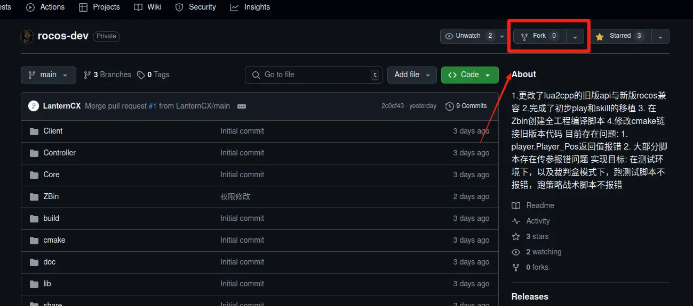
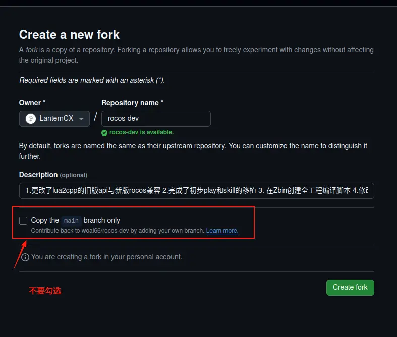
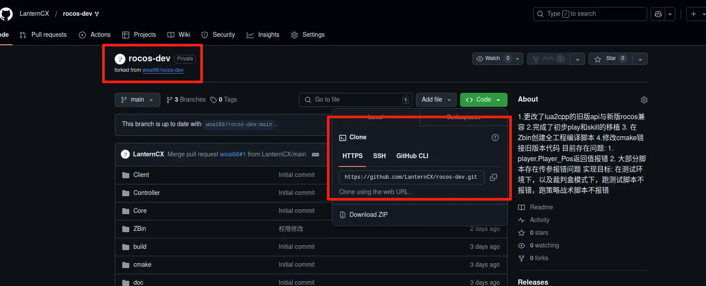
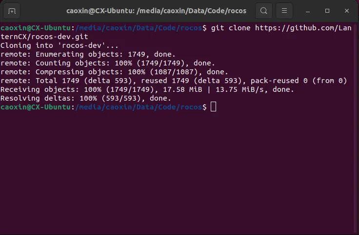
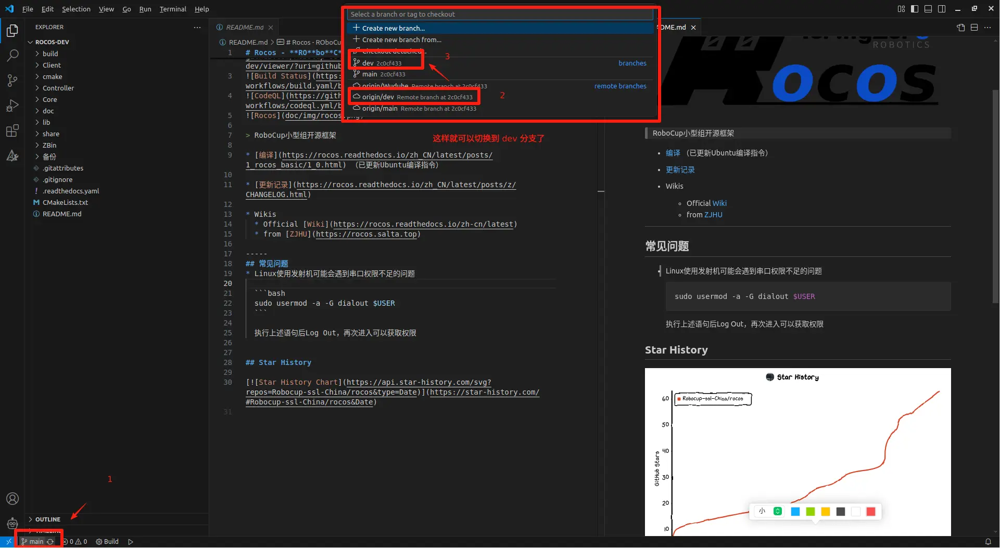
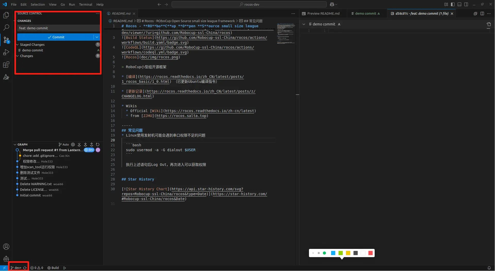
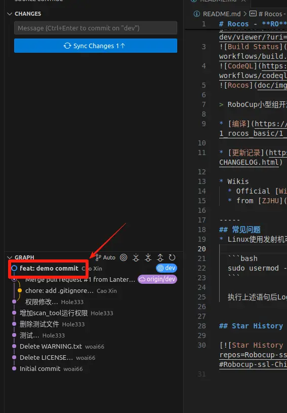
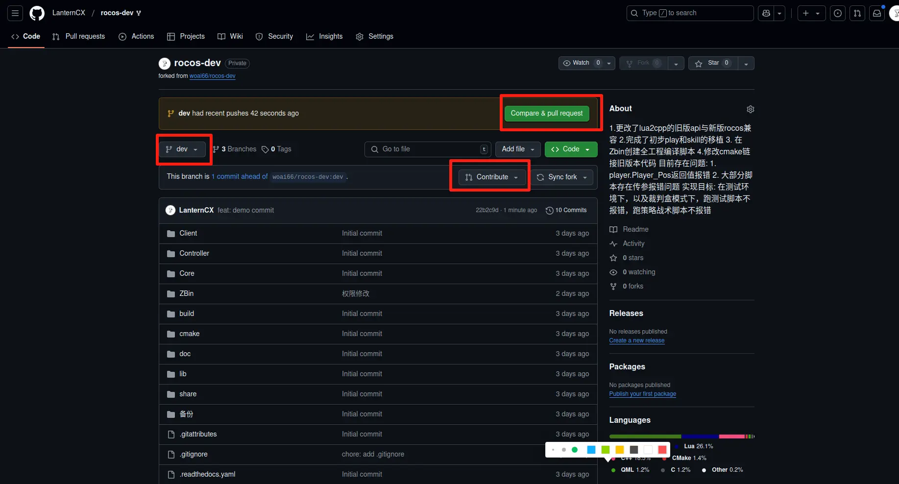

# Debug Lab - Rocos repo

fork from [Robocup-ssl-China/rocos](https://github.com/Robocup-ssl-China/rocos)

## Doc

* [编译](https://rocos.readthedocs.io/zh_CN/latest/posts/1_rocos_basic/1_0.html) 

* [更新记录](https://rocos.readthedocs.io/zh_CN/latest/posts/z/CHANGELOG.html)

* Wikis
  * Official [Wiki](https://rocos.readthedocs.io/zh-cn/latest)
  * from [ZJHU](https://rocos.salta.top)

## Contribute

### 前置知识

1. [Git 基础使用](https://www.runoob.com/git/git-tutorial.html): Commit 流程，Git 与 GitHub 的结合使用， 以及分支管理

2. [Git Angular Commit 规范](https://juejin.cn/post/7126022242508472351)

### 贡献你的代码

1. Fork 分支到你的仓库

2. Clone 仓库到本地

3. 在 VSCode 中打开项目并切换到 `dev` 分支

4. 提交 commit

注意 commit 消息要遵守 Angular Commit 规范，说明进行了何种改动以及改动了什么部分

4. Push commit 到你的 GitHub 仓库并创建 PR(Pull Request)

