# 数据库系统原理

数据库系统原理并不是一门只教 SQL 语法的课程。SQL 只是我们向数据库表达“要保存什么、要查什么、要修改什么”的工具。真正决定一个数据库是否可靠、是否容易维护、是否能够高效运行的，是 SQL 背后的整套结构：现实世界怎样被抽象成数据，数据之间的联系怎样落到表中，哪些状态必须被禁止，查询怎样被形式化，存储系统又怎样减少访问代价。

可以把数据库看成一个长期运行的数据系统。它既要保存事实，也要维护事实之间的关系。例如，选课表中的学号必须对应真实学生，订单明细必须属于真实订单，同一门课程的成绩不能凭空脱离学生和课程存在。数据库因此不仅需要“装下数据”，还要知道数据代表什么，以及哪些组合才符合业务规则。

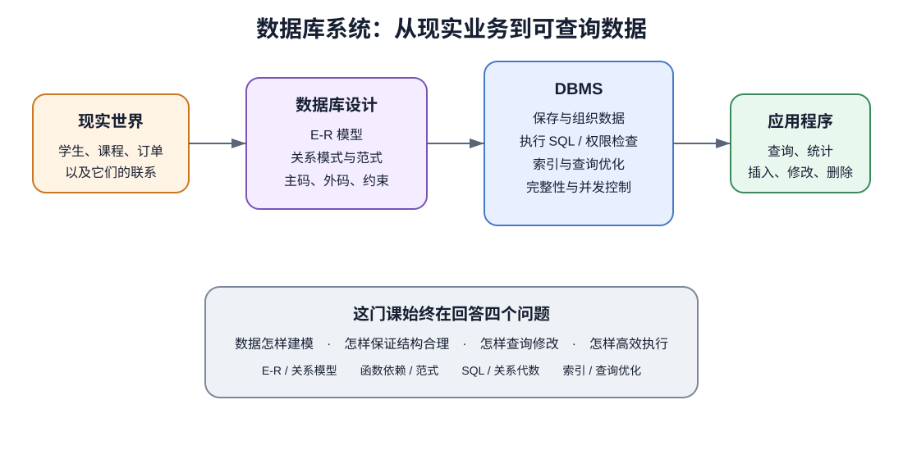

从现实业务到最终查询，大致会经过下面这条链路：

> [!note] 数据进入数据库的完整过程
> 现实对象与业务规则先被抽象为实体和联系；实体与联系再转换为关系模式；主码、外码和其他约束排除非法数据；SQL 负责定义和操作这些关系；函数依赖与范式检查表结构是否存在不必要的冗余；关系代数解释查询由哪些基本运算组成；索引与执行计划则决定这些运算在存储层需要付出多少代价。

关系数据库并不是唯一的数据组织方式。MongoDB 把一份业务对象通常需要共同读取的数据组织为文档，Neo4j 则把节点之间的连接本身作为主要查询对象。它们并不是简单地取代关系数据库，而是在不同数据形态下采用更自然的表示方式。

## 章节索引

- [[#第一章　数据库系统与关系模型基础]]
- [[#第二章　E-R 建模与关系模式转换]]
- [[#第三章　关系代数与集合查询]]
- [[#第四章　SQL 基础：建表、单表查询与数据更新]]
- [[#第五章　SQL 进阶：连接、子查询、分组、视图与权限]]
- [[#第六章　函数依赖、候选码与 3NF]]
- [[#第七章　存储过程、游标与触发器]]
- [[#第八章　索引与查询执行]]
- [[#第九章　MongoDB 文档数据库]]
- [[#第十章　Neo4j 图数据库]]

---

# 第一章　数据库系统与关系模型基础

数据库首先要解决的，并不是“怎样写一条查询”，而是“怎样让许多程序长期共享同一批数据，并且始终保持一致”。一个小程序可以把数据直接写进文本文件；但当用户数量、数据规模和业务规则逐渐增加时，文件本身不会主动保证学号唯一，也不会阻止不存在的部门编号被写进员工记录，更不会处理两个人同时修改同一条数据时可能发生的冲突。

数据库管理系统就是在这个位置出现的。它把原本散落在各个应用程序中的公共问题集中起来：数据结构由谁定义，访问权限由谁控制，关联关系怎样保持，发生故障后怎样恢复，以及数据在磁盘上怎样组织。应用程序仍然负责业务逻辑，但不再需要亲自实现一套完整的数据管理机制。

> [!note] 本章的核心关系
> 文件能够保存字节，却不了解业务规则；DBMS 在文件之上增加结构、约束、查询和控制；数据模型规定数据怎样表示；关系模型再把数据组织成关系，并用码与完整性约束说明哪些状态是合法的。

## 1. 普通文件与数据库

文件并不是一种错误的技术。日志、图片、配置文件和程序代码都很适合直接保存在文件中。问题只在于：当一批数据需要被多个程序共同理解、频繁查询并长期维护时，普通文件没有提供足够的公共语义。

假设学校最初只用一个表格记录学生：

```text
学号 | 姓名 | 学院 | 学院电话
```

如果一千名学生来自同一个学院，学院名称和电话就会重复一千次。学院电话发生变化时，必须找到所有相关行并逐一修改。只要漏掉一行，同一个学院便会出现两个电话。这不是因为表格不能保存电话，而是因为文件不知道“学院电话由学院决定”，更不知道这项事实只应该保存一次。

再增加一张选课文件：

```text
学号 | 课程号 | 成绩
```

文件本身也不会检查其中的学号是否存在于学生文件。于是一个输入错误就可能产生“属于任何学生的选课记录”。如果两个程序同时改写文件，还可能出现部分内容被覆盖、写入一半时程序崩溃等问题。

这些问题可以由程序员逐个补丁式解决，但每个应用都要重复实现。数据库管理系统的价值就在于把它们统一成系统能力：主码保证唯一性，外码保证引用对象存在，事务处理并发和故障，查询语言负责组合数据，权限系统决定谁能够读取或修改。

因此，数据库并不是简单地把文件变成表格，而是把**数据及其规则**交给一个专门系统集中管理。

## 2. DB、DBMS、DBS 与 DBA

日常交流中，人们常把 MySQL 称为“数据库”，也把其中保存的数据称为“数据库”。这种说法在一般语境下不会造成太大问题，但在数据库原理中，需要区分数据、管理软件和整个运行系统。

**数据库（DB）** 是被组织和长期保存的数据集合。例如某学校系统中保存的学生、课程、选课和成绩数据，合在一起构成数据库。它强调的是数据本身。

**数据库管理系统（DBMS）** 是管理这些数据的软件。MySQL、PostgreSQL、Oracle Database 都属于 DBMS。它们负责解释 SQL、维护表和索引、检查约束、控制权限并处理并发访问。也就是说，DBMS 不是数据，而是管理数据的系统软件。

**数据库系统（DBS）** 比前两者范围更大。一个真正运行的数据库系统还包含应用程序、操作系统、硬件、数据库管理员以及使用系统的人员。所以 DBS 是一个完整环境，DB 和 DBMS 只是其中的组成部分。

**数据库管理员（DBA）** 负责使这个系统能够持续可靠地运行。DBA 的工作可能包括设计结构、分配权限、备份恢复、监控性能和调整索引。它不是某一个具体软件模块，而是一类管理角色。

可以用一个仓库作类比：货物相当于 DB，仓库管理软件相当于 DBMS，货物、软件、仓库设施、管理员和业务人员共同构成 DBS，负责维护整个仓库的人就是 DBA。

> [!warning] 容易混淆的关系
> DBMS 可以创建和管理多个数据库；DBS 则表示一个包含数据、软件、人员和环境的整体。因而“DBS 等于 DBMS”是不正确的。

## 3. 数据库特性

数据库相对于分散文件的优势，并不是若干互不相关的口号，而是集中管理自然带来的结果。

当所有应用都按照统一结构访问数据时，数据就具有了**整体结构**。学生的学院编号不再只是某个程序自行解释的字符串，而是数据库模式中的一个属性，并且可能引用学院表中的主码。结构被统一以后，不同程序才有可能可靠地共享数据。

共享同一份数据后，重复保存的必要性会降低，这就是所谓的**冗余可控**。这里不能理解成数据库中绝对没有重复。订单表中可能会有许多相同日期，缓存字段也可能有意保存计算结果。真正需要避免的是同一业务事实被无规则地重复保存，并且各副本无法保持一致。

DBMS 还提供了**统一控制**。完整性约束防止非法值进入数据库；权限系统限制用户能做什么；并发控制避免多个操作相互破坏；恢复机制保证系统发生故障后能够回到一致状态。这些能力如果完全依赖每个应用自己实现，往往会产生不同标准和大量重复代码。

最后，数据库通过抽象层提供一定程度的**数据独立性**。应用程序关心“学生表有哪些字段”，而不必关心这些记录具体位于磁盘哪个页中。数据库管理员可以增加索引、改变存储布局，而查询语句通常仍然保持不变。

因此，数据库的主要特点可以归结为：数据以统一模型组织，能够被多个应用共享，冗余受到控制，并由 DBMS 对安全、完整性、并发和恢复进行统一管理。

## 4. 数据模型及其三要素

现实世界中的“学生”“订单”“课程”并不能直接放进计算机。计算机只能保存经过编码的数据，因此首先要规定这些对象怎样被表示。数据模型就是这套表示规则。

一个完整的数据模型不能只描述静态结构。即使我们规定学生由学号、姓名和学院组成，仍然没有说明怎样插入学生、怎样查询学院，也没有说明学号能否重复。因此，数据模型必须同时回答三个问题。

第一是**数据结构**：系统用什么单位组织数据，以及这些单位怎样相互联系。关系模型使用关系、元组和属性；文档模型使用文档和字段；图模型使用节点和边。

第二是**数据操作**：在这些结构之上允许执行什么操作。关系模型中的操作包括选择、投影、连接、插入、删除和更新；图模型更强调沿关系进行路径匹配。

第三是**完整性约束**：哪些数据状态不允许出现。学号不能重复，成绩应在合理范围内，选课记录必须引用真实学生，这些都不是结构本身自动表达的，而需要约束补充。

因此，数据模型三要素是：

> **数据结构、数据操作、完整性约束。**

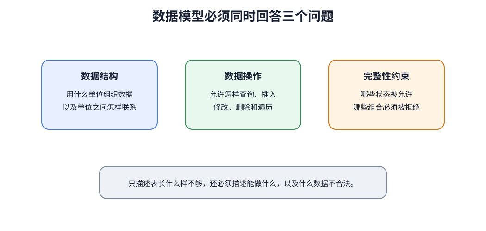

不同模型并不是只把同一批数据换一种外观。模型会影响数据最自然的组织方式，也会影响查询的表达方式。例如，关系模型擅长把不同实体拆成规范的表并通过连接组合；文档模型擅长把经常整体读取的数据放在一个文档中；图模型则擅长表达多层连接关系。

## 5. 三级模式结构与数据独立性

一个数据库同时面对两类完全不同的关注点。用户关心的是学生姓名、课程成绩和订单金额；存储系统关心的是数据页、记录偏移和索引节点。如果把二者直接绑定，磁盘布局的每一次变化都可能迫使应用程序修改。三级模式结构就是为了在这些层次之间建立隔离。

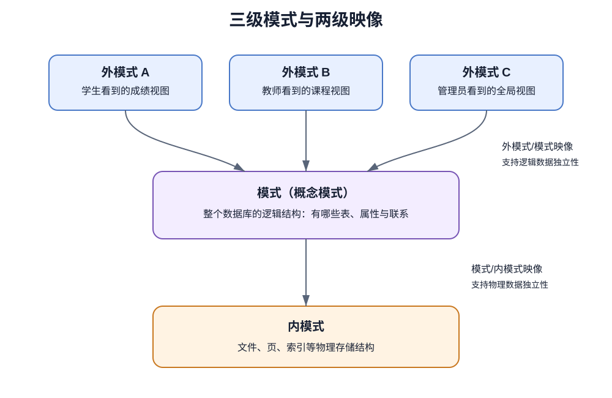

### 5.1 外模式

外模式描述的是某一类用户能够看到的局部数据。它并不要求把数据库真实结构完整暴露出来。

例如，同一个成绩数据库中，学生可能只能看到自己的课程和成绩；教师可以看到自己所授课程中的全部学生；教务管理员则需要看到更完整的数据。这三类用户面对的内容不同，但底层可以来自同一组关系。

外模式的意义不仅是方便。它还可以隐藏敏感字段，并为不同应用提供稳定接口。底层表稍有变化时，只要外模式仍能维持原来的字段和含义，上层程序就不一定需要修改。

### 5.2 模式

模式也称概念模式，描述整个数据库在逻辑上的统一结构。它回答“数据库中有哪些关系、每个关系有哪些属性、关系之间怎样引用、需要满足哪些约束”。

例如：

```text
Student(Sno, Sname, DeptId)
Department(DeptId, DeptName)
```

以及 `Student.DeptId` 引用 `Department.DeptId`，都属于模式层面的内容。模式不关心某张表具体存放在哪个数据文件中，也不针对某一位用户只展示局部信息。

一个数据库通常只有一个整体概念模式，因为系统需要一份统一的逻辑说明。

### 5.3 内模式

内模式描述数据怎样在存储介质中实现。记录是定长还是变长，数据分布在哪些页中，是否建立 B+ 树索引，索引的键是什么，这些都属于内模式。

用户执行：

```sql
SELECT * FROM Student WHERE Sno = '2026001';
```

时只说明要找什么，并不说明要扫描文件还是使用索引。具体访问路径由 DBMS 根据内模式和执行计划决定。

### 5.4 两级映像

三级模式之间需要建立对应关系，这就是两级映像。外模式/模式映像说明用户视图怎样对应整体逻辑结构；模式/内模式映像说明逻辑关系怎样对应实际存储。

当内模式发生变化，例如给 `Sno` 增加索引，概念模式中的 `Student` 结构并没有改变，应用查询通常也无需修改。这体现了**物理数据独立性**：物理存储变化尽量不影响逻辑结构和应用。

当概念模式发生某些调整，例如把一张表拆分，但仍通过视图保持原有用户接口时，应用可能继续使用原来的外模式。这体现了**逻辑数据独立性**：整体逻辑结构变化尽量不影响用户视图和程序。

逻辑独立性通常比物理独立性更难实现，因为表结构变化更容易影响字段含义和查询方式。不过两者的共同目标都是减少层次之间的耦合。

> [!important] 三级模式的真正作用
> 三级模式并不是把同一张表重复描述三遍，而是分别描述用户视角、整体逻辑视角和物理存储视角。两级映像使这些层次可以在一定范围内独立变化。

## 6. 数据库语言

SQL 只有一套语法体系，但不同语句作用于不同层面。有的语句改变数据库结构，有的改变数据内容，有的只读取数据，还有的改变访问权限。把它们分类，可以看清一条语句究竟在修改什么。

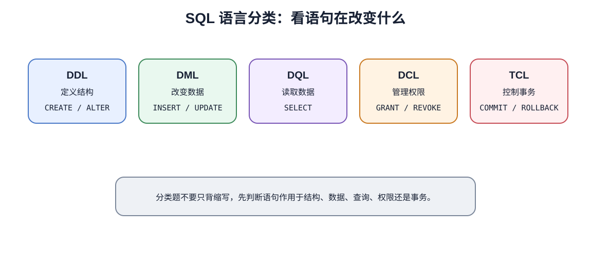

**DDL（数据定义语言）** 用于定义数据库对象。`CREATE TABLE` 创建表，`ALTER TABLE` 修改表结构，`DROP TABLE` 删除表。这些语句影响的是模式，而不仅是某几行数据。

**DML（数据操纵语言）** 用于改变数据内容，典型语句是 `INSERT`、`UPDATE` 和 `DELETE`。它们在已有结构中增加、修改或删除元组。

**DQL（数据查询语言）** 通常专指 `SELECT`。查询读取数据但不直接改变数据库状态。有些教材把查询包含在广义 DML 中，所以遇到分类题时要注意课程口径。

**DCL（数据控制语言）** 管理权限，例如 `GRANT` 和 `REVOKE`。它们回答“某个用户能否查询某张表，能否修改某一列”。

**TCL（事务控制语言）** 管理一组操作的提交和撤销，例如 `COMMIT` 和 `ROLLBACK`。事务相关内容强调的是若干操作应当作为一个整体成功或失败。

这些分类不是为了记缩写本身，而是为了理解 SQL 同时承担了结构定义、数据操作、访问控制和事务管理等多种职责。

## 7. 集合与关系

关系模型使用“关系”这个词，并不是因为表与表之间有关联，而是因为它来自数学中的关系概念。这个数学基础使查询能够被表示为集合运算，也说明了为什么关系中的行在逻辑上没有固定顺序。

### 7.1 域

域是某个属性允许取值的集合。它不仅可以表示数据类型，还可以包含更具体的业务范围。

例如，年龄属性可以来自整数域，但业务上可能进一步限制为 0 到 150；课程状态可能只允许“未开课、进行中、已结束”。域说明了一个分量能够从哪里取值。

两个属性都使用字符串类型，并不表示它们一定属于同一个语义域。学号和电话号码都可以保存为字符串，但它们代表不同概念，允许值的规则也不同。

### 7.2 笛卡尔积

如果有两个域：

$$
D_1=\{a_1,a_2,a_3\},\qquad D_2=\{b_1,b_2\}
$$

笛卡尔积会列出从两个域中各取一个值形成的全部有序组合：

$$
D_1\times D_2=\{(a_1,b_1),(a_1,b_2),\ldots,(a_3,b_2)\}
$$

组合数量为：

$$
|D_1\times D_2|=|D_1|\times|D_2|=3\times2=6
$$

把它放到数据库语境中，可以把“所有学号”和“所有课程号”的笛卡尔积理解成所有理论上可能的学生—课程组合。但现实中并不是每名学生都选了每门课程，所以实际选课数据只占这些组合的一部分。

### 7.3 关系

关系就是若干域笛卡尔积的一个有限子集。换句话说，笛卡尔积给出所有可能组合，关系只保留真实存在或业务允许的组合。

例如：

```text
Enrollment(Sno, Cno, Grade)
```

每一行表示一个真实选课事实，而不是任意学号、课程号和成绩的组合。关系模式规定了属性及其域，具体关系则是某一时刻存在的元组集合。

这一区分很重要：`Enrollment(Sno, Cno, Grade)` 是结构说明，称为关系模式；表中当前的所有记录才是关系的一个具体状态。

## 8. 关系模型术语

关系表看起来像普通二维表，但关系模型只保留具有逻辑意义的部分。屏幕上第一行或最后一行没有特殊含义，列的显示位置也不决定语义。DBMS 可以改变物理排列，只要每个属性和元组表示的事实不变，逻辑关系就没有改变。

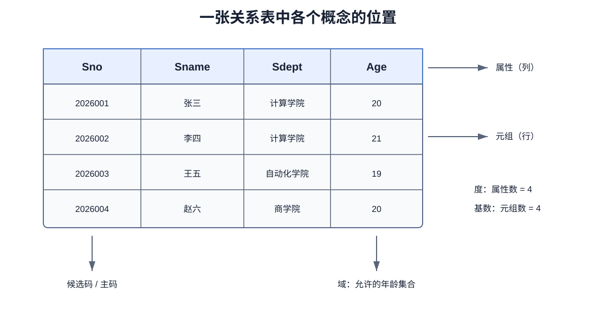

设有关系模式：

```text
Student(Sno, Sname, Sdept)
```

`Student` 的结构定义称为**关系模式**。数据库在某一时刻保存的全部学生记录构成一个具体的**关系**。

关系中的一行叫作**元组**。元组不是简单的“第几行”，而是一组属性值共同表示的一条事实。关系中的一列叫作**属性**；元组在某个属性上的具体值叫作**分量**。

属性允许取值的集合叫作**域**。关系包含的属性个数叫作**度**，当前包含的元组数量叫作**基数**。因此，一个三列表的度是 3；表中当前有 500 行，则基数是 500。

关系模型通常具有以下逻辑性质：元组的排列顺序没有意义，属性通常通过名称识别而不是靠位置识别，同一关系中不允许存在完全相同的重复元组，每个分量应当是当前关系层次上的单一值。

最后一点常被表述为“属性值具有原子性”。原子并不意味着字符串不能包含多个字符，而是说 DBMS 在当前模式中把它作为一个整体值处理。例如，把“张三,李四,王五”塞进一个联系人字段，会让查询某个联系人变得困难；更合理的做法通常是建立独立联系记录。

## 9. 候选码、主码、主属性与外码

数据库中的一行必须能够被明确区分。姓名通常不能承担这个任务，因为可能重名；地址也可能变化。码的概念就是为了找出能够稳定标识元组的属性组合。

### 9.1 超码与候选码

若一组属性能够唯一标识关系中的每个元组，这组属性就是超码。这里的“唯一标识”意味着不会有两个不同元组在这些属性上取值完全相同。

设：

```text
Student(Sno, IDCard, Sname, Sdept)
```

若学号和身份证号都各自唯一，那么 `{Sno}` 和 `{IDCard}` 都能唯一标识学生。`{Sno, Sname}` 也能唯一，因为其中已经包含唯一的 `Sno`。但它加入了不必要的 `Sname`。

候选码要求在能唯一标识的基础上进一步满足**最小性**：去掉其中任何一个属性后，都不能继续唯一标识。因此 `{Sno}` 是候选码，`{Sno, Sname}` 只是超码而不是候选码。

复合候选码由多个属性共同组成。例如选课关系中，一名学生可以选多门课，一门课也可以被多名学生选择，单独的学号或课程号都不能唯一标识选课记录，而 `(Sno, Cno)` 共同可以。

### 9.2 主码

一个关系可能有多个候选码，但数据库通常选择其中一个作为主要标识，这就是主码。其他候选码仍然保持候选码性质，也可以称为备用码。

主码的选择通常考虑稳定性、简洁性和使用方便。身份证号可能具有业务唯一性，但系统仍可能选择内部生成的学号作为主码，因为学号更适合当前业务。主码是设计选择，不是说其他候选码突然失去唯一性。

### 9.3 主属性与非主属性

出现在任意候选码中的属性叫主属性，其余属性叫非主属性。

这里容易误解为“只有主码中的属性才叫主属性”。若关系有两个候选码 `{Sno}` 和 `{IDCard}`，即使主码最终选了 `Sno`，`IDCard` 仍然属于另一个候选码，所以也是主属性。

这个概念在判断第三范式时会出现，因为 3NF 的正式条件会区分右侧属性是否为主属性。

### 9.4 外码

主码解决一张表内部怎样识别元组，外码则解决不同关系之间怎样建立引用。

设：

```text
Department(DeptId, DeptName)
Employee(Eid, Ename, DeptId)
```

`Employee.DeptId` 表示员工属于哪个部门。它引用 `Department` 中能够唯一标识部门的 `DeptId`，所以是外码。

外码本身通常不唯一。一个部门可以有很多员工，因此多个员工记录可以拥有相同的 `DeptId`。外码的任务不是区分员工，而是保证它指向一个存在的部门。

外码还可以引用本关系，形成递归联系。例如员工表中的 `ManagerId` 可以引用同一员工表的 `Eid`，表示员工的直属经理。

## 10. 三类完整性约束

数据类型只能保证“工资是数字”，却不能保证“工资非负”；它也无法保证一个部门编号真实存在。完整性约束用于把业务规则转化为数据库能够检查的条件。

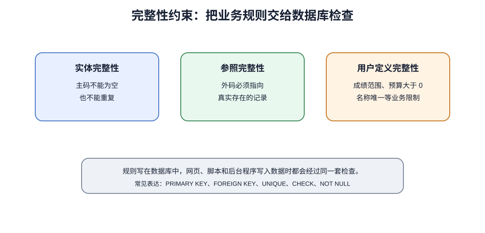

### 10.1 实体完整性

实体完整性要求主码中的每个属性都不能为 `NULL`。原因很直接：主码承担元组身份，而未知身份无法稳定地区分记录。

若选课表主码是 `(Sno, Cno)`，那么两个部分都必须有值。只有学号而没有课程号，我们就无法知道它表示哪一次选课；只有课程号而没有学号也一样。

实体完整性不只是“主码不能重复”，还包含“主码不能为空”。唯一性和非空性共同保证每个实体都有明确身份。

### 10.2 参照完整性

参照完整性约束外码。一个外码值要么为空——前提是业务允许“尚未关联”；要么必须等于被参照关系中某个候选码的现有值。

例如，`Employee.DeptId='D10'` 意味着员工属于 D10 部门。如果部门表中没有 D10，这条员工记录就引用了不存在的对象。参照完整性会阻止这种悬空引用。

当被引用的部门需要删除时，系统必须决定已有员工怎样处理。常见方式包括：拒绝删除，级联删除相关员工，把员工部门设为 `NULL`，或者改成默认部门。不存在一种对所有业务都正确的固定策略，约束定义必须符合实际语义。

### 10.3 用户定义完整性

实体完整性和参照完整性是关系模型中普遍存在的规则，但每个业务还有自己的限制，这些规则统称用户定义完整性。

例如，预算必须大于 0，项目名称不能重复，成绩必须处于 0 到 100 之间，性别字段只能取允许值。SQL 中常用 `NOT NULL`、`UNIQUE`、`CHECK`、`DEFAULT` 等约束表达这些规则。

把规则写进数据库而不是只写在界面中有一个重要好处：无论数据来自网页、脚本还是后台程序，都要经过同一套检查。否则，一个绕开前端界面的导入脚本就可能把非法数据直接写入数据库。

## 11. NULL 的特殊性

`NULL` 不是 0，也不是空字符串。它表示当前没有一个确定值。原因可能是值未知、尚未填写，或者这个属性对当前对象不适用。

例如，员工离职日期在员工仍在职时可以为空；这不表示离职日期是某个特殊日期，而是“当前没有离职日期”。同样，电话号码为空可能表示尚未登记，并不等于电话号码是空字符串。

普通比较建立在两边都有确定值的基础上。若问“未知电话号码是否等于未知电话号码”，结果既不能确定为真，也不能确定为假。因此 SQL 使用三值逻辑：`TRUE`、`FALSE` 和 `UNKNOWN`。

这就是为什么下面写法不正确：

```sql
WHERE phone = NULL
```

任何与 `NULL` 的普通比较都会得到 `UNKNOWN`。正确判断方式是：

```sql
WHERE phone IS NULL
WHERE phone IS NOT NULL
```

`WHERE` 只保留条件结果为 `TRUE` 的行，`FALSE` 和 `UNKNOWN` 都会被过滤。这个规则会影响许多查询，尤其是 `NOT IN`。如果子查询结果含有 `NULL`，比较可能变成未知，使本来想找“没有关联记录”的查询得不到结果。此类语义通常使用 `NOT EXISTS` 更安全。

聚合函数对 `NULL` 的处理也不同。`COUNT(*)` 统计行数，不会因为某列为空而跳过；`COUNT(column)` 只统计该列非空的行；`AVG(column)` 和 `SUM(column)` 通常忽略空值。理解这一点才能正确解释统计结果。

## 12. 基础概念关系

前面的术语看起来很多，但它们分属于不同层次，并不是同一类概念。

DB、DBMS、DBS 和 DBA 描述的是数据库系统由什么组成。数据模型描述计算机用什么方式表示、操作并约束数据。三级模式描述同一数据库在用户、逻辑和物理三个视角下的抽象层次。

进入关系模型后，关系模式说明表的结构，关系表示某一时刻的数据状态，属性和元组分别对应列和行，域限制属性值。候选码与主码提供元组身份，外码表达关系之间的引用，完整性约束则排除不合法状态。

可以把它们连成一条完整路径：

> 现实业务由数据模型抽象；关系模型把数据表示为关系；关系模式规定属性和域；码说明怎样识别和引用元组；完整性约束说明哪些关系状态允许存在；DBMS 负责真正执行这些规则，并通过三级模式隔离用户视图与物理存储。

## 本章速记

- DB 是被管理的数据集合，DBMS 是管理这些数据的软件，DBS 是包含数据、软件、人员和环境的完整系统。
- 数据模型同时规定数据结构、数据操作和完整性约束。
- 外模式面向局部用户，模式描述整体逻辑结构，内模式描述物理存储；两级映像带来逻辑和物理数据独立性。
- 关系模式是结构，关系是某一时刻的元组集合；属性对应列，元组对应行。
- 候选码必须同时满足唯一性和最小性；主码是选定的候选码；外码用于引用其他关系的候选码。
- 实体完整性保证主码非空，参照完整性保证外码不会指向不存在的对象，用户定义完整性表达具体业务规则。
- `NULL` 表示未知或不适用，需要使用 `IS NULL` 判断，并会引入 `UNKNOWN`。

## 章节练习与解析

### 补充题

#### 补充题 1｜DB、DBMS 与 DBS

数据库、数据库管理系统和数据库系统之间的关系正确的是____。

- A. DBMS 包含 DB 和 DBS
- B. DBS 包含 DB、DBMS、应用和相关人员
- C. DB 就是 DBMS
- D. DBS 只包含数据库文件

> [!example]- 答案
> **B。** DB 是数据集合，DBMS 是管理软件，DBS 是包含二者以及应用、人员和运行环境的整体。

#### 补充题 2｜数据模型三要素

数据模型的三个组成部分是____。

- A. 外模式、模式、内模式
- B. 数据结构、数据操作、完整性约束
- C. 实体、联系、数据库
- D. DDL、DML、DCL

> [!example]- 答案
> **B。** 一个模型必须规定数据如何组织、允许怎样操作以及哪些状态合法。

#### 补充题 3｜三级模式

给成绩表增加 B+ 树索引而不修改应用 SQL，主要体现了____。

- A. 逻辑数据独立性
- B. 物理数据独立性
- C. 实体完整性
- D. 参照完整性

> [!example]- 答案
> **B。** 索引属于内模式的物理组织，概念模式和应用查询不必随之改变。

#### 补充题 4｜关系术语

关系 `Student(Sno,Sname,Sdept)` 中的 `Sdept` 称为____。

- A. 元组
- B. 属性
- C. 基数
- D. 关系实例

> [!example]- 答案
> **B。** 属性对应关系中的列。

#### 补充题 5｜候选码

若 `Sno` 能唯一标识学生，`(Sno,Sname)` 也能唯一标识学生，则____。

- A. 二者都是候选码
- B. 只有 `(Sno,Sname)` 是候选码
- C. `Sno` 是候选码，`(Sno,Sname)` 只是超码
- D. 二者都不是超码

> [!example]- 答案
> **C。** 候选码不仅要唯一，还要最小；组合中包含多余的 `Sname`。

#### 补充题 6｜参照完整性

`Enrollment(Sno,Cno)` 中 `Sno` 引用 `Student(Sno)`。下列状态违反参照完整性的是____。

- A. Enrollment 中的 Sno 在 Student 中存在
- B. Student 中某学生没有选课记录
- C. Enrollment 中出现 Student 中不存在的 Sno
- D. 一名学生有多条选课记录

> [!example]- 答案
> **C。** 外码不能指向不存在的被引用对象。

#### 补充题 7｜NULL

判断某列 `x` 是否为空，正确写法是____。

- A. `x = NULL`
- B. `x <> NULL`
- C. `x IS NULL`
- D. `x == NULL`

> [!example]- 答案
> **C。** NULL 参与普通比较通常产生 UNKNOWN，必须使用 `IS NULL`。

#### 补充题 8｜DB、DBMS 与 DBS

数据库、数据库管理系统和数据库系统的关系正确的是：

- A. DBMS 包含 DB 和 DBS
- B. DBS 包含 DB 和 DBMS
- C. DB 包含 DBMS
- D. 三者完全等价

> [!example]- 解析
> **答案：B。** DB 是数据集合，DBMS 是管理软件，DBS 是包含数据库、管理软件、人员和应用的完整系统。

#### 补充题 9｜三级模式

给学生建立一个只显示本人课程和成绩的视图，这一层主要对应：

- A. 内模式
- B. 模式
- C. 外模式
- D. 物理模式映像

> [!example]- 解析
> **答案：C。** 外模式描述特定用户或应用看到的数据子集。

#### 补充题 10｜实体完整性

关系 `SC(Sno, Cno, Grade)` 的主码为 `(Sno, Cno)`。下列说法正确的是：

- A. 只有 `Sno` 不能为 NULL
- B. 只有 `Cno` 不能为 NULL
- C. `Sno` 和 `Cno` 都不能为 NULL
- D. 只有 `Grade` 不能为 NULL

> [!example]- 解析
> **答案：C。** 复合主码中的每一个属性都必须非空。

#### 补充题 11｜关系术语

一张关系表有 6 列、200 行，则它的度和当前基数分别是多少？

> [!example]- 解析
> 度为 6，基数为 200。度描述属性数量，基数描述当前元组数量。

---

# 第二章　E-R 建模与关系模式转换

数据库中的表不会凭空出现。设计者面对的最初材料通常不是表结构，而是一段业务描述：公司有部门和员工，员工参与项目；旅行社管理线路、景点和团队；学校记录学生、课程和选课。直接把这些名词写成表，往往会过早陷入字段和外码细节，也容易把业务中的联系误当成普通属性。

E-R 模型位于现实世界和关系表之间。它先回答“有哪些对象”“对象有哪些特征”“对象之间怎样联系”，暂时不考虑具体数据库中的字段类型和索引。等概念关系清楚以后，再按照固定规则转换为关系模式。这样做的目的不是多画一张图，而是让设计先忠实表达业务，再落到技术实现。

> [!note] 本章的核心关系
> 业务描述中的名词通常提示实体，描述对象特征的内容形成属性，动词和数量关系提示联系；E-R 图先保存这些语义，再根据 1:1、1:N、M:N 等基数转换为主码、外码和中间关系。

## 1. E-R 图与关系表

假设需求只写了一句话：“每个员工只能属于一个部门，一个部门有多名员工。”如果直接建表，设计者可能会犹豫：部门编号应该放在员工表，还是员工编号应该放在部门表？若先把这句话画成 E-R 联系，方向会很清楚：部门与员工是 1:N，员工位于多的一端，因此部门主码应作为外码进入员工关系。

更复杂的情况是“学生参加课程，并记录成绩和选课日期”。成绩不是学生自身的固定属性，也不是课程自身的固定属性。它只在某名学生与某门课程发生联系时才存在。如果直接从名词出发表设计，很容易把成绩塞进学生表或课程表。E-R 模型会把“选课”识别为学生和课程之间的 M:N 联系，并把成绩、选课日期放到这个联系上。

因此，E-R 图的作用是暂时推迟技术细节，把注意力放在业务事实上。它帮助区分：哪些对象可以独立存在，哪些信息依赖于对象之间的一次联系，哪些数量关系会决定外码位置，哪些联系需要单独转化为关系。

概念模型设计正确以后，关系表的转换大多有稳定规则；概念模型若一开始就误解业务，后面再正确地写 SQL 也只能得到结构良好的错误系统。

## 2. 实体、实体集、属性与联系

E-R 模型只使用少量基本元素，但每个元素都有明确角色。理解它们时，不要把“实体等于表、属性等于列”作为起点。E-R 模型还没有进入关系数据库，它首先描述现实世界中的对象和语义。

### 2.1 实体

实体是现实中能够被区分的具体对象。某一名学生、某一门课程、某一个项目都可以是实体。这里的“具体”并不要求对象一定是有形物体；一个订单、一次预约、一项合同也可以成为实体，只要系统需要独立识别和记录它。

判断一个对象是否值得建成实体，关键看它是否拥有自己的身份和生命周期。例如，部门可以独立创建、修改和撤销，拥有部门编号和名称，因此适合作为实体。单独一个“颜色值”通常只描述商品，不需要独立身份，所以更适合作为属性。

### 2.2 实体集

同一类实体的集合叫实体集。“张三”是一个学生实体，所有学生共同构成学生实体集。E-R 图中通常画的是实体集，而不是每一个具体实例。

实体集类似于一种类型说明：它规定这一类对象通常有哪些属性，以及用什么方式区分不同对象。最终转换到关系模型时，普通实体集通常对应一个关系模式。

### 2.3 属性

属性描述实体或联系的特征。学生可以有学号、姓名、出生日期；课程可以有课程号、名称和学分。

属性并不只是“任何能描述对象的词”。设计时需要判断它是否应被进一步拆分、是否可能有多个值、是否可以通过其他属性计算得到。

**简单属性**不能或无需继续拆分，例如学号。**复合属性**可以由若干部分构成，例如地址可能分为省、市、街道。是否拆分取决于系统是否需要分别查询这些部分。

**单值属性**对一个实体通常只有一个值，例如出生日期。**多值属性**可能同时有多个值，例如一个人有多个电话号码。关系表中的一个单元格通常不适合直接保存任意数量的号码，因此多值属性在转换时往往需要单独建立关系。

**派生属性**可以由其他数据计算得到。例如年龄可由出生日期和当前日期计算。若直接保存年龄，它会随着时间自动过期；保存出生日期并在需要时计算通常更稳定。

**码属性**能够区分实体集中的不同实体。学号可作为学生实体的码，项目号可作为项目实体的码。E-R 模型中的码最终通常转换为关系主码。

### 2.4 联系

联系表示实体之间有意义的关联。例如员工“属于”部门，学生“选修”课程，供应商“供应”零件。联系一般来自需求中的动词，但不能机械地把所有动词都画成联系；关键是系统是否需要长期保存这种关联。

联系可以有自己的属性。学生和课程之间的“选课”联系可以包含成绩和选课日期，因为这些值取决于某名学生与某门课程的组合。换成另一名学生或另一门课程，成绩都会改变。

联系还可以连接两个以上实体。例如供应商向项目供应零件，供应数量同时依赖供应商、零件和项目三个实体，这属于三元联系。若随意拆成三个二元联系，可能会失去“哪个供应商向哪个项目供应了哪种零件”的完整组合语义。

## 3. 1:1、1:N 与 M:N

联系的基数说明一边的一个实体最多能与另一边多少实体发生联系。它不是由当前数据中碰巧出现几行决定，而是由业务规则决定。当前一个部门只有一名员工，也不能据此认定部门与员工是 1:1；只要规则允许以后出现多名员工，它就是 1:N。

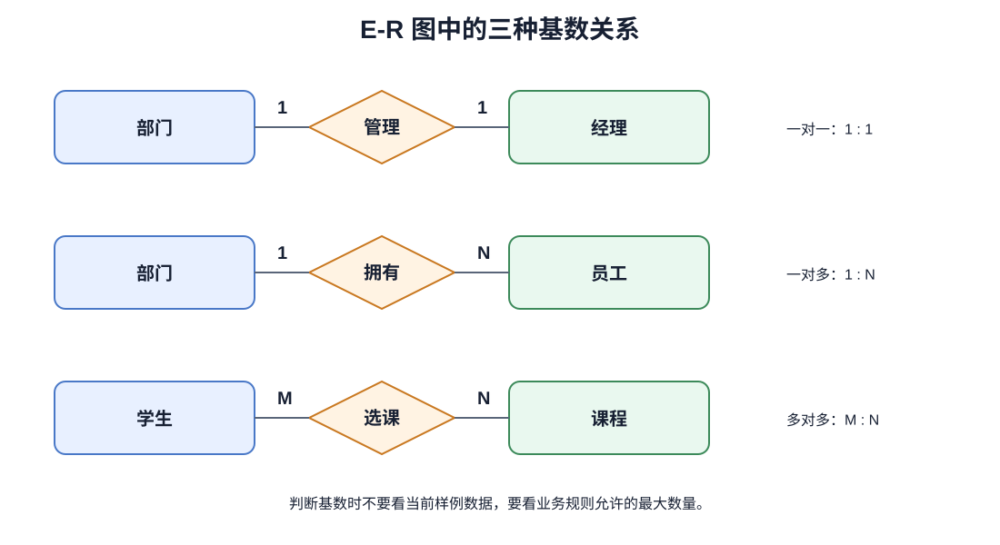

### 3.1 一对一 1:1

若 A 中一个实体最多对应 B 中一个实体，B 中一个实体也最多对应 A 中一个实体，则联系是 1:1。

例如，在某些制度下，一个部门只有一名经理，一名经理也只管理一个部门。这里必须两边都满足“最多一个”才能称为 1:1。若经理可以同时管理多个部门，关系就会变成 N:1。

1:1 联系常见于把一个对象的可选信息、敏感信息或大字段拆到另一实体中。例如每位员工最多有一份保密档案，每份档案只属于一位员工。

### 3.2 一对多 1:N

若 A 中一个实体可以关联 B 中多个实体，而 B 中每个实体最多只关联 A 中一个实体，则 A 到 B 是 1:N。

部门和员工是典型例子：一个部门有多名员工，每名员工只属于一个部门。部门位于“一”的一端，员工位于“多”的一端。

转换为关系模式时，通常把“一”端的主码放到“多”端作为外码。原因是每个多端实体只需保存一个一端标识。若反过来在部门表中保存员工编号，一个部门需要容纳任意多个员工编号，就会破坏关系表的固定结构。

### 3.3 多对多 M:N

若 A 中一个实体可以关联 B 中多个实体，同时 B 中一个实体也可以关联 A 中多个实体，则联系是 M:N。

学生和课程就是典型 M:N：一名学生选多门课程，一门课程也有多名学生。任何一方都无法只用一个外码完整表示所有关联。

因此 M:N 联系必须单独转换为中间关系。中间关系至少包含两端实体的主码作为外码，并常把它们组合成主码。若联系还有成绩、数量或日期，这些属性也放在中间关系中。

### 3.4 参与约束

基数回答“最多可以关联多少”，参与约束则回答“是否必须参与”。

若每名员工必须属于一个部门，员工对“属于”联系是全参与；若部门可以暂时没有员工，部门一侧可能是部分参与。转换到关系表后，全参与常表现为外码 `NOT NULL`，部分参与则可能允许外码为空。

必须区分“最多一个”和“至少一个”。“每名员工只属于一个部门”通常只说明最多一个；若需求还说“每名员工必须属于一个部门”，才明确最低基数为 1。

## 4. 需求文字与建模元素

需求文本不会直接标注“这里是实体”“这里是 M:N 联系”。建模的过程就是把自然语言中的事实拆成稳定的结构。

名词通常是候选实体或属性。例如“员工有工号、姓名和职称”中，员工是实体，工号、姓名和职称是属性。但名词并不一定都要成为实体。若“职称”只是一个字符串，它是属性；若系统还要管理职称等级、津贴和晋升条件，职称便可能独立成实体。

动词通常提示联系。“员工承担项目”“会员预约设施”“产品由零件组成”都表达实体之间的关系。随后要继续追问两边的数量：一个员工能承担几个项目，一个项目能由几名员工承担？只有回答这些问题，才能确定基数。

需求中的“记录……的时间、数量、成绩、名次”常提示联系属性。例如“系统记录每名运动员参与每个项目所得名次和成绩以及比赛日期”，这些值不属于运动员本身，也不属于项目本身，而属于一次“参与”联系。

还要关注唯一性词语。“项目号唯一”“用户名不可重复”提示候选码或唯一约束；“每名员工只属于一个部门”提示多端外码；“不同线路的景点存在交叉”提示线路与景点为 M:N。

建模不是把句子逐字翻译成图形，而是提取句子背后的长期规则。某个样例中暂时没有出现的组合，只要业务允许，就应在模型中保留可能性。

## 5. E-R 图转换为关系模式

E-R 图描述概念语义，关系模式要求把这些语义落成固定属性、主码和外码。转换规则的核心问题只有一个：怎样在二维关系中保留实体身份和联系基数。

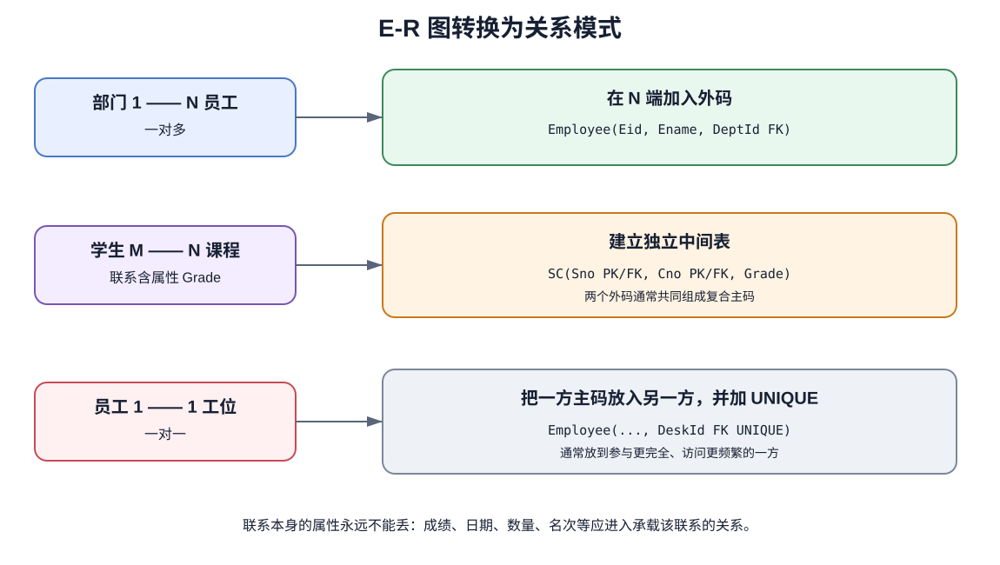

### 5.1 普通实体

每个普通实体集通常转换成一个关系。实体的简单属性成为关系属性，实体的码成为关系主码。

例如：

```text
员工：工号、姓名、性别
```

转换为：

```text
Employee(Eid, Ename, Gender)
PK: Eid
```

复合属性若需要分别查询，应拆成多个属性；派生属性通常不必保存；多值属性则不能简单塞进同一关系的一列。

### 5.2 一对多联系

1:N 联系通常不需要单独建联系表，而是在 N 端关系中加入 1 端主码作为外码。

部门与员工为 1:N：

```text
Department(DeptId, DeptName)
Employee(Eid, Ename, DeptId)
```

其中 `Employee.DeptId` 是外码。这样，每名员工通过一个部门编号指向所属部门，而同一个部门编号可以出现在多名员工记录中，自然表达“一对多”。

如果联系本身有属性，例如员工加入部门的日期，这个属性也通常放在 N 端，因为每个员工只对应一次所属部门联系：

```text
Employee(Eid, Ename, DeptId, JoinDeptDate)
```

### 5.3 多对多联系

M:N 联系必须转换为独立关系。这个关系的属性包括两端实体的主码，它们同时是外码；联系自身的属性也放在这里。

学生选课：

```text
Student(Sno, Sname)
Course(Cno, Cname)
Enrollment(Sno, Cno, Grade, EnrollDate)
```

`Enrollment.Sno` 引用学生，`Enrollment.Cno` 引用课程。若同一学生对同一课程只能有一条当前选课记录，`(Sno, Cno)` 可以组成复合主码。

若允许同一学生多次重修同一课程，`(Sno, Cno)` 就不再足够，还需要学期、考试次数或独立选课编号参与主码。主码必须与真实业务中的唯一性一致。

### 5.4 一对一联系

1:1 联系有多种转换方式。可以把一方主码作为外码放到另一方，也可以在联系有较多属性时单独建表。

选择外码放在哪一边时，通常考虑参与约束和空值数量。若每位员工都必须有一份档案，但档案一定属于员工，可以把员工主码放入档案表并加 `UNIQUE`：

```text
Employee(Eid, Ename)
Profile(ProfileId, Eid, ...)
```

`Eid` 既是外码，又必须唯一，才能保证一个员工最多对应一份档案。

如果两个实体总是同时存在，且属性数量不多，也可能合并为一个关系。但合并会降低概念独立性，因此应根据业务生命周期决定，而不是只为了减少表数量。

### 5.5 多值属性

多值属性不能在一个字段中随意保存逗号分隔列表，因为这样难以施加约束、查询和建立索引。

若员工有多个电话号码，应转换为：

```text
Employee(Eid, Ename)
EmployeePhone(Eid, Phone)
```

`EmployeePhone` 的主码可以是 `(Eid, Phone)`，表示同一员工的同一电话号码不重复。这样号码个数可以自由增长，每个号码仍然是独立值。

### 5.6 递归联系

实体也可以与自身发生联系。例如员工管理员工、课程先修课程、用户添加用户为好友。

一对多递归联系可以在同一关系中加入自引用外码：

```text
Employee(Eid, Ename, ManagerId)
```

`ManagerId` 引用 `Employee.Eid`。普通员工记录通过它指向经理，最高管理者可以没有经理，因此该字段可能为空。

多对多递归联系通常需要独立关系。例如用户好友：

```text
Friend(UserId1, UserId2, SinceDate)
```

若好友关系是无向的，还需要规定只保存一种顺序，例如始终令 `UserId1 < UserId2`，否则 A—B 和 B—A 会重复表示同一关系。

## 8. 概念模型、逻辑模型与物理模型

数据库设计通常会经历概念、逻辑和物理三个层次。这三者不是同一张图逐渐增加细节，而是分别回答不同问题。

**概念模型**关注业务世界。E-R 图主要说明有哪些实体、属性和联系，不依赖具体 DBMS。此时不必决定字符串长度，也不必考虑 B+ 树索引。

**逻辑模型**把概念结构转换成某种数据模型中的结构。在关系数据库中，它表现为关系模式、主码、外码和规范化结果。这里已经决定表怎样拆分，但仍不必完全绑定某个数据库产品。

**物理模型**面向具体实现。字段使用 `VARCHAR(20)` 还是 `CHAR(10)`，建立哪些索引，表怎样分区，采用何种存储引擎，都属于物理设计。

三层设计的意义在于把“业务是否表达正确”和“系统怎样高效实现”分开。索引设计得再精巧，也无法修复一个错误理解了业务关系的概念模型；反过来，概念模型正确后，物理实现仍可以根据数据规模和查询模式不断优化。

## 9. 建模错误

### 9.1 联系属性的错误归属

联系属性依赖的是一次关联，而不是任一实体单独决定。例如成绩由学生和课程共同决定。若把成绩放进学生表，就无法表示同一学生在不同课程中的不同成绩；放进课程表也同样错误。

判断方法是追问：只知道一个实体，能否确定该值？只知道学生不能确定成绩，只知道课程也不能，必须同时知道学生和课程，因此它属于选课联系。

### 9.2 M:N 联系的中间表缺失

在学生表中增加一个 `CourseId` 只能表示每名学生一门课程；在课程表中增加一个 `StudentId` 只能表示每门课程一名学生。逗号分隔列表又会破坏原子性和约束能力。

M:N 的本质是双方都可能出现多次，必须通过独立中间关系把每一次配对表示为一条元组。

### 9.3 当前数据与基数

样例中一个部门只有一名员工，不代表模型是 1:1。基数描述的是业务允许的最大数量，而不是当前实例的偶然状态。

设计时应依据需求中的“可以”“只能”“每个”“多个”等规则。若需求不明确，需要从业务语义中确认，而不能从少量样例数据推断长期约束。

### 9.4 非唯一名称主码

姓名、项目名、课程名通常看起来具有标识作用，但实际可能重名，也可能修改。若业务没有明确保证唯一，就不应直接作为主码。

稳定编号通常更适合充当主码。名称若要求不可重复，可以额外设置 `UNIQUE`，但这与主码选择仍是两个问题。

### 9.5 联系时间维度

有些联系看似由两个实体唯一确定，但历史记录会改变唯一性。例如员工属于部门，若系统只记录当前部门，员工表中的一个外码足够；若还要保存每次调动历史，就需要独立关系：

```text
EmployeeDepartment(Eid, DeptId, StartDate, EndDate)
```

此时同一员工可以在不同时间多次属于不同部门，时间成为联系的一部分。是否需要历史维度会直接影响主码和表结构。

## 本章速记

- E-R 模型先表达现实对象和业务联系，再转换为关系模式。
- 实体具有可区分身份，属性描述实体或联系，联系表示实体之间需要保存的关联。
- 基数由业务规则决定，不由当前样例数据决定。
- 1:N 通常把 1 端主码放到 N 端作为外码；M:N 必须建立中间关系；联系属性放在表示联系的关系中。
- 多值属性通常单独建表，递归联系使用自引用外码或独立关系。
- 概念模型关注业务，逻辑模型关注关系结构，物理模型关注具体存储与性能。
- 主码、外码和联系表的设计必须与真实唯一性和历史需求一致。

## 章节练习与解析

### 材料原题

#### 原题 1｜2022—2023·运动队数据库 E-R 设计

实体与业务要求：

- 运动队：队名、主教练，队名唯一；
- 运动员：运动员编号、姓名、性别、年龄；
- 运动项目：项目编号、项目名、所属类别；
- 一个运动队有多名运动员，每名运动员只属于一个运动队；
- 运动员与项目之间是多对多联系；
- 记录名次、成绩和比赛日期。

1. 设计 E-R 图；
2. 转换为关系模式并标出主码、外码。

> [!example]- 答案与解析
> E-R 结构可表示为：
>
> 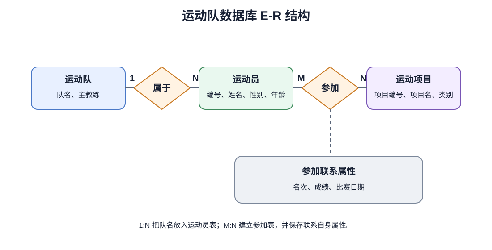
>
> 转换结果：
>
> ```text
> 运动队(
>     队名 PK,
>     主教练
> )
>
> 运动员(
>     运动员编号 PK,
>     姓名,
>     性别,
>     年龄,
>     队名 FK -> 运动队.队名
> )
>
> 运动项目(
>     项目编号 PK,
>     项目名,
>     所属类别
> )
>
> 参加(
>     运动员编号 PK/FK -> 运动员.运动员编号,
>     项目编号 PK/FK -> 运动项目.项目编号,
>     名次,
>     成绩,
>     比赛日期
> )
> ```
>
> `队名` 放在运动员表中，是因为 1:N 联系的外码放在 N 端。运动员与项目是 M:N，必须建立独立的“参加”表，联系自身的名次、成绩和日期也放在该表中。
>
> 若业务允许同一运动员在不同日期多次参加同一项目，则 `(运动员编号, 项目编号, 比赛日期)` 应共同构成主码；题面未明确重复参赛时，通常按 `(运动员编号, 项目编号)` 作答。

#### 原题 2｜2023—2024·软件公司项目管理系统

需求：部门与员工为 1:N；员工与项目为 M:N；项目具有项目号、项目名和预算。

##### 1. E-R 图

> [!example]- 答案
>
> 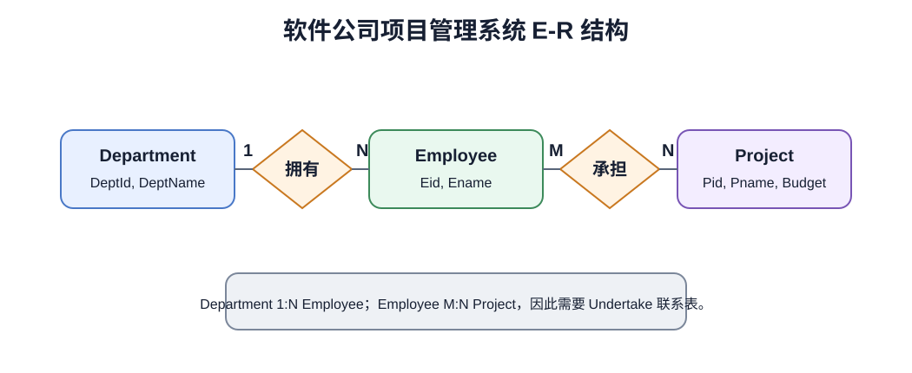

##### 2. 关系模式

> [!example]- 答案
>
> ```text
> Department(DeptId PK, DeptName)
> Employee(Eid PK, Ename, DeptId FK -> Department.DeptId)
> Project(Pid PK, Pname, Budget)
> Undertake(Eid PK/FK -> Employee.Eid,
>           Pid PK/FK -> Project.Pid)
> ```

##### 3. project 表

> [!example]- 答案
>
> ```sql
> CREATE TABLE project (
>     pid VARCHAR(20) PRIMARY KEY,
>     pname VARCHAR(100) NOT NULL UNIQUE,
>     budget DECIMAL(12, 2) NOT NULL,
>     CHECK (budget > 0)
> );
> ```

##### 4. 单条记录

> [!example]- 答案
>
> ```sql
> INSERT INTO project(pid, pname, budget)
> VALUES ('P001', '数据库管理平台', 500000.00);
> ```

#### 原题 3｜2025—2026 样卷·软件公司项目管理系统

部门与员工为 1:N，员工与项目为 M:N；项目号为主码，项目名不可重复，预算大于 0。

> [!example]- 答案
> ```text
> Department(DeptId PK, DeptName)
> Employee(Eid PK, Ename, DeptId FK)
> Project(Pid PK, Pname, Budget)
> Undertake(Eid PK/FK, Pid PK/FK)
> ```
>
> ```sql
> CREATE TABLE project (
>     pid VARCHAR(20) PRIMARY KEY,
>     pname VARCHAR(100) NOT NULL UNIQUE,
>     budget DECIMAL(12, 2) NOT NULL,
>     CHECK (budget > 0)
> );
>
> INSERT INTO project(pid, pname, budget)
> VALUES ('P001', '数据库管理平台', 500000.00);
> ```

### 补充题

#### 补充题 1｜1:N 联系

部门与员工为 1:N，且员工只能属于一个部门。转换为关系模式时，部门号通常应放在____。

- A. 部门表中作为外码
- B. 员工表中作为外码
- C. 单独建立联系表且不保存外码
- D. 两张表中都作为主码

> [!example]- 答案
> **B。** N 端的每个员工只需保存一个所属部门号。

#### 补充题 2｜M:N 联系

学生与课程为 M:N，联系具有“成绩”属性。正确转换是____。

- A. 把所有课程号放入学生表一个字段
- B. 把所有学号放入课程表一个字段
- C. 建立 `SC(Sno,Cno,Grade)`，通常以 `(Sno,Cno)` 为主码
- D. 只保留学生表和课程表

> [!example]- 答案
> **C。** M:N 的组合本身是一类事实，联系属性也属于该组合。

#### 补充题 3｜联系属性

“员工参与项目，并记录在该项目中的工时”。工时应放在____。

- A. 员工实体
- B. 项目实体
- C. 员工—项目的参与联系
- D. 任意一张表都完全等价

> [!example]- 答案
> **C。** 工时由具体员工和具体项目共同决定。

#### 补充题 4｜基数判断

判断 E-R 联系基数时，应依据____。

- A. 当前样本数据中恰好出现的最大数量
- B. 业务规则允许的最大对应数量
- C. 属性的数据类型
- D. 表名的单复数形式

> [!example]- 答案
> **B。** 基数是语义约束，不是当前实例的偶然统计。

#### 补充题 5｜基数判断

“每条线路有多名导游，但一名导游只负责一条线路。”线路与导游是什么关系？外码放在哪里？

> [!example]- 解析
> 是线路 1 —— N 导游。把线路编号放进导游关系作为外码：`Guide(Gid, Gname, Level, RouteId)`。

#### 补充题 6｜M:N 联系属性

会员可以参加多门课程，每门课程也有多名会员，并记录报名时间。转换关系模式。

> [!example]- 解析
> `Member(MemberId, ...)`、`Course(CourseId, ...)`、`Enroll(MemberId, CourseId, EnrollTime)`。中间关系的两个编号是外码，通常共同构成主码；若允许重复报名，则需要加入报名序号或时间参与主码。

#### 补充题 7｜自联系

用户之间可以建立双向好友关系。应怎样设计？

> [!example]- 解析
> 可建立 `Friend(UserId1, UserId2, Since)`，两个用户编号都外码引用 User。为了避免同时保存 `(A,B)` 和 `(B,A)` 两条重复关系，可规定 `UserId1 < UserId2`，或在应用/约束中统一顺序。

#### 补充题 8｜关系属性归属

产品由多种零件组成，一种零件也可用于多个产品，并记录每件产品需要某零件的数量。数量放在哪里？

> [!example]- 解析
> 产品与零件是 M:N，应建立 `Composition(ProductId, PartId, Qty)`。`Qty` 属于二者的组成联系。

---

# 第三章　关系代数与集合查询

SQL 告诉数据库“想得到什么结果”，关系代数则进一步把查询拆成一系列可以组合的基本操作。它并不是另一门用来替代 SQL 的查询语言，而是关系数据库内部理解查询结构的重要基础。选择、投影、连接这些操作，既可以用来写考试中的关系代数表达式，也可以用来解释查询优化器为什么会调整执行顺序。

关系代数采用集合式思维。一个关系是元组集合，查询接收一个或多个关系，再产生新的关系。因为每一步结果仍然是关系，所以操作可以像积木一样连续组合。这种封闭性使复杂查询能够由少量基本运算逐层构造。

> [!note] 本章的核心关系
> 选择负责减少行，投影负责减少列，连接负责把不同关系中的相关元组组合起来；并、差等集合运算处理同类关系；除法或等价差运算表达“满足全部条件”；查询树把表达式变成运算结构，优化的本质是尽早缩小中间结果。

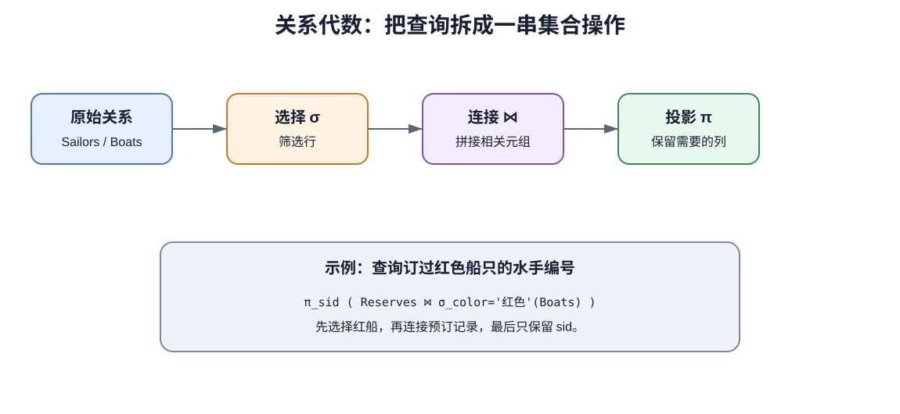

## 1. 关系代数

SQL 的表面语法并不直接等于执行过程。下面两条 SQL 可能写法不同，却表达同一种逻辑；同一条 SQL 也可能有多种物理执行方式。

```sql
SELECT S.sid
FROM Sailors S
JOIN Reserves R ON S.sid = R.sid
WHERE R.bid = 'B01';
```

从逻辑上看，它只做了三件事：先从预订记录中筛选 `bid='B01'`，再与水手关系连接，最后只保留 `sid`。关系代数能够把这三个动作明确写出，因此便于比较不同执行顺序。

关系代数还有两个作用。第一，它为关系模型提供形式化查询基础，说明复杂查询最终可以由若干基本运算组成。第二，它为优化提供依据：选择下推、投影下推等规则，本质上是在保持结果不变的前提下重排代数运算。

所以学习关系代数不是为了背符号，而是为了建立“查询由哪些数据变换组成”的结构感。

## 2. 基本关系代数运算

传统关系代数通常把选择、投影、并、差和笛卡尔积视为基本运算。其他运算如交、连接和除法，都可以由这些基本运算定义出来。

**选择**从关系中保留满足条件的元组；**投影**保留指定属性；**并**合并两个并相容关系的元组；**差**保留只出现在左关系中的元组；**笛卡尔积**把两个关系的每一对元组全部组合。

这些运算之所以足够，是因为查询中的主要动作都可以归结为：缩小行、缩小列、合并同类结果，或者构造两个关系的组合。连接看起来很特殊，实际上就是笛卡尔积之后再进行选择。

关系代数的每个运算结果仍然是关系，因此可以继续参与下一步运算。例如先选择红色船，再连接预订表，最后投影水手编号，就是三个关系运算连续嵌套。

## 3. 选择：条件行

选择运算记作：

$$
\sigma_{条件}(R)
$$

它从关系 $R$ 中保留满足条件的全部元组。选择只改变行数，不改变关系原有属性集合。

例如：

$$
\sigma_{color='红色'}(Boats)
$$

表示从船只关系中找出所有红色船。若 `Boats` 有 `bid、bname、color` 三个属性，选择结果仍然有这三个属性，只是行数减少。

选择条件可以使用比较和逻辑运算：

$$
\sigma_{age\ge 20\land age\le35\land gender='男'}(Sailors)
$$

它对应 SQL 中的 `WHERE`。这里最重要的理解是：选择处理的是元组是否留下，而不是决定显示哪些列。

选择具有较强的可交换性。若两个条件都只依赖同一关系属性，可以先执行任意一个：

$$
\sigma_{A}(\sigma_{B}(R))=\sigma_{B}(\sigma_{A}(R))
$$

这给优化器留下调整顺序的空间。通常更有选择性的条件先执行，可以更快减少中间结果。

## 4. 投影：目标列

投影运算记作：

$$
\pi_{属性列表}(R)
$$

它只保留指定属性，因此主要改变列数。例如：

$$
\pi_{sid,sname}(Sailors)
$$

表示只保留水手编号和姓名。

关系代数使用集合语义，投影后如果多个元组在保留属性上完全相同，重复元组会被消除。假设多名水手级别相同：

$$
\pi_{rating}(Sailors)
$$

得到的是出现过的级别集合，而不是每名水手对应的一行级别。SQL 默认保留重复，需要写 `SELECT DISTINCT rating` 才与经典关系代数投影一致。

投影不仅为了控制输出。查询过程中若后续不再需要某些属性，也可以提前投影，减少中间结果宽度。不过不能过早删除连接属性，否则后面无法完成连接。

## 5. 并、差与交

并、差和交用于处理两个结构相容的关系。它们不能随意作用于任意两张表，而要求两个关系具有相同属性个数，并且对应属性来自相容的域。这称为并相容。

### 5.1 并

并运算记作：

$$
R\cup S
$$

结果包含出现在 $R$ 或 $S$ 中的全部元组，并消除重复。

例如，分别得到绿色船编号和黄色船编号后，可以用并合并：

$$
\pi_{bid}(\sigma_{color='绿色'}(Boats))
\cup
\pi_{bid}(\sigma_{color='黄色'}(Boats))
$$

它与一个包含“或”条件的选择结果等价。

### 5.2 差

差运算记作：

$$
R-S
$$

它保留在 $R$ 中出现、但不在 $S$ 中出现的元组。差具有方向性，$R-S$ 与 $S-R$ 通常不同。

差非常适合表达“没有”。例如所有水手编号减去有预订记录的水手编号，可以得到从未预订过船只的水手编号：

$$
\pi_{sid}(Sailors)-\pi_{sid}(Reserves)
$$

前提是两个结果都只有同一个 `sid` 属性，因此并相容。

### 5.3 交

交运算记作：

$$
R\cap S
$$

结果包含同时出现在两个关系中的元组。交不是最基本运算，因为可以由差定义：

$$
R\cap S=R-(R-S)
$$

例如，同时订过红色船和绿色船的水手编号，可以把两组编号求交。

集合运算的难点通常不在符号，而在于先把两边投影成相同结构。若一边是 `(sid)`，另一边是 `(sid,bid)`，就不能直接求并、差或交。

## 6. 笛卡尔积与连接

两个关系中的数据如果要组合，最宽泛的方式是把每一行与另一关系每一行配对，这就是笛卡尔积。连接则在这些组合中只保留满足关联条件的部分。

### 6.1 笛卡尔积

笛卡尔积记作：

$$
R\times S
$$

若 $R$ 有 $m$ 个元组，$S$ 有 $n$ 个元组，结果最多有 $m\times n$ 个元组。每个结果元组包含两边全部属性。

假设 `Sailors` 有 100 行，`Reserves` 有 1000 行，直接笛卡尔积会产生 100000 个组合，其中绝大多数水手编号并不匹配。这说明笛卡尔积是连接的基础，但通常不会作为最终目的。

若两个关系存在同名属性，需要通过关系名或重命名区分，否则结果属性会产生歧义。

### 6.2 条件连接

条件连接可以定义为：

$$
R\bowtie_{条件}S=\sigma_{条件}(R\times S)
$$

例如水手与预订关系按 `sid` 连接：

$$
Sailors\bowtie_{Sailors.sid=Reserves.sid}Reserves
$$

连接条件排除了编号不一致的组合，只保留每条预订与其所属水手的配对。

理解连接时，不要把它看成“把两张表横着贴起来”。真正过程是：寻找两边满足关联条件的元组对，再把每对元组的属性组合成一条结果。

### 6.3 等值连接与自然连接

若连接条件只使用等号，称为等值连接。自然连接则进一步自动以两个关系中同名属性相等为条件，并在结果中只保留一份同名属性。

例如：

$$
Sailors\bowtie Reserves
$$

若两者唯一同名属性是 `sid`，自然连接会按 `sid` 相等组合。

自然连接写法简洁，但它依赖属性命名。若两个表中有同名但语义不同的属性，自动连接会产生错误结果；若应连接的属性名称不同，自然连接又无法识别。因此实际 SQL 中通常更倾向显式写 `JOIN ... ON ...`。

## 7. 连接查询书写顺序

把自然语言查询转换为关系代数时，可以按“需要哪些关系、每个关系先过滤什么、关系怎样连接、最后输出哪些属性”的顺序思考。

例如：“查询名称包含‘花菜’的菜品销售信息，显示菜品名称、单价、餐厅编号和销售数量。”

需要 `Dish` 和 `Sales` 两个关系。名称条件只涉及 `Dish`，所以先选择：

$$
D_1=\sigma_{dName\ LIKE\ '\%花菜\%'}(Dish)
$$

然后按菜品编号连接：

$$
D_2=D_1\bowtie_{D_1.dID=Sales.dID}Sales
$$

最后投影需要的属性：

$$
\pi_{dName,dPrice,rID,QTY}(D_2)
$$

合并写成：

$$
\pi_{dName,dPrice,rID,QTY}
\left(
\sigma_{dName\ LIKE\ '\%花菜\%'}(Dish)
\bowtie_{Dish.dID=Sales.dID}Sales
\right)
$$

这个顺序不是死记模板，而是对应查询数据流：先在最接近数据源的位置去掉无关元组，再组合关系，最后形成输出结构。

## 8. 除法与“全部”

普通连接擅长表达“存在至少一个匹配”。例如订过红色船的水手，只要找到一条红色船预订记录即可。但“订过所有船的水手”要求对每一艘船都存在匹配，这是一种全称条件。

关系除法记作：

$$
R(X,Y)\div S(Y)
$$

它返回那些 $X$ 值，使得对 $S$ 中每一个 $Y$，组合 $(X,Y)$ 都出现在 $R$ 中。

在水手问题中：

```text
Reserves(sid, bid)
Boats(bid, ...)
```

先把预订关系投影成 `(sid,bid)`，把船只关系投影成 `(bid)`：

$$
\pi_{sid,bid}(Reserves)\div\pi_{bid}(Boats)
$$

结果就是订过全部船只的 `sid`。

除法不是“数值相除”，而是检查某个对象是否覆盖了目标集合中的所有元素。把 `sid` 看作候选水手，把所有 `bid` 看作必须完成的条件，除法就是筛出没有遗漏任何 `bid` 的水手。

### 8.1 差运算与“所有”

“满足所有条件”也可以从反面理解：不存在一个要求没有被满足。

先构造每名水手理论上应有的全部水手—船只组合：

$$
\pi_{sid}(Sailors)\times\pi_{bid}(Boats)
$$

再减去实际预订组合：

$$
Missing=
(\pi_{sid}(Sailors)\times\pi_{bid}(Boats))
-
\pi_{sid,bid}(Reserves)
$$

`Missing` 表示每名水手缺少哪些船。只要某个水手出现在 `Missing` 中，他就没有订过全部船。因此再从全部水手编号中减去这些水手：

$$
\pi_{sid}(Sailors)-\pi_{sid}(Missing)
$$

这个推导与 SQL 中双重 `NOT EXISTS` 的思想完全一致：找不到任何一个未满足的条件，才说明满足全部条件。

## 9. 自然语言与关系代数结构

自然语言中的一些词，会稳定对应某类代数结构。

“满足某条件”通常对应选择；“显示哪些字段”对应投影；“某对象的关联信息”通常需要连接；“A 或 B”可以使用带 `OR` 的选择，也可以先分别选择再求并；“A 且 B”可使用 `AND` 或求交；“没有”常用差；“所有”常用除法或两层差运算。

但不能只看到关键词就机械套符号。例如“查询所有水手”中的“所有”只是自然语言量词，并不一定需要除法；只有当它表示“对目标集合中的每一个对象都满足”时，才是关系除法意义上的“全部”。

判断时应把条件完整改写成一句逻辑话：

- “存在一条匹配记录”——连接或存在条件；
- “不存在任何匹配记录”——差；
- “对于每一个目标都存在匹配记录”——除法；
- “不存在一个目标没有匹配记录”——双重否定。

## 10. 查询树

关系代数表达式是嵌套的，查询树把这种嵌套结构画成树。叶子结点是基础关系，内部结点是选择、投影、连接等操作，根结点是最终结果。

例如：

$$
\pi_{sid,bid}
\left(
Reserves\bowtie_{Reserves.bid=Boats.bid}
\sigma_{color='绿色'\lor color='黄色'}(Boats)
\right)
$$

查询树从底部开始读取：先访问 `Boats`，执行颜色选择；再与 `Reserves` 连接；最后投影 `sid,bid`。

查询树的重要作用是把“表达式看起来怎样写”和“数据经过哪些步骤”分开。两个形式不同的表达式可能对应等价查询树；优化器也可以在保持语义不变的前提下重新安排树中操作位置。

## 11. 查询优化原则

查询优化不是改变查询结果，而是改变得到结果的代价。逻辑优化主要关注中间结果大小，因为中间结果越大，后续连接、排序和传输通常越昂贵。

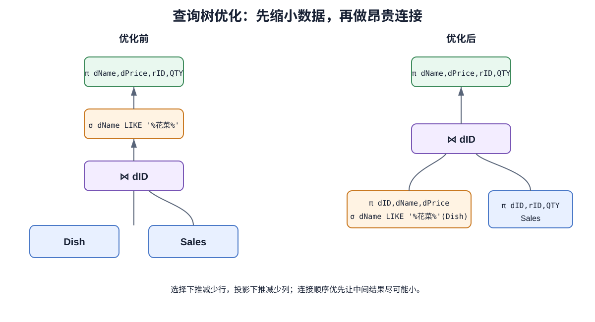

### 11.1 选择下推

若一个选择条件只涉及某个基础关系，应尽量在连接前执行。

未优化写法可能先把全部 `Boats` 与 `Reserves` 连接，再筛选绿色或黄色船。优化后先从 `Boats` 中保留目标颜色，再连接。两者结果相同，但后者参与连接的船只元组更少。

选择下推不能越过不满足语义条件的操作。例如条件依赖连接后才出现的两个关系属性，就不能单独推到任一边。

### 11.2 投影下推

若后续只需要某些属性，可以尽早删除无关列，减少每个中间元组的宽度。

但连接键必须保留。若在连接前从 `Boats` 中只保留 `color` 而删除 `bid`，后面就无法与 `Reserves` 连接。正确投影应保留后续运算需要的属性和最终输出属性。

### 11.3 较小中间结果

多个连接存在时，先连接哪些关系会显著影响代价。通常希望先连接经过过滤后较小、或连接条件选择性较高的关系，以减少后续中间结果。

这不是简单地“总先连接行数最少的表”。索引、数据分布、连接算法和结果选择性都会影响实际代价。关系代数层面的基本直觉仍然是：尽量避免产生大量随后又被丢弃的数据。

## 12. 关系代数与 SQL

关系代数是逻辑运算，SQL 是实际使用的声明式语言，两者大致对应如下：

| 关系代数 | SQL 中常见写法 |
| --- | --- |
| 选择 $\sigma$ | `WHERE` |
| 投影 $\pi$ | `SELECT` 列表；集合语义时常需 `DISTINCT` |
| 连接 $\bowtie$ | `JOIN ... ON ...` |
| 并 $\cup$ | `UNION` |
| 差 $-$ | `EXCEPT`、`NOT EXISTS` 等 |
| 笛卡尔积 $\times$ | `CROSS JOIN` |
| 除法 $\div$ | 双重 `NOT EXISTS` 或分组计数 |

这种对应不是逐字符翻译。SQL 还包含空值、重复行、分组、排序和聚合等关系代数经典形式之外的内容。不过关系代数仍然提供了查询主干结构。

## 本章速记

- 关系代数把查询表示为关系到关系的变换，每一步结果仍然是关系。
- 选择减少行，投影减少列；经典投影会消除重复。
- 并、差、交要求两个关系并相容；差具有方向性。
- 连接可看作笛卡尔积后再选择，自然连接会按同名属性自动匹配。
- “满足全部目标”可用除法，也可理解为“没有任何遗漏”。
- 查询树从叶子关系经过内部运算得到根部结果。
- 选择下推、投影下推和控制中间结果大小，是逻辑查询优化的核心。

## 章节练习与解析

### 材料原题

#### 原题 1｜2022—2023·关系代数与查询优化

##### 1. 所有餐厅菜品信息

> [!example]- 答案与解析
> “所有餐厅”对应除法。先求在每个餐厅都出现的菜品编号：
>
> $$
> T=\pi_{rID,dID}(Sales)\div\pi_{rID}(Restaurant)
> $$
>
> 再连接菜品信息：
>
> $$
> \pi_{dID,dName,dPrice}(Dish\bowtie T)
> $$

##### 2. “花菜”菜品销售信息

输出菜品名称、单价、餐厅编号、销售数量。

> [!example]- 答案
> $$
> \pi_{dName,dPrice,rID,QTY}
> \left(
> \sigma_{dName\ LIKE\ '\%花菜\%'}(Dish)
> \bowtie Sales
> \right)
> $$

##### 3. 第 2 题查询树与优化

> [!example]- 答案与解析
> 未优化形式可以写成：
>
> $$
> \pi_{dName,dPrice,rID,QTY}
> \left(
> \sigma_{dName\ LIKE\ '\%花菜\%'}(Dish\bowtie Sales)
> \right)
> $$
>
> 
>
> 优化后先在 Dish 上选择，再只保留连接和输出所需属性：
>
> $$
> \pi_{dName,dPrice,rID,QTY}
> \left(
> \pi_{dID,dName,dPrice}
> (\sigma_{dName\ LIKE\ '\%花菜\%'}(Dish))
> \bowtie
> \pi_{dID,rID,QTY}(Sales)
> \right)
> $$
>
---

#### 原题 2｜2023—2024·关系代数与查询树

##### 1. 订过所有船的水手姓名和编号

> [!example]- 答案
> $$
> \pi_{sid,sname}
> \left(
> Sailors\bowtie
> \left(
> \pi_{sid,bid}(Reserves)\div\pi_{bid}(Boats)
> \right)
> \right)
> $$

##### 2. 绿色或黄色船只预订信息

> [!example]- 答案
> $$
> \pi_{sid,bid}
> \left(
> Reserves\bowtie
> \sigma_{color='绿色'\lor color='黄色'}(Boats)
> \right)
> $$

##### 3. 查询树与优化

> [!example]- 答案与解析
> 未优化：
>
> $$
> \pi_{sid,bid}
> \left(
> \sigma_{color='绿色'\lor color='黄色'}
> (Reserves\bowtie Boats)
> \right)
> $$
>
> 优化：
>
> $$
> \pi_{sid,bid}
> \left(
> \pi_{sid,bid}(Reserves)
> \bowtie
> \pi_{bid}
> (\sigma_{color='绿色'\lor color='黄色'}(Boats))
> \right)
> $$
>
> 选择条件只涉及 Boats，所以先过滤 Boats；随后只保留连接属性 `bid` 和输出属性 `sid`，再执行连接。

---

#### 原题 3｜2025—2026 样卷·关系代数与查询优化

> [!example]- 完整答案
> 查询订过所有船的水手：
>
> $$
> \pi_{sid,sname}
> \left(
> Sailors\bowtie
> (\pi_{sid,bid}(Reserves)\div\pi_{bid}(Boats))
> \right)
> $$
>
> 查询绿色或黄色船只的预订信息：
>
> $$
> \pi_{sid,bid}
> \left(
> Reserves\bowtie
> \sigma_{color='绿色'\lor color='黄色'}(Boats)
> \right)
> $$
>
> 优化时把对 Boats 的选择下推，并在连接前只保留 `bid`；Reserves 只保留 `sid、bid`，以减少中间关系的行数和列数。

### 补充题

#### 补充题 1｜选择与投影

在关系代数中，选择运算改变____，投影运算改变____。

- A. 列、行
- B. 行、列
- C. 表名、列名
- D. 域、数据类型

> [!example]- 答案
> **B。** 选择筛选元组，投影保留属性。

#### 补充题 2｜并相容

关系 R 与 S 能执行并运算，至少要求____。

- A. 两者元组数相同
- B. 两者具有相同度，且对应属性来自相容域
- C. 两者主码名称相同
- D. 两者都没有 NULL

> [!example]- 答案
> **B。** 传统集合运算要求并相容。

#### 补充题 3｜自然连接

自然连接与等值连接相比，通常会____。

- A. 保留两份同名连接属性
- B. 自动在所有同名属性上相等连接，并去掉重复连接列
- C. 产生所有可能组合
- D. 只能用于一张表

> [!example]- 答案
> **B。** 自然连接按同名属性匹配并合并重复列。

#### 补充题 4｜除法

“查询选修了所有必修课程的学生”最直接对应关系代数中的____。

- A. 并
- B. 差
- C. 除
- D. 投影

> [!example]- 答案
> **C。** 除法用于表达候选对象与要求集合中每个元素都形成关系。

#### 补充题 5｜查询优化

条件只涉及关系 B 时，表达式 `σc(A ⋈ B)` 的典型优化是____。

- A. 先执行 `σc(B)` 再与 A 连接
- B. 先计算 A 与自身笛卡尔积
- C. 删除选择条件
- D. 把连接改成并

> [!example]- 答案
> **A。** 选择下推能提前减少参与连接的元组。

#### 补充题 6｜红色船只

写出“查询订过红色船只的水手编号”的关系代数。

> [!example]- 解析
> $$
> \pi_{sid}
> \left(
> Reserves\bowtie_{Reserves.bid=Boats.bid}
> \sigma_{color='红色'}(Boats)
> \right)
> $$
> 先筛红船，再与预订表连接，最后投影 `sid`。

#### 补充题 7｜绿色或黄色船只

查询绿色或黄色船只的预订信息，显示水手编号和船只编号。

> [!example]- 解析
> $$
> \pi_{sid,bid}
> \left(
> Reserves\bowtie
> \sigma_{color='绿色'\lor color='黄色'}(Boats)
> \right)
> $$

#### 补充题 8｜所有餐厅都有的菜品

设 `Sales(rID,dID,QTY)`，`Restaurant(rID,...)`，查询出现在所有餐厅的菜品编号。

> [!example]- 解析
> $$
> \pi_{rID,dID}(Sales)\div\pi_{rID}(Restaurant)
> $$
> 除法结果保留 `dID`。若还要显示菜品名称和单价，再与 Dish 连接并投影。

#### 补充题 9｜查询树优化

为什么“先选出花菜，再与 Sales 连接”通常比“先连接再筛选”更好？

> [!example]- 解析
> 选择下推会减少进入连接运算的 Dish 元组数。连接通常比单表筛选成本高，中间结果越小，后续 CPU、内存和 I/O 成本越低。

---

# 第四章　SQL 基础：建表、单表查询与数据更新

SQL 的特点是声明式：使用者说明希望得到什么结果，而不是逐步规定数据库必须怎样扫描文件。要真正写对 SQL，首先要把语句分成两个层次。建表语句定义数据能够以什么结构存在，查询和更新语句则在这些结构与约束之内操作数据。

这一章先处理单个关系中的基本操作。重点不只是记住关键字，而是理解每个子句在查询中承担什么职责：`FROM` 确定数据来源，`WHERE` 判断哪些行参与后续处理，`GROUP BY` 把行组成分组，`HAVING` 筛选分组，`SELECT` 决定最终显示什么，`ORDER BY` 只改变展示顺序。

## 1. 示例表

为了让语法不脱离数据语义，下面使用三张表：

```text
Sailors(sid, sname, rating, age, gender)
Boats(bid, bname, color)
Reserves(sid, bid, rDate)
```

`Sailors` 记录水手，`Boats` 记录船只，`Reserves` 记录水手预订船只的事实。一个水手可以预订多艘船，一艘船也可以被多名水手预订，所以 `Reserves` 是连接两端的关系。

在只讨论单表查询时，主要使用 `Sailors`。进入连接与子查询后，再把三张表组合起来。持续使用同一组关系的好处是可以看到：同一个业务问题怎样逐渐从简单筛选扩展为连接、分组和全称查询。

## 2. CREATE TABLE：关系模式

关系模式只写 `Sailors(sid, sname, rating, age, gender)`，还没有说明每个属性使用什么类型、哪些属性必填、哪一组属性唯一。`CREATE TABLE` 把逻辑结构转换为 DBMS 能够执行的定义。

### 2.1 语句结构

建表语句的基本形式是：

```sql
CREATE TABLE 表名 (
    列名 数据类型 [列级约束],
    ...,
    [表级约束]
);
```

列定义回答“这一列能保存什么值”，约束回答“这些值还必须满足什么规则”。表级约束适合描述复合主码、外码等涉及多列的规则。

### 2.2 常用数据类型

数据类型不是单纯的存储格式，它决定允许的操作和比较方式。

`INT` 适合整数；`DECIMAL(p,s)` 适合需要精确小数的金额；`FLOAT` 属于近似数，可能产生二进制浮点误差；`CHAR(n)` 适合长度固定的字符串，`VARCHAR(n)` 适合长度可变的文本；`DATE`、`DATETIME`、`TIMESTAMP` 用于日期时间。

电话号码和编号虽然由数字字符组成，通常不应使用整数。它们不参与算术运算，还可能带前导零，因此字符串更合适。金额通常优先使用 `DECIMAL`，因为账务数据需要可预测的精度。

### 2.3 常用约束

`PRIMARY KEY` 保证主码唯一且非空。`NOT NULL` 表示该列必须有值。`UNIQUE` 保证列或列组不重复，但它不等同于主码。`CHECK` 检查业务条件。`DEFAULT` 在插入时未提供值的情况下给出默认值。`FOREIGN KEY` 建立参照完整性。

约束应尽量表达真实业务，而不是为了让建表语句看起来完整。例如，“姓名不能重复”通常不符合现实，不应随意加 `UNIQUE`；“预算大于 0”则具有明确业务含义，可以使用 `CHECK`。

### 2.4 完整建表示例

`Reserves` 中 `sid` 和 `bid` 共同标识一条预订记录时，可以写：

```sql
CREATE TABLE Reserves (
    sid   VARCHAR(10) NOT NULL,
    bid   VARCHAR(10) NOT NULL,
    rDate DATE NOT NULL,
    PRIMARY KEY (sid, bid),
    FOREIGN KEY (sid) REFERENCES Sailors(sid),
    FOREIGN KEY (bid) REFERENCES Boats(bid)
);
```

这里的两个字段既参与复合主码，又分别是外码。主码说明同一水手与同一船只在当前设计中最多一条记录；外码说明水手和船只必须真实存在。

如果业务允许同一水手在不同日期多次预订同一艘船，主码就应包含 `rDate` 或使用独立预订编号。建表语句必须反映业务唯一性，不能只照搬模板。

## 3. ALTER 与 DROP

表创建完成以后，表结构并不是永远不能修改。比如一开始设计 `Sailors` 表时没有记录邮箱，后来系统增加了邮箱功能，就需要在原表中增加一列。这时使用的不是 `UPDATE`，而是 `ALTER TABLE`。

```sql
ALTER TABLE Sailors
ADD COLUMN email VARCHAR(100);
```

这条语句修改的是**表的结构**：它为 `Sailors` 表增加了一个 `email` 字段。表中原来的数据仍然保留，只是每一行都多出了这一列。

`ALTER TABLE` 常见的用途包括：

```sql
-- 增加字段
ALTER TABLE Sailors
ADD COLUMN email VARCHAR(100);

-- 修改字段定义
ALTER TABLE Sailors
MODIFY COLUMN email VARCHAR(200) NOT NULL;

-- 删除字段
ALTER TABLE Sailors
DROP COLUMN email;

-- 增加约束
ALTER TABLE Sailors
ADD CONSTRAINT ck_age CHECK (age >= 0);
```

因此要注意区分：

- `ALTER TABLE`：修改表结构。
- `UPDATE`：修改表中已有的数据。

例如：

```sql
UPDATE Sailors
SET age = 20
WHERE sid = 'S01';
```

这条语句只修改满足条件的数据行中的 `age` 值，并没有改变表有哪些字段。

如果不再需要整张表，可以使用：

```sql
DROP TABLE Sailors;
```

`DROP TABLE` 会把表中的数据和表结构一起删除。执行以后，`Sailors` 这张表本身就不存在了。

它和下面这条语句完全不同：

```sql
DELETE FROM Sailors;
```

`DELETE FROM Sailors` 只会删除表中的全部数据，表的字段、主码和其他约束仍然保留，之后还可以继续向表中插入数据。

可以简单理解为：

- `DELETE`：清空表里的数据，但保留表。
- `DROP TABLE`：把整张表直接删除。

删除表时还要考虑外码依赖。例如，假设 `Reserves.sid` 引用了 `Sailors.sid`，那么 `Reserves` 表依赖 `Sailors` 表。此时直接删除 `Sailors`，数据库通常会拒绝，因为删除以后，`Reserves` 中的外码就失去了引用目标。

因此，一般需要先删除相关外码约束，或者先删除依赖该表的对象，再删除当前表。

## 4. INSERT：数据插入

`INSERT` 向关系中加入新元组。推荐明确写出列名：

```sql
INSERT INTO Sailors (sid, sname, rating, age, gender)
VALUES ('S01', '张三', 7, 24, '男');
```

列名列表使语句不依赖表中列的物理顺序，也允许省略有默认值或允许为空的列。

一次插入多行可以写：

```sql
INSERT INTO Boats (bid, bname, color)
VALUES
    ('B01', '海风号', '红色'),
    ('B02', '远航号', '绿色');
```

`INSERT ... SELECT` 可以把查询结果插入另一个表：

```sql
INSERT INTO HighRatingSailors (sid, sname)
SELECT sid, sname
FROM Sailors
WHERE rating >= 8;
```

插入并不是把文本机械追加到文件末尾。DBMS 会检查数据类型、主码、外码、`CHECK` 和其他约束。只要违反任一规则，插入就可能失败。

## 5. SELECT 基本结构

一条常见查询写作：

```sql
SELECT [DISTINCT] 列或表达式
FROM 数据来源
WHERE 行条件
GROUP BY 分组列
HAVING 分组条件
ORDER BY 排序列;
```

书写顺序与逻辑处理顺序并不相同。为了形成结果，数据库先确定 `FROM` 数据来源，再用 `WHERE` 过滤行，然后分组，筛选分组，最后形成 `SELECT` 输出并排序。

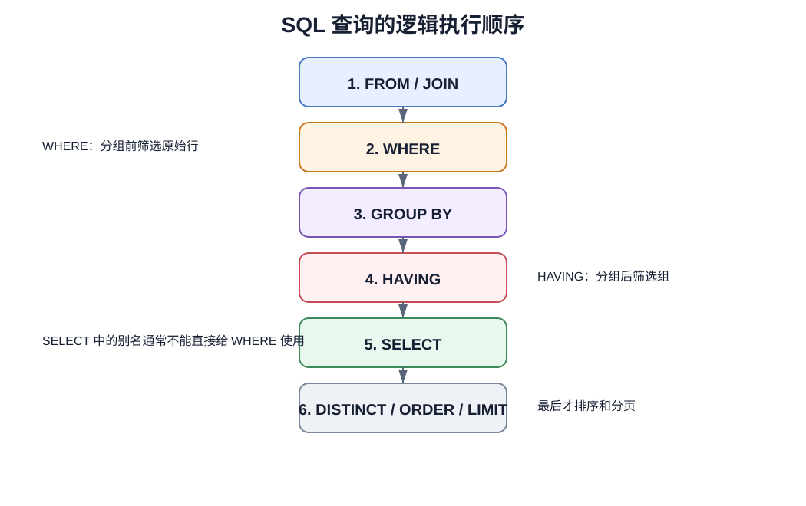

这可以解释许多语法现象。例如，`WHERE` 通常不能直接使用 `SELECT` 中刚定义的别名，因为逻辑上执行 `WHERE` 时，该别名还未形成；`ORDER BY` 往往可以使用别名，因为排序发生在输出形成之后。

SQL 是声明式语言，逻辑顺序不等于数据库物理执行时必须逐步照做。优化器可以重排访问路径，但必须保持与逻辑语义相同的结果。

## 6. 单表查询

单表查询的核心是从一个关系中确定“保留哪些行”和“显示哪些列”。对应关系代数中的选择和投影。

### 6.1 选择列与别名

```sql
SELECT sid, sname
FROM Sailors;
```

只返回编号和姓名。`SELECT *` 会返回所有列，但在长期维护的程序中不够稳定，因为表新增列后结果结构会自动改变。

别名用于改善输出名称或简化表达式：

```sql
SELECT sname AS sailor_name,
       rating + 1 AS next_rating
FROM Sailors;
```

别名只改变结果中的名称，不会修改原表字段。

### 6.2 去重

SQL 默认保留重复结果。例如多个水手可能拥有同一级别：

```sql
SELECT rating
FROM Sailors;
```

会返回每名水手的一行。若只想知道出现过哪些级别，应写：

```sql
SELECT DISTINCT rating
FROM Sailors;
```

`DISTINCT` 针对整个选择列表去重。`SELECT DISTINCT rating, gender` 去除的是 `(rating, gender)` 组合重复，而不是分别对两列去重。

### 6.3 表达式

查询结果列可以是表达式：

```sql
SELECT sname, age + 1 AS age_next_year
FROM Sailors;
```

这只是计算输出，不会修改表中 `age`。真正更新数据需要使用 `UPDATE`。

包含 `NULL` 的算术表达式通常仍为 `NULL`，因为未知值参与计算后结果仍未知。需要替代空值时，可使用 `COALESCE(column, default_value)`。

### 6.4 比较条件

`WHERE` 中常用 `=、<>、>、>=、<、<=`。多个条件可用 `AND、OR、NOT` 组合。

```sql
SELECT *
FROM Sailors
WHERE age >= 20
  AND age <= 35
  AND gender = '男';
```

`AND` 的优先级通常高于 `OR`，复杂条件应使用括号明确语义：

```sql
WHERE (color = '绿色' OR color = '黄色')
  AND price < 100
```

缺少括号可能使条件被解释成另一种逻辑组合。

### 6.5 IN

`IN` 适合判断一个值是否属于给定集合：

```sql
SELECT *
FROM Boats
WHERE color IN ('红色', '绿色', '黄色');
```

它等价于多个等值条件使用 `OR` 连接。`NOT IN` 表示不属于集合，但当集合来自子查询且可能含 `NULL` 时，需要特别谨慎。

### 6.6 LIKE

`LIKE` 进行模式匹配。`%` 表示任意长度字符，`_` 表示单个字符。

```sql
WHERE bname LIKE '%号'
```

表示名称以“号”结尾；

```sql
WHERE sname LIKE '张_'
```

表示以“张”开头且总共再有一个字符。

`LIKE '%花菜%'` 表示字段中任意位置包含“花菜”。前导 `%` 会让普通 B+ 树索引难以直接定位起点，这属于后续索引章节的性能问题，但不影响其逻辑语义。

### 6.7 NULL

空值不能使用 `= NULL` 判断，而要写：

```sql
WHERE email IS NULL
WHERE email IS NOT NULL
```

这是因为 `NULL` 不是一个可比较的普通值。任何 `column = NULL` 都不会得到 `TRUE`。

判断空值时还要区分空字符串。`''` 是一个长度为零但已知的字符串，`NULL` 表示没有确定值，两者语义不同。

## 7. 排序与结果限制

关系在逻辑上无序。没有 `ORDER BY` 时，数据库不保证结果按主码、插入时间或磁盘位置返回，即使某次执行看起来有稳定顺序，也不能依赖。

```sql
SELECT sid, sname, age
FROM Sailors
ORDER BY age DESC, sid ASC;
```

先按年龄降序，年龄相同时按编号升序。`ASC` 为升序，`DESC` 为降序。

限制结果数量在 MySQL 中常写：

```sql
SELECT *
FROM Sailors
ORDER BY rating DESC
LIMIT 5;
```

先排序再限制，得到级别最高的五名水手。若没有 `ORDER BY`，`LIMIT 5` 只是任意五行，不能表示“前五名”。

分页常使用 `LIMIT ... OFFSET ...`，但数据量大时偏移量过高可能需要扫描并丢弃大量行，实际系统会考虑基于游标或键值的分页方式。

## 8. 聚合函数

聚合函数把多行数据概括成一个值。常见函数包括：

- `COUNT`：计数；
- `SUM`：求和；
- `AVG`：平均值；
- `MAX`：最大值；
- `MIN`：最小值。

它们的关键区别之一是对 `NULL` 的处理。`COUNT(*)` 统计结果中的行数；`COUNT(age)` 只统计 `age` 非空的行；`SUM(age)`、`AVG(age)` 等通常忽略空值。

```sql
SELECT COUNT(*) AS sailor_count,
       AVG(age) AS avg_age
FROM Sailors
WHERE gender = '男';
```

`WHERE` 先筛选男性水手，聚合函数再对剩余行计算。

`COUNT(DISTINCT sid)` 可以统计不同水手编号数量。它与 `COUNT(*)` 的区别在连接查询中特别重要，因为同一水手可能因多条预订记录重复出现。

## 9. GROUP BY 与 HAVING

没有 `GROUP BY` 时，所有满足 `WHERE` 的行被看成一个整体。`GROUP BY` 根据指定属性把行分成多个组，并对每组分别计算聚合结果。

```sql
SELECT rating,
       COUNT(*) AS sCount,
       AVG(age) AS avgAge
FROM Sailors
GROUP BY rating;
```

每个 `rating` 值形成一个组，结果每组一行。

分组查询中的 `SELECT` 列通常只能是分组属性或聚合表达式。若按 `rating` 分组，却直接选择 `sname`，一个组中可能有多个姓名，数据库无法确定应显示哪一个。

`HAVING` 用于筛选聚合后的组：

```sql
SELECT rating, COUNT(*) AS sCount
FROM Sailors
GROUP BY rating
HAVING COUNT(*) >= 3;
```

它只保留人数至少为 3 的级别。

### 9.1 WHERE 与 HAVING

`WHERE` 作用于分组前的单行，`HAVING` 作用于分组后的组。

若查询“年龄大于 20 的水手中，人数超过 3 的级别”：

```sql
SELECT rating, COUNT(*)
FROM Sailors
WHERE age > 20
GROUP BY rating
HAVING COUNT(*) > 3;
```

`age > 20` 能对每一行判断，所以属于 `WHERE`；`COUNT(*) > 3` 只有分组后才有意义，所以属于 `HAVING`。

能够在 `WHERE` 完成的普通行条件一般不应拖到 `HAVING`，因为提前过滤可以减少参与分组的数据量，也更准确表达逻辑。

## 10. CASE：条件表达式

`CASE` 在 SQL 表达式中实现条件分支。它可以根据每行数据产生不同结果：

```sql
SELECT sname,
       CASE
           WHEN rating >= 8 THEN '高级'
           WHEN rating >= 5 THEN '中级'
           ELSE '初级'
       END AS rating_level
FROM Sailors;
```

`CASE` 返回一个值，因此可以出现在 `SELECT`、`ORDER BY`、`UPDATE` 等位置。它不是流程控制语句，而是一个条件表达式。

例如，年龄大于 40 的水手级别加一，但最高不超过 9：

```sql
UPDATE Sailors
SET rating = CASE
    WHEN rating < 9 THEN rating + 1
    ELSE 9
END
WHERE age > 40;
```

也可以使用 `LEAST(rating + 1, 9)`，但 `CASE` 更容易表达复杂规则。

## 11. UPDATE：数据更新

`UPDATE` 修改已有元组。最危险的问题不是语法复杂，而是忘记 `WHERE`，从而更新整张表。

### 11.1 简单更新

```sql
UPDATE Sailors
SET rating = 8
WHERE sid = 'S01';
```

数据库先找到满足条件的行，再修改指定列。若条件匹配多行，所有匹配行都会更新。

### 11.2 多列更新

```sql
UPDATE Sailors
SET rating = rating + 1,
    age = age + 1
WHERE sid = 'S01';
```

右侧表达式通常基于更新前的当前行值计算。具体 DBMS 对同一 `SET` 中列赋值顺序的细节可能不同，复杂依赖应避免模糊写法。

### 11.3 带上限更新

例如级别加一但不超过 9：

```sql
UPDATE Sailors
SET rating = LEAST(rating + 1, 9)
WHERE age > 40;
```

这里不能只写 `WHERE rating < 9` 后加一而忽略年龄条件；每个业务条件都必须明确表达。

### 11.4 子查询更新

更新条件可以依赖其他表：

```sql
UPDATE MedRecord
SET Cost = Cost * 0.5
WHERE sNo IN (
    SELECT s.sNo
    FROM Staff s
    JOIN Depart d ON s.dNo = d.dNo
    WHERE d.dName = '物流部'
);
```

子查询先找出物流部员工编号，外层再更新这些员工的医疗记录。

某些 MySQL 场景中，不能在更新目标表的子查询中直接读取同一表，需要增加一层派生表。那是具体实现限制，不改变“先确定目标行，再执行更新”的逻辑。

## 12. DELETE：数据删除

`DELETE` 删除关系中的元组，不删除表结构。

### 12.1 简单删除

```sql
DELETE FROM Dish
WHERE dPrice > 500;
```

只删除单价超过 500 的菜品。省略 `WHERE` 会删除全部行，但表仍存在。

删除可能受到外码限制。若销售记录仍引用某菜品，DBMS 可能拒绝删除，除非外码定义了级联等处理方式。

### 12.2 无关联记录对象

“删除没有被预订过的船只”要求对每艘船判断是否不存在任何预订记录：

```sql
DELETE FROM Boats b
WHERE NOT EXISTS (
    SELECT 1
    FROM Reserves r
    WHERE r.bid = b.bid
);
```

子查询与外层当前船只相关。只要找到一条相同 `bid` 的预订，`EXISTS` 就为真，`NOT EXISTS` 为假，该船不会删除。

也可使用左连接或 `NOT IN` 改写，但删除语句中 `NOT EXISTS` 往往最直接地表达“不存在关联记录”。

### 12.3 NOT EXISTS

若使用：

```sql
WHERE bid NOT IN (SELECT bid FROM Reserves)
```

而子查询结果中包含 `NULL`，比较可能产生 `UNKNOWN`，导致没有任何行满足条件。即使当前表定义保证 `bid` 非空，理解这个风险仍然重要。

`NOT EXISTS` 检查的是是否存在匹配行，不直接把外层值与含空值集合逐项比较，因此更符合“没有关联记录”的语义。

## 13. 常见单表与更新结构

### 范围查询

```sql
SELECT *
FROM Sailors
WHERE age BETWEEN 20 AND 35;
```

`BETWEEN` 通常包含两端，等价于 `age >= 20 AND age <= 35`。

### 模糊查询

```sql
SELECT *
FROM Dish
WHERE dName LIKE '%花菜%';
```

`%` 允许前后出现任意字符。

### 最大值记录

```sql
SELECT *
FROM Sailors
WHERE rating = (SELECT MAX(rating) FROM Sailors);
```

使用等于最大值的条件会保留全部并列最高记录，而 `ORDER BY ... LIMIT 1` 只返回其中一条，语义不同。

### 百分比更新

“提高 15%”应乘以 `1.15`，“降低 30%”通常是乘以 `0.70`，“调整为原来的 30%”则乘以 `0.30`。这些自然语言不能混淆。

```sql
UPDATE Dish
SET dPrice = dPrice * 0.30
WHERE ...;
```

### 无关联记录

```sql
DELETE FROM Parent p
WHERE NOT EXISTS (
    SELECT 1
    FROM Child c
    WHERE c.parent_id = p.id
);
```

这是一类可迁移到菜品—销售、部门—员工、顾客—订单等多种场景的结构。

## 本章速记

- `CREATE TABLE` 定义结构、类型和约束；`ALTER` 修改结构；`DROP` 删除对象。
- `INSERT` 增加元组，`UPDATE` 修改元组，`DELETE` 删除元组。
- SQL 逻辑顺序大致是 `FROM → WHERE → GROUP BY → HAVING → SELECT → ORDER BY`。
- `WHERE` 筛行，`GROUP BY` 分组，`HAVING` 筛组。
- `COUNT(*)` 统计行，`COUNT(column)` 忽略该列的空值。
- `NULL` 使用 `IS NULL` 判断。
- 更新和删除若遗漏 `WHERE` 会作用于全部行。
- “没有关联记录”通常使用相关 `NOT EXISTS` 表达最稳妥。

## 章节练习与解析

### 补充题

#### 补充题 1｜建表

建立项目表 `project`，`pid` 为主码，`pname` 不可重复，`budget` 大于 0。

> [!example]- 解析
> ```sql
> CREATE TABLE project (
>     pid VARCHAR(20) PRIMARY KEY,
>     pname VARCHAR(100) NOT NULL UNIQUE,
>     budget DECIMAL(12, 2) NOT NULL,
>     CHECK (budget > 0)
> );
> ```

#### 补充题 2｜分组统计

统计就诊次数大于 2 次的职工平均医疗费用和总医疗费用。

> [!example]- 解析
> ```sql
> SELECT
>     sNo,
>     AVG(Cost) AS avgCost,
>     SUM(Cost) AS totalCost
> FROM MedRecord
> GROUP BY sNo
> HAVING COUNT(*) > 2;
> ```
> “次数大于 2”是对组的限制，因此使用 HAVING。

#### 补充题 3｜没有订单的顾客

> [!example]- 解析
> ```sql
> DELETE FROM Customers AS c
> WHERE NOT EXISTS (
>     SELECT 1
>     FROM Orders AS o
>     WHERE o.CustomerID = c.CustomerID
> );
> ```

#### 补充题 4｜订单量最多员工

> [!example]- 解析
> 一种通用写法是先按员工统计订单数，再找最大值。MySQL 更新目标表与子查询冲突时，可以多套一层派生表。
>
> ```sql
> UPDATE Employee
> SET Salary = Salary + 1000
> WHERE Eid IN (
>     SELECT Eid
>     FROM (
>         SELECT Eid
>         FROM Orders
>         GROUP BY Eid
>         HAVING COUNT(*) = (
>             SELECT MAX(cnt)
>             FROM (
>                 SELECT COUNT(*) AS cnt
>                 FROM Orders
>                 GROUP BY Eid
>             ) AS counts
>         )
>     ) AS winners
> );
> ```
> 该写法能保留并列第一。考试若数据保证唯一，也可使用排序加 `LIMIT 1`。

#### 补充题 5｜CHECK 约束

建立 `Project(pid, pname, budget)` 时，若要求 `budget` 必须大于 0，最直接的表级或列级约束是________。

- A. `DEFAULT (budget > 0)`
- B. `CHECK (budget > 0)`
- C. `UNIQUE (budget > 0)`
- D. `FOREIGN KEY (budget > 0)`

> [!example]- 解析
> **答案：B。**`CHECK` 用于限制单行中列值必须满足的布尔条件。

#### 补充题 6｜UPDATE 作用范围

执行下列语句后，哪些行会被修改？

```sql
UPDATE Sailors
SET rating = rating + 1
WHERE age > 40;
```

- A. 只修改第一名年龄大于 40 的水手
- B. 修改所有年龄大于 40 的水手
- C. 修改所有水手
- D. 只修改 `rating` 为 NULL 的水手

> [!example]- 解析
> **答案：B。**`UPDATE` 默认作用于所有满足 `WHERE` 条件的行；没有 `WHERE` 才会命中全表。

#### 补充题 7｜复合主码

关系 `Sales(rID, dID, QTY)` 中，若同一家餐厅对同一道菜只保留一条汇总销售记录，最合适的主码是________。

- A. `rID`
- B. `dID`
- C. `(rID, dID)`
- D. `QTY`

> [!example]- 解析
> **答案：C。** 单独的餐厅号或菜品号都不能唯一标识一条“某餐厅销售某菜品”的记录，二者组合才可以。

#### 补充题 8｜DELETE 与 DROP

关于 `DELETE FROM Dish;` 与 `DROP TABLE Dish;`，下列说法正确的是________。

- A. 二者都只删除满足条件的行
- B. `DELETE` 删除表结构，`DROP` 只删除数据
- C. `DELETE` 删除数据但保留表结构，`DROP` 删除整个表对象
- D. 二者完全等价

> [!example]- 解析
> **答案：C。**`DELETE` 属于数据操纵，表仍存在；`DROP TABLE` 属于数据定义，会移除表结构及其数据。

---

# 第五章　SQL 进阶：连接、子查询、分组、视图与权限

单表查询只能回答一个关系内部的问题。真实业务中的信息通常被拆在多张表中：员工表保存员工，部门表保存部门，医疗记录表保存就诊事实。要查询“李四所在部门的电话”，必须先找到李四，再根据部门编号找到部门；要查询“没有就诊记录的员工”，还要保留连接失败的一侧。

SQL 进阶的核心不在于语句变长，而在于处理不同逻辑关系：存在、没有、全部、每组统计、保留无匹配对象、把查询封装成视图，以及限制用户权限。只要先把自然语言改写成明确逻辑，再选择连接、子查询或分组，复杂查询仍然可以逐层构造。

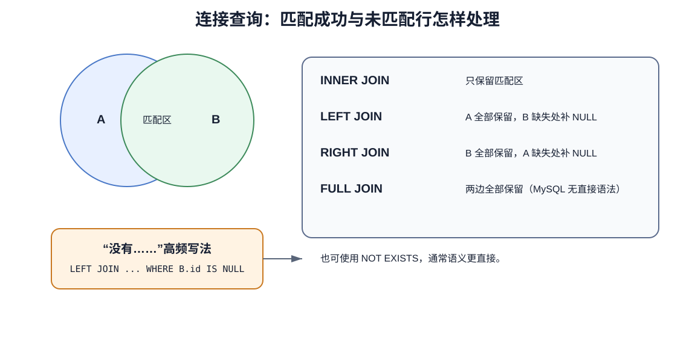

## 1. 多表查询与连接

规范化设计会把不同类型的事实分开保存。员工姓名由员工编号决定，部门电话由部门编号决定；若把部门电话重复写进每名员工记录，会产生更新异常。因此查询完整业务信息时，必须重新把这些关系按外码组合。

设：

```text
Depart(dNo, dName, mNo, dTel)
Staff(sNo, sName, dNo)
```

查询李四所在部门：

```sql
SELECT d.dName, d.dTel
FROM Staff s
JOIN Depart d ON s.dNo = d.dNo
WHERE s.sName = '李四';
```

连接条件 `s.dNo = d.dNo` 说明两张表中的哪两行属于同一个业务对象。如果遗漏连接条件，数据库会产生笛卡尔积，把每名员工与每个部门任意组合。

表别名并不只为了缩短语句。当两个表都有 `dNo` 时，`s.dNo` 与 `d.dNo` 能明确属性来源，也使自连接成为可能。

## 2. INNER JOIN

`INNER JOIN` 只保留两边都能找到匹配的元组。普通 `JOIN` 通常就是内连接。

```sql
SELECT s.sid, s.sname, r.bid
FROM Sailors s
JOIN Reserves r ON s.sid = r.sid;
```

没有预订记录的水手不会出现，因为找不到匹配的 `Reserves` 元组；存在预订但对应水手不存在的记录通常会被外码阻止，即使存在也不会出现在内连接结果中。

一对多连接会使“一”端元组重复。例如一名水手有三条预订，连接结果中会出现三行该水手信息。这不是重复错误，而是三条不同关联事实。若最终只想得到水手编号，应考虑 `DISTINCT` 或分组。

多表连接只是继续增加 `JOIN`：

```sql
SELECT s.sname, b.bname, r.rDate
FROM Reserves r
JOIN Sailors s ON r.sid = s.sid
JOIN Boats b ON r.bid = b.bid;
```

每个连接条件都应对应真实的主外码或业务关联。

## 3. 外连接

内连接会丢掉没有匹配的一方。但有些问题恰恰要求保留这些对象，例如“显示每个员工的医疗情况，没有就诊过的员工也要显示”。外连接为未匹配一侧补 `NULL`，使其仍出现在结果中。

### 3.1 LEFT JOIN

`LEFT JOIN` 保留左表全部行，右表没有匹配时以 `NULL` 补齐：

```sql
SELECT s.sNo, s.sName, m.mDate, m.Hospital, m.Cost
FROM Staff s
LEFT JOIN MedRecord m ON s.sNo = m.sNo;
```

有多次就诊的员工会出现多行；没有就诊的员工也有一行，只是医疗字段为空。

条件放在 `ON` 还是 `WHERE` 会影响结果。若要保留所有员工，并只连接费用超过 100 的医疗记录，应写：

```sql
LEFT JOIN MedRecord m
  ON s.sNo = m.sNo
 AND m.Cost > 100
```

若把 `m.Cost > 100` 放进 `WHERE`，未匹配行的 `m.Cost` 为 `NULL`，会被过滤，外连接可能退化成类似内连接的效果。

### 3.2 LEFT JOIN 与“没有”查询

要找没有医疗记录的员工，可以利用右表主码在未匹配时为 `NULL`：

```sql
SELECT s.sNo, s.sName
FROM Staff s
LEFT JOIN MedRecord m ON s.sNo = m.sNo
WHERE m.sNo IS NULL;
```

这里检查 `m.sNo` 是因为它在真实医疗记录中本应非空，出现 `NULL` 就能确定连接失败。

这种写法与 `NOT EXISTS` 语义相同。选择哪一种取决于表达清晰度和具体查询计划。

### 3.3 RIGHT JOIN 与 FULL JOIN

`RIGHT JOIN` 保留右表全部行，可以通过交换左右表改写为 `LEFT JOIN`。实际书写中统一使用 `LEFT JOIN` 往往更容易保持阅读方向。

`FULL OUTER JOIN` 保留两边全部行，匹配的组合，未匹配的各自补空。MySQL 没有直接的 `FULL JOIN` 语法，通常需要使用左右连接与 `UNION` 等方式模拟。

## 4. 自连接

自连接是同一张表以不同角色参与连接。员工表中的 `manager_id` 引用员工表自己的 `eid` 时，可以分别给“员工”和“经理”两个别名：

```sql
SELECT e.ename AS employee_name,
       m.ename AS manager_name
FROM Employee e
LEFT JOIN Employee m ON e.manager_id = m.eid;
```

虽然物理上是一张表，逻辑上 `e` 表示下属角色，`m` 表示经理角色。没有别名，字段来源无法区分。

自连接还可用于比较同行，例如查找工资高于同部门平均以外的结构，但若只是聚合比较，子查询或窗口函数可能更自然。自连接的本质不是“自己连接自己”这一形式，而是同一实体集中的不同实例发生联系。

## 5. 子查询位置

子查询是嵌套在另一条 SQL 中的查询。它先产生一个值、一列值或一张临时结果，再被外层使用。子查询放在哪里，取决于它产生什么形状的数据。

### 5.1 WHERE 中的子查询

`WHERE` 子查询通常用于产生比较值或集合：

```sql
SELECT *
FROM Sailors
WHERE rating > (
    SELECT AVG(rating)
    FROM Sailors
);
```

内层返回一个平均值，外层逐行比较。

若子查询返回多行，不能使用普通 `=`，而要使用 `IN、ANY、ALL、EXISTS` 等与集合相容的操作符。

### 5.2 FROM 中的派生表

子查询也可以产生一张临时关系放在 `FROM` 中：

```sql
SELECT x.rating, x.sCount
FROM (
    SELECT rating, COUNT(*) AS sCount
    FROM Sailors
    GROUP BY rating
) AS x
WHERE x.sCount > 2;
```

内层先完成分组，外层再把分组结果当作普通表继续查询。派生表通常必须有别名。

这种结构适合“先按一个层次汇总，再在汇总结果上继续统计或筛选”的问题。

### 5.3 SELECT 中的标量子查询

若子查询保证只返回一个值，可以出现在选择列表中：

```sql
SELECT s.sid,
       s.sname,
       (
           SELECT COUNT(*)
           FROM Reserves r
           WHERE r.sid = s.sid
       ) AS reserve_count
FROM Sailors s;
```

外层每名水手都会执行逻辑上的相关计数。实际优化器可能改写执行，但语义上子查询必须为当前水手返回单个值。

如果子查询返回多行，标量位置会报错。

## 6. 相关子查询与非相关子查询

### 6.1 非相关子查询

非相关子查询不引用外层列，可以独立执行：

```sql
SELECT *
FROM Sailors
WHERE age > (SELECT AVG(age) FROM Sailors);
```

平均年龄与外层当前行无关。逻辑上可以先计算一次，再用于所有行比较。

### 6.2 相关子查询

相关子查询引用外层当前元组：

```sql
SELECT b.bid, b.bname
FROM Boats b
WHERE NOT EXISTS (
    SELECT 1
    FROM Reserves r
    WHERE r.bid = b.bid
);
```

子查询中的 `b.bid` 来自外层当前船只。对不同船只，子查询检查不同的预订条件。

理解相关子查询时，可以把它想成外层取出一行，把该行参数带入内层询问；但这只是逻辑模型，不意味着数据库一定真的逐行重复扫描。优化器常把它改写为反连接等更高效结构。

## 7. IN 与 EXISTS

`IN` 和 `EXISTS` 都能表达存在性，但观察角度不同。

### 7.1 IN

`IN` 判断一个值是否属于子查询返回的集合：

```sql
SELECT *
FROM Sailors
WHERE sid IN (
    SELECT sid
    FROM Reserves
);
```

它适合内层结果是一列值，外层拿一个值与集合比较的场景。

### 7.2 EXISTS

`EXISTS` 不关心子查询具体返回什么列，只关心是否至少有一行：

```sql
SELECT *
FROM Sailors s
WHERE EXISTS (
    SELECT 1
    FROM Reserves r
    WHERE r.sid = s.sid
);
```

一旦找到匹配行，存在条件就成立。`SELECT 1` 只是表明返回内容不重要。

### 7.3 NOT EXISTS

`NOT EXISTS` 表示找不到任何匹配行：

```sql
SELECT *
FROM Boats b
WHERE NOT EXISTS (
    SELECT 1
    FROM Reserves r
    WHERE r.bid = b.bid
);
```

它非常适合“没有销售记录”“没有下属职工”“没有被预订过”等问题。

`NOT EXISTS` 与 `NOT IN` 在无空值时常可得到相同结果，但 `NOT IN` 遇到子查询中的 `NULL` 会受三值逻辑影响。因此“不存在”问题通常优先用 `NOT EXISTS`。

## 8. ANY、ALL 与比较量词

子查询返回多个值时，`ANY` 和 `ALL` 让普通比较扩展到集合。

### 8.1 ANY / SOME

`> ANY (子查询)` 表示大于集合中至少一个值。只要存在一个值使比较成立，整体就成立。

```sql
WHERE salary > ANY (
    SELECT salary
    FROM Staff
    WHERE dNo = 'D01'
)
```

相当于工资大于 D01 部门至少一名员工的工资。在集合非空且无特殊空值影响时，它接近于“大于该集合最小值”。

`= ANY` 与 `IN` 语义相近。`SOME` 通常是 `ANY` 的同义词。

### 8.2 ALL

`> ALL (子查询)` 表示大于集合中的每一个值，相当于大于该集合最大值：

```sql
WHERE salary > ALL (
    SELECT salary
    FROM Staff
    WHERE dNo = 'D01'
)
```

若子查询为空，`ALL` 与 `ANY` 的逻辑结果需要按量词语义理解：对空集合，“对所有元素都成立”在逻辑上为真，“存在一个元素成立”为假。考试通常不会把这种边界与空值混在一起，但概念上应区分。

## 9. SQL 中的“所有”——双重 NOT EXISTS

“订过所有船的水手”不是查到一条预订就够，而是每艘船都必须有对应预订。可以把“所有”改写成双重否定：不存在一艘船，使该水手没有预订它。

```sql
SELECT s.sid, s.sname
FROM Sailors s
WHERE NOT EXISTS (
    SELECT 1
    FROM Boats b
    WHERE NOT EXISTS (
        SELECT 1
        FROM Reserves r
        WHERE r.sid = s.sid
          AND r.bid = b.bid
    )
);
```

从内向外理解：最内层检查当前水手是否预订当前船；中间层寻找“当前水手没有预订的船”；最外层要求这样的船不存在。

这个结构与关系代数除法完全对应。它看起来有两层 `NOT EXISTS`，但逻辑并不复杂：**没有遗漏任何目标**。

需要注意目标集合为空的情况。若系统中没有任何船，则每名水手都不存在“未预订的船”，所以所有水手都满足条件。这符合数学上的全称量词真空真。

## 10. SQL 中的“所有”——分组计数法

同一个问题也可以比较“实际覆盖数量”和“目标总数量”：

```sql
SELECT s.sid, s.sname
FROM Sailors s
JOIN Reserves r ON s.sid = r.sid
GROUP BY s.sid, s.sname
HAVING COUNT(DISTINCT r.bid) = (
    SELECT COUNT(*)
    FROM Boats
);
```

左边统计每名水手预订过多少种不同船，右边统计船只总数。两者相等说明没有遗漏。

`DISTINCT` 很重要。若同一水手对同一艘船有多条历史预订，直接 `COUNT(*)` 会重复计数，甚至错误地达到总船数。

双重 `NOT EXISTS` 更直接表达逻辑，分组计数法在目标和覆盖对象有明确唯一编号时也很常见。二者应根据题意和数据约束选择。

## 11. 分组统计模式

### 11.1 对象汇总与高层汇总

“按城市统计销售总数量在 100 到 500 之间的餐厅数量”包含两个统计层次。第一层按餐厅计算销售总量，第二层按城市统计满足条件的餐厅数。

不能直接按城市分组后判断 `SUM(QTY)`，因为那会判断城市总销量，而不是每家餐厅销量。

正确结构是先形成派生表：

```sql
SELECT x.City, COUNT(*) AS rCount
FROM (
    SELECT r.rID, r.City, SUM(s.QTY) AS totalQty
    FROM Restaurant r
    JOIN Sales s ON r.rID = s.rID
    GROUP BY r.rID, r.City
    HAVING SUM(s.QTY) > 100
       AND SUM(s.QTY) < 500
) AS x
GROUP BY x.City;
```

理解多层分组的关键，是明确每个聚合值属于哪个对象。餐厅总销量必须先在餐厅粒度上形成，城市餐厅数才能在更高层统计。

### 11.2 无记录对象与 0

若希望每名水手都显示预订次数，包括从未预订者，应从水手表出发使用左连接：

```sql
SELECT s.sid,
       s.sname,
       COUNT(r.bid) AS reserve_count
FROM Sailors s
LEFT JOIN Reserves r ON s.sid = r.sid
GROUP BY s.sid, s.sname;
```

没有预订的水手仍保留一行，`r.bid` 为 `NULL`，`COUNT(r.bid)` 忽略空值，因此得到 0。

这里不能使用 `COUNT(*)`，因为左连接至少为每名水手保留一行，`COUNT(*)` 会把未匹配占位行计为 1。

## 12. 集合查询

SQL 提供 `UNION`、`INTERSECT` 和 `EXCEPT` 等集合操作。参与运算的查询必须返回相同列数，并具有兼容类型。

`UNION` 消除重复，`UNION ALL` 保留重复。若确定两部分不会重复或业务需要保留重复，`UNION ALL` 通常避免额外去重开销。

例如查询绿色或黄色船编号：

```sql
SELECT bid FROM Boats WHERE color = '绿色'
UNION
SELECT bid FROM Boats WHERE color = '黄色';
```

也可以直接写 `WHERE color IN ('绿色','黄色')`。集合查询的价值在于合并来自不同逻辑分支甚至不同表的相同结构结果。

MySQL 传统版本没有直接支持 `INTERSECT` 和 `EXCEPT`，可以用连接、`EXISTS` 或 `NOT EXISTS` 改写。考试语法以课程采用的 DBMS 为准。

## 13. 视图

视图是由查询定义的虚拟关系。它通常不独立保存一份结果数据，而是在访问时根据定义查询基础表。视图使复杂查询拥有一个稳定名称，也可以隐藏不希望用户直接看到的列。

### 13.1 简单视图

```sql
CREATE VIEW AdultSailors AS
SELECT sid, sname, rating
FROM Sailors
WHERE age >= 18;
```

之后可以像查询表一样查询：

```sql
SELECT * FROM AdultSailors;
```

视图定义保存的是查询逻辑。基础表数据变化后，视图查询结果通常随之变化。

### 13.2 统计视图

```sql
CREATE VIEW VWS AS
SELECT rating,
       COUNT(*) AS sCount,
       AVG(age) AS avgAge
FROM Sailors
GROUP BY rating;
```

统计视图把常用分组逻辑封装起来，调用者不必每次重写。

视图列应有明确名称，尤其是聚合表达式。可以在 `SELECT` 中使用别名，也可以在视图名后指定列列表。

### 13.3 视图

视图可以简化复杂查询，提供逻辑数据独立性，并限制用户只能看到部分行或列。

例如工资表可以创建一个不包含薪资的公开视图；不同部门可拥有只显示本部门记录的视图。授权给视图而不是基础表，能够缩小访问范围。

视图不是性能优化的同义词。普通视图通常只是保存查询定义，复杂视图每次查询仍需执行底层逻辑。物化视图才会保存结果，但更新维护方式与普通视图不同。

### 13.4 可更新视图

简单的单表视图可能允许插入、更新和删除，因为 DBMS 能明确把操作映射回基础表。包含聚合、分组、`DISTINCT`、集合操作或复杂连接的视图通常不可直接更新，因为一行视图结果可能对应多行基础数据，系统无法唯一确定怎样修改。

是否可更新还取决于具体 DBMS。原理上要判断：视图中的修改能否无歧义地转换为基础关系修改。

## 14. 权限控制

数据库不仅要保证数据正确，还要保证只有被授权的主体能够执行相应操作。

### 14.1 GRANT

授予所有用户查询 `Restaurant`：

```sql
GRANT SELECT ON Restaurant TO PUBLIC;
```

授予用户 U2 修改 `Sailors.age` 的权限：

```sql
GRANT UPDATE(age) ON Sailors TO U2;
```

列级权限说明 U2 只能更新指定列，而不是整张表所有字段。不同 DBMS 对用户名、对象限定和 `PUBLIC` 的支持细节可能不同。

权限应遵循最小权限原则：只授予完成工作所必需的操作和对象范围。能够查询不代表能够更新，能够更新某列也不代表能够删除整表。

### 14.2 REVOKE

撤销权限使用：

```sql
REVOKE UPDATE(age) ON Sailors FROM U2;
```

权限可能通过角色、直接授权和级联授权传递。基础考试通常只要求掌握直接授予与撤销语法，但实际系统中还要考虑用户通过其他角色是否仍然拥有同类权限。

## 15. 常见 SQL 逻辑结构

### 15.1 存在关联记录

```sql
SELECT DISTINCT p.*
FROM Parent p
JOIN Child c ON c.parent_id = p.id
WHERE ...;
```

或：

```sql
WHERE EXISTS (
    SELECT 1 FROM Child c
    WHERE c.parent_id = p.id
)
```

连接适合同时输出子表字段，`EXISTS` 适合只判断是否存在。

### 15.2 无关联记录

```sql
WHERE NOT EXISTS (
    SELECT 1 FROM Child c
    WHERE c.parent_id = p.id
)
```

也可以左连接后判断右表主码为空。

### 15.3 对象统计值与 0

```sql
SELECT p.id, COUNT(c.id)
FROM Parent p
LEFT JOIN Child c ON c.parent_id = p.id
GROUP BY p.id;
```

使用 `COUNT(c.id)` 而不是 `COUNT(*)`，才能让无匹配对象得到 0。

### 15.4 最大值并列对象

```sql
SELECT *
FROM T
WHERE value = (SELECT MAX(value) FROM T);
```

这种写法保留全部并列最大值。排序后 `LIMIT 1` 不具有相同语义。

### 15.5 “所有”条件

可以使用双重 `NOT EXISTS` 表达“没有遗漏”，或用 `COUNT(DISTINCT 已覆盖对象)=目标总数`。前者更接近逻辑量词，后者更接近集合大小比较。

## 16. 自然语言条件与 SQL 子句

面对复杂题目时，先识别句子中的逻辑对象：

“查询……”后的输出字段对应 `SELECT`；“来自哪些表”对应 `FROM/JOIN`；“年龄大于 20”这种行条件对应 `WHERE`；“每个部门”提示 `GROUP BY`；“人数大于 2 的部门”提示 `HAVING`；“没有……”提示 `NOT EXISTS` 或外连接空值；“所有……”提示双重否定或计数覆盖。

这种对应不是机械替换。最重要的是确定条件作用于单行、某个分组，还是一组关联对象。只有粒度正确，SQL 子句才会正确。

例如“就诊次数大于 2 次的职工平均医疗费用”中，判断的是每名职工的记录数量，因此先按职工分组，再用 `HAVING COUNT(*) > 2`；平均费用也在同一职工分组中计算。

## 本章速记

- 内连接只保留匹配行；左连接保留左表全部行，并为未匹配右侧补 `NULL`。
- 相关子查询引用外层当前行，`EXISTS` 只判断是否存在结果。
- “没有”通常使用 `NOT EXISTS`；“所有”可改写为“不存在未满足的目标”。
- 多层统计要先在正确对象粒度上聚合，再进行更高层统计。
- 左连接统计无匹配对象时使用 `COUNT(右表非空列)`，不要使用 `COUNT(*)`。
- 视图保存查询定义，可用于简化逻辑和限制访问；复杂聚合视图通常不可更新。
- `GRANT` 授权，`REVOKE` 撤销；权限可以细化到操作和列。

## 章节练习与解析

### 材料原题

#### 原题 1｜2022—2023·Restaurant、Dish、Sales SQL

关系模式：

```text
Restaurant(rID, rName, rAddress, City)
Dish(dID, dName, dPrice)
Sales(rID, dID, QTY)
```

##### 1. Sales 完整建表语句

> [!example]- 答案
> ```sql
> CREATE TABLE Sales (
>     rID VARCHAR(10) NOT NULL,
>     dID VARCHAR(10) NOT NULL,
>     QTY INT NOT NULL,
>     PRIMARY KEY (rID, dID),
>     FOREIGN KEY (rID) REFERENCES Restaurant(rID),
>     FOREIGN KEY (dID) REFERENCES Dish(dID),
>     CHECK (QTY >= 0)
> );
> ```

##### 2. VWS 视图与餐厅数量

> [!example]- 答案与解析
> 先按餐厅汇总销售量并筛选，再按城市统计餐厅数：
>
> ```sql
> CREATE VIEW VWS (City, rCount) AS
> SELECT r.City, COUNT(*)
> FROM Restaurant AS r
> JOIN (
>     SELECT rID
>     FROM Sales
>     GROUP BY rID
>     HAVING SUM(QTY) > 100
>        AND SUM(QTY) < 500
> ) AS x ON r.rID = x.rID
> GROUP BY r.City;
> ```
>
> 不能直接按城市 `HAVING SUM(QTY)`，因为题目先判断每一家餐厅的总销量是否在区间内，再统计每个城市中符合条件的餐厅数，存在两级分组粒度。

##### 3. 单价超过 500 的菜品

> [!example]- 答案
> ```sql
> DELETE FROM Dish
> WHERE dPrice > 500;
> ```

##### 4. 无销售记录菜品的 30% 单价

> [!example]- 答案
> ```sql
> UPDATE Dish AS d
> SET dPrice = dPrice * 0.30
> WHERE NOT EXISTS (
>     SELECT 1
>     FROM Sales AS s
>     WHERE s.dID = d.dID
> );
> ```

##### 5. Restaurant 查询权限

> [!example]- 答案
> ```sql
> GRANT SELECT ON Restaurant TO PUBLIC;
> ```

#### 原题 2｜2023—2024·Sailors、Boats、Reserves SQL

关系：

```text
Sailors(sid, sname, rating, age, gender)
Boats(bid, bname, color)
Reserves(sid, bid, rDate)
```

##### 1. 订过红色船只的水手编号

> [!example]- 答案
> ```sql
> SELECT DISTINCT r.sid
> FROM Reserves AS r
> JOIN Boats AS b ON r.bid = b.bid
> WHERE b.color = '红色';
> ```

##### 2. 年龄在 [20,35] 的男性水手数量

> [!example]- 答案
> ```sql
> SELECT COUNT(*) AS sailor_count
> FROM Sailors
> WHERE age BETWEEN 20 AND 35
>   AND gender = '男';
> ```

##### 3. 水手级别统计视图

> [!example]- 答案
> ```sql
> CREATE VIEW VWS (rating, sCount, avgAge) AS
> SELECT rating, COUNT(*), AVG(age)
> FROM Sailors
> GROUP BY rating;
> ```

##### 4. 未被预订船只

> [!example]- 答案
> ```sql
> DELETE FROM Boats AS b
> WHERE NOT EXISTS (
>     SELECT 1
>     FROM Reserves AS r
>     WHERE r.bid = b.bid
> );
> ```

##### 5. Sailors.age 修改权限

> [!example]- 答案
> ```sql
> GRANT UPDATE(age) ON Sailors TO U2;
> ```

##### 6. 年龄大于 40 岁水手级别

> [!example]- 答案
> ```sql
> UPDATE Sailors
> SET rating = CASE
>     WHEN rating < 9 THEN rating + 1
>     ELSE 9
> END
> WHERE age > 40;
> ```

#### 原题 3｜2025—2026 样卷·Sailors、Boats、Reserves SQL

> [!example]- 完整答案
> ```sql
> -- 1. 订过红色船只的水手编号
> SELECT DISTINCT r.sid
> FROM Reserves AS r
> JOIN Boats AS b ON r.bid = b.bid
> WHERE b.color = '红色';
>
> -- 2. 年龄在 [20,35] 的男性水手数量
> SELECT COUNT(*) AS sailor_count
> FROM Sailors
> WHERE age BETWEEN 20 AND 35
>   AND gender = '男';
>
> -- 3. 水手级别统计视图
> CREATE VIEW VWS (rating, sCount, avgAge) AS
> SELECT rating, COUNT(*), AVG(age)
> FROM Sailors
> GROUP BY rating;
>
> -- 4. 删除没有被预订过的船只
> DELETE FROM Boats AS b
> WHERE NOT EXISTS (
>     SELECT 1
>     FROM Reserves AS r
>     WHERE r.bid = b.bid
> );
>
> -- 5. 授予 age 列修改权限
> GRANT UPDATE(age) ON Sailors TO U2;
>
> -- 6. 40 岁以上级别加一，最高 9
> UPDATE Sailors
> SET rating = CASE
>     WHEN rating < 9 THEN rating + 1
>     ELSE 9
> END
> WHERE age > 40;
> ```

#### 原题 4｜综合练习·Depart、Staff、MedRecord SQL

关系：

```text
Depart(dNo, dName, mNo, dTel)
Staff(sNo, sName, sSex, Salary, dNo, Title)
MedRecord(sNo, mDate, Cost, Hospital, Diagnostic)
```

##### 1. 医疗信息表

> [!example]- 答案
> ```sql
> CREATE TABLE MedRecord (
>     sNo VARCHAR(20) NOT NULL,
>     mDate DATE NOT NULL,
>     Cost FLOAT NOT NULL,
>     Hospital VARCHAR(100) NOT NULL,
>     Diagnostic VARCHAR(200),
>     PRIMARY KEY (sNo, mDate),
>     FOREIGN KEY (sNo) REFERENCES Staff(sNo),
>     CHECK (Cost > 0)
> );
> ```

##### 2. “张三”负责部门名称和电话

> [!example]- 答案
> ```sql
> SELECT d.dName, d.dTel
> FROM Depart AS d
> JOIN Staff AS s ON d.mNo = s.sNo
> WHERE s.sName = '张三';
> ```

##### 3. “李四”所在部门名称和电话

> [!example]- 答案
> ```sql
> SELECT d.dName, d.dTel
> FROM Staff AS s
> JOIN Depart AS d ON s.dNo = d.dNo
> WHERE s.sName = '李四';
> ```

##### 4. 就诊次数大于 2 次职工医疗费用

> [!example]- 答案
> ```sql
> SELECT sNo,
>        AVG(Cost) AS avgCost,
>        SUM(Cost) AS totalCost
> FROM MedRecord
> GROUP BY sNo
> HAVING COUNT(*) > 2;
> ```

##### 5. 物流部员工医疗费用

> [!example]- 答案
> ```sql
> UPDATE MedRecord AS m
> SET Cost = Cost * 0.5
> WHERE EXISTS (
>     SELECT 1
>     FROM Staff AS s
>     JOIN Depart AS d ON s.dNo = d.dNo
>     WHERE s.sNo = m.sNo
>       AND d.dName = '物流部'
> );
> ```

##### 6. 医院医疗统计视图 VWH

> [!example]- 答案
> ```sql
> CREATE VIEW VWH (Hospital, pCount, avgCost) AS
> SELECT Hospital,
>        COUNT(DISTINCT sNo),
>        AVG(Cost)
> FROM MedRecord
> GROUP BY Hospital;
> ```
>
> “累计医治人数”更接近不同职工人数，所以使用 `COUNT(DISTINCT sNo)`；若题目明确指就诊人次，则改用 `COUNT(*)`。

##### 7. 质检部

> [!example]- 答案
> ```sql
> INSERT INTO Depart(dNo, dName)
> VALUES ('D019', '质检部');
> ```

##### 8. 每个职工医疗情况

> [!example]- 答案
> ```sql
> SELECT s.sNo, s.sName,
>        m.mDate, m.Hospital, m.Cost
> FROM Staff AS s
> LEFT JOIN MedRecord AS m ON s.sNo = m.sNo;
> ```

##### 9. 无下属职工部门

> [!example]- 答案
> ```sql
> DELETE FROM Depart AS d
> WHERE NOT EXISTS (
>     SELECT 1
>     FROM Staff AS s
>     WHERE s.dNo = d.dNo
> );
> ```

---

### 补充题

#### 补充题 1｜逻辑执行顺序

SQL 查询中，逻辑上通常先于 `SELECT` 处理的是____。

- A. `FROM` 和 `WHERE`
- B. `ORDER BY` 之后的显示
- C. 列别名输出
- D. 客户端格式化

> [!example]- 答案
> **A。** 必须先确定来源并过滤，才能计算输出列。

#### 补充题 2｜WHERE 与 HAVING

“只保留平均成绩大于 80 的班级”应主要使用____。

- A. `WHERE AVG(score) > 80`
- B. `HAVING AVG(score) > 80`
- C. `ORDER BY AVG(score) > 80`
- D. `CHECK AVG(score) > 80`

> [!example]- 答案
> **B。** 平均值在分组形成后才能判断，因此使用 HAVING。

#### 补充题 3｜COUNT 与 NULL

`COUNT(score)` 与 `COUNT(*)` 的区别是____。

- A. 前者不统计 score 为 NULL 的行，后者统计行数
- B. 前者一定比后者大
- C. 二者都不统计 NULL 行
- D. 二者只适用于字符列

> [!example]- 答案
> **A。** COUNT(列) 忽略该列 NULL，COUNT(*) 统计组中的行。

#### 补充题 4｜外连接

需要“显示所有职工，即使职工没有医疗记录”，应以 Staff 为左表使用____。

- A. INNER JOIN
- B. LEFT JOIN
- C. CROSS JOIN
- D. UNION ALL

> [!example]- 答案
> **B。** 左连接会保留左表中没有匹配项的职工。

#### 补充题 5｜EXISTS

相关子查询中的 `EXISTS` 主要判断____。

- A. 子查询是否返回至少一行
- B. 子查询是否只返回一列
- C. 外层表是否为空
- D. 所有列是否非空

> [!example]- 答案
> **A。** EXISTS 不关心具体返回值，只关心匹配行是否存在。

#### 补充题 6｜NOT IN 与 NULL

子查询结果可能包含 NULL 时，查找“没有关联记录”通常更稳妥的是____。

- A. `NOT EXISTS`
- B. `NOT IN`
- C. `= NULL`
- D. `ORDER BY`

> [!example]- 答案
> **A。** NOT IN 遇到 NULL 可能使比较结果变成 UNKNOWN；NOT EXISTS 直接表达不存在匹配行。

#### 补充题 7｜视图

普通视图通常保存的是____。

- A. 查询定义
- B. 一份永不变化的数据副本
- C. 磁盘分区表
- D. 用户口令明文

> [!example]- 答案
> **A。** 普通视图是命名查询，查询时从基础表得到结果。

#### 补充题 8｜列级授权

只允许用户 U1 修改表 T 的 salary 列，正确写法是____。

- A. `GRANT UPDATE ON salary TO U1`
- B. `GRANT UPDATE(salary) ON T TO U1`
- C. `GRANT SELECT(salary) ON U1 TO T`
- D. `REVOKE UPDATE ON T TO U1`

> [!example]- 答案
> **B。** UPDATE 可以按列授权。

#### 补充题 9｜李四所在部门

> [!example]- 解析
> ```sql
> SELECT d.dName, d.dTel
> FROM Staff AS s
> JOIN Depart AS d ON s.dNo = d.dNo
> WHERE s.sName = '李四';
> ```

#### 补充题 10｜张三负责部门

Depart 中 `mNo` 保存负责人编号：

> [!example]- 解析
> ```sql
> SELECT d.dName, d.dTel
> FROM Depart AS d
> JOIN Staff AS s ON d.mNo = s.sNo
> WHERE s.sName = '张三';
> ```
> 这里不是“张三所属部门”，而是“负责人是张三的部门”，连接条件不同。

#### 补充题 11｜无销售记录菜品的 30% 单价

> [!example]- 解析
> ```sql
> UPDATE Dish AS d
> SET dPrice = dPrice * 0.30
> WHERE NOT EXISTS (
>     SELECT 1
>     FROM Sales AS s
>     WHERE s.dID = d.dID
> );
> ```

#### 补充题 12｜医院统计视图

创建医院医疗情况视图，包含医院名称、累计医治人数和平均费用。

> [!example]- 解析
> 若“人数”指去重后的职工数：
>
> ```sql
> CREATE VIEW VWH (Hospital, pCount, avgCost) AS
> SELECT
>     Hospital,
>     COUNT(DISTINCT sNo),
>     AVG(Cost)
> FROM MedRecord
> GROUP BY Hospital;
> ```
> 若题目明确按就诊记录次数统计，则使用 `COUNT(*)`。答题时应根据“人数”与“次数”的用词区分。

#### 补充题 13｜订过所有船的水手

> [!example]- 解析
> ```sql
> SELECT s.sid, s.sname
> FROM Sailors AS s
> WHERE NOT EXISTS (
>     SELECT 1
>     FROM Boats AS b
>     WHERE NOT EXISTS (
>         SELECT 1
>         FROM Reserves AS r
>         WHERE r.sid = s.sid
>           AND r.bid = b.bid
>     )
> );
> ```

---

# 第六章　函数依赖、候选码与 3NF

关系模式设计中最容易产生困惑的一点是：表能够正常插入数据，并不代表结构合理。一张大表可以暂时保存全部信息，但如果同一事实被重复写在许多行中，修改、插入和删除都会带来额外风险。规范化理论正是用来判断“哪些属性应该放在同一关系中”。

函数依赖是规范化的基础。它描述的不是某一行当前碰巧具有怎样的值，而是业务规则长期保证的确定关系。例如，一个学号确定一个学生姓名；一个部门编号确定部门名称。只要左侧值相同，右侧值就必须相同。候选码、部分依赖、传递依赖和范式，都是在这个确定关系之上逐步建立的。

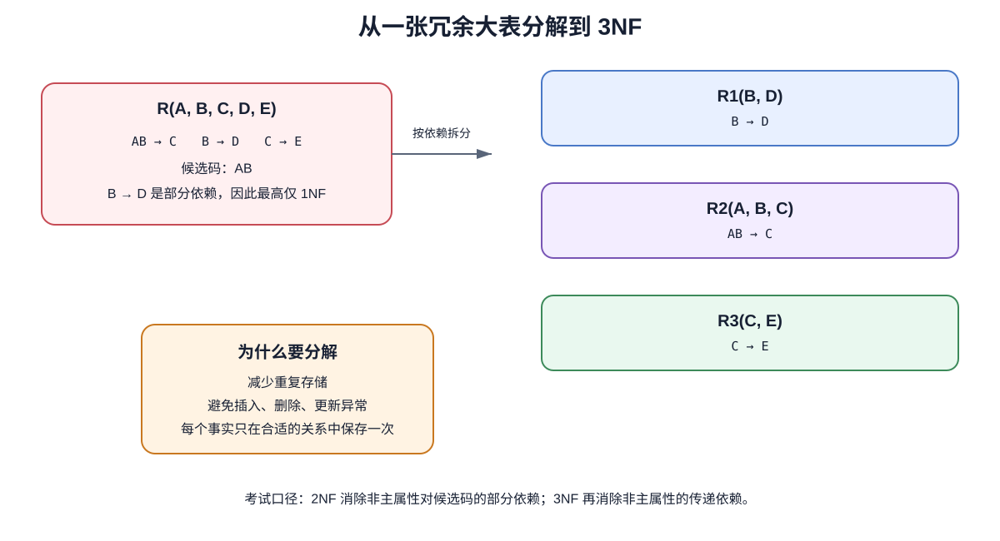

> [!note] 本章的核心关系
> 函数依赖描述属性之间的确定性；属性闭包检验一组属性能够推出什么；能够推出全部属性且不可再缩小的属性组是候选码；2NF 消除非主属性对复合码的部分依赖；3NF 进一步消除非主属性通过其他非主属性形成的传递依赖。

## 1. 规范化

先看一个没有规范化的关系：

```text
EmployeeProject(
    Eid, Ename,
    ProjectId, ProjectName,
    DeptId, DeptName, Manager,
    Salary
)
```

假设每名员工可以参加多个项目，工资由员工和项目共同决定；每个项目属于一个部门；每个部门有一名经理。若一个项目有 100 名员工，项目名称和部门信息就会重复 100 次。重复本身会增加存储，但更严重的是它让同一事实拥有多个副本。

### 1.1 更新异常

部门经理发生变化时，所有属于该部门项目的记录都要修改。只要漏改一行，同一部门便出现多个经理。数据库失去了一致的事实来源。

### 1.2 插入异常

如果一个新部门刚建立，还没有项目和员工，大表可能无法保存它。因为主码需要员工和项目信息，而这些对象尚不存在。于是“部门事实”被错误地依赖于“员工参与项目”事实。

### 1.3 删除异常

若某部门最后一个项目被删除，大表中该部门名称和经理信息也可能随最后一行一起消失。删除一种事实意外删除了另一种独立事实。

这三类异常的根源相同：多个不同层次的事实被放在同一个关系中。规范化不是单纯追求更多表，而是让每个关系尽量只表达一种稳定事实。

## 2. 函数依赖

设关系模式 $R$ 中有属性组 $X$ 和 $Y$。若在任何合法关系状态中，只要两个元组的 $X$ 值相同，它们的 $Y$ 值也一定相同，就称 $X$ 函数决定 $Y$，记作：

$$
X\rightarrow Y
$$

例如：

$$
Sno\rightarrow Sname
$$

表示一个学号只能对应一个姓名。它不是说“从程序中执行某个函数计算出姓名”，而是说学号值确定以后，姓名值也被唯一确定。

函数依赖来自业务语义，而不是只观察当前样例。样例表中恰好所有姓名都不重复，不能据此断言 `Sname → Sno`，因为现实中可能出现重名。只有业务规则保证姓名唯一，依赖才成立。

函数依赖也不要求左侧必须是主码。部门编号可以决定部门名称，但在包含员工和部门的宽表中，部门编号可能不能决定员工信息。它仍然是一个有效函数依赖。

### 2.1 决定因素与被决定属性

在 $X\rightarrow Y$ 中，$X$ 称为决定因素，$Y$ 称为被决定属性。

理解箭头最稳妥的方法是问：固定左侧后，右侧是否只能有一个值？

- 固定学号，姓名是否唯一？若是，则 `学号 → 姓名`。
- 固定项目号，部门号是否唯一？若每个项目只属于一个部门，则 `项目号 → 部门号`。
- 固定员工号，项目号是否唯一？若员工可参加多个项目，则不成立。

函数依赖有方向。`A → B` 并不自动推出 `B → A`。一个部门编号可以确定部门名称，但多个部门若不允许重名，反向才可能成立；若允许重名，反向不成立。

## 3. 业务描述中的函数依赖

业务描述通常用“每个……唯一”“只属于一个”“由……决定”等语言隐含函数依赖。

例：

```text
每个职工可以参加多个项目，并在每个项目中领取一份工资；
每个项目只属于一个部门；
每个部门只有一名经理。
```

逐句分析：

一名职工可参加多个项目，所以员工号不能单独决定项目号；一个项目也可能有多名职工，所以项目号不能单独决定职工号。工资属于某名职工在某个项目中的工资，因此：

$$
(Eid,ProjectId)\rightarrow Salary
$$

每个项目只属于一个部门：

$$
ProjectId\rightarrow DeptId
$$

每个部门只有一名经理：

$$
DeptId\rightarrow Manager
$$

若需求还说明员工编号唯一标识员工，就有：

$$
Eid\rightarrow Ename
$$

写依赖时要区分“唯一标识实体”的属性和“联系属性”。工资不是由员工号单独决定，也不是项目号单独决定，而由二者组合决定。

还要避免从自然语言中加入未经说明的依赖。例如项目名称允许重名，就不能写 `ProjectName → ProjectId`；即使当前样例没有重名，也不能把偶然数据当成规则。

## 4. 平凡依赖与非平凡依赖

若 $Y\subseteq X$，则 $X\rightarrow Y$ 必然成立，称为平凡函数依赖。

例如：

$$
(A,B)\rightarrow A
$$

只要知道 `(A,B)`，当然知道其中的 `A`。这类依赖不提供新的业务信息。

若 $Y$ 不是 $X$ 的子集，则称为非平凡依赖，例如：

$$
Sno\rightarrow Sname
$$

规范化分析主要关注非平凡依赖，因为它们说明一组属性能够确定另一组额外属性。

还有完全非平凡依赖，即 $X$ 与 $Y$ 没有共同属性。基础考试一般不要求深入区分，但理解平凡依赖有助于闭包推导：任何属性组都天然能推出自己。

## 5. 属性闭包

给定函数依赖集 $F$，属性组 $X$ 的闭包记为 $X^+$，表示从 $X$ 出发利用 $F$ 能够推出的全部属性。

闭包是判断候选码最可靠的方法。只看箭头左右位置只能作为初步线索，不能代替严格计算。

### 5.1 计算方法

计算 $X^+$ 时：

1. 先把 $X$ 中属性放入闭包；
2. 查找函数依赖，只要某条依赖左侧已经全部包含在闭包中，就把右侧加入；
3. 重复检查，直到没有新属性加入。

这个过程类似不断使用已知条件解锁新属性。

### 5.2 示例

设：

$$
F=\{AB\rightarrow C,\ B\rightarrow D,\ C\rightarrow E\}
$$

计算 $(AB)^+$：

初始有：

$$
(AB)^+=\{A,B\}
$$

因为包含 $AB$，由 $AB\rightarrow C$ 加入 $C$；因为包含 $B$，由 $B\rightarrow D$ 加入 $D$；加入 $C$ 后，由 $C\rightarrow E$ 加入 $E$。

最终：

$$
(AB)^+=\{A,B,C,D,E\}
$$

因此 `AB` 能决定关系中全部属性，是超码。

再计算 $B^+$：

$$
B^+=\{B,D\}
$$

它无法推出 A、C、E，所以 B 不是超码。计算 A 的闭包只有 A，也不是超码。

## 6. 候选码

候选码需要同时满足两个条件：闭包包含关系全部属性，并且属性组不可再缩小。

### 6.1 必含属性起点

只出现在函数依赖左侧、从未出现在右侧的属性，无法由其他属性推出，通常必须出现在每个候选码中。它们可以作为起始集合。

但这只是一条辅助规律。某属性既出现在左侧又出现在右侧，也可能属于候选码；存在多组候选码时，更不能只看箭头位置得出唯一答案。

可靠流程仍然是：选取候选属性组，计算闭包，确认能推出全部属性，再逐个删除属性验证最小性。

### 6.2 AB 示例

对于：

$$
R(A,B,C,D,E),\quad F=\{AB\rightarrow C,B\rightarrow D,C\rightarrow E\}
$$

A 和 B 都无法从其他依赖右侧得到，因此候选码必须包含 A、B。前面已经算出 `(AB)^+` 包含全部属性，所以 AB 是超码。删除 A 后 B 不能推出全部；删除 B 后 A 也不能，因此 AB 是候选码。

### 6.3 多个候选码

设：

$$
F=\{A\rightarrow B,\ B\rightarrow A,\ C\rightarrow D\}
$$

关系为 $R(A,B,C,D)$。

`AC` 的闭包可以通过 A 得到 B，通过 C 得到 D，因此推出全部属性。`BC` 也可以通过 B 得到 A，再由 C 得到 D。所以候选码有 `AC` 和 `BC`。

这说明主码只是从多个候选码中选出的一个。判断主属性时，A、B、C 都属于至少一个候选码，都是主属性。

## 7. 完全、部分与传递函数依赖

这三个概念关注非主属性怎样依赖候选码，是判断 2NF 和 3NF 的核心。

### 7.1 完全函数依赖

若 $X\rightarrow Y$，并且去掉 $X$ 中任何一个属性后都不能继续决定 $Y$，则称 $Y$ 完全函数依赖于 $X$。

例如选课关系中：

$$
(Sno,Cno)\rightarrow Grade
$$

若单独学号不能确定成绩，单独课程号也不能确定成绩，则成绩完全依赖于复合码 `(Sno,Cno)`。

完全依赖强调左侧每个属性都不可缺少。若候选码只有一个属性，非主属性只要依赖该码，就天然是完全依赖，不会出现对码的部分依赖。

### 7.2 部分函数依赖

若 $X\rightarrow Y$，但 $X$ 的某个真子集也能决定 $Y$，则 $Y$ 对 $X$ 是部分函数依赖。

设候选码为 `(Sno,Cno)`，同时有：

$$
Sno\rightarrow Sname
$$

由于 `Sname` 只依赖候选码的一部分 `Sno`，所以 `Sname` 部分依赖于复合码。

部分依赖意味着学生姓名会在每门选课记录中重复。它提示“学生自身属性”和“选课事实”混在了一张表中，应把学生信息拆出。

部分依赖只有在候选码由多个属性组成时才可能出现。单属性候选码没有非空真子集，因此满足 1NF 的关系若所有候选码都是单属性，就自动满足 2NF。

### 7.3 传递函数依赖

若候选码 $K$ 决定非主属性 $Y$，而 $Y$ 又决定另一个非主属性 $Z$，且 $Y$ 不能反向决定候选码，则 $Z$ 通过 $Y$ 传递依赖于 $K$。

例如：

$$
ProjectId\rightarrow DeptId,
\qquad DeptId\rightarrow Manager
$$

于是：

$$
ProjectId\rightarrow Manager
$$

经理并不是直接属于项目，而是项目先确定部门，部门再确定经理。若把三者放在一个关系中，部门经理会在同部门多个项目中重复。

传递依赖提示中间非主属性代表另一个独立实体或事实，应该将 `DeptId, Manager` 单独保存。

## 8. 1NF、2NF 与 3NF

范式不是对表“好或坏”的绝对评分，而是一组逐层增强的结构条件。高一级范式首先必须满足低一级条件。

### 8.1 第一范式 1NF

1NF 要求关系中每个属性在当前模式下取单一、不可再分的值。不能在一个字段中直接保存任意长度的列表或嵌套表。

例如：

```text
Student(Sno, Sname, Phones)
```

若 `Phones` 中保存 `138...,139...`，查询单个号码、保证号码唯一或建立外码都会变得困难。更合理的结构是：

```text
Student(Sno, Sname)
StudentPhone(Sno, Phone)
```

“原子性”与现实是否能继续拆分不同。日期可以拆成年月日，但若系统把日期作为一个完整值比较和计算，它仍可以视为原子属性。

### 8.2 第二范式 2NF

2NF 要求关系先满足 1NF，并且每个非主属性都完全依赖于每个候选码，不能只依赖复合候选码的一部分。

设：

```text
Enrollment(Sno, Cno, Sname, Cname, Grade)
```

候选码为 `(Sno,Cno)`，但：

$$
Sno\rightarrow Sname,
\qquad Cno\rightarrow Cname
$$

学生姓名和课程名都部分依赖复合码，因此不满足 2NF。应分解为：

```text
Student(Sno, Sname)
Course(Cno, Cname)
Enrollment(Sno, Cno, Grade)
```

分解后，每类属性都由各自关系的完整候选码决定。

### 8.3 第三范式 3NF

直观上，3NF 要求关系先满足 2NF，并且非主属性不能通过其他非主属性传递依赖于候选码。

设：

```text
Project(ProjectId, ProjectName, DeptId, DeptName)
```

有：

$$
ProjectId\rightarrow DeptId,
\qquad DeptId\rightarrow DeptName
$$

`DeptName` 通过 `DeptId` 传递依赖于 `ProjectId`，所以应分解为：

```text
Project(ProjectId, ProjectName, DeptId)
Department(DeptId, DeptName)
```

3NF 的正式定义是：对每个非平凡依赖 $X\rightarrow A$，要么 $X$ 是超码，要么 $A$ 是主属性。基础考试通常用“消除非主属性对码的传递依赖”进行判断，但遇到多个候选码时，正式定义更可靠。

## 11. 实例表与函数依赖

题目有时只给一张样例表，要求找函数依赖。此时可以用数据排除明显不成立的依赖，但不能仅凭有限样例证明业务上一定成立。

若同一个 `AuthorID` 在多行中始终对应同一个 `AuthorName`，可以结合“作者编号唯一标识作者”的常识推测：

$$
AuthorID\rightarrow AuthorName
$$

但样例中每个作者姓名恰好不同，不能仅因此断言 `AuthorName → AuthorID`，除非题目说明姓名唯一。

通常应优先使用字段语义、约束描述和主码信息，再用样例数据验证。编号类属性往往标识实体，名称类属性可能重名，价格和版本等属性可能由某一更具体的编号决定。

还要注意“当前表中没出现反例”不等于函数依赖必然成立。函数依赖针对所有合法状态，而不是当前十几行数据。

## 12. 模式分解

把一个关系拆成多个小表不自动等于正确规范化。分解还应尽量满足无损连接和保持函数依赖。

### 12.1 无损连接

无损连接要求把分解后的关系自然连接起来时，能够准确恢复原关系，而不会丢失元组或产生原来不存在的伪元组。

例如把 `Student(Sno,Sname)` 和 `Enrollment(Sno,Cno,Grade)` 按 `Sno` 连接，可以恢复学生与选课信息，因为公共属性 `Sno` 是学生关系的码。

若随意拆成缺少合适公共属性的关系，重新连接可能出现错误组合。

### 12.2 保持函数依赖

保持依赖意味着原来的函数依赖可以通过分别检查分解后的关系来保证，而不必每次把多张表连接后再检查。

例如把：

```text
Project(ProjectId, DeptId, Manager)
```

分为：

```text
ProjectDept(ProjectId, DeptId)
Department(DeptId, Manager)
```

原来的 `ProjectId → DeptId` 和 `DeptId → Manager` 分别保存在两个关系中，容易通过主码或唯一约束维护。

### 12.3 无限分解

规范化的目标是消除由依赖结构造成的异常，不是让每张表只剩两列。过度分解会增加连接数量和理解成本。

实际设计还可能为了性能有意反规范化，例如保存订单总额缓存字段。但这应建立在明确知道冗余来源、并能维护一致性的基础上，而不是无规则地混合事实。

## 13. 范式分析结构

### 第 1 问：函数依赖

先根据业务逐句写出最基本依赖。不要只写候选码决定全部属性，而应保留项目决定部门、部门决定经理等能够揭示异常的依赖。

### 第 2 问：候选码/主码

计算候选属性组的闭包，确认能推出全部属性，再检查最小性。若题目说“主码”，通常从候选码中选定一个；若业务只存在一组候选码，它就是主码。

### 第 3、4 问：最高范式

先确认属性原子，满足 1NF。再检查复合候选码是否存在非主属性只依赖其中一部分；若有，最高通常为 1NF。若没有部分依赖，再检查非主属性之间是否形成传递依赖；若有，最高为 2NF。都没有则通常达到 3NF。

理由必须指出具体依赖。例如不能只写“存在部分依赖”，应写“B → D，而 B 是候选码 AB 的真子集，所以非主属性 D 部分依赖于候选码 AB”。

### 第 5 问：3NF 分解

把每种独立事实放入能够由其决定因素作为码的关系中。对：

$$
AB\rightarrow C,
\quad B\rightarrow D,
\quad C\rightarrow E
$$

可以分解为：

```text
R1(A, B, C)
R2(B, D)
R3(C, E)
```

`R1` 保存由 AB 决定 C 的事实，`R2` 保存 B 决定 D，`R3` 保存 C 决定 E。每个关系内部的决定因素都是候选码，因此达到 3NF。

## 14. 概念错误

“箭头左边出现的属性都是候选码”是错误的。决定某个属性不等于决定全部属性，必须计算闭包。

“候选码就是主码”也不准确。候选码可能有多个，主码是其中被选中的一个。

“只要有传递关系就不满足 3NF”过于宽泛。关键是非主属性是否通过其他非主属性依赖于码；主属性参与时应使用正式定义判断。

“单属性主码的关系一定是 3NF”也是错误的。它自动避免部分依赖，因此满足 2NF，但仍可能有 `K → A → B` 的传递依赖，只达到 2NF。

“分解成三个表就一定是 3NF”没有依据。必须检查每个分解关系中的函数依赖，并考虑无损连接和依赖保持。

## 本章速记

- 函数依赖 $X\rightarrow Y$ 表示固定 X 后 Y 必须唯一确定，依赖来自业务规则而不是当前样例。
- 属性闭包表示一组属性在依赖集下能够推出的全部属性。
- 候选码必须能推出全部属性，并且不可再删除任何属性。
- 完全依赖要求复合决定因素的每一部分都不可缺少；部分依赖表示只靠复合码的一部分就能决定非主属性。
- 传递依赖表示码先决定一个非主属性，该属性再决定另一个非主属性。
- 1NF 要求属性值原子；2NF 消除非主属性对候选码的部分依赖；3NF 进一步消除非主属性对码的传递依赖。
- 正确分解还应尽量无损连接并保持函数依赖。

## 章节练习与解析

### 材料原题

#### 原题 1｜2022—2023·函数依赖、主码与 3NF

现有关系模式：

```text
R(工程号, 工程名, 动工日期, 竣工日期, 材料号, 材料名称, 使用数量)
```

业务规定：每个工程的工程信息唯一；工程名和材料名称允许重名；每个工程使用若干材料，每种材料也可用于若干工程。

1. 给出函数依赖或函数依赖图；
2. 给出主码；
3. 判断最高范式；
4. 说明理由；
5. 规范到 3NF。

> [!example]- 答案与解析
> 题面中“每个工程的地址”与关系模式属性不一致，应按关系模式和通常业务语义理解为：工程号唯一确定工程名、动工日期和竣工日期。
>
> 函数依赖为：
>
> $$
> 工程号\rightarrow 工程名,动工日期,竣工日期
> $$
>
> $$
> 材料号\rightarrow 材料名称
> $$
>
> $$
> (工程号,材料号)\rightarrow 使用数量
> $$
>
> `(工程号, 材料号)` 的闭包能推出全部属性，而任意去掉其中一个属性都不能确定一条“某工程使用某材料”的记录，因此候选码和主码为 `(工程号, 材料号)`。
>
> 关系最高属于 **1NF**。原因是 `工程名、动工日期、竣工日期` 只依赖复合码中的 `工程号`，`材料名称` 只依赖 `材料号`，均属于非主属性对候选码的部分函数依赖，所以不满足 2NF。
>
> 分解到 3NF：
>
> ```text
> 工程(工程号 PK, 工程名, 动工日期, 竣工日期)
> 材料(材料号 PK, 材料名称)
> 工程材料(工程号 PK/FK, 材料号 PK/FK, 使用数量)
> ```
>
> 三张表分别保存工程事实、材料事实和使用事实。工程或材料信息不再随着每一条使用记录重复。

#### 原题 2｜2023—2024·关系模式 R(A,B,C,D,E)

已知：

$$
F=\{AB\rightarrow C,\ B\rightarrow D,\ C\rightarrow E\}
$$

要求画依赖图、求主码、判断最高范式并分解到 3NF。

> [!example]- 答案与解析
> 依赖图：
>
> 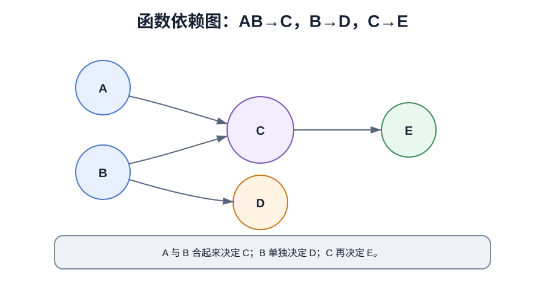
>
> A、B 都不能由其他属性推出，所以候选码必须包含 AB；`(AB)+ = ABCDE`，且去掉任一属性都不能决定全部属性，因此主码为 `AB`。
>
> 最高属于 **1NF**。`B→D` 中 B 是候选码 AB 的真子集，D 是非主属性，存在部分函数依赖，因此不满足 2NF。
>
> 3NF 分解：
>
> ```text
> R1(B, D)       主码 B
> R2(A, B, C)    主码 (A, B)
> R3(C, E)       主码 C
> ```

#### 原题 3｜2025—2026 样卷·函数依赖与 3NF

已知关系 `R(A,B,C,D,E)`，函数依赖为 `AB→C、B→D、C→E`。要求画依赖图、求主码、判断最高范式并分解到 3NF。

> [!example]- 答案与解析
> 
>
> 主码为 `AB`。关系最高属于 1NF，因为 `B→D` 使非主属性 D 部分依赖于复合候选码 AB。
>
> ```text
> R1(B, D)
> R2(A, B, C)
> R3(C, E)
> ```

#### 原题 4｜综合练习·BookStore 函数依赖与 3NF

关系包含：

```text
BookStore(
    AuthorID, AuthorName, AuthorPhone,
    BookNo, BookTitle, Publisher, Edition, Price, PubAddr
)
```

按题目通常采用的业务语义：作者编号确定作者信息；图书编号确定图书信息；出版社确定出版社地址；作者与图书之间的组合表示著作关系。

> [!example]- 答案与解析
> 基本函数依赖：
>
> $$
> AuthorID\rightarrow AuthorName,AuthorPhone
> $$
>
> $$
> BookNo\rightarrow BookTitle,Publisher,Edition,Price
> $$
>
> $$
> Publisher\rightarrow PubAddr
> $$
>
> 候选码为 `(AuthorID, BookNo)`。依赖图可以表示为：
>
> 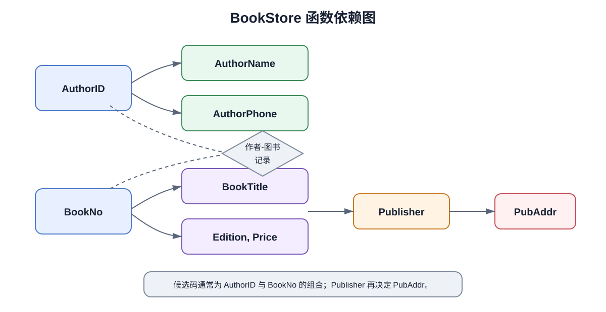
>
> `AuthorName、AuthorPhone` 只依赖复合码的一部分 `AuthorID`；图书属性只依赖 `BookNo`，所以存在部分依赖，最高属于 **1NF**。此外 `BookNo→Publisher→PubAddr` 还存在传递依赖。
>
> 分解到 3NF：
>
> ```text
> Author(AuthorID PK, AuthorName, AuthorPhone)
> Publisher(Publisher PK, PubAddr)
> Book(BookNo PK, BookTitle, Publisher FK, Edition, Price)
> AuthorBook(AuthorID PK/FK, BookNo PK/FK)
> ```
>
> 若课程明确规定“一本书只能有一名作者”，则可以把 `AuthorID` 直接作为 Book 的外码并以 `BookNo` 为主码；在未给出这一限制时，保留作者—图书联系表更稳妥。

### 补充题

#### 补充题 1｜闭包

已知 `A→B, B→C`，则 `A+` 至少包含____。

- A. A
- B. A、B
- C. A、B、C
- D. 只有 C

> [!example]- 答案
> **C。**先由 A 推出 B，再由 B 推出 C。

#### 补充题 2｜部分依赖

候选码为 `(A,B)`，存在 `A→C`，C 为非主属性。该依赖说明____。

- A. C 完全依赖候选码
- B. C 部分依赖候选码
- C. C 是主属性
- D. 关系一定满足 3NF

> [!example]- 答案
> **B。**候选码真子集 A 已能决定 C。

#### 补充题 3｜传递依赖

候选码 K 决定非主属性 X，且 X 决定非主属性 Y。通常说明 Y 对 K 存在____。

- A. 平凡依赖
- B. 传递函数依赖
- C. 多值依赖
- D. 无依赖

> [!example]- 答案
> **B。**K 通过 X 间接决定 Y。

#### 补充题 4｜单属性候选码与 2NF

若关系已经满足 1NF，且每个候选码都只有一个属性，则关系一定满足____。

- A. 2NF
- B. 3NF
- C. BCNF
- D. 4NF

> [!example]- 答案
> **A。**单属性码不存在真子集，因此不可能出现对码的部分依赖；传递依赖仍可能存在，所以不保证 3NF。

#### 补充题 5｜规范化目的

规范化最直接要减少的是____。

- A. 所有表之间的连接
- B. 因不同事实混在同一关系而产生的插入、删除和更新异常
- C. 数据库中的全部重复字符
- D. 所有外码

> [!example]- 答案
> **B。**范式关注事实依赖结构，不是单纯追求零重复。

#### 补充题 6｜候选码与范式

设：

$$
R(A,B,C,D,E,F)
$$

$$
F=\{E\rightarrow D,\ C\rightarrow B,\ CE\rightarrow F,\ B\rightarrow A\}
$$

> [!example]- 解析
> C、E 不在任何依赖右部，因此候选码必须包含 CE。  
> $CE^+$：由 C 得 B，再由 B 得 A；由 E 得 D；由 CE 得 F，所以得到全部属性。CE 是候选码。  
> C→B 和 E→D 使非主属性分别依赖复合码的一部分，所以最高为 1NF。  
> 可分解为：`R1(E,D)`、`R2(C,B)`、`R3(B,A)`、`R4(C,E,F)`。

#### 补充题 7｜单属性码

设 `R(A,B,C)`，依赖 `A→B, B→C`。A 是候选码。最高范式是什么？

> [!example]- 解析
> 候选码只有一个属性 A，所以不存在部分依赖，满足 2NF。但 `A→B→C`，非主属性 C 传递依赖于 A，因此不满足 3NF，最高为 2NF。分解为 `R1(A,B)` 与 `R2(B,C)`。

#### 补充题 8｜球队题

```text
R(队员编号, 比赛场次, 进球数, 球队名, 队长名)
```

每个队员只属于一个球队，每个球队只有一个队长。

> [!example]- 解析
> 函数依赖：  
> `(队员编号,比赛场次)→进球数`；  
> `队员编号→球队名`；  
> `球队名→队长名`。  
> 候选码是 `(队员编号,比赛场次)`。球队名部分依赖于候选码，所以最高 1NF。  
> 3NF 分解：`Score(队员编号,比赛场次,进球数)`、`Player(队员编号,球队名)`、`Team(球队名,队长名)`。

---

# 第七章　存储过程、游标与触发器

普通 SQL 更擅长描述集合操作：一次查询一组行，一次更新一批满足条件的记录。但有些业务还需要变量、条件判断、循环和自动响应事件。例如，根据采购总量决定采用不同折扣；逐行读取结果并执行特定逻辑；当一条供应记录被修改时自动写入审计日志。

过程性 SQL 在 SQL 的集合操作之外加入控制结构。存储过程把一段可调用逻辑保存在数据库服务器中，游标让程序逐行访问查询结果，触发器则在插入、更新或删除事件发生时自动执行。它们解决的问题不同，不能简单看成三种写法相似的 SQL 对象。

## 1. 过程性 SQL

集合 SQL 可以非常简洁地完成批量操作：

```sql
UPDATE P
SET Weight = Weight * 0.9
WHERE Pno IN (...);
```

但如果规则是“总供货量大于 200 时重量减 20%，大于 100 时减 10%，小于 50 时增加 10%”，就需要先计算汇总值，再根据结果选择不同分支。过程性 SQL 通过局部变量和 `IF` 结构表达这种流程。

另一些任务要求处理查询结果中的每一行，例如逐个输出北京供应商提供的零件编号。SQL 原本面向集合，不提供传统编程语言式的逐行循环；游标在这里建立了一条从结果集到逐行处理的通道。

触发器则解决“无论谁执行这项操作，都必须自动附带另一项动作”的问题。应用程序可以忘记写审计日志，但触发器由数据库在事件发生时自动执行，因此规则集中在数据层。

过程性功能并不意味着应该把所有业务都搬进数据库。它适合强依赖数据一致性、需要靠近数据执行的逻辑，但复杂业务流程放在应用层往往更容易测试和维护。

## 2. 存储过程

存储过程是一段有名称、保存在数据库中的过程化程序。调用者通过过程名和参数执行它，过程内部可以包含查询、更新、变量、条件和循环。

一个简单过程：

```sql
DELIMITER //
CREATE PROCEDURE GetAllSailors()
BEGIN
    SELECT * FROM Sailors;
END //
DELIMITER ;
```

`DELIMITER` 是 MySQL 客户端为了区分过程内部分号与整个 `CREATE PROCEDURE` 结束位置而使用的命令，不属于过程逻辑本身。

调用过程：

```sql
CALL GetAllSailors();
```

存储过程的优势包括复用数据库逻辑、减少重复 SQL、集中权限控制，以及让多步操作靠近数据执行。代价是逻辑与具体 DBMS 绑定更强，调试和版本管理也可能不如应用代码方便。

过程与普通 SQL 的区别在于：普通 SQL 通常描述一次集合操作，过程可以组织多条语句并维护执行状态。

## 3. IN、OUT 与 INOUT 参数

参数是过程与调用者交换数据的接口。

`IN` 参数只负责把值传入过程：

```sql
CREATE PROCEDURE GetPartName(
    IN p_pno VARCHAR(20)
)
BEGIN
    SELECT Pname
    FROM P
    WHERE Pno = p_pno;
END;
```

调用者给出零件号，过程据此查询。

`OUT` 参数把结果返回给调用者：

```sql
CREATE PROCEDURE CountParts(
    IN p_jno VARCHAR(20),
    OUT p_total INT
)
BEGIN
    SELECT COALESCE(SUM(Qty), 0)
    INTO p_total
    FROM SPJ
    WHERE Jno = p_jno;
END;
```

调用后：

```sql
CALL CountParts('J01', @total);
SELECT @total;
```

`INOUT` 参数既接收初始值，又在过程结束时返回修改后的值。它适合累加器或需要在原值基础上调整的场景，但如果输入和输出含义不同，分别使用 `IN` 与 `OUT` 更清晰。

参数模式决定数据流向，不决定参数能否在过程内部被引用。`OUT` 参数也可以在内部赋值，但调用前的值通常不作为可靠输入使用。

## 4. 局部变量与 SELECT ... INTO

过程内部常需要暂存中间结果。局部变量使用 `DECLARE` 声明，并且在 MySQL 中通常必须放在 `BEGIN` 块前部、可执行语句之前。

```sql
DECLARE v_total INT DEFAULT 0;
```

把查询结果赋给变量可使用：

```sql
SELECT COALESCE(SUM(Qty), 0)
INTO v_total
FROM SPJ
WHERE Pno = p_pno;
```

该查询应返回一行。聚合查询即使没有匹配行通常也返回一行，只是 `SUM` 为 `NULL`，因此使用 `COALESCE(...,0)` 转成 0。

若普通查询返回多行却赋给单个变量，会产生错误。此时要么进一步限定结果只返回一行，要么使用游标逐行读取。

局部变量只在过程调用期间存在，与表字段和会话变量 `@name` 不同。命名时常加 `v_`、`p_` 前缀，以免与列名冲突。

## 5. IF、ELSEIF 与 CASE

条件结构根据当前变量或查询结果选择不同语句块：

```sql
IF v_total > 200 THEN
    UPDATE P
    SET Weight = Weight * 0.8
    WHERE Pno = p_pno;
ELSEIF v_total > 100 THEN
    UPDATE P
    SET Weight = Weight * 0.9
    WHERE Pno = p_pno;
ELSEIF v_total < 50 THEN
    UPDATE P
    SET Weight = Weight * 1.1
    WHERE Pno = p_pno;
END IF;
```

条件按顺序判断。`v_total > 200` 必须放在 `v_total > 100` 之前，否则大于 200 的值会先匹配第二个条件，永远到不了更具体的分支。

过程中的 `IF ... THEN` 是流程控制语句；查询中的 `CASE` 是返回值的表达式。两者都表达条件，但出现位置和语法不同。

过程性 `CASE` 也可用于多分支，但基础题中 `IF/ELSEIF` 通常更直观。

## 6. 循环

MySQL 过程支持 `LOOP`、`WHILE` 和 `REPEAT`。

`WHILE` 在进入循环前检查条件：

```sql
WHILE v_i <= 10 DO
    SET v_i = v_i + 1;
END WHILE;
```

`REPEAT` 先执行一次，再在末尾判断退出条件：

```sql
REPEAT
    SET v_i = v_i + 1;
UNTIL v_i > 10
END REPEAT;
```

`LOOP` 本身没有条件，通常配合标签和 `LEAVE` 退出：

```sql
read_loop: LOOP
    ...
    IF done THEN
        LEAVE read_loop;
    END IF;
END LOOP;
```

循环的价值不在于模仿普通编程语言，而是在少量必须逐步处理的场景中维持状态。能用一条集合 SQL 完成的批量更新，通常不应拆成逐行循环。

## 7. 游标

查询会一次产生结果集，而过程变量一次通常只能接收一行。游标提供一个位置指针，使过程可以每次从结果集中取出一行。

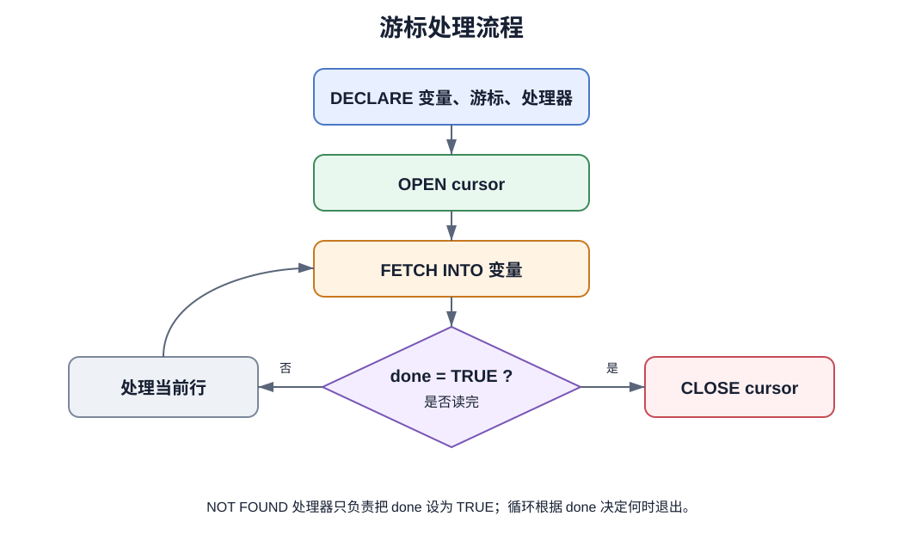

一个完整游标流程包含：声明游标、声明结束处理器、打开游标、循环 `FETCH`、关闭游标。

```sql
DECLARE done INT DEFAULT FALSE;
DECLARE v_rating INT;

DECLARE cur_sailors CURSOR FOR
    SELECT rating FROM Sailors;

DECLARE CONTINUE HANDLER FOR NOT FOUND
    SET done = TRUE;
```

打开与读取：

```sql
OPEN cur_sailors;

read_loop: LOOP
    FETCH cur_sailors INTO v_rating;

    IF done THEN
        LEAVE read_loop;
    END IF;

    -- 处理 v_rating
END LOOP;

CLOSE cur_sailors;
```

`FETCH` 超过结果集末尾时不会自动结束循环，而会触发 `NOT FOUND` 条件。处理器把 `done` 设为真，下一步通过 `LEAVE` 退出。

检查 `done` 应放在 `FETCH` 之后、处理当前值之前。否则最后一次失败读取后，过程可能错误地再次使用上一次变量值。

## 9. 集合 SQL 与游标

游标按行处理，数据库需要反复获取和执行逻辑。集合 SQL 则允许优化器整体选择扫描、连接和批量更新方式。

例如统计 rating=8 的水手数，直接写：

```sql
SELECT COUNT(*)
FROM Sailors
WHERE rating = 8;
```

通常比游标逐行比较更简单、更快。样卷要求游标，是为了考查过程语法，不代表实际工程中该任务最适合游标。

游标更适合每行处理差异很大、难以表达成集合操作、或需要与过程状态交互的场景。使用前应先问：这项任务是否能被改写为一次 `INSERT ... SELECT`、`UPDATE ... WHERE` 或聚合查询。

## 10. 触发器

触发器是绑定到表事件上的数据库程序。当指定的 `INSERT`、`UPDATE` 或 `DELETE` 发生时，DBMS 自动执行触发器，无需调用者显式 `CALL`。

例如，删除水手后自动清理预订：

```sql
CREATE TRIGGER cascade_delete_reservations
AFTER DELETE ON Sailors
FOR EACH ROW
BEGIN
    DELETE FROM Reserves
    WHERE sid = OLD.sid;
END;
```

`FOR EACH ROW` 表示每删除一行水手，就执行一次触发器。若一条语句删除十名水手，行级触发器会触发十次。

触发器适合强制数据层规则、维护审计日志、自动同步冗余字段等。但它是隐式执行的，过多触发器会让数据变化路径难以追踪，也可能形成递归或性能问题。

## 11. BEFORE 与 AFTER

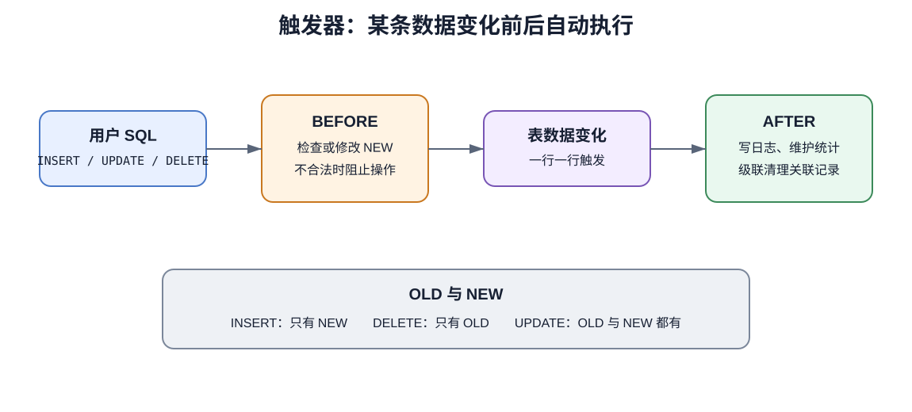

### 11.1 BEFORE

`BEFORE` 触发器在目标操作真正写入前执行。它适合检查或调整新值。

例如阻止非正供应量：

```sql
CREATE TRIGGER check_qty
BEFORE INSERT ON SPJ
FOR EACH ROW
BEGIN
    IF NEW.Qty <= 0 THEN
        SIGNAL SQLSTATE '45000'
        SET MESSAGE_TEXT = 'Qty must be positive';
    END IF;
END;
```

由于记录尚未写入，`BEFORE` 可以在错误数据进入表之前阻止操作。

### 11.2 AFTER

`AFTER` 触发器在目标操作成功后执行，适合记录日志、更新汇总表或清理依赖记录。

例如记录数量变化：

```sql
CREATE TRIGGER log_qty_change
AFTER UPDATE ON SPJ
FOR EACH ROW
BEGIN
    INSERT INTO SPJ_Log(...)
    VALUES (..., OLD.Qty, NEW.Qty, NOW());
END;
```

若主操作失败，`AFTER` 不会以成功状态继续执行。它观察的是已经发生的变化。

## 12. OLD 与 NEW

`OLD` 和 `NEW` 表示触发事件前后的行值。

| 事件 | OLD | NEW |
| --- | --- | --- |
| INSERT | 不存在 | 新插入行 |
| UPDATE | 更新前行 | 更新后行 |
| DELETE | 被删除行 | 不存在 |

因此，删除水手时使用 `OLD.sid`，因为删除后已没有新行。插入供应记录时使用 `NEW.Qty`。更新审计日志同时需要 `OLD.Qty` 与 `NEW.Qty`。

在 `BEFORE INSERT` 中，某些 DBMS 允许给 `NEW.column` 赋值，从而自动补充或修正即将写入的数据；`OLD` 通常只读。

选择 `OLD` 还是 `NEW` 不是语法记忆，而是看所需值属于事件之前还是之后。

## 14. 触发器典型场景

### 14.1 负数供应量

业务规则要求 `Qty > 0`，最直接的方法通常是 `CHECK` 约束。若还需要复杂判断或自定义错误信息，可使用 `BEFORE INSERT/UPDATE` 触发器。

触发器应同时考虑插入和更新。只检查插入会允许原本合法的记录后来被更新成负数。

### 14.2 审计日志

审计需要保存谁在何时把什么从旧值改成新值。`AFTER UPDATE` 可把 `OLD` 和 `NEW` 写入日志表。

日志表通常独立存在，包含业务主键、旧值、新值、时间和操作者。触发器保证所有更新路径都被记录，而不是依赖每个应用主动写日志。

### 14.3 冗余总量

若零件表保存 `Total_Supply`，插入供应记录时增加，删除时减少，更新数量时还要计算差值。

这种冗余能加快读取，但维护逻辑更复杂。必须覆盖插入、删除和更新全部路径，否则缓存总量会与明细不一致。触发器适合集中维护，但也要考虑批量操作和异常回滚。

### 14.4 供应商与项目城市

插入 `SPJ` 前，可以查询供应商城市和项目城市，若相同则设置 `NEW.Is_Local = 1`。

这类触发器将派生规则自动化，但要问清楚规则是否应动态变化。若供应商后来迁址，旧记录中的 `Is_Local` 是否需要重新计算？如果它表示插入当时状态，保存合理；若表示当前状态，直接查询比较可能比冗余字段更可靠。

## 15. 存储过程与触发器

存储过程由调用者显式执行，触发器由数据库事件自动执行。过程可以接收参数并返回结果，触发器围绕某张表的一次数据变更工作。

过程适合封装一段可复用业务操作，例如“根据项目号统计零件总量”；触发器适合保证任何数据修改都附带某项规则，例如“每次更新都写审计日志”。

过程的执行入口清晰，调用代码能看到 `CALL`；触发器隐式发生，使用过多会增加调试难度。设计时应优先使用简单约束和集合 SQL，确实需要流程或事件自动化时再引入过程与触发器。

## 本章速记

- 存储过程是可显式调用的数据库程序，参数分为 `IN`、`OUT`、`INOUT`。
- `SELECT ... INTO` 把单行查询结果保存到变量。
- 游标把结果集逐行读取，流程是声明、打开、`FETCH`、检测结束、关闭。
- `NOT FOUND` 处理器常用于设置游标结束标志。
- 能用集合 SQL 完成的任务通常不应改用游标。
- 触发器在表的插入、更新或删除事件发生时自动执行。
- `BEFORE` 适合检查和修正，`AFTER` 适合日志与后续维护。
- INSERT 使用 `NEW`，DELETE 使用 `OLD`，UPDATE 同时拥有二者。

## 章节练习与解析

### 材料原题

#### 原题 1｜2025—2026 样卷·过程性 SQL

##### 1. 指定 rating 水手数

题目要求补全：游标查询列、NOT FOUND 处理器、循环结束条件和关闭的游标名。

> [!example]- 答案
>
> ```sql
> CREATE PROCEDURE CountSailorsByRatingCursor(
>     IN p_target_rating INT,
>     OUT p_count INT
> )
> BEGIN
>     DECLARE done INT DEFAULT FALSE;
>     DECLARE v_rating INT;
>
>     DECLARE cur_sailors CURSOR FOR
>         SELECT rating FROM Sailors;
>
>     DECLARE CONTINUE HANDLER FOR NOT FOUND
>         SET done = TRUE;
>
>     SET p_count = 0;
>     OPEN cur_sailors;
>
>     read_loop: LOOP
>         FETCH cur_sailors INTO v_rating;
>
>         IF done THEN
>             LEAVE read_loop;
>         END IF;
>
>         IF v_rating = p_target_rating THEN
>             SET p_count = p_count + 1;
>         END IF;
>     END LOOP;
>
>     CLOSE cur_sailors;
> END;
> ```
>
> 填空：`rating`、`done = TRUE`、`done`、`cur_sailors`。

##### 2. 水手预订记录

> [!example]- 答案
>
> ```sql
> CREATE TRIGGER cascade_delete_reservations
> AFTER DELETE ON Sailors
> FOR EACH ROW
> BEGIN
>     DELETE FROM Reserves
>     WHERE sid = OLD.sid;
> END;
> ```
>
> 删除事件中只能引用旧行，因此使用 `OLD.sid`。

### 补充题

#### 补充题 1｜存储过程参数

调用者传入值，过程内部读取但不负责返回该参数时，应使用____。

- A. IN
- B. OUT
- C. NEW
- D. OLD

> [!example]- 答案
> **A。**IN 参数从调用者流向过程。

#### 补充题 2｜游标结束

MySQL 游标遍历中，`NOT FOUND` 处理器通常用于____。

- A. 表示 FETCH 已没有下一行
- B. 创建索引
- C. 提交事务
- D. 删除游标结果集

> [!example]- 答案
> **A。**最后一次记录之后继续 FETCH 会触发 NOT FOUND。

#### 补充题 3｜触发时机

插入前检查 `Qty`，若小于等于 0 就阻止写入，最适合使用____。

- A. AFTER SELECT
- B. BEFORE INSERT
- C. AFTER COMMIT
- D. BEFORE GRANT

> [!example]- 答案
> **B。**规则需要在数据正式写入前拒绝本次插入。

#### 补充题 4｜OLD 与 NEW

在 `AFTER UPDATE` 触发器中记录字段修改前后值，应使用____。

- A. 只有 OLD
- B. 只有 NEW
- C. OLD 和 NEW
- D. 只能使用临时表

> [!example]- 答案
> **C。**UPDATE 同时存在旧行和新行。

#### 补充题 5｜输出参数

创建过程，根据项目号统计供货总数并通过输出参数返回。

> [!example]- 解析
> ```sql
> DELIMITER //
> CREATE PROCEDURE sp_CountProjectParts(
>     IN p_jno VARCHAR(20),
>     OUT p_total INT
> )
> BEGIN
>     SELECT COALESCE(SUM(Qty), 0)
>     INTO p_total
>     FROM SPJ
>     WHERE Jno = p_jno;
> END //
> DELIMITER ;
> ```

#### 补充题 6｜游标结束条件

为什么 `FETCH` 后要立刻判断 `done`，再处理当前变量？

> [!example]- 解析
> 当结果集读完时，最后一次 FETCH 会触发 NOT FOUND 处理器，把 `done` 设为 TRUE。若不先判断，就可能重复处理上一次变量中残留的值。

#### 补充题 7｜OLD 与 NEW

删除记录后需要取得被删除行的主码，应使用哪个？

> [!example]- 解析
> 使用 `OLD.id`。DELETE 没有 NEW 行。

---

# 第八章　索引与查询执行

数据库中的表最终仍然保存在存储设备上。SQL 中写一个条件看起来只是一行文字，但如果表有一亿行，系统怎样找到满足条件的记录，会决定查询需要毫秒还是几十秒。索引就是为特定访问方式建立的辅助结构。

索引不会改变查询结果，也不会替代原始数据。它保存键值与记录位置之间的有序或散列映射，使数据库不必每次从头扫描整张表。代价是额外空间，以及插入、删除、更新时维护索引的成本。因此，索引设计必须与真实查询模式匹配。

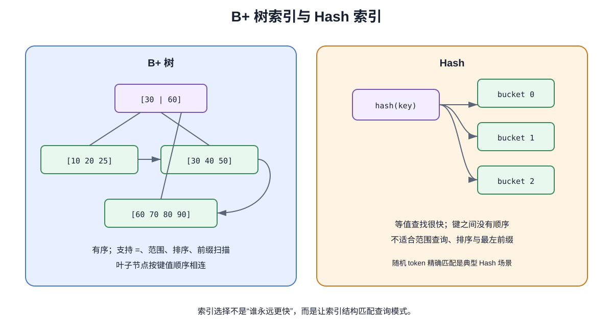

## 1. 无索引查询

执行：

```sql
SELECT *
FROM UserSessions
WHERE session_token = 'abc123xyz';
```

若没有可用索引，数据库通常只能进行全表扫描：读取每一行，比较 `session_token`，直到扫描结束。即使目标记录在第一行，系统若要保证不存在其他匹配，也可能仍需继续检查。

全表扫描并不总是坏事。表很小时，顺序读取比走索引更简单；查询返回大部分行时，先通过索引找到大量位置再随机回表，可能比直接扫描更慢。

索引的价值在于减少需要检查的数据范围。例如一本书的目录不能替代正文，但能先定位章节。数据库索引也先定位候选记录，再读取真正数据。

执行计划会根据表大小、条件选择性、索引统计信息和成本估计决定使用索引还是扫描。存在索引不意味着每次一定使用。

## 2. B+ 树

B+ 树是一种多路平衡搜索树。每个节点可容纳许多键和子指针，因此树高度很低。数据库访问磁盘页的成本远高于内存比较，降低树高可以减少随机页读取次数。

B+ 树内部节点主要用于导航，实际记录指针或数据通常集中在叶子节点。所有叶子处于同一深度，查询路径稳定；叶子之间按键值顺序相连，方便连续范围扫描。

与二叉搜索树相比，B+ 树每个节点有更多分支。若一个页能容纳数百个键，几层树就能管理海量记录，这非常符合页式存储特点。

### 2.1 等值查询

查找 `id = 100` 时，从根节点根据键范围选择子节点，逐层下降到叶子，再找到对应记录位置。时间复杂度近似为对数级。

B+ 树能够完成等值查询，虽然在纯哈希场景下理论常数可能不如 Hash 索引，但它功能更通用。

### 2.2 范围查询

查找：

```sql
WHERE expire_at > '2024-01-01'
```

B+ 树先定位第一个满足条件的叶子位置，然后沿叶子链顺序读取后续键。因为键已排序，范围查询不需要重新扫描所有记录。

这也是 B+ 树相对 Hash 索引的重要优势：顺序信息天然存在。

### 2.3 排序

若查询排序顺序与索引键顺序一致，数据库可能直接按索引顺序读取，减少额外排序：

```sql
SELECT *
FROM Orders
ORDER BY order_date;
```

是否能完全利用索引还取决于过滤条件、复合索引顺序和查询列，但有序结构提供了这种可能。

## 3. B+ 树插入和分裂

插入新键时，数据库先找到目标叶子节点。若该页还有空间，按顺序插入；若页已满，则将节点分裂成两个，并把分隔键提升到父节点。

父节点也可能因此溢出，继续向上分裂。若根节点分裂，树高度增加一层。删除时也可能发生合并或重新分配。

这些维护操作说明索引不是免费的。频繁插入会产生页分裂、日志和额外写入；随机键如 UUID 还可能使插入分散到不同页。顺序递增键通常更有利于局部写入，但也可能在高并发下形成热点。

B+ 树始终保持平衡，所有叶子深度相同，因此不会像普通二叉树那样因插入顺序退化成长链。

## 4. Hash 索引

Hash 索引使用哈希函数把键映射到桶。等值查询时，根据键计算桶位置，再在桶中寻找记录。

对于高区分度、固定长度、只进行精确匹配的随机 token：

```sql
WHERE session_token = 'abc123xyz'
```

Hash 索引很符合访问模式，因为不需要维护键顺序，理论上平均定位接近常数时间。

但哈希函数破坏了原始顺序。相近时间或相近字符串不会落到相邻桶，因此 Hash 索引不适合：

- `>`、`<`、`BETWEEN` 等范围查询；
- 按键排序；
- 前缀匹配；
- 找最大值、最小值。

哈希还可能发生冲突，不同键映射到同一桶，需要链表、开放寻址等方法继续区分。平均性能依赖哈希函数和桶分布。

## 6. 主索引、聚簇索引与辅助索引

这些术语在不同教材和 DBMS 中定义细节可能不同，核心区别是索引顺序是否决定数据记录的物理或主存储组织。

### 6.1 聚簇索引

聚簇索引使数据记录按照索引键顺序组织，或直接把完整行存放在叶子节点。因为一张表的数据只能有一种主要排列方式，所以通常只有一个聚簇组织。

在 InnoDB 中，主键索引是聚簇索引，叶子节点保存完整行。按主键查找只需到达叶子；按主键范围读取也具有良好局部性。

聚簇键过大时，其他辅助索引叶子还需要保存该主键作为行定位信息，会增加所有索引体积。

### 6.2 辅助索引

辅助索引按另一属性建立，不决定整表的主存储顺序。叶子通常保存索引键和记录定位信息。

在 InnoDB 中，辅助索引叶子保存主键值。通过辅助索引找到主键后，往往还需再次访问聚簇索引读取完整行，这称为回表。

若查询所需列都包含在辅助索引中，可以直接从索引得到结果，形成覆盖索引，避免回表。

## 7. 复合索引与最左前缀

复合索引按多个列组成有序键：

```sql
CREATE INDEX idx_a_b_c ON T(a, b, c);
```

排序首先按 `a`，`a` 相同再按 `b`，`a,b` 相同再按 `c`。因此它天然支持从最左列开始的前缀：

- `(a)`；
- `(a,b)`；
- `(a,b,c)`。

仅按 `b` 查询时，树的全局顺序不是按 b 排列，因为不同 a 区间中 b 会重新开始。普通情况下无法直接利用该索引快速定位。

对于：

```sql
WHERE a = 1 AND b = 2 AND c > 5
```

数据库可以先定位固定的 a、b，再在 c 上做范围扫描。若在前面某列使用范围条件，后续列通常难以继续用于精确定位，但仍可能参与索引下推或覆盖，具体取决于 DBMS。

复合索引列顺序应根据常用过滤条件、等值与范围关系、排序需求和选择性决定，而不是机械地把选择性最高列永远放最前。

## 8. 选择性

选择性描述条件能过滤掉多少数据。主码等值查询通常只返回一行，选择性很高；性别字段若只有两个值，单独过滤可能返回表的一半，选择性较低。

高选择性索引更容易显著减少访问行数。但低选择性列并非永远不值得索引。若查询只需索引中的少量列，覆盖索引可能仍有价值；与其他列组成复合索引也可能有效。

优化器依赖统计信息估计选择性。数据分布变化后，过时统计可能导致错误成本估计和不理想执行计划。

选择性不是列本身固定不变的标签，而与具体条件有关。例如日期列查询一天可能高选择性，查询十年全部数据则低选择性。

## 9. 索引失效写法

### 9.1 索引列函数运算

若索引建立在 `order_date` 上：

```sql
WHERE YEAR(order_date) = 2026
```

数据库可能无法直接按原始日期顺序定位，因为每个索引值都需要先计算年份。更适合写成范围：

```sql
WHERE order_date >= '2026-01-01'
  AND order_date <  '2027-01-01'
```

函数索引或生成列可以支持特定表达式，但前提是显式建立相应结构。

### 9.2 前导通配符

```sql
WHERE name LIKE '%abc'
```

无法从字符串开头确定索引起点。`LIKE 'abc%'` 通常能利用有序前缀，前导 `%` 则往往需要扫描。

全文检索、倒排索引或专门搜索引擎更适合包含式文本查询。

### 9.3 隐式类型转换

索引列是字符串，却用数字比较，或字符集与排序规则不一致，可能导致 DBMS 对列进行转换，从而影响索引使用。参数类型应与列类型一致。

### 9.4 过多结果行

即使条件可以使用索引，若预计返回表中大部分行，优化器仍可能选择全表扫描。索引不是“只要存在就一定更快”，因为大量随机回表成本可能高于顺序扫描。

## 10. EXPLAIN 基础

`EXPLAIN` 显示查询计划，帮助判断访问方式、连接顺序和估计行数。

```sql
EXPLAIN
SELECT *
FROM UserSessions
WHERE session_token = 'abc123xyz';
```

常见关注点包括：使用了哪个索引、访问类型是全表扫描还是索引查找、估计需要检查多少行、是否出现额外排序或临时表。

执行计划是优化器基于统计信息的估计，不一定等于真实执行代价。支持 `EXPLAIN ANALYZE` 的系统可以显示实际行数和时间，更适合验证估计偏差。

阅读计划时应结合查询目的，不应只追求“必须出现索引”。小表扫描完全合理，错误的索引访问也可能更慢。

## 11. 顺序表与索引

表中某列看起来已经按顺序排列，不等于数据库拥有索引。关系在逻辑上无序，物理记录位置也可能因更新、页分裂和存储引擎而变化。

索引是一种由 DBMS 维护的独立访问结构，包含键与定位信息。只有通过 `CREATE INDEX`、主码或唯一约束等方式建立，优化器才能可靠使用。

同样，查询结果某次恰好按主码输出，也不能省略 `ORDER BY`。索引顺序可能影响当前执行，但 SQL 只有显式排序才保证结果顺序。

## 12. 查询条件与索引

精确等值查询适合 B+ 树和 Hash。若还需要范围、排序、前缀或最值，B+ 树更合适。

随机 token 的查询模式若 99% 都是 `=`，且不排序、不做范围，Hash 索引具有针对性优势。若未来增加 `expire_at > 某时间`，应在 `expire_at` 上建立 B+ 树，而不是指望 token 的 Hash 索引支持时间范围。

一个查询可以有多个条件，不意味着每列都单独建索引。复合索引可能更匹配常用组合；索引合并也可能利用多个单列索引，但成本和稳定性未必优于合适的复合索引。

索引设计最终应从查询模式出发：条件是等值还是范围，返回比例多大，是否排序，是否需要覆盖，写入频率如何。没有脱离工作负载的“最佳索引”。

## 本章速记

- 无索引时常需全表扫描；索引通过辅助结构缩小候选记录范围。
- B+ 树有序、树高低，适合等值、范围、排序和前缀查询。
- Hash 索引适合精确等值，不支持自然范围与排序。
- 聚簇索引决定主要数据组织，辅助索引通常还需定位或回表。
- 复合索引按列顺序排序，遵循最左前缀。
- 索引越多，读查询可能更快，但写入和存储成本越高。
- 函数、前导通配符、隐式转换和低选择性可能降低索引收益。
- `EXPLAIN` 用来观察计划，而不是简单检查“有没有用索引”。

## 章节练习与解析

### 材料原题

#### 原题 1｜2025—2026 样卷·B+ 树与 Hash 索引

场景：`session_token` 为高区分度随机字符串，99% 查询都是精确等值匹配，不需要排序和范围查询。

> [!example]- 答案与解析
> 当前场景更适合 **Hash 索引**。哈希函数可以把 token 直接映射到桶，查询条件又恰好只有等值匹配；系统不需要利用键值顺序，所以 B+ 树的有序性没有额外收益。
>
> 若新增“查询 2024-01-01 之后过期的会话”，应在 `expire_at` 上建立 B+ 树索引。Hash 不保持大小顺序，无法从某个日期开始连续扫描后续值。
>
> ```sql
> CREATE INDEX idx_expire_at
> ON UserSessions(expire_at);
> ```

### 补充题

#### 补充题 1｜B+ 树叶子

B+ 树索引适合范围查询的主要原因之一是____。

- A. 叶子结点按键值有序并相互链接
- B. 所有键被随机打散
- C. 每次查询都必须全表扫描
- D. 内部结点保存完整行且无顺序

> [!example]- 答案
> **A。**定位范围起点后可以沿叶子链连续扫描。

#### 补充题 2｜Hash 限制

Hash 索引通常不能有效支持____。

- A. `token = 'abc'`
- B. `id = 10`
- C. `expire_at > '2026-01-01'`
- D. 精确匹配唯一键

> [!example]- 答案
> **C。**哈希桶不保存大小顺序。

#### 补充题 3｜复合索引

存在索引 `(a,b,c)`，最符合最左前缀的是____。

- A. 仅按 b 查询
- B. 仅按 c 查询
- C. 按 a、b 查询
- D. 跳过 a 直接按 b、c 查询

> [!example]- 答案
> **C。**复合索引首先按 a 排序，然后才是 b、c。

#### 补充题 4｜索引代价

索引并非越多越好，主要因为索引会____。

- A. 使 SELECT 语义改变
- B. 占用空间，并增加 INSERT、UPDATE、DELETE 的维护成本
- C. 自动删除基础表
- D. 禁止范围查询

> [!example]- 答案
> **B。**每次相关键值变化都要同步维护索引结构。

#### 补充题 5｜Hash 范围查询

为什么 `session_id > 'abc-100'` 不能有效使用 Hash 索引？

> [!example]- 解析
> Hash 桶只由哈希函数决定，桶之间没有按原始键值大小排列。即使知道某个键的哈希值，也无法沿有序结构找到所有更大的键。

#### 补充题 6｜复合索引

索引 `(category, price)` 能否支持 `WHERE category='Books' ORDER BY price`？

> [!example]- 解析
> 通常可以。固定 category 后，同一 category 内的索引条目按 price 排列，因此可能避免额外排序。

#### 补充题 7｜辅助索引

为 stock 建辅助索引后，`stock < 10` 一定使用索引吗？

> [!example]- 解析
> 不一定。若满足条件的行很少，索引通常有利；若大部分行都小于 10，回表成本可能高于全表扫描，优化器可能不用索引。

---

# 第九章　MongoDB 文档数据库

关系数据库倾向于把不同类型的事实拆成表，再通过外码和连接恢复完整对象。这个方式非常适合结构稳定、约束明确的数据。但有些业务对象本身就天然由一组嵌套字段组成，而且经常整体读取，例如一篇文章连同标签、作者摘要和评论片段。在这种情况下，把相关内容组织成一份文档可能更自然。

MongoDB 使用 BSON 文档保存数据。文档外观类似 JSON，可以包含普通字段、数组和嵌套对象。同一集合中的文档可以具有不同字段，但“允许灵活”不等于“完全没有结构”。真正的应用仍然需要约定字段含义、类型和索引，否则灵活性会变成不可控的数据差异。

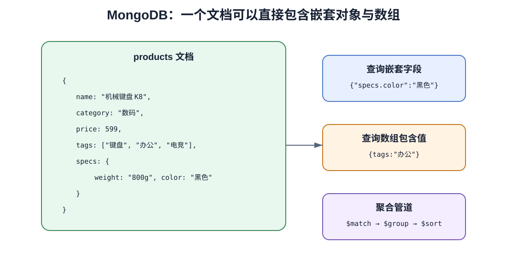

## 1. 文档数据库

关系模型要求一行中的每个属性处在固定关系模式下。若一个商品有多个规格、不同类别商品又有不同属性，可以建立多张关系表，但读取一个完整商品时可能需要多次连接。

文档模型允许把与对象一起出现的数据嵌入同一文档：

```javascript
{
  title: "MongoDB 权威指南",
  author: "Chodorow",
  category: "计算机",
  price: 89,
  stock: 50,
  tags: ["NoSQL", "数据库"]
}
```

标题、价格、库存和标签共同描述一本书，经常一次读取。数组 `tags` 不必拆成多行独立表。

文档模型的优势是对象结构与应用中的 JSON 更接近，嵌套数据可整体读取，字段演化较灵活。代价是跨文档约束和复杂多表关系通常不如关系数据库自然，重复嵌入还可能带来一致性问题。

因此，文档数据库并非“关系数据库升级版”。选择取决于数据边界和访问方式：若数据围绕独立聚合对象组织，文档很合适；若需要大量跨实体连接和严格参照约束，关系模型往往更稳妥。

## 2. 关系术语与 MongoDB 术语对照

MongoDB 中的**数据库**仍然是若干数据集合的容器。**集合（collection）** 大致对应关系数据库中的表，**文档（document）** 大致对应一行，**字段（field）** 大致对应列。

这种对应只适合建立初步直觉，不能认为两者完全相同。关系表通常有统一模式，文档可以嵌套数组与对象；关系行之间通过外码连接，MongoDB 既可以保存引用，也可以直接嵌入子文档。

每个 MongoDB 文档通常有 `_id` 字段，用于唯一标识文档。若插入时未提供，MongoDB 会自动生成 `ObjectId`。它类似主码，但 MongoDB 的其他约束能力与关系数据库并不完全相同。

| 关系数据库 | MongoDB |
| --- | --- |
| 表 | 集合 |
| 行/元组 | 文档 |
| 列/属性 | 字段 |
| 主码 | `_id` 或其他唯一索引字段 |
| 连接 | `$lookup`、引用或嵌入 |

## 3. 文档插入

### 3.1 insertOne

插入单个文档：

```javascript
db.books.insertOne({
  title: "MongoDB 权威指南",
  author: "Chodorow",
  category: "计算机",
  price: 89.00,
  stock: 50,
  tags: ["NoSQL", "数据库"]
})
```

文档使用键值对表达字段。字符串加引号，数值不加引号，数组使用方括号。

若未指定 `_id`，系统自动生成。若显式给出已经存在的 `_id`，插入会因唯一性冲突失败。

### 3.2 insertMany

插入多个文档：

```javascript
db.books.insertMany([
  { title: "A", price: 50 },
  { title: "B", price: 80 }
])
```

数组中的每个对象成为一份文档。默认情况下，批量插入遇到错误时的后续处理与 `ordered` 选项有关；基础题通常只要求正确构造文档数组。

MongoDB 允许不同文档字段不同，但应用仍应保持合理一致。例如一部分文档把价格保存为字符串，另一部分保存为数值，会导致比较、排序和聚合结果混乱。

## 4. 基础查询 find

`find` 接收查询条件对象和可选投影对象：

```javascript
db.books.find(
  { category: "计算机", price: { $lte: 100 } },
  { title: 1, author: 1, price: 1, _id: 0 }
)
```

条件对象中，同一层的多个字段默认是“并且”。上面表示分类为计算机，并且价格不超过 100。

常用比较操作符包括 `$eq`、`$ne`、`$gt`、`$gte`、`$lt`、`$lte`、`$in` 和 `$nin`。例如：

```javascript
db.books.find({
  price: { $gt: 50, $lte: 100 }
})
```

同一字段对象中可以同时写上下界，表示区间。`findOne` 只返回第一份匹配文档；若条件可能匹配多份且需要全部结果，应使用 `find`。

## 5. `$or`、`$and` 与否定

同一对象中的不同字段默认使用逻辑与：

```javascript
{ category: "计算机", stock: { $gt: 0 } }
```

需要逻辑或时使用 `$or`，值是条件对象数组：

```javascript
{
  $or: [
    { category: "计算机" },
    { category: "数学" }
  ]
}
```

显式 `$and` 也接收数组。同一字段的区间通常直接合并在一个对象中更简洁。`$not` 否定一个字段条件，`$nor` 表示所有给定条件都不成立。

逻辑操作符的结构容易写错：`$or` 后必须是数组，数组中每个元素是完整条件对象，而不是简单值列表。值列表应使用 `$in`。

## 6. 投影

投影对象控制返回字段：

```javascript
{ title: 1, author: 1, price: 1, _id: 0 }
```

值为 1 表示包含，值为 0 表示排除。除了 `_id` 可以单独排除外，一般不能在同一投影中混用包含和排除模式。

MongoDB 默认返回 `_id`，因此题目要求“只返回 title、author、price”时，通常还要显式写 `_id: 0`。

投影只影响返回结果，不会删除文档中的其他字段。它类似 SQL 的选择列表，但支持嵌套字段路径和数组相关投影。

## 7. 排序、跳过与限制

查询结果可以链式调用：

```javascript
db.books.find(
  { price: { $gt: 50 } },
  { title: 1, price: 1, _id: 0 }
).sort({ price: -1 })
```

排序值 `1` 表示升序，`-1` 表示降序。多字段排序按对象中字段顺序解释：

```javascript
.sort({ category: 1, price: -1 })
```

先按分类升序，同类内按价格降序。

`limit(n)` 限制数量，`skip(n)` 跳过前 n 条：

```javascript
.find({}).sort({ price: -1 }).skip(10).limit(10)
```

这可实现简单分页，但大偏移会让数据库扫描并丢弃许多文档。生产系统常使用基于上次排序键的范围分页。

## 8. 正则、数组和嵌套字段

### 8.1 正则查询

查询标题包含“数据库”：

```javascript
db.books.find({
  title: /数据库/
})
```

也可以使用 `$regex`。正则表达式提供灵活文本匹配，但前导任意匹配通常难以利用普通索引，复杂全文搜索更适合专用全文索引。

### 8.2 数组包含某值

若 `tags` 是数组：

```javascript
{ tags: ["NoSQL", "数据库"] }
```

查询包含 `"NoSQL"` 的文档可直接写：

```javascript
db.books.find({ tags: "NoSQL" })
```

MongoDB 会匹配数组中任一元素。若要求同时包含多个值，可使用 `$all`：

```javascript
{ tags: { $all: ["NoSQL", "数据库"] } }
```

### 8.3 嵌套字段

嵌套文档：

```javascript
{
  title: "A",
  publisher: {
    name: "某出版社",
    city: "北京"
  }
}
```

查询内部字段使用点号路径：

```javascript
db.books.find({ "publisher.city": "北京" })
```

若直接比较整个嵌套对象，字段和值结构通常需要完全匹配；点号方式更适合只关心其中一项。

## 9. 文档更新

更新操作由“定位条件”和“更新操作对象”组成。不能直接把新字段对象当作完整替换，除非明确使用替换 API。

### 9.1 `$set`

设置或新增字段：

```javascript
db.books.updateOne(
  { title: "MongoDB 权威指南" },
  { $set: { stock: 60 } }
)
```

`updateOne` 只更新第一份匹配文档，`updateMany` 更新全部匹配文档。

### 9.2 `$inc`

按数值增减：

```javascript
db.books.updateMany(
  { category: "小说" },
  { $inc: { price: -10 } }
)
```

题目中的“价格减少 10”应使用 `$inc: { price: -10 }`。它表示减去固定数值，不是降低 10%。

### 9.3 乘法 `$mul`

按比例调整：

```javascript
db.books.updateMany(
  { category: "小说" },
  { $mul: { price: 0.9 } }
)
```

这才表示调整为原来的 90%，也就是降低 10%。固定减少和百分比减少必须区分。

### 9.4 数组 `$push`

向数组末尾增加元素：

```javascript
db.books.updateOne(
  { title: "A" },
  { $push: { tags: "畅销" } }
)
```

`$push` 允许重复；若不希望重复，可使用 `$addToSet`。

### 9.5 upsert

`upsert: true` 表示找不到匹配文档时插入新文档：

```javascript
db.books.updateOne(
  { title: "New Book" },
  { $set: { price: 50 } },
  { upsert: true }
)
```

它适合“存在则更新，不存在则创建”的场景，但要确保查询条件能够稳定标识目标，否则可能插入意外文档。

## 10. 文档删除

删除第一份匹配文档：

```javascript
db.books.deleteOne({ title: "A" })
```

删除全部匹配文档：

```javascript
db.books.deleteMany({ stock: 0 })
```

空条件 `{}` 会匹配集合中全部文档：

```javascript
db.books.deleteMany({})
```

它删除数据但保留集合。删除集合本身使用 `drop()`，类似 SQL 中 `DELETE` 与 `DROP TABLE` 的区别。

删除前应确认条件是否具有预期唯一性。`deleteOne({ title: 'A' })` 只删除第一份同名文档，若标题不唯一，结果可能不是想象中的那一本。

## 11. 聚合管道

聚合管道把文档依次送入多个阶段，每个阶段接收上一阶段输出，再产生下一阶段输入：

```javascript
db.books.aggregate([
  { $match: { category: "计算机" } },
  { $group: {
      _id: "$author",
      avgPrice: { $avg: "$price" },
      count: { $sum: 1 }
  } },
  { $sort: { avgPrice: -1 } }
])
```

`$match` 类似 `WHERE`，`$group` 类似 `GROUP BY`，`$project` 类似输出字段与表达式，`$sort` 排序，`$limit` 限制数量。

管道顺序会影响语义和性能。先分组再筛选原始字段与先筛选再分组不是同一件事。

### 11.1 `$match`

若条件只依赖原始字段，应尽量在管道前部 `$match`，减少后续阶段处理文档数量，也有机会使用索引。

但针对分组结果的条件必须放在 `$group` 之后。例如筛选平均价格大于 100 的作者，只能先计算平均值，再匹配 `avgPrice`。

## 12. `$group`

`$group` 使用 `_id` 指定分组键：

```javascript
{
  $group: {
    _id: "$category",
    bookCount: { $sum: 1 },
    avgPrice: { $avg: "$price" },
    maxPrice: { $max: "$price" }
  }
}
```

结果中的 `_id` 保存分类值。若希望改名，可在后续 `$project` 中转换。

按多个字段分组时，`_id` 可以是对象：

```javascript
_id: { category: "$category", author: "$author" }
```

`$sum: 1` 用于计数，`$sum: "$stock"` 用于求库存总量。与 SQL 类似，聚合前要明确分组粒度。

## 13. `$unwind`

数组字段在一个文档中包含多个元素。`$unwind` 把每个数组元素展开成一份管道文档。

原文档：

```javascript
{ title: "A", tags: ["NoSQL", "数据库"] }
```

执行：

```javascript
{ $unwind: "$tags" }
```

后会形成两份结果，一份 `tags="NoSQL"`，一份 `tags="数据库"`。这样可以按标签分组统计。

`$unwind` 会增加文档数量，空数组或缺失字段的处理可通过选项控制。使用前要理解它改变了结果粒度。

## 14. `$lookup`

`$lookup` 在聚合管道中连接另一个集合：

```javascript
{
  $lookup: {
    from: "authors",
    localField: "authorId",
    foreignField: "_id",
    as: "authorInfo"
  }
}
```

结果中的 `authorInfo` 是匹配文档数组。即使一对一关系，返回形式仍通常是数组，常配合 `$unwind` 展开。

`$lookup` 说明 MongoDB 并非不能连接，但大量跨集合复杂连接不是它最有优势的模式。若数据总是一起读取且更新边界一致，可能更适合嵌入；若对象独立存在、共享频繁，则引用与 `$lookup` 更合理。

## 15. 关系表与文档嵌入

嵌入把相关数据放在同一文档中，读取简单且具有局部性，但会产生重复和文档增长问题。引用把对象独立保存，通过标识关联，避免重复，却需要额外查询或 `$lookup`。

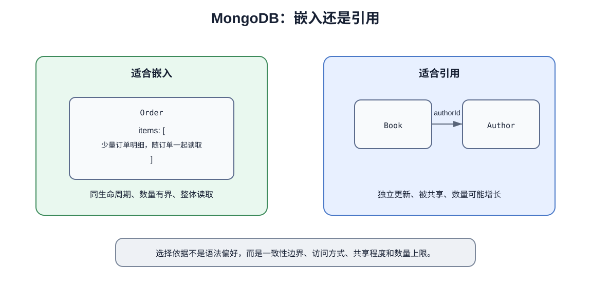

适合嵌入的情况：子数据只属于一个父对象，数量有界，经常与父对象整体读取，更新也围绕同一聚合边界发生。例如订单中的少量明细常可嵌入订单文档。

适合引用的情况：对象被许多文档共享，独立更新，数量可能无限增长，或者需要单独查询。例如作者被许多图书引用，作者信息独立维护，引用通常更合理。

文档设计的核心不是“能不能嵌入”，而是数据的一致性边界和访问模式。经常一起读取、一起更新的内容适合靠近；独立生命周期和高共享对象适合分开。

## 本章速记

- MongoDB 以集合保存文档，文档可包含数组和嵌套对象。
- `find(条件, 投影)` 完成查询；投影默认包含 `_id`。
- 同层字段默认 AND，`$or` 后接条件数组。
- `$set` 设置字段，`$inc` 按固定数值增减，`$mul` 按比例调整。
- `updateOne/deleteOne` 只处理第一份匹配文档，`updateMany/deleteMany` 处理全部匹配。
- 聚合管道按阶段处理数据，`$match`、`$group`、`$project`、`$sort` 分别承担筛选、分组、变换和排序。
- `$unwind` 展开数组，`$lookup` 连接集合。
- 嵌入与引用的选择取决于共享程度、生命周期、数量边界和访问模式。

## 章节练习与解析

### 材料原题

#### 原题 1｜2025—2026 样卷·MongoDB books 集合

文档结构：

```javascript
{
  title: "书名",
  author: "作者",
  category: "分类",
  price: 价格,
  stock: 库存量,
  tags: ["标签1", "标签2"]
}
```

##### 1. 《MongoDB 权威指南》文档

> [!example]- 答案
> ```javascript
> db.books.insertOne({
>   title: "MongoDB 权威指南",
>   author: "Chodorow",
>   category: "计算机",
>   price: 89.00,
>   stock: 50,
>   tags: ["NoSQL", "数据库"]
> })
> ```

##### 2. 计算机类低价图书字段

> [!example]- 答案
> ```javascript
> db.books.find(
>   { category: "计算机", price: { $lte: 100 } },
>   { _id: 0, title: 1, author: 1, price: 1 }
> )
> ```

##### 3. 小说价格

> [!example]- 答案
> ```javascript
> db.books.updateMany(
>   { category: "小说" },
>   { $inc: { price: -10 } }
> )
> ```

##### 4. 高价图书字段排序

> [!example]- 答案
> ```javascript
> db.books.find(
>   { price: { $gt: 50 } },
>   { _id: 0, title: 1, price: 1 }
> ).sort({ price: -1 })
> ```

### 补充题

#### 补充题 1｜投影

MongoDB 查询中只返回 `title` 和 `price`，并排除 `_id`，投影应写为____。

- A. `{ title: 0, price: 0 }`
- B. `{ _id: 0, title: 1, price: 1 }`
- C. `{ _id: 1 }`
- D. `{ title: -1, price: -1 }`

> [!example]- 答案
> **B。** 1 表示包含字段，`_id:0` 显式排除默认返回的 `_id`。

#### 补充题 2｜数值增减

把所有小说价格减少 10，应使用____。

- A. `$inc: {price: -10}`
- B. `$set: {price: "-10"}`
- C. `$push: {price: -10}`
- D. `$unset: {price: 10}`

> [!example]- 答案
> **A。** $inc 按给定增量修改数值，负数表示减少。

#### 补充题 3｜聚合阶段

聚合管道中，通常应尽早执行 `$match`，主要为了____。

- A. 增加后续阶段处理的文档数
- B. 提前过滤无关文档，减少后续工作量
- C. 把所有字段改成数组
- D. 强制创建关系

> [!example]- 答案
> **B。** 与关系代数的选择下推原理一致。

#### 补充题 4｜嵌入与引用

一组子数据总是随父对象一起读取、生命周期一致且规模有限，通常更适合____。

- A. 嵌入父文档
- B. 拆成无限多集合且不保存关联
- C. 保存为图关系但删除父对象
- D. 全部转成字符串

> [!example]- 答案
> **A。** 这种数据处于同一聚合边界，嵌入能减少额外查询。

#### 补充题 5｜样卷文档

> [!example]- 解析
> ```javascript
> db.books.insertOne({
>   title: "MongoDB 权威指南",
>   author: "Chodorow",
>   category: "计算机",
>   price: 89.00,
>   stock: 50,
>   tags: ["NoSQL", "数据库"]
> })
> ```

#### 补充题 6｜样卷条件与投影

> [!example]- 解析
> ```javascript
> db.books.find(
>   { category: "计算机", price: { $lte: 100 } },
>   { _id: 0, title: 1, author: 1, price: 1 }
> )
> ```

#### 补充题 7｜样卷文档更新

> [!example]- 解析
> ```javascript
> db.books.updateMany(
>   { category: "小说" },
>   { $inc: { price: -10 } }
> )
> ```

#### 补充题 8｜样卷排序

> [!example]- 解析
> ```javascript
> db.books.find(
>   { price: { $gt: 50 } },
>   { _id: 0, title: 1, price: 1 }
> ).sort({ price: -1 })
> ```

---

# 第十章　Neo4j 图数据库

关系数据库当然可以保存用户关系、课程先修关系和交通线路，但当查询重点变成“谁与谁相连”“经过几跳可以到达”“哪些对象拥有共同邻居”时，表连接会迅速增多。图数据库把连接本身提升为一等数据，使路径查询能够直接按照关系模式表达。

Neo4j 的数据由节点、关系、标签和属性组成。节点表示对象，关系表示有方向和类型的连接，属性保存对象或关系的具体信息。Cypher 查询语言使用接近图形的括号和箭头描述模式，因此阅读查询时应先看图结构，再看过滤与返回字段。

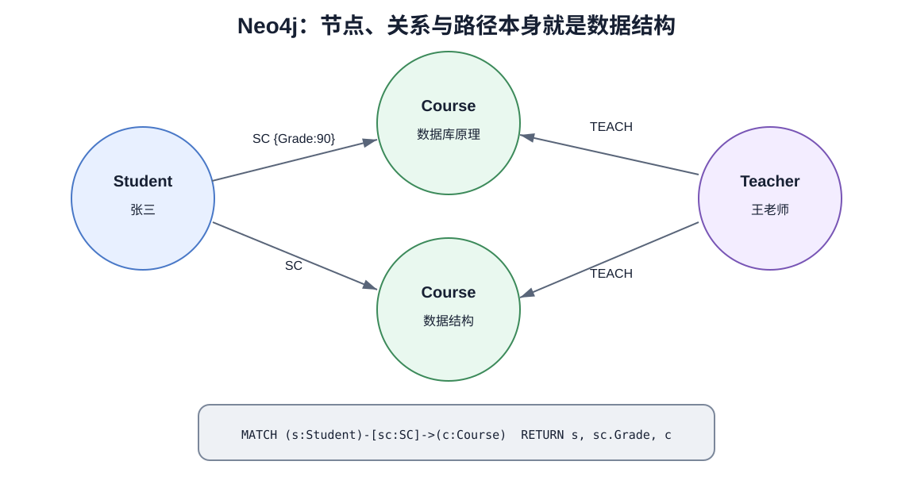

## 1. 图数据库

图数据库特别适合关系密集、路径重要的数据：社交网络中的好友传播，知识图谱中的概念关系，推荐系统中的用户—商品连接，交通网络中的路线，组织结构中的汇报链。

在关系数据库中，员工与部门可以通过外码轻松连接一次。但若查询“某员工经理的经理所在部门”，需要多次自连接。路径长度不固定时，SQL 会更复杂。

图数据库从某个起点沿已有关系遍历，不必在每一步重新做全局表连接。其优势不是节点属性查询一定比关系数据库快，而是关联结构与查询模式高度一致。

如果数据主要是规则化表格、聚合统计和强事务约束，关系数据库仍然更自然。图数据库适合把“关系网络”作为核心问题，而不是因为它能画图。

## 2. 图基本元素

**节点（Node）** 表示实体，例如员工、部门、课程。一个节点可以带一个或多个**标签（Label）**，标签类似类型：`:Employee`、`:Department`。

**关系（Relationship）** 连接两个节点，具有类型和方向：

```text
(Employee)-[:BELONGS_TO]->(Department)
```

关系也可以拥有属性，例如员工从何时加入部门：

```text
[:BELONGS_TO {since: '2024-01-01'}]
```

**属性（Property）** 是节点或关系上的键值数据。例如员工节点拥有 `name、salary、hire_date`。

方向是关系模式的一部分。`Employee-[:BELONGS_TO]->Department` 与反向关系表达不同语义。查询时可以忽略方向匹配，但建模仍应选择清晰一致的方向。

Neo4j 中没有要求所有同标签节点字段完全一致，但实际模型应保持语义规范，否则查询需要处理大量缺失和类型差异。

## 3. Cypher 模式

Cypher 使用括号表示节点，中括号表示关系，箭头表示方向：

```cypher
(e:Employee)-[r:BELONGS_TO]->(d:Department)
```

`e、r、d` 是查询变量，后续可以引用；`:Employee` 是节点标签；`:BELONGS_TO` 是关系类型。

带属性的节点模式：

```cypher
(e:Employee {name: 'Charlie'})
```

表示匹配或创建姓名为 Charlie 的员工节点，具体动作由前面的 `MATCH、CREATE、MERGE` 决定。

Cypher 的视觉形式很重要。阅读：

```cypher
(a)-[:KNOWS]->(b)-[:WORKS_AT]->(c)
```

可以直接理解为 a 认识 b，b 就职于 c。多个关系连续出现就是一条路径。

## 4. 节点创建

创建节点使用 `CREATE`：

```cypher
CREATE (e:Employee {
  name: 'Charlie',
  salary: 15000,
  hire_date: '2025-03-01'
})
```

`CREATE` 每执行一次都会新建节点，即使已存在同名员工。它不会自动根据属性判断重复。

可以一次创建多个节点：

```cypher
CREATE
  (:Department {name: '市场部', location: '北京'}),
  (:Department {name: '研发部', location: '杭州'})
```

日期若保存为普通字符串，只能按字符串语义处理。Neo4j 支持 `date()` 等时间类型，正式模型应选择合适类型；样卷为了简化可能直接使用 String。

节点创建后通常会返回内部 ID，但内部 ID 不是稳定业务标识。实际系统应为业务唯一字段建立约束，例如员工编号唯一。

## 5. CREATE 与 MERGE

`CREATE` 无条件创建，`MERGE` 保证给定模式至少存在一次：

```cypher
MERGE (d:Department {name: '市场部'})
```

若找到匹配节点就复用，找不到就创建。

`MERGE` 匹配的是完整模式。若写入多个非唯一属性，属性变化可能导致创建新节点。因此通常以稳定唯一标识进行 `MERGE`，再用 `SET` 更新其他属性：

```cypher
MERGE (e:Employee {employee_id: 'E01'})
SET e.name = 'Charlie', e.salary = 15000
```

没有唯一约束时，并发执行相同 `MERGE` 仍可能出现重复风险。数据库级唯一约束与 `MERGE` 配合更可靠。

`ON CREATE SET` 与 `ON MATCH SET` 可以分别处理首次创建和已有匹配：

```cypher
MERGE (e:Employee {employee_id: 'E01'})
ON CREATE SET e.created_at = datetime()
ON MATCH SET e.last_seen = datetime()
```

## 6. 关系创建

通常先 `MATCH` 两端节点，再 `CREATE` 或 `MERGE` 关系：

```cypher
MATCH (e:Employee {name: 'Charlie'}),
      (d:Department {name: '市场部'})
CREATE (e)-[:BELONGS_TO]->(d)
```

这不会创建两端节点，只在匹配成功时创建关系。若任一节点找不到，关系不会产生。

为避免重复关系，可使用：

```cypher
MATCH (e:Employee {name: 'Charlie'}),
      (d:Department {name: '市场部'})
MERGE (e)-[:BELONGS_TO]->(d)
```

关系可以有属性：

```cypher
MERGE (e)-[r:BELONGS_TO]->(d)
SET r.since = '2025-01-01'
```

若员工只能属于一个部门，图模型本身不会自动禁止他连接多个部门，需要通过应用规则、约束设计或更新逻辑保证基数。

## 7. MATCH、WHERE 与 RETURN

`MATCH` 描述要寻找的图模式，`WHERE` 过滤匹配，`RETURN` 指定输出。

```cypher
MATCH (e:Employee)-[:BELONGS_TO]->(d:Department)
WHERE d.location = '北京'
  AND e.salary > 12000
RETURN e.name, d.name
```

执行含义是：寻找员工到部门的 `BELONGS_TO` 关系，只保留部门在北京且薪资高于 12000 的匹配，返回员工名和部门名。

属性访问使用点号：`e.salary`。返回别名：

```cypher
RETURN e.name AS employee, d.name AS department
```

`MATCH` 中的多个独立模式可能产生组合，类似笛卡尔积。创建关系时若分别匹配两端，应确保每个条件只找到预期节点，否则可能创建多条组合关系。

`OPTIONAL MATCH` 类似 SQL 左外连接。即使可选模式未匹配，已有变量仍保留，缺失部分为 `NULL`。

## 8. 排序、分页与聚合

排序：

```cypher
MATCH (e:Employee)
RETURN e.name, e.salary
ORDER BY e.salary DESC
```

分页：

```cypher
SKIP 10 LIMIT 10
```

聚合函数与 SQL 类似：`count、sum、avg、max、min`。

```cypher
MATCH (e:Employee)-[:BELONGS_TO]->(d:Department)
RETURN d.name, count(e) AS employee_count
ORDER BY employee_count DESC
```

Cypher 会把未聚合返回表达式作为分组键。这里 `d.name` 形成部门分组，`count(e)` 统计每组员工。

`count(*)` 统计匹配行，`count(e.property)` 忽略属性为空的值。与 SQL 一样，聚合前要明确当前匹配结果的粒度，避免路径重复导致重复计数；必要时使用 `count(DISTINCT e)`。

## 9. 多跳查询

图数据库最自然的能力之一是沿多条关系匹配路径。

查询员工的二级同事关系：

```cypher
MATCH (a:Employee)-[:KNOWS]->()-[:KNOWS]->(b:Employee)
WHERE a.name = 'Alice'
RETURN DISTINCT b.name
```

匿名节点 `()` 表示中间对象本身不需要引用。

可变长度路径：

```cypher
MATCH (a:Employee {name: 'Alice'})-[:KNOWS*1..3]->(b:Employee)
RETURN DISTINCT b.name
```

表示沿 `KNOWS` 关系走 1 到 3 跳。

可变长度遍历可能产生大量路径，尤其在高连接图中。应限定起点、关系类型和最大深度，并根据需求决定返回路径还是去重后的节点。

最短路径可使用 `shortestPath` 等函数，但不能把任意复杂模式都直接包入；具体限制取决于 Neo4j 版本。

## 10. 两门课程条件

“学生同时选了数据库和操作系统”可以通过两条独立关系模式表达：

```cypher
MATCH (s:Student)-[:ENROLLED_IN]->(:Course {name: '数据库'}),
      (s)-[:ENROLLED_IN]->(:Course {name: '操作系统'})
RETURN s.name
```

同一个变量 `s` 出现在两个模式中，要求同一学生同时存在两种关系。

也可以匹配课程后分组计数：

```cypher
MATCH (s:Student)-[:ENROLLED_IN]->(c:Course)
WHERE c.name IN ['数据库', '操作系统']
WITH s, count(DISTINCT c.name) AS n
WHERE n = 2
RETURN s.name
```

第一种写法直观，第二种更容易扩展到任意课程集合。关键仍然是“覆盖全部目标”，与关系数据库中的除法思维相似。

## 11. 属性更新

使用 `SET` 修改或增加属性：

```cypher
MATCH (e:Employee {name: 'Charlie'})
SET e.salary = 16000
```

一次设置多个属性：

```cypher
SET e.salary = 16000,
    e.location = '北京'
```

用 `+=` 合并属性对象：

```cypher
SET e += {salary: 16000, title: '工程师'}
```

删除属性使用 `REMOVE`：

```cypher
REMOVE e.temp_field
```

更新关系属性与节点相同，只需变量指向关系：

```cypher
MATCH (e)-[r:BELONGS_TO]->(d)
SET r.since = '2025-01-01'
```

`SET` 会作用于全部匹配结果，所以 `MATCH` 条件必须精确。若姓名不唯一，按姓名更新可能修改多名员工。

## 12. 关系与节点删除

### 12.1 关系删除

```cypher
MATCH (e:Employee {name: 'Charlie'})-[r:BELONGS_TO]->(d:Department)
DELETE r
```

只删除关系，两端节点仍存在。

### 12.2 无关系节点删除

普通 `DELETE` 只能删除没有任何关系的节点：

```cypher
MATCH (e:Employee {name: 'Eve'})
WHERE NOT (e)--()
DELETE e
```

`(e)--()` 表示 e 与任意节点存在任意方向关系，`NOT` 表示没有任何关系。

样卷中的“删除尚未加入任何部门的 Eve”只要求没有 `BELONGS_TO` 关系，也可能允许她存在其他关系。更精确可写：

```cypher
MATCH (e:Employee {name: 'Eve'})
WHERE NOT (e)-[:BELONGS_TO]->(:Department)
DELETE e
```

若 Eve 仍有其他关系，普通 `DELETE` 会失败，因此题目语义与数据状态要一致。

### 12.3 DETACH DELETE

```cypher
MATCH (e:Employee {name: 'Eve'})
DETACH DELETE e
```

会先删除节点所有关系，再删除节点。它相当于级联清理连接，使用时要确认确实希望移除全部关系。

`DETACH DELETE` 很方便，但也更危险，因为会隐藏关系存在这一事实。若业务要求“有关联时禁止删除”，应使用普通 `DELETE` 并先检查，而不是一律级联。

## 14. 图数据库与关系数据库

关系数据库把联系表示为外码值，通过连接运算恢复关联；图数据库把关系作为显式对象保存，并能直接拥有类型、方向和属性。

对于固定深度、结构清晰的关联，关系数据库的连接非常成熟，而且具有强约束、事务和聚合能力。对于路径长度不固定、关系类型丰富、频繁进行邻居扩展的查询，图模型通常更直观。

同一业务也可以混合使用。订单和账务保存在关系数据库，用户推荐网络保存在图数据库；关键数据通过应用或数据管道同步。数据库类型应由数据语义和查询模式决定，而不是追求某一种技术覆盖全部问题。

图数据库也需要索引。`MATCH (e:Employee {name:'Charlie'})` 若没有适当索引或唯一约束，仍可能扫描大量节点。图遍历高效的前提是能先快速定位起点。

## 本章速记

- Neo4j 用节点表示实体，用带类型和方向的关系表示连接，节点和关系都可有属性。
- 括号表示节点，中括号表示关系，箭头表示方向。
- `CREATE` 无条件创建，`MERGE` 匹配不到时创建。
- `MATCH` 描述图模式，`WHERE` 过滤，`RETURN` 输出。
- 多跳路径通过连续关系或 `*最小..最大` 表达。
- 聚合时非聚合返回项形成分组键，路径重复时可使用 `DISTINCT`。
- `DELETE` 只能删除无关系节点，`DETACH DELETE` 会先删除全部关系。
- 图数据库适合路径和关系网络查询，关系数据库适合规则化表格、复杂聚合和强约束。

## 章节练习与解析

### 材料原题

#### 原题 1｜2025—2026 样卷·Neo4j Employee—BELONGS_TO→Department

##### 1. Charlie 与市场部

> [!example]- 答案
>
> ```cypher
> MATCH (e:Employee {Name: 'Charlie'}),
>       (d:Department {name: '市场部'})
> CREATE (e)-[:BELONGS_TO]->(d);
> ```

##### 2. 北京高薪员工与部门

> [!example]- 答案
>
> ```cypher
> MATCH (e:Employee)-[:BELONGS_TO]->(d:Department)
> WHERE d.Location = '北京'
>   AND e.Salary > 12000
> RETURN e.Name, d.name;
> ```

##### 3. 未加入部门的 Eve

> [!example]- 答案
>
> ```cypher
> MATCH (e:Employee {Name: 'Eve'})
> WHERE NOT EXISTS {
>   MATCH (e)-[:BELONGS_TO]->()
> }
> DELETE e;
> ```
>
> 因为条件已经保证 Eve 没有 `BELONGS_TO` 关系，所以可以直接 DELETE。若节点还连接着其他类型关系，则需要先处理关系或使用 `DETACH DELETE`。

---

### 补充题

#### 补充题 1｜模式语法

Cypher 中 `(e:Employee)-[:BELONGS_TO]->(d:Department)` 表示____。

- A. Employee 表与 Department 表做笛卡尔积
- B. 员工节点通过 BELONGS_TO 有向关系指向部门节点
- C. 删除两个节点
- D. 创建 B+ 树索引

> [!example]- 答案
> **B。** 圆括号是节点，方括号是关系，箭头给出方向。

#### 补充题 2｜CREATE 与 MERGE

需要“若节点不存在则创建，存在则复用”，通常使用____。

- A. CREATE
- B. MERGE
- C. DELETE
- D. SKIP

> [!example]- 答案
> **B。** MERGE 先匹配指定模式，匹配不到才创建。

#### 补充题 3｜有关联节点

删除节点及其所有关系，可以使用____。

- A. DETACH DELETE
- B. RETURN DELETE
- C. MATCH ONLY
- D. GROUP BY

> [!example]- 答案
> **A。** 普通 DELETE 不能直接删除仍带关系的节点。

#### 补充题 4｜多跳路径

查询“员工所属部门所在城市”这类连续关系时，图数据库主要通过____表达。

- A. 连续路径模式
- B. HAVING 子句
- C. 数组投影
- D. 属性闭包

> [!example]- 答案
> **A。** Cypher 可以在 MATCH 中连续写出多段节点和关系。

---

#### 补充题 5｜高分学生

查询成绩不低于 85 的学生、课程和成绩。

> [!example]- 解析
>
> ```cypher
> MATCH (s:Student)-[sc:SC]->(c:Course)
> WHERE sc.Grade >= 85
> RETURN s.sname, c.cname, sc.Grade;
> ```

#### 补充题 6｜王老师课程

> [!example]- 解析
>
> ```cypher
> MATCH (t:Teacher {tname: '王老师'})-[:TEACH]->(c:Course)
> RETURN c.cno, c.cname;
> ```

#### 补充题 7｜课程节点

为什么有关系的课程不能直接 `DELETE c`？

> [!example]- 解析
> Neo4j 不允许留下悬空关系。应先删除相关关系，或使用 `DETACH DELETE c` 同时删除节点及其全部关系。
