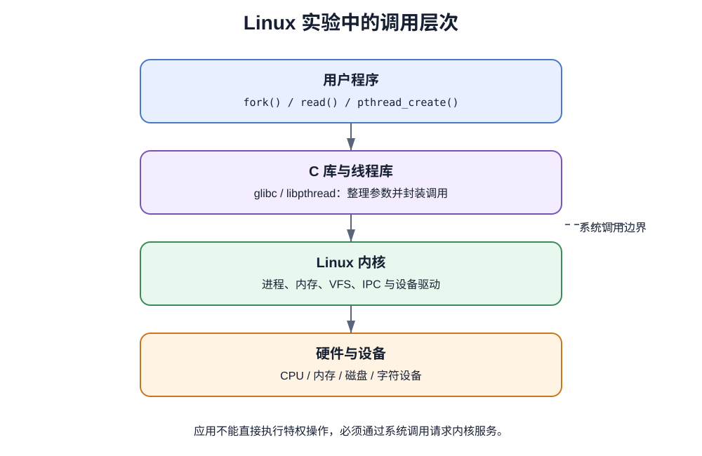
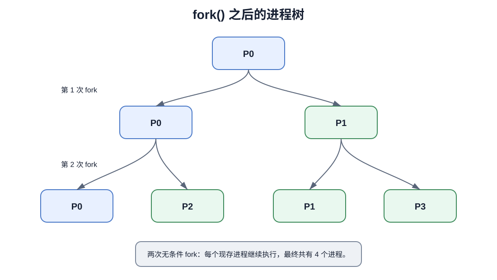
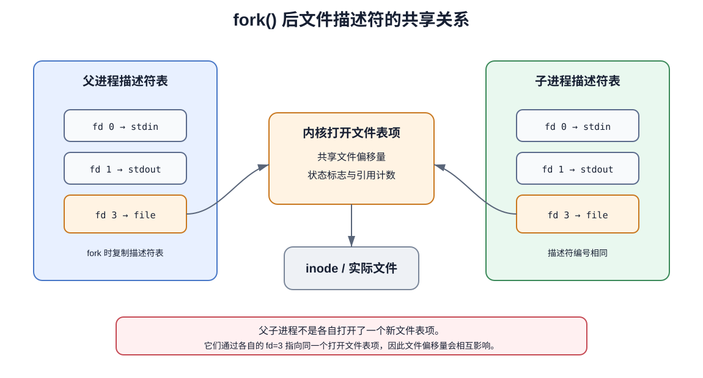
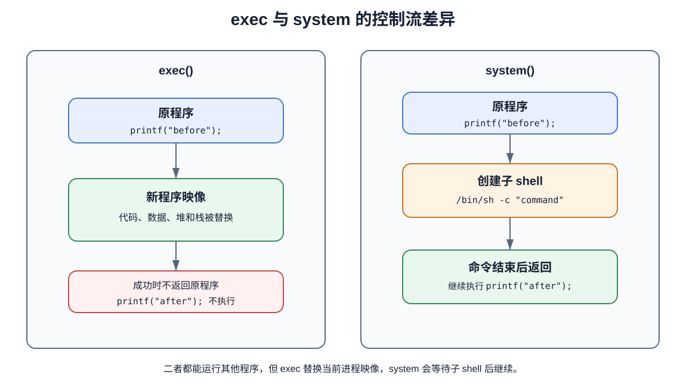
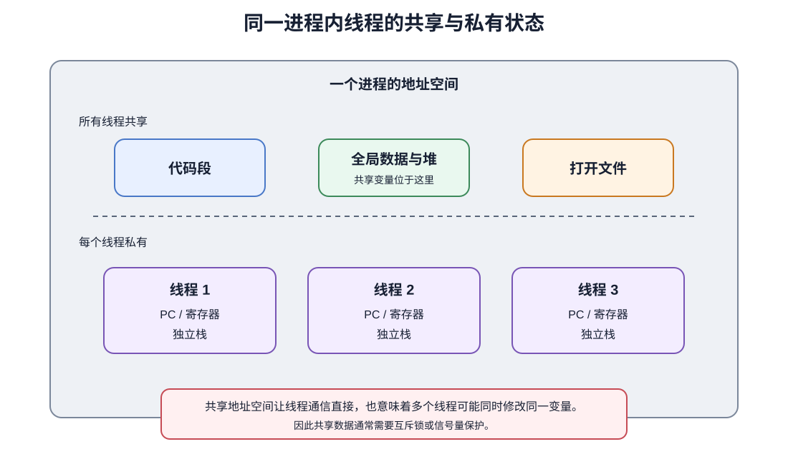
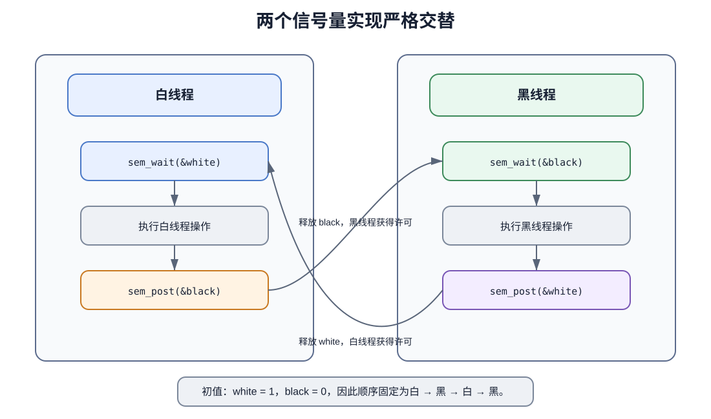
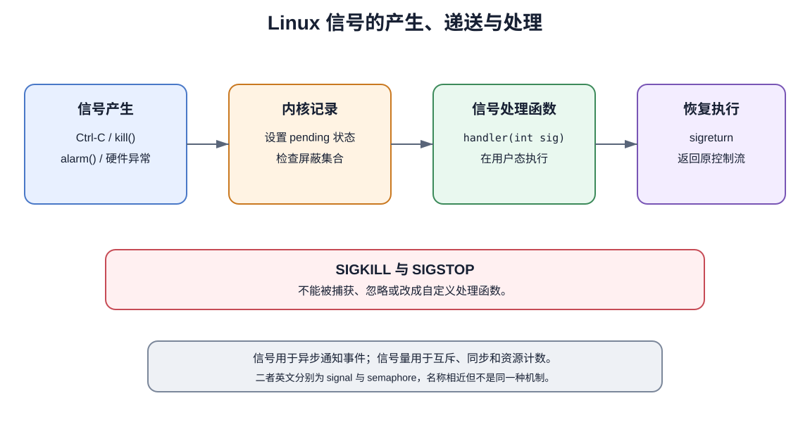
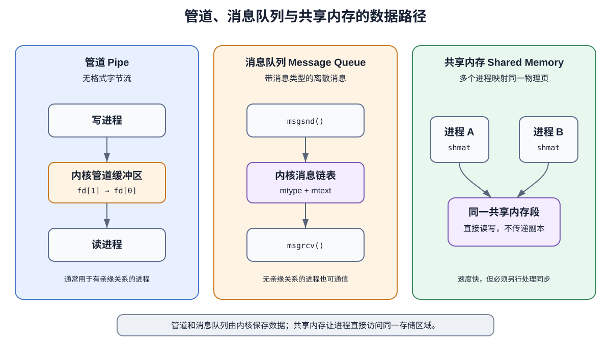
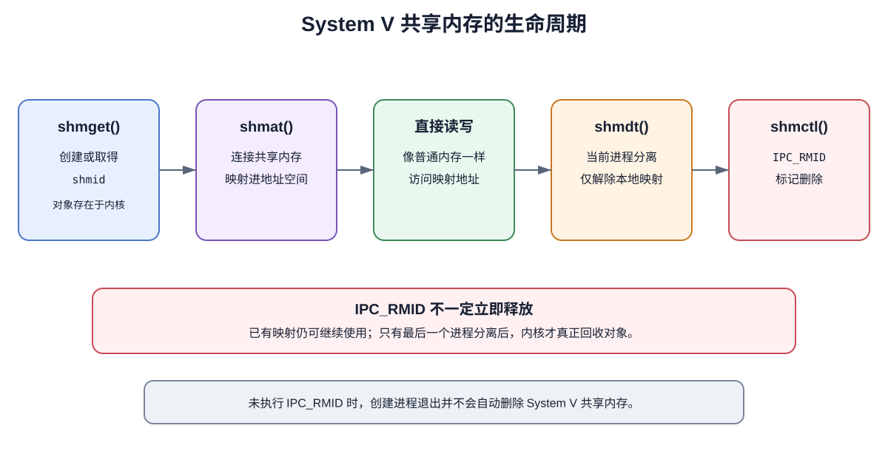
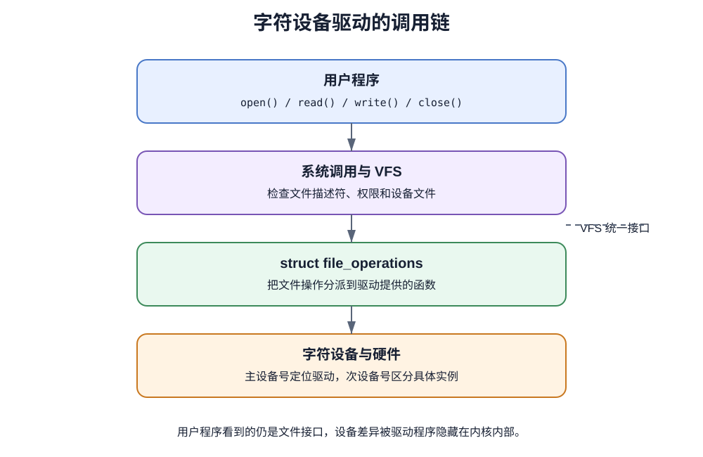

# 操作系统原理实验考试复习资料

> [!abstract] 资料范围
> 本资料以实验题库为考试边界，并沿用理论课已经建立的知识链：先从操作系统接口进入 Linux，再学习进程与线程，随后处理同步、信号和进程间通信，最后落到设备驱动与内核模块。正文以 C 代码和 API 调用为主；章末收录并解析题库原题。

实验考试和理论考试关注的是同一套操作系统机制，但观察角度不同。理论课回答“为什么需要进程、同步和设备驱动”，实验课进一步追问：Linux 用什么数据结构表示它们，程序调用哪个 API，以及一段 C 代码运行后究竟会发生什么。

| 理论知识 | 实验中的具体形式 |
|---|---|
| 系统调用、用户态与内核态 | `fork()`、`read()`、`write()`、`kill()` 等接口 |
| 进程创建与撤销 | `fork()`、`exec()`、`wait()` |
| 线程与同步 | `pthread_create()`、互斥锁、POSIX 信号量 |
| 进程通信 | 管道、消息队列、共享内存、信号 |
| 设备管理 | 设备文件、`file_operations`、内核模块 |

---


# 第一章 Linux 系统与实验环境

> [!abstract] 本章核心问题
> 理论课把操作系统描述为应用和硬件之间的管理层。本章把这层结构落实到 Linux：用户程序如何请求内核服务，Linux 内核由哪些部分组成，以及实验中常用的命令、编译工具和伪文件系统分别处于什么位置。



## 1. Linux 中的系统调用

用户程序运行在用户态，不能直接修改页表、控制设备或创建内核调度实体。程序需要这些服务时，必须通过系统调用进入内核。实验代码里看到的函数名通常是 C 库提供的包装接口，但真正完成资源管理的是内核。

例如：

```c
#include <unistd.h>

ssize_t n = write(STDOUT_FILENO, "hello\n", 6);
```

`write()` 的参数在用户态准备好，随后触发系统调用。内核检查文件描述符和用户缓冲区，完成写入，再把结果返回给程序。系统调用的目的不是单纯“申请资源”或“释放资源”，而是更一般的：**请求操作系统服务**。

库函数不一定都是系统调用。`strlen()` 可以完全在用户态计算；`printf()` 会先处理格式和用户态缓冲，必要时才调用 `write()`。因此应保持下面的层次：

```text
用户代码 → 库函数包装 → 系统调用入口 → 内核服务
```

## 2. Linux 内核与发行版

Linux 通常分成两个容易混淆的概念：

- **内核版本**：由 Linux 内核项目维护，负责进程、内存、文件系统、网络和设备驱动；
- **发行版本**：把 Linux 内核、系统工具、软件包管理器和桌面环境组合成可直接使用的系统，例如 Ubuntu、Debian。

Linux 采用宏内核结构。进程调度、内存管理、VFS、网络和大多数设备驱动都运行在同一个内核地址空间中。可加载模块并没有把 Linux 变成微内核；模块只是让部分内核代码可以动态装入和卸载。

内核源码中的高频目录如下：

| 目录 | 作用 |
|---|---|
| `arch/` | 与 CPU 体系结构相关的代码 |
| `kernel/` | 调度、定时器等核心内核代码 |
| `ipc/` | System V IPC 等进程通信代码 |
| `drivers/` | 各类设备驱动 |
| `mm/` | 内存管理 |
| `fs/` | 文件系统和 VFS |

## 3. `/proc` 与 `/dev`

`/proc` 不是普通磁盘目录。它是内核导出的伪文件系统，读取其中的文件等于向内核查询当前系统状态。例如：

```bash
cat /proc/cpuinfo
cat /proc/meminfo
cat /proc/1234/status
```

`/dev` 中则主要放设备文件。应用程序对设备文件仍然使用 `open()`、`read()`、`write()` 等统一文件接口，VFS 再把操作分派给具体驱动。

## 4. 常用命令

实验题不会只考命令名称，还会把命令和对象对应起来。

| 命令 | 主要用途 |
|---|---|
| `pwd` | 显示当前工作目录 |
| `ps ax` | 显示较完整的进程列表 |
| `ps -f` | 以 full 格式显示进程信息 |
| `top` | 动态显示进程、CPU 和内存使用情况 |
| `pstree` | 以树状结构显示父子进程关系 |
| `kill PID` | 默认发送 `SIGTERM` |
| `kill -9 PID` | 发送 `SIGKILL`，不能写成只有 `kill -9` |
| `dmesg` | 查看内核环形缓冲区中的日志 |
| `uname -r` | 查看内核版本 |
| `ipcs` | 查看 System V IPC 对象 |
| `lsmod` | 查看已加载内核模块 |
| `more file` | 分页查看文件 |
| `tail file` | 查看文件末尾内容 |

`Ctrl-C` 通常向前台进程组发送 `SIGINT`，默认效果是终止。`Ctrl-Z` 通常发送 `SIGTSTP`，默认效果是暂停进程，而不是直接让它在后台继续运行。

## 5. GCC 与 Makefile

执行：

```bash
gcc hello.c
```

若没有指定输出名，默认生成 `a.out`。使用 `-o` 可以指定可执行文件名：

```bash
gcc hello.c -o hello
```

编译 pthread 程序时应使用 `-pthread`：

```bash
gcc thread_demo.c -o thread_demo -pthread
```

`Makefile` 负责描述多个源文件的依赖关系和编译规则。一个最小示例：

```makefile
CC := gcc
CFLAGS := -Wall -Wextra -O2

app: main.o worker.o
	$(CC) main.o worker.o -o app -pthread

main.o: main.c
	$(CC) $(CFLAGS) -c main.c

worker.o: worker.c
	$(CC) $(CFLAGS) -c worker.c

clean:
	rm -f app *.o
```

`gcc` 是编译器驱动；`make` 根据 Makefile 判断哪些目标需要重新构建。两者不是“一个只能编译单文件、一个只能编译多文件”这么绝对，但在本课程题库中应掌握这种基本分工。

## 高频易错点

1. 系统调用是程序请求内核服务的接口，Shell 命令不是系统调用本身。
2. Linux 文件名区分大小写。
3. `/proc` 主要反映运行时状态，`/dev` 主要提供设备访问入口。
4. `kill -9` 中的 `9` 是信号编号，后面还必须跟目标 PID。
5. Linux 是宏内核；可加载模块不等于微内核。

## 本章速记

> 系统调用负责请求内核服务。Linux = 内核，不等于某个发行版。`arch/` 管体系结构，`kernel/` 管核心代码，`ipc/` 管 IPC，`drivers/` 管驱动。`dmesg` 看内核日志，`uname` 看内核版本，`top` 看动态进程，`ipcs` 看 System V IPC，`lsmod` 看模块。`gcc file.c` 默认输出 `a.out`。


## 章节练习与解析

> [!note] 题目来源
> 以下均为用户提供的实验题库原题。完全相近的题目仍保留原题号，便于与 PTA 题库核对。

### 判断题

#### 原题 判断题-11｜基本概念

Linux继承UNIX版本制定的规则，将Linux的版本分为内核版本和发行版本两类。

> [!example]- 答案与解析
> **答案：T**
>
> **解析：** 通常区分内核版本和由内核加软件组成的发行版本。

#### 原题 判断题-15｜基本概念

Linux系统中的文件名不区分大小写。

> [!example]- 答案与解析
> **答案：F**
>
> **解析：** Linux 文件名区分大小写。

#### 原题 判断题-28｜基本概念

gcc是编译一个文件，make是编译多个源文件的工程文件的工具。

> [!example]- 答案与解析
> **答案：T**
>
> **解析：** 按课程基础口径，gcc 负责编译链接，make 根据规则组织工程构建。

#### 原题 判断题-31｜基本概念 (内核架构)

操作系统内核的设计在历史上存在两大阵营，一个是宏内核，另一个是微内核。Linux采用宏内核架构。

> [!example]- 答案与解析
> **答案：T**
>
> **解析：** Linux 采用宏内核。

#### 原题 判断题-32｜基本概念 (内核架构)

操作系统内核的设计在历史上存在两大阵营，一个是宏内核，另一个是微内核。Linux采用微内核架构。

> [!example]- 答案与解析
> **答案：F**
>
> **解析：** Linux 不是微内核。

### 单选题

#### 原题 单选题-1｜基本概念 (命令格式)

Linux命令的一般格式是：
- A. 命令名 [选项] [参数]
- B. [选项] [参数] 命令名
- C. [参数] [选项] 命令名
- D. [命令名] [选项] [参数]

> [!example]- 答案与解析
> **答案：A**
>
> **解析：** Linux 命令基本格式为命令名后接选项和参数。

#### 原题 单选题-2｜基本概念 (系统调用目的)

系统调用的目的是：
- A. 请求系统服务
- B. 终止系统服务
- C. 申请系统资源
- D. 释放系统资源

> [!example]- 答案与解析
> **答案：A**
>
> **解析：** 系统调用用于请求操作系统服务。

#### 原题 单选题-3｜基本概念 (系统调用)

系统调用是由操作系统提供的内部调用，它（ ）。
- A. 直接通过键盘交互方式使用
- B. 只能通过用户程序间接使用
- C. 是命令接口中的命令使用
- D. 与系统的命令一样

> [!example]- 答案与解析
> **答案：B**
>
> **解析：** 用户程序通过系统调用接口间接进入内核。

#### 原题 单选题-4｜基本概念

用户向操作系统提出服务请求一般有两种方式：终端命令和( )。
- A. 系统调用
- B. 高级语言
- C. 宏命令
- D. 汇编语言

> [!example]- 答案与解析
> **答案：A**
>
> **解析：** 用户请求服务的程序接口是系统调用。

#### 原题 单选题-17｜常用命令

下述哪个命令可显示所有运行进程列表？
- A. ps
- B. ps ax
- C. getprocess
- D. down

> [!example]- 答案与解析
> **答案：B**
>
> **解析：** ps ax 显示较完整的运行进程列表。

#### 原题 单选题-18｜内核官网

Linux内核官方发布网站 __。
- A. Linus Torvalds
- B. www.kernel.org
- C. www.gnu.org
- D. www.github.com

> [!example]- 答案与解析
> **答案：B**
>
> **解析：** Linux 内核官方发布站点是 kernel.org。

#### 原题 单选题-19｜kernel版本

下列哪个命令可以用来查看Linux kernel版本信息？
- A. whereis kernel
- B. ls kernel
- C. kernel
- D. uname

> [!example]- 答案与解析
> **答案：D**
>
> **解析：** uname 可显示内核与系统信息。

#### 原题 单选题-20｜gcc

在Linux环境执行"gcc hello.c"，将产生__ 。
- A. hello.o
- B. hello
- C. a.out
- D. hello.exe

> [!example]- 答案与解析
> **答案：C**
>
> **解析：** gcc 未指定 -o 时默认输出 a.out。

#### 原题 单选题-29｜系统调用目的

系统调用的目的是______
- A. 终止系统服务
- B. 请求系统服务
- C. 申请系统资源
- D. 释放系统资源

> [!example]- 答案与解析
> **答案：B**
>
> **解析：** 对应选项顺序，系统调用用于请求系统服务。

#### 原题 单选题-30｜/proc目录

在Linux系统中，目录"/proc"主要用于存放 __ 。
- A. 设备文件
- B. 系统命令文件
- C. 配置文件
- D. 进程和系统信息

> [!example]- 答案与解析
> **答案：D**
>
> **解析：** /proc 主要导出进程和系统运行信息。

#### 原题 单选题-34｜Linux内核

下列关于Linux内核的说法，正确的是_____。
- A. Linux有多种发行版本，如ubuntu、debian。但是其内核均遵循GNU的GPL。
- B. 内核源代码通过编译，生成可执行代码文件后，必须安装在/boot目录下，才起作用。
- C. 内核源代码只要通过编译，生成了可执行代码文件（例如bzImage），就起作用了。
- D. Linux的内核，绝大部分源代码是公开的，除了极少量与CPU类型密切相关的代码段。

> [!example]- 答案与解析
> **答案：A**
>
> **解析：** 发行版不同但 Linux 内核遵循 GPL；其余说法过于绝对或错误。

#### 原题 单选题-35｜tail命令

显示一个文件最后几行的命令是________.
- A. tac
- B. rear
- C. tail
- D. last

> [!example]- 答案与解析
> **答案：C**
>
> **解析：** tail 显示文件末尾。

#### 原题 单选题-36｜系统调用

下列关于Linux系统调用的说法，正确的是________.
- A. 用户进程要求Linux操作系统提供服务，只有通过系统调用这一方式。
- B. 用户进程要求Linux操作系统提供服务，除了系统调用，也可以用标准函数库，如printf()。
- C. Linux内核大部分由C语言实现，所以，用户进程必须用C函数发起系统调用。
- D. Linux采用微内核结构。系统调用就是这个微内核与用户进程之间的交互界面。

> [!example]- 答案与解析
> **答案：A**
>
> **解析：** 用户进程请求内核服务最终必须通过系统调用。

#### 原题 单选题-37｜more命令

在Linux中，shell命令________可以逐页显示文件内容。
- A. tail
- B. cat
- C. more
- D. grep

> [!example]- 答案与解析
> **答案：C**
>
> **解析：** more 分页显示文件。

#### 原题 单选题-39｜gcc缺省名

Linux环境中，使用命令"gcc test.c"编译生成的可执行文件，其缺省名字为________。
- A. a.out
- B. test
- C. test.exe
- D. test.com

> [!example]- 答案与解析
> **答案：A**
>
> **解析：** 默认可执行文件名为 a.out。

#### 原题 单选题-41｜dmesg

查看Linux启动过程输出的信息，可以用________.
- A. dmesg
- B. mesg –d
- C. cat /etc/mesg
- D. cat /var/mesg

> [!example]- 答案与解析
> **答案：A**
>
> **解析：** dmesg 查看启动和运行期间的内核缓冲区信息。

#### 原题 单选题-42｜uname

下列哪个命令可以用来查看Linux kernel版本信息？
- A. whereis kernel
- B. ls kernel
- C. kernel
- D. uname

> [!example]- 答案与解析
> **答案：D**
>
> **解析：** uname 查看 kernel 版本信息。

#### 原题 单选题-43｜pwd

在Linux系统中，用于显示当前目录路径名的命令是__。
- A. cd
- B. pwd
- C. ps
- D. ls

> [!example]- 答案与解析
> **答案：B**
>
> **解析：** pwd 显示当前目录。

#### 原题 单选题-45｜ps

下面哪一个命令可以显示前台进程的全部信息？
- A. ps -e
- B. ps -f
- C. jobs
- D. top

> [!example]- 答案与解析
> **答案：B**
>
> **解析：** ps -f 以完整格式显示前台/当前终端相关进程信息。

### 填空题

#### 原题 填空题-1｜基本概念

Linux内核源代码中，`______` 目录包含和硬件体系结构相关的代码，其中每个平台占一个相应子目录。

> [!example]- 答案与解析
> **答案：arch**
>
> **解析：** 体系结构相关代码位于 arch/。

#### 原题 填空题-2｜基本概念

Linux内核主要由进程调度（SCHED），内存管理（MM），虚拟文件系统（VFS），网络接口（NET）和进程通信（`______`）5个子系统组成。

> [!example]- 答案与解析
> **答案：IPC**
>
> **解析：** 五大子系统中的进程通信简称 IPC。

#### 原题 填空题-10｜常用命令

使用 `______` 命令，可以显示内核缓冲区系统控制信息。

> [!example]- 答案与解析
> **答案：dmesg**
>
> **解析：** dmesg 显示内核环形缓冲区信息。

#### 原题 填空题-11｜常用命令

`______` 命令用ASCII字符显示树状结构，清楚地表达系统中进程层次结构(宗族关系)。

> [!example]- 答案与解析
> **答案：pstree**
>
> **解析：** pstree 显示进程树。

#### 原题 填空题-12｜基本概念

所有的操作系统都提供多种服务的入口点，由此程序向内核请求服务。linux提供经良好定义的有限数目的入口点，经过这些入口点进入内核，这些入口点被称为 `______`，它在很大程度上定义了操作系统应提供的主要功能，是操作系统的核心。

> [!example]- 答案与解析
> **答案：系统调用**
>
> **解析：** 系统调用是用户程序进入内核服务的入口。

#### 原题 填空题-20｜基本概念

`______` 文件是用来告诉make命令如何编译和链接程序。

> [!example]- 答案与解析
> **答案：Makefile**
>
> **解析：** Makefile 描述 make 的编译链接规则。

#### 原题 填空题-22｜常用命令

用 `______` 命令动态显示当前系统正在执行的进程的相关信息，包括进程ID、内存占用率、CPU占用率等，该命令默认3s刷新一次。

> [!example]- 答案与解析
> **答案：top**
>
> **解析：** top 动态显示进程和资源。

#### 原题 填空题-23｜常用命令

GCC编译器有许多选项，其中 `______` 选项要求输出可执行文件名。

> [!example]- 答案与解析
> **答案：-o**
>
> **解析：** -o 指定输出文件名。

#### 原题 填空题-28｜基本概念

在创建Linux分区时，至少要创建的两个分区是根分区和 `______` 分区。

> [!example]- 答案与解析
> **答案：swap**
>
> **解析：** 传统安装题口径要求根分区和交换分区。

#### 原题 填空题-29｜基本概念

Linux版本分为 `______` 版和 `______` 版，其中前者指的是由Linus Torvalds负责维护，提供硬件抽象层、硬盘及文件系统控制及多任务功能的系统核心程序；后者由Linux内核与各种常用软件的集合产品组成。

> [!example]- 答案与解析
> **答案：内核; 发行**
>
> **解析：** Linux 版本通常分内核版和发行版。

#### 原题 填空题-30｜常用命令

Linux的 `______` 命令是用来监视系统进程和资源使用情况的命令，可显示瞬间进程的动态。

> [!example]- 答案与解析
> **答案：top**
>
> **解析：** top 显示动态进程状态。

#### 原题 填空题-43｜基本概念

Linux内核源代码中，`______` 目录包含了内核管理的核心代码，此目录下的文件实现了大多数linux系统的内核函数，其中最重要的文件当属sched.c。

> [!example]- 答案与解析
> **答案：kernel**
>
> **解析：** 核心管理代码位于 kernel/。

#### 原题 填空题-44｜基本概念

Linux内核源代码中，`______` 目录包含了核心进程间的通信代码。

> [!example]- 答案与解析
> **答案：ipc**
>
> **解析：** 核心 IPC 代码位于 ipc/。


# 第二章 进程控制与程序执行

> [!abstract] 本章核心问题
> 理论课已经说明进程是程序的一次执行。本章关注 Linux 怎样创建这个执行实体、父子进程怎样区分、程序映像怎样替换，以及 `fork()` 代码为什么经常出现“调用一次、返回两次”和输出数量异常。

## 1. `task_struct` 与进程标识

Linux 内核使用 `struct task_struct` 描述可调度任务。进程和线程都使用这种结构，因此 Linux 内核不会为“进程 PCB”和“线程 TCB”建立两套完全独立的数据结构。

高频字段或概念包括：

- `pid`：内核任务标识；在线程语境下也可视为线程 ID；
- `tgid`：线程组 ID，同一进程中的线程具有相同 `tgid`；
- `state`：运行、可中断睡眠、不可中断睡眠等状态；
- 调度实体：保存调度所需信息；
- 地址空间、打开文件、父子关系等引用。

PID 0 通常对应每个 CPU 的 idle/空闲任务；PID 1 通常是用户空间第一个进程 `init` 或 `systemd`。

## 2. `fork()` 的核心语义

`fork()` 让当前进程复制出一个子进程：

```c
#include <stdio.h>
#include <unistd.h>

int main(void) {
    pid_t pid = fork();

    if (pid < 0) {
        perror("fork");
        return 1;
    }
    if (pid == 0) {
        printf("child: pid=%d, parent=%d\n", getpid(), getppid());
    } else {
        printf("parent: pid=%d, child=%d\n", getpid(), pid);
    }
    return 0;
}
```

同一条 `fork()` 调用会在两个执行流中返回：

| 执行者 | 返回值 |
|---|---|
| 父进程 | 子进程 PID，大于 0 |
| 子进程 | 0 |
| 创建失败的原进程 | -1 |

子进程不会从 `main()` 重新执行，而是从 `fork()` 返回后的下一条语句继续。父子进程谁先运行没有保证，除非程序使用 `wait()`、信号量等机制明确约束顺序。



每执行一次无条件 `fork()`，所有到达该语句的进程都会各创建一个子进程。因此连续执行 $n$ 次无条件 `fork()`，最终进程数为：

$$
2^n
$$

但输出次数不能只看最终进程数。应逐行追踪“这一行由当时存在的多少个进程执行”。

## 3. 标准 I/O 缓冲与输出数量

下面两段程序看起来只差一个换行，输出数量却可能不同：

```c
printf("a\n");   // 终端上通常立即刷新
```

```c
printf("a");     // 可能仍留在用户态缓冲区
```

`fork()` 会复制进程的用户态地址空间，也会复制尚未刷新的 `stdio` 缓冲。之后每个子进程正常退出时都会刷新自己的副本。

分析下面的程序：

```c
for (int i = 0; i < 2; i++) {
    fork();
    printf("a");
}
```

执行过程：

1. 第一次 `fork()` 后有 2 个进程，各把一个 `a` 留在自己的缓冲区；
2. 第二次 `fork()` 会把这两个含有 `a` 的缓冲区再次复制，得到 4 个进程；
3. 4 个进程各再追加一个 `a`，退出时每个缓冲区都是 `aa`；
4. 最终可能输出 8 个 `a`。

若每次 `printf()` 后调用：

```c
fflush(stdout);
```

则历史缓冲不会被后续 `fork()` 复制，输出次数回到实际执行 `printf()` 的次数，即 6 次。

> [!warning] 环境差异
> `stdout` 连接终端时通常是行缓冲；重定向到文件时通常是全缓冲。因此严谨程序应主动 `fflush()`，不要依赖换行的偶然效果。

## 4. 写时复制

现代 Linux 不会在 `fork()` 时立刻复制父进程的全部物理页。父子进程先共享只读映射；当某一方尝试写入时，内核才复制对应页面。这就是 Copy-on-Write，简称 COW。

```text
fork 刚完成：父页 ─┐
                   ├─ 同一物理页
            子页 ─┘

子进程写入：父进程继续使用原页
            子进程获得复制后的新页
```

COW 同时减少立即复制的页面数量和复制开销。它尤其适合常见的 `fork()` 后立刻 `exec()` 场景，因为旧地址空间很快就会被新程序替换。

## 5. 文件描述符的继承

`fork()` 会复制文件描述符表，但描述符指向的内核打开文件表项通常仍是同一个，因此父子进程共享文件偏移量和部分状态。



下面的程序中，子进程写完后，父进程会从更新后的共享偏移继续写：

```c
int fd = open("temp.txt", O_CREAT | O_TRUNC | O_RDWR, 0600);
pid_t pid = fork();

if (pid == 0) {
    write(fd, "child\n", 6);
    _exit(0);
}

wait(NULL);
write(fd, "parent\n", 7);
close(fd);
```

“父子进程拥有相同数字的 fd”不等于“重新打开了两个彼此独立的文件”。这正是相关判断题的陷阱。

## 6. `wait()` 与子进程回收

父进程使用 `wait()` 或 `waitpid()` 等待子进程状态变化，并回收其退出状态：

```c
#include <sys/wait.h>

int status;
pid_t child = wait(&status);
```

`wait()` 只处理当前进程的子进程，不负责任意无亲缘关系进程之间的同步。子进程已经退出而父进程尚未回收时，会暂时处于僵尸状态。

`waitpid()` 可以指定目标：

```c
waitpid(pid, &status, 0);
```

## 7. `exec` 程序映像替换

`exec` 系列函数不会创建新进程，而是把当前进程的代码、数据、堆和栈替换成新程序。PID 通常保持不变。

```c
char *argv[] = {"ls", "-l", NULL};
execvp(argv[0], argv);
perror("execvp");   // 只有 exec 失败才会执行
```

成功的 `execvp()` 不会返回。因此下面的 `after` 正常情况下不会输出：

```c
printf("before\n");
execvp("ls", argv);
printf("after\n");
```

## 8. `system()` 与 `exec()`



`system("ls -l")` 通常创建一个 shell 子进程执行命令，调用者等待命令完成后继续运行。因此成功执行后仍会打印 `after`。

```c
printf("before\n");
int rc = system("ls -l");
printf("after, rc=%d\n", rc);
```

`exec` 适合“当前进程从此变成另一个程序”；`system` 适合“临时运行一条 shell 命令后回来”。

## 9. `fork + exec + wait` 完整模式

```c
#include <stdio.h>
#include <stdlib.h>
#include <sys/wait.h>
#include <unistd.h>

int main(void) {
    pid_t pid = fork();
    if (pid < 0) {
        perror("fork");
        return 1;
    }

    if (pid == 0) {
        execlp("ps", "ps", "-f", NULL);
        perror("execlp");
        _exit(127);
    }

    int status;
    if (waitpid(pid, &status, 0) < 0) {
        perror("waitpid");
        return 1;
    }
    printf("child finished\n");
    return 0;
}
```

这一模式把三个理论动作完整连接起来：创建子进程、装入新程序、父进程同步回收。

## 高频易错点

1. `fork()` 被调用一次，但父子进程各得到一次返回。
2. 子进程从 `fork()` 后继续，不从 `main()` 重新开始。
3. `exec()` 成功后不返回，也不会改变 PID。
4. `system()` 执行完命令后通常返回原程序。
5. `wait()` 只能等待子进程。
6. `fork()` 后文件描述符表被复制，但打开文件表项和文件偏移通常共享。
7. 无换行输出可能留在缓冲区并被 `fork()` 复制。

## 本章速记

> 父进程中 `fork()>0`，子进程中 `fork()==0`，失败为 `-1`。无条件 fork 两次最终 4 个进程。COW 延迟复制页面。父子 fd 指向同一打开文件表项。`wait` 回收子进程。`exec` 换程序不换 PID，成功不返回；`system` 执行命令后返回。


## 章节练习与解析

> [!note] 题目来源
> 以下均为用户提供的实验题库原题。完全相近的题目仍保留原题号，便于与 PTA 题库核对。

### 判断题

#### 原题 判断题-1｜基本概念

一个进程可以调用创建原语create( )创建一个进程。

> [!example]- 答案与解析
> **答案：T**
>
> **解析：** 创建进程在理论上由创建原语完成；用户程序通常通过系统调用间接请求内核执行。

#### 原题 判断题-3｜进程概念

exec把当前进程映像替换成新的进程文件，而且该新程序通常从main函数处开始执行。进程号不改变。

> [!example]- 答案与解析
> **答案：T**
>
> **解析：** exec 替换进程映像但通常保留 PID，成功后从新程序入口开始。

#### 原题 判断题-4｜fork

调用fork()之前，父进程打开的文件描述符，在子进程中即便打开，指向的也是新的同名文件表项。

> [!example]- 答案与解析
> **答案：F**
>
> **解析：** 描述符表虽被复制，但父子描述符通常指向同一个打开文件表项。

#### 原题 判断题-5｜进程概念

wait函数不仅被用来处理父子进程间的同步问题，还可处理非亲缘关系的进程间的同步问题。

> [!example]- 答案与解析
> **答案：F**
>
> **解析：** wait/waitpid 只能等待当前进程的子进程。

#### 原题 判断题-6｜基本概念 (写时复制)

写时复制(copy-on-write)是存储管理节省物理主存(页框)的一种页面级优化技术，能减少主存页面内容的复制操作次数，但不能减少相同内容页面在主存的副本数目。

> [!example]- 答案与解析
> **答案：F**
>
> **解析：** COW 既减少立即复制，也让父子在写入前共享同一物理页，能减少副本数。

#### 原题 判断题-12｜fork

fork调用的一个奇妙之处就是它仅仅被调用一次，却能够返回两次，它可能有三种不同的返回值：
1. 在父进程中，fork返回新创建子进程的进程ID；
2. 在子进程中，fork返回0；
3. 如果出现错误，fork返回一个负值。

> [!example]- 答案与解析
> **答案：T**
>
> **解析：** 父进程得子 PID，子进程得 0，失败返回负值。

#### 原题 判断题-19｜进程概念

exec把当前进程映像替换成新的进程文件，而且该新程序通常从main函数处开始执行。并赋予进程新的进程号。

> [!example]- 答案与解析
> **答案：F**
>
> **解析：** exec 成功后 PID 通常不变。

#### 原题 判断题-20｜基本概念

系统调用wait()常常被用来处理父子进程间的同步问题。

> [!example]- 答案与解析
> **答案：T**
>
> **解析：** wait 常用于父进程等待并回收子进程。

#### 原题 判断题-21｜fork

fork()之前父进程打开的文件描述符，在子进程中同样打开，并且都指向相同的文件表项。

> [!example]- 答案与解析
> **答案：T**
>
> **解析：** fork 后父子描述符通常指向同一打开文件表项。

#### 原题 判断题-26｜fork

父进程使用fork()产生子进程后，子进程不会从main入口重新执行，而是执行fork后的下一条指令。

> [!example]- 答案与解析
> **答案：T**
>
> **解析：** 子进程从 fork 返回处继续执行。

#### 原题 判断题-33｜基本概念

Linux内核并没有严格区分进程和线程，都用task_struct数据结构来描述。

> [!example]- 答案与解析
> **答案：T**
>
> **解析：** 进程和线程均由 task_struct 描述。

#### 原题 判断题-34｜execvp代码分析

下面代码生成的可执行程序运行结果中会出现"after"：
```c
#include <stdio.h>
#include <unistd.h>
int main() {
    char *arglist[3];
    arglist[0] = "ls";
    arglist[1] = "-l";
    arglist[2] = 0;
    printf("before\n");
    execvp(arglist[0], arglist);
    printf("after\n");
}
```

> [!example]- 答案与解析
> **答案：F**
>
> **解析：** execvp 成功后不返回，after 仅在执行失败时出现。

#### 原题 判断题-35｜fork

fork()之前父进程打开的文件描述符，在子进程中将打开文件的备份，并且指向新的文件表项。

> [!example]- 答案与解析
> **答案：F**
>
> **解析：** fork 不会为每个描述符重新建立独立打开文件表项。

#### 原题 判断题-48｜system代码分析

下面代码生成的可执行程序运行结果中会出现"after"：
```c
#include <stdio.h>
#include <unistd.h>
int main() {
    printf("before\n");
    system("ls -l");
    printf("after\n");
}
```

---

> [!example]- 答案与解析
> **答案：T**
>
> **解析：** system 执行命令后返回调用者，因此会继续输出 after。

### 单选题

#### 原题 单选题-5｜fork

分析以下程序，经正确编译链接后，运行结果为：
```c
#include <stdio.h>
#include <stdlib.h>
int main() {
    pid_t pid;
    pid = fork();
    if (pid == 0)
        printf("I am child process, my PID is %d\n", getpid());
    else
        printf("I am parent process, my PID is %d\n", getpid());
}
```
- A. I am child process, my PID is 3943\nI am parent process, my PID is 3942
- B. I am parent process, my PID is 3942
- C. I am child process, my PID is 3943
- D. 不输出任何信息

> [!example]- 答案与解析
> **答案：A**
>
> **解析：** fork 后父子两个分支都会输出，先后顺序不保证；A 表达了两行均出现。

#### 原题 单选题-8｜fork

下述代码运行后，共产生（ )个进程，输出（ ）个字符'a'。
```c
#include <stdio.h>
#include <sys/types.h>
#include <unistd.h>
int main(void) {
    int i;
    for(i = 0; i < 2; i++) {
        fork();
        printf("a");
    }
    wait(NULL);
    wait(NULL);
    return 0;
}
```
- A. 2，2
- B. 3，4
- C. 4，6
- D. 4，8

> [!example]- 答案与解析
> **答案：D**
>
> **解析：** 两次 fork 最终 4 进程；无换行缓冲被复制，可能输出 8 个 a。

#### 原题 单选题-9｜fork

下述代码运行后，共产生（ )个进程，输出（ ）个字符'a'。
```c
#include <stdio.h>
#include <sys/types.h>
#include <unistd.h>
int main(void) {
    int i;
    for(i = 0; i < 2; i++) {
        fork();
        printf("a\n");
    }
    wait(NULL);
    wait(NULL);
    return 0;
}
```
- A. 2，2
- B. 3，4
- C. 4，6
- D. 4，8

> [!example]- 答案与解析
> **答案：C**
>
> **解析：** 有换行时通常及时刷新，实际 printf 执行 2+4=6 次。

#### 原题 单选题-12｜fork

父进程用i=fork()函数创建子进程后，子进程返回的i值是（ ）。
- A. 0
- B. 1
- C. 子进程的pid值
- D. 没有返回值

> [!example]- 答案与解析
> **答案：A**
>
> **解析：** 子进程中的 fork 返回 0。

#### 原题 单选题-13｜基本概念 (PCB)

下面的哪一个结构是可以被称为进程控制块PCB (Process Control Block)的最重要结构：
- A. struct mm_struct
- B. struct pcb
- C. struct task_struct
- D. struct thread_info

> [!example]- 答案与解析
> **答案：C**
>
> **解析：** Linux 中 task_struct 承担 PCB 的核心作用。

#### 原题 单选题-14｜PID 0

在Linux内核中，进程标识符PID为0的进程是？
- A. 空闲进程
- B. init进程 或systemd进程
- C. 交换进程
- D. 守护进程

> [!example]- 答案与解析
> **答案：A**
>
> **解析：** PID 0 是空闲任务。

#### 原题 单选题-15｜PID 1

在Linux内核中，进程标识符PID为1的进程是？
- A. 空闲进程
- B. init进程 或systemd进程
- C. 交换进程
- D. 守护进程

> [!example]- 答案与解析
> **答案：B**
>
> **解析：** PID 1 通常是 init 或 systemd。

#### 原题 单选题-21｜fork

父进程用i=fork()函数创建子进程后，父进程返回的i值是（ ）。
- A. 0
- B. 1
- C. 子进程的pid值
- D. 没有返回值

> [!example]- 答案与解析
> **答案：C**
>
> **解析：** 父进程中的 fork 返回子进程 PID。

#### 原题 单选题-27｜execlp/system

运行下述代码后，正确的结论是：
```c
#include <stdlib.h>
#include <stdio.h>
#include <unistd.h>
int main() {
    printf("Running ps: \n");
    execlp("/bin/ps","ps",NULL);  // （1）
    system("ps");                 // （2）
    printf("Done.\n");
    exit(0);
}
```
- A. 仅运行语句（1），不会输出 Done.
- B. 仅运行语句（2），不会输出 Done.
- C. 仅运行语句（1）或（2），都会输出 Done.
- D. 仅运行语句（1）或（2），都不会输出 Done.

> [!example]- 答案与解析
> **答案：A**
>
> **解析：** execlp 成功后替换映像，后面的 system 和 Done 都不执行。

#### 原题 单选题-47｜task_struct (state)

在task_struct结构中，下面的哪一个字段用来表示进程的状态？
- A. volatile long state
- B. unsigned int flags
- C. int state
- D. pid_t flags

> [!example]- 答案与解析
> **答案：A**
>
> **解析：** task_struct 中 state 字段表示任务状态。

#### 原题 单选题-48｜进程状态

下面所列的名称中， __不是Linux进程的状态。
- A. 僵死状态
- B. 就绪状态
- C. 可中断等待状态
- D. 可运行状态

> [!example]- 答案与解析
> **答案：B**
>
> **解析：** Linux 内核用 runnable 等状态统一表示运行/就绪，没有独立名为“就绪状态”的内核状态。

#### 原题 单选题-49｜PCB结构

下面的哪一个结构可以被称为进程控制块PCB (Process Control Block)的最重要结构？
- A. struct mm_struct
- B. struct pcb
- C. struct thread_info
- D. struct task_struct

> [!example]- 答案与解析
> **答案：D**
>
> **解析：** task_struct 是 Linux PCB 的核心结构。

### 多选题

#### 原题 多选题-7｜task_struct

下列哪些是 task_struct 里面应该包括的成员？
- A. pid
- B. 任务状态 state
- C. 调度实体 sched_entity
- D. 线程 ID

---

> [!example]- 答案与解析
> **答案：ABCD**
>
> **解析：** task_struct 包含 PID、状态、调度实体，并通过 pid/tgid 等字段表达线程身份。

### 填空题

#### 原题 填空题-4｜fork (编程填空)

下列C程序说明系统调用fork()的应用。请填入有关父、子进程的正确语句：
```c
main() {
    int i;
    i = ______;
    if(i > 0) {
        printf("It is ______ process\n");
    } else {
        printf("It is ______ process\n");
    }
}
```
执行本程序时，子进程在标准输出上打印以下结果：It is child process
父进程在标准输出上打印以下结果：It is parent process

> [!example]- 答案与解析
> **答案：fork(); parent; child**
>
> **解析：** 父进程返回值大于 0，子进程返回 0。

#### 原题 填空题-5｜fork

试分析：下列代码运行后，共生成 `______` 个进程。
```c
#include <stdio.h>
#include <stdlib.h>
void forkthem(int n) {
    if(n > 0) {
        fork();
        forkthem(n-1);
    }
}
void main() {
    forkthem(3);
}
```

> [!example]- 答案与解析
> **答案：8**
>
> **解析：** 递归中每层所有现存进程都 fork，三层得到 2^3=8。

#### 原题 填空题-6｜fork (编程填空)

请按注释提示填写代码。
```c
#include <stdio.h>
#include <sys/types.h>
#include <sys/wait.h>
#include <sys/stat.h>
#include <fcntl.h>
#include <unistd.h>
#include <errno.h>
int main() {
    char buf[100];
    pid_t cld_pid;
    int fd;
    if((fd=open("temp",O_CREAT|O_TRUNC|O_RDWR,S_IRWXU))==-1) {
        printf("open error%d",errno);
        exit(1);
    }
    strcpy(buf,"This is parent process write\n");
    if((cld_pid=fork()) ______ 0) {
        /* 这里是子进程执行的代码 */
        strcpy(buf,"This is child process write\n");
        printf("This is child process\n");
        printf("My PID (child) is %d\n", ______);    /* 打印出本进程的ID */
        printf("My parent PID is %d\n", ______);     /* 打印出父进程的ID */
        write(fd,buf,strlen(buf));
        close(fd);
        exit(0);
    } else {
        /* 这里是父进程执行的代码 */
        wait(0);
        printf("This is parent process\n");
        printf("My PID (parent) is %d\n", getpid());  /* 打印出本进程的ID */
        printf("My child PID is %d\n", ______);        /* 打印出子进程的ID */
        write(______, buf, strlen(buf));
        close(fd);
    }
    return 0;
}
```

> [!example]- 答案与解析
> **答案：==; getpid(); getppid(); cld_pid; fd**
>
> **解析：** 子分支判断返回 0；父进程保存的 cld_pid 就是子 PID。

#### 原题 填空题-31｜fork

下列程序编译运行后，共生成 `______` 个进程，输出 `______` 个字符'@'。
```c
#include <stdio.h>
int main(void) {
    int i;
    for(i = 0; i < 2; i++) {
        fork();
        printf("@");
    }
    wait(0);
    wait(0);
    return 0;
}
```

> [!example]- 答案与解析
> **答案：4; 8**
>
> **解析：** 两次 fork 最终 4 进程；未刷新缓冲被复制，输出 8 个 @。

#### 原题 填空题-32｜fork

下列程序编译运行后，共生成 `______` 个进程，输出 `______` 个字符"$"。
```c
#include <stdio.h>
int main(void) {
    int i;
    for(i = 0; i < 3; i++)
        fork();
    printf("$");
}
```

> [!example]- 答案与解析
> **答案：8; 8**
>
> **解析：** 三次 fork 得 8 个进程，每个执行一次 printf。

#### 原题 填空题-34｜fork (编程填空)

请按注释提示填写代码。
```c
#include <stdio.h>
#include <sys/types.h>
#include <sys/wait.h>
#include <sys/stat.h>
#include <fcntl.h>
#include <unistd.h>
#include <errno.h>
int main() {
    char buf[100];
    pid_t cld_pid;
    int fd;
    if((fd=open("temp",O_CREAT|O_TRUNC|O_RDWR,S_IRWXU))==-1) {
        printf("open error%d",errno);
        exit(1);
    }
    strcpy(buf,"This is parent process write\n");
    if((cld_pid=fork()) ______ 0) {
        /* 这里是子进程执行的代码 */
        strcpy(buf,"This is child process write\n");
        printf("This is child process\n");
        printf("My PID (child) is %d\n", ______);   /* 打印出本进程的ID */
        printf("My parent PID is %d\n", ______);     /* 打印出父进程的ID */
        write(fd,buf,strlen(buf));
        close(fd);
        exit(0);
    } else {
        /* 这里是父进程执行的代码 */
        wait(0);
        printf("This is parent process\n");
        printf("My PID (parent) is %d\n", ______);   /* 打印出本进程的ID */
        printf("My child PID is %d\n", ______);       /* 打印出子进程的ID */
        write(fd,buf,strlen(buf));
        close(fd);
    }
    return 0;
}
```

> [!example]- 答案与解析
> **答案：==; getpid(); getppid(); getpid(); cld_pid**
>
> **解析：** 子分支 fork()==0；父子 PID 分别由对应接口和返回值取得。

#### 原题 填空题-36｜fork (含换行)

下列程序编译运行后，共生成 `______` 个进程，输出 `______` 个字符'a'。
```c
#include <stdio.h>
#include <sys/types.h>
#include <unistd.h>
int main(void) {
    int i;
    for(i = 0; i < 2; i++) {
        fork();
        printf("a\n");
    }
    wait(NULL);
    wait(NULL);
    return 0;
}
```

> [!example]- 答案与解析
> **答案：4; 6**
>
> **解析：** 两次 fork 得 4 进程；换行及时刷新时 printf 实际执行 6 次。

#### 原题 填空题-37｜fork (无换行)

下列程序编译运行后，共生成 `______` 个进程，输出 `______` 个字符'a'。
```c
#include <stdio.h>
#include <sys/types.h>
#include <unistd.h>
int main(void) {
    int i;
    for(i = 0; i < 2; i++) {
        fork();
        printf("a");
    }
    wait(NULL);
    wait(NULL);
    return 0;
}
```

> [!example]- 答案与解析
> **答案：4; 8**
>
> **解析：** 未换行缓冲被第二次 fork 复制。

#### 原题 填空题-38｜fork (fflush)

下列程序编译运行后，共生成 `______` 个进程，输出 `______` 个字符'a'。
```c
#include <stdio.h>
#include <sys/types.h>
#include <unistd.h>
int main(void) {
    int i;
    for(i = 0; i < 2; i++) {
        fork();
        printf("a");
        fflush(stdout);
    }
    wait(NULL);
    wait(NULL);
    return 0;
}
```

> [!example]- 答案与解析
> **答案：4; 6**
>
> **解析：** 每次 fflush 后没有历史缓冲被复制。

#### 原题 填空题-50｜fork

下列程序编译运行后，共生成 `______` 个进程，输出 `______` 个字符'e'，输出 `______` 个字符'f'。
```c
#include <stdio.h>
#include <unistd.h>
int main(void) {
    fork();
    printf("e");
    fork();
    printf("f");
    return 0;
}
```

> [!example]- 答案与解析
> **答案：4; 4; 4**
>
> **解析：** 第二次 fork 会复制尚未刷新的 e 缓冲，最终 4 个进程各输出 ef。


# 第三章 线程与同步

> [!abstract] 本章核心问题
> 线程共享同一进程的地址空间，因此创建和通信成本较低，但多个线程也会同时访问全局变量。实验题重点不在重新背诵互斥定义，而在于正确填写 `pthread`、互斥锁和信号量 API，并判断初值怎样决定执行顺序。

## 1. pthread 线程模型

创建线程需要包含：

```c
#include <pthread.h>
```

并使用 `-pthread` 编译。线程入口函数必须符合：

```c
void *worker(void *arg);
```

完整示例：

```c
#include <pthread.h>
#include <stdio.h>

void *worker(void *arg) {
    const char *name = arg;
    printf("worker: %s\n", name);
    return NULL;  // 等价于 pthread_exit(NULL)
}

int main(void) {
    pthread_t tid;
    pthread_create(&tid, NULL, worker, "A");
    pthread_join(tid, NULL);
    return 0;
}
```

`pthread_create()` 只说明新线程可以运行，不保证主线程和新线程谁先获得 CPU。`pthread_join()` 等待指定线程结束，并回收线程资源。

单个线程可以通过以下方式结束而不终止整个进程：

- 从线程入口函数返回；
- 调用 `pthread_exit()`；
- 被其他线程取消。

调用 `exit()` 会终止整个进程及其全部线程。

## 2. 线程共享与私有状态



同一进程中的线程共享代码、全局变量、堆和打开文件；每个线程有自己的程序计数器、寄存器和栈。因此“所有信息都共享，包括栈”是错误说法。

共享让线程可以直接读写同一个变量：

```c
int number = 0;
```

但 `number++` 并不是不可分割的操作，它通常包含读取、加一和写回。两个线程交错执行时就可能丢失更新。

## 3. POSIX 无名信号量

需要包含：

```c
#include <semaphore.h>
```

核心 API：

```c
int sem_init(sem_t *sem, int pshared, unsigned int value);
int sem_wait(sem_t *sem);
int sem_post(sem_t *sem);
int sem_destroy(sem_t *sem);
```

- `sem_wait()` 对应理论课的 P/wait 操作；
- `sem_post()` 对应 V/signal 操作；
- 同一进程线程共享时，`pshared` 通常填 0；
- 初值 1 可作为互斥锁；初值 0 表示事件尚未发生。

### 3.1 互斥访问

```c
#include <pthread.h>
#include <semaphore.h>
#include <stdio.h>

static int number = 0;
static sem_t mutex;

void *add(void *arg) {
    for (int i = 0; i < 3; i++) {
        sem_wait(&mutex);
        number++;
        printf("number=%d\n", number);
        sem_post(&mutex);
    }
    return NULL;
}

int main(void) {
    pthread_t a, b;
    sem_init(&mutex, 0, 1);
    pthread_create(&a, NULL, add, NULL);
    pthread_create(&b, NULL, add, NULL);
    pthread_join(a, NULL);
    pthread_join(b, NULL);
    sem_destroy(&mutex);
}
```

初值为 1 表示开始时有一张“进入临界区的许可证”。一个线程拿走后信号量变为 0，另一个线程必须等待。

### 3.2 严格交替



先白后黑，需要两个信号量：

```c
sem_t white_turn;
sem_t black_turn;

sem_init(&white_turn, 0, 1);
sem_init(&black_turn, 0, 0);
```

线程代码：

```c
void *white(void *arg) {
    for (int i = 0; i < 3; i++) {
        sem_wait(&white_turn);
        puts("white");
        sem_post(&black_turn);
    }
    return NULL;
}

void *black(void *arg) {
    for (int i = 0; i < 3; i++) {
        sem_wait(&black_turn);
        puts("black");
        sem_post(&white_turn);
    }
    return NULL;
}
```

初值决定第一棒交给谁；每个线程结束一次操作后把许可证交给另一个线程。

## 4. pthread 互斥锁

互斥锁更直接地表达“同一时刻只允许一个线程进入”：

```c
pthread_mutex_t mutex;

pthread_mutex_init(&mutex, NULL);
pthread_mutex_lock(&mutex);
/* 临界区 */
pthread_mutex_unlock(&mutex);
pthread_mutex_destroy(&mutex);
```

完整结构：

```c
static int gnum = 0;
static pthread_mutex_t mutex = PTHREAD_MUTEX_INITIALIZER;

void *add_two(void *arg) {
    pthread_mutex_lock(&mutex);
    gnum++;
    gnum++;
    pthread_mutex_unlock(&mutex);
    return NULL;
}
```

信号量既可以做互斥，也可以表达数量和先后关系；互斥锁专门表达所有权式互斥。考试填空时应根据题目已有变量类型选择 API，不能把 `sem_wait()` 和 `pthread_mutex_lock()` 混写。

## 5. POSIX 命名信号量

题库中的父子孙进程管道题使用：

```c
sem_t *s1 = sem_open("/s1", O_CREAT, 0666, 1);
```

命名信号量可以由不同进程通过名称打开。使用结束后：

```c
sem_close(s1);
sem_unlink("/s1");
```

它适合给跨进程的管道读写附加执行顺序，例如父进程、子进程、孙进程按 `s1 → s2 → s3 → s1` 循环传递许可。

## 6. System V 信号量集

System V 信号量不是单个 `sem_t`。一个 `semid` 可以表示一组信号量：

```c
int semid = semget(key, nsems, IPC_CREAT | 0600);
```

- `semget()` 创建或取得信号量集；
- `semop()` 对一个或多个信号量执行原子操作；
- `semctl()` 查询、设置或删除信号量集。

System V 信号量集是内核持久化 IPC 对象，创建进程退出后不会自动销毁，需要显式执行 `IPC_RMID`。

## 高频易错点

1. `pthread_create()` 后执行顺序不确定。
2. 每个线程有独立栈，栈不是进程内全部线程共享的。
3. `sem_wait()` 是 P，`sem_post()` 是 V。
4. 互斥信号量初值通常为 1；同步事件信号量常从 0 开始。
5. `pthread_exit()` 结束当前线程，`exit()` 结束整个进程。
6. System V 信号量集不会因创建者退出而自动删除。

## 本章速记

> pthread：`pthread_create` 创建，`pthread_join` 等待。线程共享代码、全局区、堆和文件，但各有 PC、寄存器和栈。POSIX 信号量：`sem_init / sem_wait / sem_post`。互斥初值 1，未发生事件初值 0。互斥锁：`pthread_mutex_init / lock / unlock`。


## 章节练习与解析

> [!note] 题目来源
> 以下均为用户提供的实验题库原题。完全相近的题目仍保留原题号，便于与 PTA 题库核对。

### 判断题

#### 原题 判断题-16｜基本概念 (线程)

进程的所有信息对该进程的所有线程都是共享的，包括可执行的程序文本、程序的全局内存和堆内存、栈以及文件描述符。

> [!example]- 答案与解析
> **答案：F**
>
> **解析：** 同进程线程共享代码、全局区、堆和文件，但每个线程有独立栈。

#### 原题 判断题-17｜fork (进程与线程开销)

在Linux系统下，启动一个新的进程必须分配给它独立的地址空间，建立众多的数据表来维护它的代码段、堆栈段和数据段，这是一种"昂贵"的多任务工作方式。而运行于一个进程中的多个线程，它们彼此之间使用相同的地址空间，共享大部分数据，启动一个线程所花费的空间远远小于启动一个进程所花费的空间，而且，线程间彼此切换所需的时间也远远小于进程间切换所需要的时间。

> [!example]- 答案与解析
> **答案：T**
>
> **解析：** 线程共享地址空间和大部分资源，创建与切换成本通常低于进程。

#### 原题 判断题-29｜线程

Linux中实际上没有线程，而是用进程来模拟线程；Linux中的线程是轻量级进程。

> [!example]- 答案与解析
> **答案：T**
>
> **解析：** Linux 把进程和线程都表示为 task_struct 任务。

### 单选题

#### 原题 单选题-6｜信号量

操作系统中提及的信号量（semaphore）是（ ）。
- A. 进程调度分派器
- B. 代码段
- C. 进程同步机制
- D. 数据段

> [!example]- 答案与解析
> **答案：C**
>
> **解析：** semaphore 是进程/线程同步机制。

#### 原题 单选题-28｜信号量

如下关于信号量的阐述，最准确的是 __ 。
- A. Linux操作系统没有实现wait/signal操作，但是提供信号量数组的功能
- B. Linux操作系统实现了wait/signal操作，但是不提供信号量数组的功能
- C. Linux操作系统实现了wait/signal操作，也提供信号量数组的功能
- D. Linux操作系统没有实现wait/signal操作，不提供信号量数组的功能

> [!example]- 答案与解析
> **答案：C**
>
> **解析：** Linux 同时提供 wait/signal 语义和 System V 信号量集。

#### 原题 单选题-31｜POSIX信号量

POSIX标准的Pthread信号量机制中相当于"wait或P操作"的API函数是___ 。
- A. pthread_post()
- B. pthread_wait()
- C. sem_wait()
- D. sem_post()

> [!example]- 答案与解析
> **答案：C**
>
> **解析：** POSIX 信号量 P/wait 操作为 sem_wait。

#### 原题 单选题-33｜信号量概念

（ ）是一种只能进行wait操作和signal操作的特殊变量。
- A. 调度
- B. 进程
- C. 信号量
- D. 同步

> [!example]- 答案与解析
> **答案：C**
>
> **解析：** 只能通过 wait/signal 操作的特殊变量是信号量。

#### 原题 单选题-52｜信号量集

关于 System V 信号量集（Semaphore Set），描述错误的是：
- A. 一个 semid 对应一组信号量，数量由 semget 创建时指定
- B. semctl 可以对信号量集中单个信号量赋值、获取值
- C. 内核用 struct sem 表示单个信号量，包含 semval、sempid
- D. 信号量集随创建进程退出而自动销毁

> [!example]- 答案与解析
> **答案：D**
>
> **解析：** System V 信号量集不会随创建进程退出自动销毁。

### 多选题

#### 原题 多选题-1｜常用命令 (ps线程)

ps 命令的哪些选项和线程有关：
- A. -a
- B. -L
- C. -e
- D. -l
- E. -m
- F. H

> [!example]- 答案与解析
> **答案：BEF**
>
> **解析：** `-L`、`-m` 和 `H` 都可用不同方式显示线程相关信息。

#### 原题 多选题-3｜线程

下述选项中，哪些是单个线程的退出方式，即：单个线程在不终止整个进程的情况下停止它的控制流。
- A. 线程只是从启动例程中返回，返回值是线程的退出码
- B. 线程调用return
- C. 线程调用pthread_exit
- D. 线程调用exit
- E. 线程可以被同一进程中的其他线程取消

> [!example]- 答案与解析
> **答案：ACE**
>
> **解析：** 从入口返回、pthread_exit 或被取消都只结束当前线程；exit 会结束整个进程。

### 填空题

#### 原题 填空题-8｜thread (编程填空)

生产围棋的工人不小心把相等数量的黑子和白子混装于一个箱子里，现要用自动分拣系统把黑子和白子分开。该系统由两个并发执行的线程组成，功能如下：(1) 线程A专门拣黑子，线程B专门拣白子；(2) 每个线程每次只拣一个子，当一个线程在拣子时不允许另一个线程去拣子。试用信号量操作实现两者的互斥。
```c
#include <pthread.h>
#include <______>
#include <sys/types.h>
#include <stdio.h>
#include <unistd.h>
int number;  // 被保护的全局变量
sem_t sem_id;
void* thread_white_fun(void *arg) {
    int i;
    for(i = 0; i < 3; i++) {
        ______(&sem_id);
        printf("thread_white have the semaphore\n");
        number++;
        printf("number = %d\n", number);
        ______(&sem_id);
    }
}
void* thread_black_fun(void *arg) {
    int i;
    for(i = 0; i < 3; i++) {
        ______(&sem_id);
        printf("thread_black have the semaphore\n");
        number--;
        printf("number = %d\n", number);
        ______(&sem_id);
    }
}
int main(int argc, char *argv[]) {
    number = 0;
    pthread_t id1, id2;
    ______(&sem_id, 0, 1);
    pthread_create(&id1, NULL, ______, NULL);
    pthread_create(&id2, NULL, ______, NULL);
    pthread_join(id1, NULL);
    pthread_join(id2, NULL);
    printf("main,,,\n");
    return 0;
}
```

> [!example]- 答案与解析
> **答案：semaphore.h; sem_wait; sem_post; sem_wait; sem_post; sem_init; thread_white_fun; thread_black_fun**
>
> **解析：** 初值 1 的 POSIX 信号量保护共享变量。

#### 原题 填空题-9｜thread (编程填空)

生产围棋的工人不小心把相等数量的黑子和白子混装于一个箱子里，现要用自动分拣系统把黑子和白子分开。该系统由两个并发执行的线程组成，功能如下：(1) 线程A专门拣黑子，线程B专门拣白子；(2) 每个线程每次只拣一个子，要求并发线程先捡白子，后面黑白交替拣子。试用信号量操作实现两者的互斥同步。
```c
#include <______>
#include <semaphore.h>
#include <sys/types.h>
#include <stdio.h>
#include <unistd.h>
int number;  // 被保护的全局变量
sem_t sem_id1, sem_id2;
void* thread_white_fun(void *arg) {
    int i;
    for(i = 0; i < 3; i++) {
        sem_wait(&______);
        printf("thread_white have the semaphore\n");
        number++;
        printf("number = %d\n", number);
        sem_post(&______);
    }
}
void* thread_black_fun(void *arg) {
    int i;
    for(i = 0; i < 3; i++) {
        sem_wait(&______);
        printf("thread_black have the semaphore\n");
        number--;
        printf("number = %d\n", number);
        sem_post(&______);
    }
}
int main(int argc, char *argv[]) {
    number = 0;
    pthread_t id1, id2;
    sem_init(&sem_id1, 0, 1);  // 空闲的
    sem_init(&sem_id2, 0, 0);  // 忙的
    ______(&id1, NULL, thread_white_fun, NULL);
    ______(&id2, NULL, thread_black_fun, NULL);
    ______(id1, NULL);
    ______(id2, NULL);
    printf("main\n");
    return 0;
}
```

> [!example]- 答案与解析
> **答案：pthread.h; sem_id1; sem_id2; sem_id2; sem_id1; pthread_create; pthread_create; pthread_join; pthread_join**
>
> **解析：** white 初值 1 先运行，之后向 black 交棒。

#### 原题 填空题-16｜thread

程序以单进程中的单个控制线程启动。新增线程可以通过 `______` 函数来创建。线程创建时并不能保证哪个线程会先运行。

> [!example]- 答案与解析
> **答案：pthread_create**
>
> **解析：** pthread_create 创建新线程。

#### 原题 填空题-17｜thread

Linux系统支持POSIX多线程接口，称为pthread。编写Linux下的多线程程序，需要包含头文件 `______`。

> [!example]- 答案与解析
> **答案：pthread.h**
>
> **解析：** pthread 接口声明在 pthread.h。

#### 原题 填空题-21｜thread

Linux系统下的多线程遵循POSIX线程接口，称为pthread。编写Linux下的多线程程序，需要使用头文件 `______`，链接这些线程函数库时要使用编译器命令的 `______` 选项。

> [!example]- 答案与解析
> **答案：pthread.h; -pthread**
>
> **解析：** 头文件和编译链接选项分别如此。

#### 原题 填空题-33｜thread (编程填空)

下述程序为教材课后习题4.9，当没有同步控制时，程序执行的输出结果混乱，运算结果不唯一。请修改代码，使用POSIX信号量，保证程序执行正确。
```c
#include <stdio.h>
#include <stdlib.h>
#include <pthread.h>
#include <errno.h>
#include <unistd.h>
#include <______>
#include <sys/types.h>
______ sem_id;
int myglobal;
void *thread_function(void *arg) {
    int i, j;
    for(i = 0; i < 20; i++) {
        ______(&sem_id);
        j = myglobal;
        j++;
        printf(".");
        fflush(stdout);
        sleep(1);
        myglobal = j;
        ______(&sem_id);
    }
    return NULL;
}
int main() {
    pthread_t mythread;
    int i;
    ______(&sem_id, 0, ______);
    if(pthread_create(&mythread, NULL, thread_function, NULL)) {
        printf("error creating thread!\n");
        abort();
    }
    for(i = 0; i < 20; i++) {
        ______(&sem_id);
        myglobal++;
        printf("O");
        fflush(stdout);
        sleep(1);
        ______(&sem_id);
    }
    if(pthread_join(mythread, NULL)) {
        printf("error joining thread!\n");
        abort();
    }
    printf("\nmyglobal equald %d\n", myglobal);
    exit(0);
}
```

> [!example]- 答案与解析
> **答案：semaphore.h; sem_t; sem_wait; sem_post; sem_init; 1; sem_wait; sem_post**
>
> **解析：** 初值 1 的信号量把两段更新变成互斥临界区。

#### 原题 填空题-35｜thread (编程填空)

下述程序是线程互斥锁的例题。请补全程序，实现并发线程的互斥控制。
```c
#include <stdlib.h>
/* 省略部分头文件 */
______ gnum = 0;
______ mutex;

static int gettid() {
    return syscall(SYS_gettid);
}

int main(void) {
    /* 线程的标识符 */
    pthread_t pt_1 = 0;
    pthread_t pt_2 = 0;
    int ret = 0;
    printf("main programme start,pid = %d,num = %d!\n", getpid(), gnum);
    /* 互斥初始化 */
    ______(&mutex, NULL);
    /* 分别创建线程1、2 */
    ret = ______(&pt_1, NULL, (void *)pthread_add2, NULL);
    ret = ______(&pt_2, NULL, (void *)pthread_add3, NULL);
    /* 等待线程1、2的结束 */
    ______(pt_1, NULL);
    ______(pt_2, NULL);
    printf("main programme exit!\n");
    return 0;
}

/* 线程1的服务程序 */
static void pthread_add2(void) {
    int i = 0;
    printf("This is pthread_1!PID = %d,LWP = %d,tid = %lu\n", getpid(), gettid(), pthread_self());
    for(i = 0; i < 3; i++) {
        ______(&mutex);    /* 获取互斥锁 */
        gnum++;
        sleep(1);
        gnum++;            /* 临界资源 */
        printf("Thread_1 add 2 to num:%d\n", gnum);
        ______(&mutex);    /* 释放互斥锁 */
    }
    pthread_exit(NULL);
}

/* 线程2的服务程序 */
static void pthread_add3(void) {
    int i = 0;
    printf("This is pthread_2!PID = %d,LWP = %d,tid = %lu\n", getpid(), gettid(), pthread_self());
    for(i = 0; i < 4; i++) {
        ______(&mutex);    /* 获取互斥锁 */
        gnum++;
        sleep(1);
        gnum++;
        sleep(1);
        gnum++;            /* 临界资源 */
        printf("Thread_2 add 3 to num:%d\n", gnum);
        ______(&mutex);    /* 释放互斥锁 */
    }
    pthread_exit(NULL);
}
```

> [!example]- 答案与解析
> **答案：int; pthread_mutex_t; pthread_mutex_init; pthread_create; pthread_create; pthread_join; pthread_join; pthread_mutex_lock; pthread_mutex_unlock; pthread_mutex_lock; pthread_mutex_unlock**
>
> **解析：** 互斥锁保护 gnum 的复合更新。


# 第四章 进程信号

> [!abstract] 本章核心问题
> 信号是一种异步事件通知机制。它不负责承载大块数据，也不是理论课中的信号量。本章从“信号怎样到达处理函数”出发，整理注册、发送、等待和默认动作相关 API。

## 1. 信号与信号量

两者英文分别是 signal 和 semaphore。

| 机制 | 作用 |
|---|---|
| 信号 signal | 通知进程发生了某个异步事件 |
| 信号量 semaphore | 计数资源或控制执行顺序 |

普通信号主要传递“哪一种事件发生了”。实时信号配合 `sigqueue()` 可以附带少量值，但不能把信号当成消息队列使用。

## 2. 信号递送过程



当信号产生时，内核先为目标进程记录待处理状态。目标进程实际获得执行机会并准备返回用户态时，内核检查信号屏蔽字和处理方式。如果注册了处理函数，内核构造用户态执行现场，让程序先执行 handler，随后通过信号返回机制恢复原控制流。

因此：

- 处理函数本身运行在用户态；
- 产生、排队、屏蔽检查和递送由内核参与；
- 不能把整个信号处理过程简单说成只发生在用户态。

## 3. `signal()` 与 `sigaction()`

旧式接口：

```c
void handler(int sig) {
    /* 尽量只做异步信号安全操作 */
}

signal(SIGALRM, handler);
```

推荐接口：

```c
#include <signal.h>
#include <string.h>

struct sigaction sa;
memset(&sa, 0, sizeof(sa));
sa.sa_handler = handler;
sigemptyset(&sa.sa_mask);
sa.sa_flags = 0;
sigaction(SIGALRM, &sa, NULL);
```

`sigaction()` 可以明确设置处理函数、处理期间附加屏蔽哪些信号以及行为标志，语义比 `signal()` 稳定。

`SIGKILL` 和 `SIGSTOP` 不能被捕获、忽略或改写处理方式。

## 4. 发送信号

### 4.1 `kill()`

```c
kill(pid, SIGTERM);
```

函数名虽然叫 kill，但本质是“向指定进程或进程组发送信号”。信号是否终止进程取决于信号种类和处理方式。

### 4.2 `raise()`

```c
raise(SIGUSR1);
```

向当前进程自身发送信号。

### 4.3 `sigqueue()`

实时信号接口，可附带 `union sigval` 数据：

```c
union sigval value;
value.sival_int = 42;
sigqueue(pid, SIGRTMIN, value);
```

### 4.4 `alarm()`

```c
alarm(5);
```

安排 5 秒后发送一次 `SIGALRM`。`alarm()` 本身不是周期计时器；若想重复，需要再次调用或使用其他定时器机制。`alarm(0)` 取消尚未到期的闹钟。

### 4.5 `abort()`

`abort()` 向自身触发 `SIGABRT`。默认动作是异常终止并可能产生 core dump。即使该信号原先被阻塞，`abort()` 也会确保终止语义得到执行。

## 5. 等待信号

最简单的 `pause()` 会挂起当前进程，直到某个未被屏蔽的信号被处理：

```c
pause();
```

父子进程例子：

```c
#include <signal.h>
#include <stdio.h>
#include <stdlib.h>
#include <unistd.h>

static volatile sig_atomic_t fired = 0;

static void ding(int sig) {
    (void)sig;
    fired = 1;
}

int main(void) {
    signal(SIGALRM, ding);

    pid_t pid = fork();
    if (pid == 0) {
        sleep(5);
        kill(getppid(), SIGALRM);
        _exit(0);
    }

    while (!fired) {
        pause();
    }
    puts("Ding!");
    return 0;
}
```

题库旧代码常直接写信号数字 16、17。实际编程应优先使用 `SIGUSR1`、`SIGUSR2` 等宏，因为不同系统的编号并不保证完全相同。

## 6. 终端控制信号

- `Ctrl-C`：通常发送 `SIGINT`，默认终止前台任务；
- `Ctrl-Z`：通常发送 `SIGTSTP`，默认暂停前台任务；
- `kill PID`：默认发送 `SIGTERM`，允许进程清理后退出；
- `kill -9 PID`：发送 `SIGKILL`，强制终止，不能捕获。

## 高频易错点

1. signal 不是 semaphore。
2. `signal()` 和 `sigaction()` 用于设置处理方式，`kill()` 用于发送信号。
3. `alarm()` 默认只发送一次 `SIGALRM`。
4. `pause()` 是等待信号，不是发送信号。
5. `SIGKILL` 和 `SIGSTOP` 不能注册处理函数。
6. handler 在用户态执行，但信号递送离不开内核。

## 本章速记

> 注册：`signal / sigaction`；发送：`kill / raise / sigqueue / alarm`；等待：`pause`。`alarm` 一次性触发 `SIGALRM`。`Ctrl-C` 是 SIGINT，`Ctrl-Z` 是 SIGTSTP。SIGKILL、SIGSTOP 不可捕获。


## 章节练习与解析

> [!note] 题目来源
> 以下均为用户提供的实验题库原题。完全相近的题目仍保留原题号，便于与 PTA 题库核对。

### 判断题

#### 原题 判断题-7｜信号

由signal()注册的信号只是用来通知某进程发生了什么事件，并不给该进程传递任何数据。

> [!example]- 答案与解析
> **答案：T**
>
> **解析：** 传统信号主要通知事件类型；signal() 注册的处理函数不接收普通消息正文。

#### 原题 判断题-22｜信号

在函数`int sigaction(int signum, const struct sigaction *act, struct sigaction *oldact)`中，参数signum是指除SIGKILL和SIGSTOP信号以外，其他给定信号的编号。

> [!example]- 答案与解析
> **答案：T**
>
> **解析：** SIGKILL 和 SIGSTOP 不能由 sigaction 修改处理方式。

#### 原题 判断题-36｜信号 (alarm)

系统调用alarm只设定为发送一次信号，如果要多次发送，就要多次使用alarm调用。

> [!example]- 答案与解析
> **答案：T**
>
> **解析：** alarm 默认安排一次 SIGALRM；重复触发需再次设置。

#### 原题 判断题-37｜信号 (alarm)

系统调用alarm为发送SIGALRM信号，会周期性重复，直到指定的参数seconds重置为0，则不再发送SIGALRM信号。

> [!example]- 答案与解析
> **答案：F**
>
> **解析：** alarm 不是自动周期性计时器。

#### 原题 判断题-38｜信号 (abort)

向进程发送SIGABORT信号，默认情况下进程会异常退出。即使SIGABORT被进程设置为阻塞信号，调用abort()后，SIGABORT仍然能被进程接收。

> [!example]- 答案与解析
> **答案：T**
>
> **解析：** abort 保证 SIGABRT 的终止语义，即使原先被阻塞。

### 单选题

#### 原题 单选题-16｜Ctrl-Z

在 bash shell 环境下，当一个命令正在执行时，按下 Ctrl-z 键后会( )。
- A. 将正在执行的进程转入后台运行
- B. 给正在执行的进程发送暂停执行的信号并使之挂起
- C. 中止正在执行的进程
- D. 注销当前用户

> [!example]- 答案与解析
> **答案：B**
>
> **解析：** Ctrl-Z 通常发送暂停信号，使前台任务挂起。

#### 原题 单选题-24｜Ctrl-C

在 bash shell 环境下，当一个命令正在执行时，按下 Ctrl-c 键后会( )。
- A. 将正在执行的进程转入后台运行
- B. 给正在执行的进程发送暂停执行的信号并使之挂起
- C. 中止正在执行的进程
- D. 注销当前用户

> [!example]- 答案与解析
> **答案：C**
>
> **解析：** Ctrl-C 通常发送 SIGINT，中止前台任务。

#### 原题 单选题-26｜ps/kill

执行ps命令，有如下输出：
```
  PID TTY      TIME CMD
  336 pts/1 00:00:00 login
  337 pts/1 00:00:00 bash
  356 pts/1 00:00:00 ps
```
如果需要终止bash的运行，则采用的方法是：
- A. kill bash
- B. kill -9 337
- C. kill 337
- D. kill pts/1

> [!example]- 答案与解析
> **答案：C**
>
> **解析：** kill 337 默认发送 SIGTERM；kill -9 也可强制终止但不是首选。

#### 原题 单选题-38｜kill命令

在Linux系统中，一个进程给另一个进程发送信号的命令是？
- A. notify
- B. kill
- C. wait
- D. signal

> [!example]- 答案与解析
> **答案：B**
>
> **解析：** kill 命令用于发送信号。

#### 原题 单选题-40｜Ctrl-Z

在 bash shell 环境下，当一个命令正在执行时，按下 Ctrl-z 键后会________。
- A. 将正在执行的进程转入后台运行
- B. 给正在执行的进程发送暂停执行的信号并使之挂起
- C. 中止正在执行的进程
- D. 注销当前用户

> [!example]- 答案与解析
> **答案：B**
>
> **解析：** Ctrl-Z 使前台进程挂起。

#### 原题 单选题-46｜kill -9

命令 kill -9 的含义是________.
- A. 终止PID号是9的进程
- B. 终止所有UID号是9的进程
- C. 向PID号为9的进程发送信号SIGKILL
- D. 向PID号为9的进程发送信号SIGTERM

> [!example]- 答案与解析
> **答案：无有效选项**
>
> **解析：** 正确语义是“向指定 PID 发送 9 号 SIGKILL”，完整命令应写 kill -9 PID；题目缺少 PID。

### 多选题

#### 原题 多选题-2｜signal

下列哪些函数涉及发送信号：
- A. kill()
- B. pause()
- C. raise()
- D. sigaction()
- E. sigqueue()
- F. alarm()
- G. signal()

> [!example]- 答案与解析
> **答案：ACEF**
>
> **解析：** kill、raise、sigqueue 和 alarm 都会产生或发送信号。

#### 原题 多选题-6｜信号处理

对于信号的处理，描述正确的有？
- A. 信号处理函数有signal和 sigaction，推荐用 sigaction
- B. 信号处理函数的设置最后的系统调用都是rt_sigaction
- C. 信号处理函数是在用户态的
- D. 信号处理的过程在用户态完成

> [!example]- 答案与解析
> **答案：ABC**
>
> **解析：** signal/sigaction 设置处理方式，底层使用 rt_sigaction；handler 在用户态执行，但完整递送过程仍需要内核。

### 填空题

#### 原题 填空题-3｜信号 (编程填空)

用fork()创建子进程，子进程在等待5秒后用系统调用kill()向父进程发送SIGALRM信号，父进程用系统调用signal()捕捉SIGALRM信号。
```c
#include <stdlib.h>
#include <signal.h>
#include <stdio.h>
#include <unistd.h>
static int alarm_fired = 0;
void ding(int sig) {
    alarm_fired = 1;
}
int main() {
    int pid;
    printf("alarm application starting\n");
    if((pid = ______) == 0) {
        sleep(5);
        kill(______, ______);
        exit(0);
    }
    printf("waiting for alarm to go off\n");
    (void) signal(SIGALRM, ______);
    // 挂起父进程，直到有一个信号出现
    pause();
    if (alarm_fired) printf("Ding!\n");
    printf("done\n");
    exit(0);
}
```

> [!example]- 答案与解析
> **答案：fork(); getppid(); SIGALRM; ding**
>
> **解析：** 子进程用 getppid() 得到父 PID，发送 SIGALRM；父进程注册 ding。

#### 原题 填空题-14｜常用命令

`______` 命令可结束后台进程的运行。

> [!example]- 答案与解析
> **答案：kill**
>
> **解析：** kill 可向后台进程发送终止信号。

#### 原题 填空题-18｜信号

进程通过系统调用 `______` 来指定进程对某个信号的处理行为。

> [!example]- 答案与解析
> **答案：sigaction**
>
> **解析：** 推荐使用 sigaction 指定信号处理行为。

#### 原题 填空题-19｜信号

在旧的信号机制中，系统调用 `______` 是进程用来设定某个信号的处理方法，系统调用 `______` 是用来发送信号给指定进程的。

> [!example]- 答案与解析
> **答案：signal; kill**
>
> **解析：** 旧接口 signal 设置处理方式，kill 发送信号。

#### 原题 填空题-24｜信号 (编程填空)

父进程创建两个子进程。父进程捕捉到键盘的中断信号（即按^c键）后，向两个子进程发出信号；子进程捕捉到信号后分别输出信息后终止；父进程等待两个子进程终止后，输出信息后终止。
```c
#include <stdio.h>
#include <______>
#include <unistd.h>
#include <stdlib.h>
int wait_mark;
void waiting(), stop();
int main() {
    int p1, p2;
    signal(SIGINT, ______);
    while((p1=fork())==-1);
    if(p1>0) {
        while((p2=fork())==-1);
        if(p2>0) {
            wait_mark=1;
            waiting();
            ______(p1, 16);    /*向子进程发送信号*/
            ______(p2, 17);
            ______(0);          /*等待子进程结束*/
            ______(0);
            printf("parents is killed\n");
            exit(0);
        } else {
            wait_mark=1;
            ______(17, stop);
            ______();           /*等待信号17*/
            printf("P2 is killed by parent 1\n");
            exit(0);
        }
    } else {
        wait_mark=1;
        ______(16, stop);
        ______();              /*等待信号16*/
        printf("P1 is killed by parent 1\n");
        exit(0);
    }
}
void waiting() {
    while(wait_mark!=0);
}
void stop() {
    wait_mark=0;
}
```

> [!example]- 答案与解析
> **答案：signal.h; stop; kill; kill; wait; wait; signal; pause; signal; pause**
>
> **解析：** 父进程捕获 SIGINT 后用 kill 通知两个子进程，子进程用 signal/pause 等待。

#### 原题 填空题-25｜信号 (编程填空)

父进程创建子进程。子进程在等待若干秒后向父进程发送闹钟信号，父进程捕捉闹钟信号并做出反馈。
```c
#include <signal.h>
#include <stdio.h>
#include <unistd.h>
#include <stdlib.h>
static int alarm_fired = 0;  // 模拟闹钟
void ding(int sig) {
    alarm_fired = 1;
}
int main() {
    int pid;
    printf("alarm application starting\n");
    if((pid = fork()) ______ 0) {
        // 子进程5秒后发送信号SIGALRM给父进程
        sleep(5);
        kill(______, SIGALRM);
        exit(0);
    }
    printf("waiting for alarm to go off\n");
    ______(SIGALRM, ______);
    ______();  // 挂起父进程，直到有一个信号出现
    if (alarm_fired) printf("Ding!\n");
    printf("done\n");
}
```

> [!example]- 答案与解析
> **答案：==; getppid(); signal; ding; pause**
>
> **解析：** 子进程分支为 fork()==0，向父进程发送 SIGALRM。

#### 原题 填空题-39｜信号 (编程填空)

下述程序实现父子进程间通过信号异步通信：子进程在等待5秒后用系统调用kill()向父进程发送SIGALARM信号，父进程用系统调用signal()捕捉SIGALRM信号。
```c
#include <stdio.h>
#include <unistd.h>
#include <stdlib.h>
#include <______>
static int alarm_fired = 0;   // 闹钟未设置
void ding(int sig) {          // 模拟闹钟
    alarm_fired = 1;          // 设置闹钟
}
int main() {
    int pid;
    printf("alarm application starting\n");
    if((pid = fork()) == 0) {
        sleep(5);             // 子进程5秒后发送信号SIGALRM给父进程
        kill(______, 16);
        exit(0);
    }
    // 父进程安排好捕捉到SIGALRM信号后执行ding函数
    printf("waiting for alarm to go off\n");
    (void) signal(16, ______);
    ______();                 // 挂起父进程，直到有一个信号出现
    wait(0);
    if (alarm_fired) printf("Ding!\n");
    printf("done\n");
    exit(0);
}
```

> [!example]- 答案与解析
> **答案：signal.h; getppid(); ding; pause**
>
> **解析：** 子进程向父进程发 16 号信号，父进程处理并等待。


# 第五章 进程间通信

> [!abstract] 本章核心问题
> 不同进程地址空间相互隔离，普通变量不能直接共享。Linux 因而提供管道、消息队列和共享内存等 IPC。实验考试既要求比较它们的数据模型，也要求完整填写创建、收发、连接和删除 API。



## 1. 管道

调用：

```c
int fd[2];
pipe(fd);
```

成功后：

- `fd[0]` 固定为读端；
- `fd[1]` 固定为写端。

管道是内核中的字节流缓冲区，不保存消息边界。普通无名管道通常在 `fork()` 前创建，让父子进程继承同一对描述符。

```c
#include <stdio.h>
#include <sys/wait.h>
#include <unistd.h>

int main(void) {
    int fd[2];
    if (pipe(fd) < 0) {
        perror("pipe");
        return 1;
    }

    pid_t pid = fork();
    if (pid == 0) {
        close(fd[1]);
        char buf[64] = {0};
        ssize_t n = read(fd[0], buf, sizeof(buf) - 1);
        if (n > 0) write(STDOUT_FILENO, buf, (size_t)n);
        close(fd[0]);
        _exit(0);
    }

    close(fd[0]);
    const char msg[] = "hello child\n";
    write(fd[1], msg, sizeof(msg) - 1);
    close(fd[1]);
    waitpid(pid, NULL, 0);
    return 0;
}
```

关闭不使用的端口非常重要。若所有写端都关闭，读端读到 EOF；若没有数据但仍存在写端，`read()` 可能阻塞。写入满管道也可能阻塞，所以“读和写都可能阻塞”是正确的。

一个管道只提供一个方向的数据流。需要全双工通信时，通常建立两条管道，或者使用 socketpair。

## 2. 消息队列

System V 消息队列把消息保存为内核对象。它不像管道只是一串连续字节，而是保留消息边界，并用消息类型支持选择性接收。

消息结构必须以 `long` 类型开头：

```c
struct message {
    long mtype;
    char mtext[256];
};
```

创建或打开：

```c
int msgid = msgget((key_t)1234, IPC_CREAT | 0666);
```

`IPC_CREAT` 的语义是：不存在则创建，已存在则打开。只有再加 `IPC_EXCL`，对象已存在时才报错。

发送：

```c
struct message msg = {.mtype = 1};
strcpy(msg.mtext, "hello");
msgsnd(msgid, &msg, strlen(msg.mtext) + 1, 0);
```

接收：

```c
msgrcv(msgid, &msg, sizeof(msg.mtext), 0, 0);
```

`msgsz` 只计算正文 `mtext` 的字节数，不包括开头的 `long mtype`。

删除：

```c
msgctl(msgid, IPC_RMID, NULL);
```

`struct msqid_ds` 记录队列权限、消息数量、最后收发进程 PID 等整体属性。单条消息最大长度属于系统限制，不是 `msqid_ds` 的 `msg_max` 成员。

## 3. 共享内存

共享内存把同一组物理页映射到多个进程的虚拟地址空间。数据不必在发送者、内核缓冲区和接收者之间来回复制，因此通常是速度最快的 IPC。



创建：

```c
int shmid = shmget((key_t)1234, 1024, IPC_CREAT | 0600);
```

连接：

```c
char *addr = shmat(shmid, NULL, 0);
if (addr == (void *)-1) {
    perror("shmat");
}
```

访问：

```c
strcpy(addr, "hello shared memory");
```

断开：

```c
shmdt(addr);
```

查询属性：

```c
struct shmid_ds info;
shmctl(shmid, IPC_STAT, &info);
```

标记删除：

```c
shmctl(shmid, IPC_RMID, NULL);
```

`IPC_RMID` 对共享内存采用延迟释放：对象先被标记删除，已经连接的进程仍可继续使用；当连接计数 `shm_nattch` 降为 0 后，内核才真正释放资源。

一个完整示例：

```c
#include <stdio.h>
#include <stdlib.h>
#include <string.h>
#include <sys/ipc.h>
#include <sys/shm.h>
#include <sys/wait.h>
#include <unistd.h>

int main(void) {
    int shmid = shmget((key_t)1234, 1024, IPC_CREAT | 0600);
    if (shmid < 0) {
        perror("shmget");
        return 1;
    }

    pid_t pid = fork();
    if (pid == 0) {
        char *p = shmat(shmid, NULL, 0);
        if (p == (void *)-1) _exit(1);
        strcpy(p, "written by child");
        shmdt(p);
        _exit(0);
    }

    waitpid(pid, NULL, 0);
    char *p = shmat(shmid, NULL, 0);
    printf("%s\n", p);
    shmdt(p);
    shmctl(shmid, IPC_RMID, NULL);
    return 0;
}
```

共享内存只解决“看见同一块数据”，不会自动保证读写次序。多个进程同时修改时，仍需要信号量或互斥机制。

## 4. System V IPC 的共同结构

消息队列、共享内存和信号量集都有：

1. 用户层 key，用于查找或创建对象；
2. 内核分配的 ID，用作后续操作句柄；
3. `ipc_perm` 权限、所有者和组信息；
4. 创建者退出后仍可能继续存在，必须显式删除。

但删除语义并不完全相同：共享内存需要等待最后一个映射分离；消息队列和信号量集通常在 `IPC_RMID` 后立即从命名空间移除。因此不能说三者都会等待所有关联进程脱离。

查看对象：

```bash
ipcs -q   # 消息队列
ipcs -m   # 共享内存
ipcs -s   # 信号量集
```

## 5. 管道与信号量组合

父、子、孙三个进程按固定顺序处理同一批数据时，管道只负责传输，三个信号量负责次序：

```text
s1 = 1：允许父进程写
s2 = 0：子进程等待
s3 = 0：孙进程等待
```

每轮执行：

```text
父：wait(s1) → 写管道 → post(s2)
子：wait(s2) → 读、修改、写回 → post(s3)
孙：wait(s3) → 读并显示 → post(s1)
```

这一题把两个知识点组合在一起：管道本身不会自动保证三种角色按业务顺序轮流执行，必须额外使用同步机制。

## 高频易错点

1. 管道是字节流，没有结构化消息边界。
2. 普通无名管道通常要求进程具有共同祖先。
3. 消息队列不要求通信进程有亲缘关系。
4. `IPC_CREAT` 不是“对象已存在就报错”；报错还需 `IPC_EXCL`。
5. `msgsnd/msgrcv` 的长度不包括 `mtype`。
6. 共享内存最快，但不会自动解决同步。
7. System V IPC 对象通常不会随创建进程退出自动销毁。

## 本章速记

> 管道：`pipe`，`fd[0]` 读、`fd[1]` 写，字节流。消息队列：`msgget / msgsnd / msgrcv / msgctl`，正文长度不含 `mtype`。共享内存：`shmget / shmat / shmdt / shmctl`；`IPC_RMID` 后等最后映射分离再真正释放。`ipcs -q/-m/-s` 查看 IPC。


## 章节练习与解析

> [!note] 题目来源
> 以下均为用户提供的实验题库原题。完全相近的题目仍保留原题号，便于与 PTA 题库核对。

### 判断题

#### 原题 判断题-2｜管道

一般在一个进程中先用pipe创建管道，再由fork创建子进程，然后通过管道实现父子进程间的通信。

> [!example]- 答案与解析
> **答案：T**
>
> **解析：** 先建管道再 fork，父子进程才能继承同一对管道描述符。

#### 原题 判断题-8｜共享内存

Linux内核通过引用计数技术来管理共享内存生命周期。

> [!example]- 答案与解析
> **答案：T**
>
> **解析：** 共享内存通过连接计数等信息管理何时真正释放。

#### 原题 判断题-9｜共享内存

如果在代码中没有使用IPC_RMID命令手动删除共享内存，则共享内存并不会随着程序的终止而自动清理。

> [!example]- 答案与解析
> **答案：T**
>
> **解析：** System V 共享内存是内核持久对象，未 IPC_RMID 时不会因进程结束自动删除。

#### 原题 判断题-13｜共享内存

共享内存允许两个或多个进程共享一给定的存储区，因为数据不需要来回复制，所以是最快的一种进程间通信机制。

> [!example]- 答案与解析
> **答案：T**
>
> **解析：** 共享内存避免数据在进程与内核缓冲区之间来回复制，通常最快。

#### 原题 判断题-18｜管道

管道通信和消息队列都要求两个进程之间要有亲缘关系；但管道只能承载无格式的字节流，而消息队列是有格式的。

> [!example]- 答案与解析
> **答案：F**
>
> **解析：** 无名管道通常要求亲缘关系；System V 消息队列不要求。

#### 原题 判断题-23｜基本概念 (IPC)

每一个IPC都有唯一的IPC标识符，但消息队列和共享内存可以有相同的标识符。

> [!example]- 答案与解析
> **答案：T**
>
> **解析：** 不同 System V IPC 类型有各自 ID 空间，数值可能相同。

#### 原题 判断题-24｜基本概念 (消息队列)

消息队列中，消息数据元素（mtext）这个字段不但可以存储字符，还可以存储任何其他的数据类型。

> [!example]- 答案与解析
> **答案：T**
>
> **解析：** mtext 本质是字节缓冲区，可存任意可序列化数据。

#### 原题 判断题-25｜管道

管道是基于文件描述符的通信方式。当一个管道建立时，它会创建两个文件描述符fd[0]和fd[1]。其中fd[0]固定用于读管道，而fd[1]固定用于写管道，一般文件I/O的函数都可以用来操作管道。

> [!example]- 答案与解析
> **答案：T**
>
> **解析：** 管道由两个文件描述符表示，0 端读、1 端写，可用 read/write。

#### 原题 判断题-30｜基本概念 (消息队列)

消息队列中，消息数据元素（mtext）这个字段只可以存储字符，不可以存储其他的数据类型。

> [!example]- 答案与解析
> **答案：F**
>
> **解析：** mtext 可承载任意字节，并不只限文本字符。

#### 原题 判断题-39｜消息队列

消息队列是Linux的一种通信机制，这种通信机制传递的数据具有某种结构，而不是简单的字节流。

> [!example]- 答案与解析
> **答案：T**
>
> **解析：** System V 消息队列按消息结点组织数据，并保留消息边界。

#### 原题 判断题-40｜消息队列

消息队列的本质其实是一个内核提供的链表，内核基于这个链表，实现了一个数据结构。向消息队列中写数据，实际上是向这个数据结构中插入一个新结点；从消息队列汇总读数据，实际上是从这个数据结构中删除一个结点。

> [!example]- 答案与解析
> **答案：T**
>
> **解析：** 可把消息队列理解为内核维护的消息结点队列。

#### 原题 判断题-41｜消息队列

消息队列是Linux的一种通信机制，这种通信机制传递的数据和共享内存类似，也是简单的字节流。

> [!example]- 答案与解析
> **答案：F**
>
> **解析：** 消息队列保存结构化消息和类型，不是单纯连续字节流。

#### 原题 判断题-42｜消息队列 (msgget)

通过msgget创建消息队列时，参数msgflg设置为IPC_CREAT，意为：如果消息对象不存在则创建之，否则产生一个错误并返回。

> [!example]- 答案与解析
> **答案：F**
>
> **解析：** IPC_CREAT 单独使用时，已存在对象会被打开；配合 IPC_EXCL 才报错。

#### 原题 判断题-43｜消息队列 (msgget)

通过msgget创建消息队列时，参数msgflg设置为IPC_CREAT，意为：如果消息队列对象不存在，则创建之，否则则进行打开操作。

> [!example]- 答案与解析
> **答案：T**
>
> **解析：** 不存在则创建，存在则取得已有消息队列。

#### 原题 判断题-44｜消息队列 (msgsnd)

使用msgsnd()向消息队列中添加数据，其中参数msgsz是msgp指向的消息长度，是消息缓冲区结构体中消息正文mtext的字节数的大小，不包括消息类型。

> [!example]- 答案与解析
> **答案：T**
>
> **解析：** msgsz 只计算消息正文，不包括 long 类型字段。

#### 原题 判断题-45｜消息队列 (ipcs)

ipcs -q命令查看已经创建的消息队列，包括它的key值信息、id信息、拥有者信息、文件权限信息、已使用的字节数和消息条数。

> [!example]- 答案与解析
> **答案：T**
>
> **解析：** ipcs -q 显示消息队列 key、id、权限、字节数和消息数等。

#### 原题 判断题-46｜消息队列

消息队列进行通信的进程可以是不相关的进程，它通过发送msgsnd和接收msgrcv的方式来传递数据。而且消息队列对每个数据都有一个最大长度的限制。

> [!example]- 答案与解析
> **答案：T**
>
> **解析：** 消息队列不要求亲缘关系，且受单条消息和队列容量限制。

#### 原题 判断题-47｜消息队列

使用消息队列可以完全避免同步问题。

> [!example]- 答案与解析
> **答案：F**
>
> **解析：** 消息队列只传输消息，不会自动解决多个进程的所有同步问题。

### 单选题

#### 原题 单选题-7｜管道

下列关于管道（Pipe）通信的叙述中，正确的是（ ）。
- A. 一个管道可实现双向数据传输
- B. 管道的容量仅受磁盘容量大小限制
- C. 进程对管道进行读操作和写操作都可能被阻塞
- D. 一个管道只能有一个读进程或一个写进程对其操作

> [!example]- 答案与解析
> **答案：C**
>
> **解析：** 管道无数据时读可能阻塞，缓冲区满时写也可能阻塞。

#### 原题 单选题-10｜管道

Linux的文件类型众多，甚至包含一些特殊文件。但是，( )不属于Linux的文件。
- A. pipe
- B. shell命令"zcat thread.c.gz | grep main -"中的符号"|"
- C. 第一块硬盘的逻辑名
- D. signal

> [!example]- 答案与解析
> **答案：D**
>
> **解析：** signal 是内核事件机制，不是 Linux 文件对象。

#### 原题 单选题-11｜常用命令 (ipcs)

Linux的ipcs命令，用于显示system v的各种IPC机制的状态。但是，它不提供( ) 的状态。
- A. Semaphore arrays
- B. Message queues
- C. pipe
- D. Shared memory segments

> [!example]- 答案与解析
> **答案：C**
>
> **解析：** ipcs 显示 System V 信号量、消息队列和共享内存，不显示 pipe。

#### 原题 单选题-25｜管道

下述哪项不是管道的局限性：
- A. 数据一旦被读走，便不在管道中存在，不可反复读取。
- B. 由于管道采用半双工通信方式。因此，数据只能在一个方向上流动。
- C. 只能在有公共祖先(有血缘)的进程间使用管道。
- D. 管道没有同步控制。

> [!example]- 答案与解析
> **答案：D**
>
> **解析：** 管道内部具备阻塞与原子性等基本同步语义，“没有同步控制”不是其局限。

#### 原题 单选题-44｜ipcs

Linux的ipcs命令，用于显示POSIX的各种IPC机制的状态。但是，它不提供___ 的状态。
- A. Shared memory segments
- B. pipe
- C. Message queues
- D. Semaphore arrays

> [!example]- 答案与解析
> **答案：B**
>
> **解析：** ipcs 不显示 pipe。

#### 原题 单选题-50｜shmctl

借助 shmctl() 结合 shmid_ds 结构进行控制与信息查询，下列操作与规则错误的是：
- A. 使用 IPC_STAT 命令，可读取 shmid_ds 中共享内存段大小、挂载数、权限等信息
- B. 使用 IPC_SET 命令，有权限进程可修改 shm_perm 权限、所有者、组等字段
- C. 执行 IPC_RMID 标记删除后，共享内存段会立刻从内核中清除
- D. 被标记 IPC_RMID 的共享内存，会等待 shm_nattch 降为 0 后，才真正释放内核资源

> [!example]- 答案与解析
> **答案：C**
>
> **解析：** 共享内存 IPC_RMID 后要等最后一个映射分离才真正释放。

#### 原题 单选题-51｜msqid_ds

Linux 内核中，使用 struct msqid_ds 描述一个消息队列整体属性，下列不属于该结构体成员的是：
- A. msg_perm 消息队列权限、所有者信息
- B. msg_qnum 当前队列中消息总数
- C. msg_max 单条消息最大字节数
- D. msg_lrpid 最后一次接收消息的进程 PID

> [!example]- 答案与解析
> **答案：C**
>
> **解析：** 单条消息最大值是系统级限制，不是 msqid_ds 的 msg_max 成员。

#### 原题 单选题-53｜IPC共性

下列关于 System V 消息队列、共享内存、信号量集的共性与差异描述，错误的是：
- A. 三者都属于内核持久化 IPC 对象，进程正常/异常退出后，对象不会自动销毁
- B. 三者均依靠 key 作为用户层标识，内核分配唯一的 id 作为操作句柄
- C. 调用 xxxctl(IPC_RMID) 标记删除后，三者都会等待所有关联进程脱离后再释放资源
- D. 三者都通过 ipc_perm 结构体统一管理访问权限、所有者与所属组

> [!example]- 答案与解析
> **答案：C**
>
> **解析：** 三类 IPC 的删除时机并不完全相同；共享内存才会等待映射计数降为 0。

### 多选题

#### 原题 多选题-4｜管道

管道拥有如下特点：
- A. 无名管道只允许具有亲缘关系的进程间通信，如父子进程间的通信。
- B. 管道只允许单向通信。
- C. 管道内部保证同步机制，从而保证访问数据的一致性。
- D. 面向字节流和结构数据均可。
- E. 管道随进程，进程在管道在，进程消失管道对应的端口也关闭，两个进程都消失管道也消失。

> [!example]- 答案与解析
> **答案：ABCE**
>
> **解析：** 无名管道通常用于亲缘进程、单向字节流，内核提供基本同步，描述符全部关闭后对象消失。

### 填空题

#### 原题 填空题-7｜共享内存 (编程填空)

试编写程序，实现父进程和子进程通过共享内存实现信息的交换。例如：子进程先将子进程号和父进程号写入共享内存，父进程将内容读出并显示。
```c
#include <stdlib.h>
#include <unistd.h>
#include <sys/ipc.h>
#include <______>
#include <errno.h>
#include <stdio.h>
#include <string.h>
#define KEY 1234   /*键*/
#define SIZE 1024  /*欲建立的共享内存的大小*/
int main() {
    int shmid;
    char *shmaddr;
    char str[500];
    struct shmid_ds buf;
    shmid = ______(KEY, SIZE, IPC_CREAT|0600);  /*建立共享内存*/
    if(shmid==-1) {
        printf("create share memory failed:%s",strerror(errno));
        return 0;
    }
    if(fork()==0) {
        /* 子进程 */
        sleep(2);
        shmaddr=(char*)shmat(shmid,NULL,0);  /*系统自动选择一个地址连接*/
        if(shmaddr==(void*)-1) {
            printf("connect to the share memory failed:%s",strerror(errno));
            return 0;
        }
        /* 向共享内存内写数据 */
        sprintf(str,"A shared data from child process:\nchild process ID %d;parent process ID %d.\n",getpid(),getppid());
        strcpy(shmaddr,str);
        ______(shmaddr);  /*断开共享内存*/
        exit(0);
    } else {
        /* 父进程 */
        wait(0);
        shmaddr=(char*)shmat(shmid,NULL,0);
        if(shmaddr==(void*)-1) {
            printf("connect the share memory failed:%s",strerror(errno));
            return 0;
        }
        printf("print the content of the share memory:\n");
        printf("%s\n",shmaddr);
        ______(shmaddr);  /*断开共享内存*/
        /* 当不再有任何其它进程使用该共享内存时系统将自动销毁它 */
        ______(shmid, ______, NULL);
    }
}
```

> [!example]- 答案与解析
> **答案：sys/shm.h; shmget; shmdt; shmdt; shmctl; IPC_RMID**
>
> **解析：** 共享内存的建立、断开和删除依次使用这些接口。

#### 原题 填空题-15｜基本概念

将前一个命令的标准输出作为后一个命令的标准输入，称之为 `______`。

> [!example]- 答案与解析
> **答案：管道**
>
> **解析：** Shell 的 `|` 把前一命令标准输出接到后一命令标准输入。

#### 原题 填空题-26｜管道 (编程填空)

填写代码，完成管道的基本操作。
```c
#include <stdio.h>
#include <______>
#include <errno.h>
int hPipe[2];
main() {
    int count;
    char buff[200];
    char msg[] = "Hello World\n";
    if (______(hPipe) < 0)        /* create an anonymous pipe */
        perror("pipe creation");
    count = write(______, msg, sizeof(msg));  /* send message to self via pipe */
    printf("characters Written to pipe: %d\n", count);
    count = read(______, buff, sizeof(buff));
    printf("characters Read back from pipe: %d\n", count);
    write(1, buff, count);  /* printf(buff) or the non-buffered write */
}
```

> [!example]- 答案与解析
> **答案：unistd.h; pipe; hPipe[1]; hPipe[0]**
>
> **解析：** pipe 创建管道，1 写 0 读。

#### 原题 填空题-27｜管道 (编程填空)

填写代码，完成管道的基本操作。
```c
#include <______>
#include <stdio.h>
int main(void) {
    int pp[2];
    char buf[80];
    pid_t pid;
    pipe(______);          /*创建管道*/
    pid = ______();
    if (pid > 0) {
        printf("This is in the father process.\n");
        char s[] = "Hello world.\n";
        ______(pp[1], s, sizeof(s));
        close(pp[0]);
        close(pp[1]);
    } else if(pid == 0) {
        printf("This is in the child process.\n");
        ______(pp[0], buf, sizeof(buf));
        printf("%s\n", buf);
        close(pp[0]);
        close(pp[1]);
    }
    waitpid(pid, NULL, 0);
    return 0;
}
```

> [!example]- 答案与解析
> **答案：unistd.h; pp; fork; write; read**
>
> **解析：** 父进程写 pp[1]，子进程读 pp[0]。

#### 原题 填空题-40｜消息队列 (编程填空)

我们可以使用两个消息队列，实现两个并发进程间的双向通信。下述程序是其中一方的代码，请按提示填充完整。
```c
#include <stdio.h>
#include <sys/types.h>
#include <______>
#include <______>
#include <stdlib.h>
#include <string.h>
#define MSGKEY1 1234
#define MSGKEY2 1235
struct msgform {
    long mtype;
    char mtext[1000];
} msg;
int msgqid;

void server() {
    msgqid = ______(MSGKEY1, 0600|IPC_CREAT);
    do {
        /* 接收消息 */
        ______(msgqid, &msg, 1030, 0, 0);
        printf("(server)received:%s\n", msg.mtext);
    } while(strcmp(msg.mtext, "bye"));
    /* 删除消息队列，归还资源 */
    msgctl(msgqid, ______, 0);
}

void client() {
    int i = 1;
    /* 打开消息队列 */
    msgqid = ______(MSGKEY2, 0777|IPC_CREAT);
    do {
        msg.mtype = i++;
        scanf("%s", msg.mtext);
        /* 发送消息 */
        ______(msgqid, &msg, 1024, 0);
    } while(strcmp(msg.mtext, "bye"));
}

main() {
    if(fork() != 0) client();
    else server();
}
```

> [!example]- 答案与解析
> **答案：sys/ipc.h; sys/msg.h; msgget; msgrcv; IPC_RMID; msgget; msgsnd**
>
> **解析：** 消息队列创建、接收、删除和发送的标准接口。

#### 原题 填空题-41｜消息队列 (编程填空)

我们可以使用两个消息队列，实现两个并发进程间的双向通信。下述程序是其中一方的代码，请按提示填充完整。
```c
#include <stdio.h>
#include <sys/types.h>
#include <______>
#include <______>
#include <stdlib.h>
#include <string.h>
#define MSGKEY1 1234
#define MSGKEY2 1235
struct msgform {
    long mtype;
    char mtext[1000];
} msg;
int msgqid;

void server() {
    msgqid = ______(MSGKEY1, 0600|IPC_CREAT);
    do {
        /* 接收消息 */
        msgrcv(______, &msg, 1030, 0, 0);
        printf("(server)received:%s\n", ______);
    } while(strcmp(msg.mtext, "bye"));
    /* 删除消息队列，归还资源 */
    ______(msgqid, IPC_RMID, 0);
}

void client() {
    int i = 1;
    /* 打开消息队列 */
    msgqid = msgget(MSGKEY2, 0777|IPC_CREAT);
    do {
        msg.mtype = i++;
        scanf("%s", msg.mtext);
        /* 发送消息 */
        msgsnd(msgqid, &msg, 1024, 0);
    } while(strcmp(msg.mtext, "bye"));
}

main() {
    if(fork() != 0) client();
    else server();
}
```

> [!example]- 答案与解析
> **答案：sys/ipc.h; sys/msg.h; msgget; msgqid; msg.mtext; msgctl**
>
> **解析：** 服务端用 msgqid 接收并用 msgctl 删除。

#### 原题 填空题-42｜共享内存 (编程填空)

下述程序实现父子进程通过共享内存进行数据传输。请按提示将程序填充完整。
```c
#include <unistd.h>
#include <sys/ipc.h>
#include <______>
#include <errno.h>
#include <stdio.h>
#include <string.h>
#include <stdlib.h>
#define KEY 1234    /*键*/
#define SIZE 1024   /*欲建立的共享内存的大小*/
int main() {
    int shmid;
    char *shmaddr;
    struct shmid_ds buf;
    shmid = ______(KEY, SIZE, IPC_CREAT|0600);  /*建立共享内存*/
    if(shmid == -1) {
        printf("create share memory failed:%s", strerror(errno));
        return 0;
    }
    if(fork() == 0) {
        /* 子进程 */
        sleep(1);
        shmaddr = (char*)______(shmid, NULL, 0);  /*系统自动选择一个地址连接*/
        if(shmaddr == (void*)-1) {
            printf("connect to the share memory failed:%s", strerror(errno));
            return 0;
        }
        /* 向共享内存内写数据 */
        strcpy(______, "hello world！\n");
        ______(shmaddr);  /*断开共享内存*/
        exit(0);
    } else {
        /* 父进程 */
        wait(0);
        shmctl(shmid, ______, &buf);  /*取得共享内存的相关信息*/
        printf("size of the share memory: shm_segsz=%dbytes\n", buf.shm_segsz);
        printf("process id of the creator:shm_cpid=%d\n", buf.shm_cpid);
        printf("process id of the last operator:shm_lpid=%d\n\n", buf.shm_lpid);
        shmaddr = (char*)shmat(shmid, NULL, 0);
        if(shmaddr == (void*)-1) {
            printf("connect the share memory failed:%s", strerror(errno));
            return 0;
        }
        printf("print the content of the share memory:\t");
        printf("%s\n", shmaddr);
        shmdt(shmaddr);
        /* 当不再有任何其它进程使用该共享内存时系统将自动销毁它 */
        ______(shmid, ______, NULL);
    }
}
```

> [!example]- 答案与解析
> **答案：sys/shm.h; shmget; shmat; shmaddr; shmdt; IPC_STAT; shmctl; IPC_RMID**
>
> **解析：** 共享内存查询用 IPC_STAT，删除用 IPC_RMID。

#### 原题 填空题-45｜消息队列 (编程填空)

下述代码是使用消息队列在两个并发进程间传递数据。请理解程序，并按提示完成填空。
```c
/* 接收端 */
#include <stdlib.h>
#include <stdio.h>
#include <string.h>
#include <errno.h>
#include <unistd.h>
#include <sys/types.h>
#include <sys/ipc.h>
#include <______>
struct my_msg_st {
    long int my_msg_type;
    char some_text[BUFSIZ];
};
int main() {
    int running = 1;
    int msgid;
    struct my_msg_st some_data;
    long int msg_to_receive = 0;
    msgid = ______((key_t)1234, 0666 | IPC_CREAT);
    if (msgid == -1) {
        fprintf(stderr, "failed with error: %d\n", errno);
        exit(EXIT_FAILURE);
    }
    while(running) {
        if (______(msgid, (void *)&some_data, BUFSIZ, msg_to_receive, 0) == -1) {
            fprintf(stderr, "failed with error: %d\n", errno);
            exit(EXIT_FAILURE);
        }
        printf("You wrote: %s", some_data.some_text);
        if (strncmp(some_data.some_text, "end", 3) == 0) {
            running = 0;
        }
    }
    if (______(msgid, IPC_RMID, 0) == -1) {
        fprintf(stderr, "failed\n");
        exit(EXIT_FAILURE);
    }
    exit(EXIT_SUCCESS);
}

/* 发送端 (头文件同上，省略) */
#define MAX_TEXT 512
struct my_msg_st {
    long int my_msg_type;
    char some_text[MAX_TEXT];
};
int main() {
    int running = 1;
    struct my_msg_st some_data;
    int msgid;
    char buffer[BUFSIZ];
    msgid = ______((key_t)1234, 0666 | IPC_CREAT);
    if (msgid == -1) {
        fprintf(stderr, "failed with error: %d\n", errno);
        exit(EXIT_FAILURE);
    }
    while(running) {
        printf("Enter some text: ");
        fgets(buffer, BUFSIZ, stdin);
        some_data.my_msg_type = 1;
        strcpy(some_data.some_text, buffer);
        if (______(msgid, (void *)&some_data, MAX_TEXT, 0) == -1) {
            fprintf(stderr, "failed\n");
            exit(EXIT_FAILURE);
        }
        if (strncmp(buffer, "end", 3) == 0) {
            running = 0;
        }
    }
    exit(EXIT_SUCCESS);
}
```

> [!example]- 答案与解析
> **答案：sys/msg.h; msgget; msgrcv; msgctl; msgget; msgsnd**
>
> **解析：** 接收端和发送端使用同一 key 取得消息队列。

#### 原题 填空题-46｜管道 (编程填空)

假设父子孙三个并发进程通过一个管道传递数据信息。现要求并发进程按如下顺序操作：
1. 父进程接收数据后写入管道；
2. 子进程从管道读出数据，修改数据后再次写入同一管道；
3. 孙子进程从管道读出数据，并允许父进程开始下一轮操作。

理解下述代码，按要求把代码填写完整。
```c
#include <errno.h>
int fd[2];
int i;
char str[100];
sem_t *s1, *s2, *s3;
s1 = sem_open("s1", O_CREAT | O_RDWR, 0666, 1);
s2 = sem_open("s2", O_CREAT | O_RDWR, 0666, 0);
s3 = sem_open("s3", O_CREAT | O_RDWR, 0666, 0);
______(fd);  /*创建管道*/
while ((pid1=fork()) == -1);
if(pid1 == 0) {
    while ((pid2= fork()) == -1);
    if(pid2 == 0) {
        // 孙子进程
        close(fd[1]);
        for(i = 0; i < 5; i++) {
            sem_wait(______);
            read(fd[0], str, 50);
            printf("loop %d 孙子进程 %d 从管道读取数据:\t%s\n\n", i, getpid(), str);
            usleep(100);
            sem_post(______);
        }
        exit(0);
    } else {
        // 儿子进程
        for(i = 0; i < 5; i++) {
            sem_wait(______);
            read(fd[0], str, 50);
            printf("loop %d 儿子进程 %d 从管道读取数据:\t%s\n", i, getpid(), str);
            strcat(str, " hello my son!");  /*儿子进程修改数据*/
            write(fd[1], str, 50);         /*儿子进程将新数据写入管道*/
            sem_post(______);
        }
        exit(0);
    }
} else {
    // 父进程
    close(fd[0]);
    for(i = 0; i < 5; i++) {
        sem_wait(______);
        printf("loop %d 父进程 %d 向管道写入数据:\t", i, getpid());
        scanf("%s", str);
        write(fd[1], str, 50);
        sem_post(s2);
    }
    sem_close(s1); sem_close(s2); sem_close(s3);
    sem_unlink("s1"); sem_unlink("s2"); sem_unlink("s3");
    return 0;
}
```

> [!example]- 答案与解析
> **答案：pipe; &s3; &s1; &s2; &s3; &s1**
>
> **解析：** 执行权按父 s1 → 子 s2 → 孙 s3 → 父 s1 循环。

#### 原题 填空题-47｜共享内存 (编程填空)

下述程序实现父子进程通过共享内存进行数据传输。请按提示将程序填充完整。
```c
#include <unistd.h>
#include <sys/ipc.h>
#include <______>
#include <errno.h>
#include <stdio.h>
#include <string.h>
#include <stdlib.h>
#define KEY 1234    /*键*/
#define SIZE 1024   /*欲建立的共享内存的大小*/
int main() {
    int shmid;
    char *shmaddr;
    struct shmid_ds buf;
    shmid = ______(KEY, SIZE, IPC_CREAT|0600);  /*建立共享内存*/
    if(shmid == -1) {
        printf("create share memory failed:%s", strerror(errno));
        return 0;
    }
    if(fork() == 0) {
        /* 子进程 */
        sleep(1);
        shmaddr = (char*)______(shmid, NULL, 0);
        if(shmaddr == (void*)-1) {
            printf("connect to the share memory failed:%s", strerror(errno));
            return 0;
        }
        /* 向共享内存内写数据 */
        strcpy(______, "hello world！\n");
        ______(shmaddr);  /*断开共享内存*/
        exit(0);
    } else {
        /* 父进程 */
        wait(0);
        shmctl(shmid, ______, &buf);  /*取得共享内存的相关信息*/
        printf("size of the share memory: shm_segsz=%dbytes\n", buf.shm_segsz);
        printf("process id of the creator:shm_cpid=%d\n", buf.shm_cpid);
        printf("process id of the last operator:shm_lpid=%d\n\n", buf.shm_lpid);
        shmaddr = (char*)shmat(shmid, NULL, 0);
        if(shmaddr == (void*)-1) {
            printf("connect the share memory failed:%s", strerror(errno));
            return 0;
        }
        printf("print the content of the share memory:\t");
        printf("%s\n", shmaddr);
        shmdt(shmaddr);
        ______(shmid, ______, NULL);
    }
}
```

> [!example]- 答案与解析
> **答案：sys/shm.h; shmget; shmat; shmaddr; shmdt; IPC_STAT; shmctl; IPC_RMID**
>
> **解析：** 与第 42 题相同，考查共享内存完整生命周期。

#### 原题 填空题-48｜管道 (编程填空)

现有三个并发进程，通过管道传输多批数据，传输顺序要求为：父进程往管道里写入数据；子进程从管道读出数据，并修改数据，然后将新数据写入管道；孙子进程从管道读出数据并显示数据，允许父进程输入下一批数据。
```c
#include <errno.h>
int fd[2];
int i;
char str[100];
sem_t *s1, *s2, *s3;
s1 = sem_open("s1", O_CREAT | O_RDWR, 0666, 1);
s2 = sem_open("s2", O_CREAT | O_RDWR, 0666, 0);
s3 = sem_open("s3", O_CREAT | O_RDWR, 0666, 0);
______;  /*创建管道*/
while ((pid1=fork()) == -1);
if(pid1 == 0) {
    while ((pid2= fork()) == -1);
    if(pid2 == 0) {
        close(fd[1]);
        for(i = 0; i < 3; i++) {
            ______;
            read(fd[0], str, 50);
            printf("loop %d 进程 %d 从管道读取数据:\t%s\n\n", i, getpid(), str);
            usleep(100);
            ______;
        }
        exit(0);
    } else {
        for(i = 0; i < 3; i++) {
            ______;
            read(fd[0], str, 50);
            printf("loop %d 进程 %d 从管道读取数据:\t%s\n", i, getpid(), str);
            strcat(str, " ,hello my son!");  /*进程修改数据*/
            write(fd[1], str, 50);          /*进程将新数据写入管道*/
            sem_post(s3);
        }
        exit(0);
    }
} else {
    close(fd[0]);
    for(i = 0; i < 3; i++) {
        ______;
        printf("loop %d 进程 %d 向管道写入数据:\t", i, getpid());
        scanf("%s", str);
        write(fd[1], str, 50);
        ______;
    }
    sem_close(s1); sem_close(s2); sem_close(s3);
    sem_unlink("s1"); sem_unlink("s2"); sem_unlink("s3");
    return 0;
}
```

> [!example]- 答案与解析
> **答案：pipe(fd); sem_wait(s3); sem_post(s1); sem_wait(s2); sem_wait(s1); sem_post(s2)**
>
> **解析：** 父、子、孙通过三个信号量顺序传递执行权。


# 第六章 设备驱动与内核模块

> [!abstract] 本章核心问题
> 理论课说明驱动程序把统一 I/O 接口翻译为具体设备操作。实验题进一步要求认识 Linux 的设备分类、设备文件、`file_operations` 和可加载模块结构。

## 1. Linux 设备类型

Linux 常把设备分为：

- **字符设备**：按字节流顺序访问，例如串口、终端；
- **块设备**：以数据块为单位并支持随机访问，例如硬盘；
- **网络设备**：通过网络协议栈收发数据包，不完全沿用普通设备文件接口。

在 `/dev` 中执行：

```bash
ls -l /dev/null /dev/sda
```

设备文件行首常见：

- `c`：字符设备；
- `b`：块设备。

主设备号用于定位驱动程序，次设备号用于区分同一驱动管理的不同设备实例。

## 2. 统一文件接口

对用户程序而言，字符设备和块设备都可以通过文件描述符访问：

```c
int fd = open("/dev/mydev", O_RDWR);
read(fd, buffer, size);
write(fd, buffer, size);
close(fd);
```

这些 API 并不意味着字符设备和块设备的内部实现相同。统一的是用户层接口，差异保留在驱动层。



## 3. `struct file_operations`

字符设备驱动通常提供一个 `file_operations` 表，把 VFS 操作绑定到驱动函数：

```c
static const struct file_operations my_fops = {
    .owner   = THIS_MODULE,
    .open    = my_open,
    .read    = my_read,
    .write   = my_write,
    .release = my_release,
};
```

用户执行 `read(fd, ...)` 时，内核根据文件描述符找到设备文件和驱动，再调用 `my_fops.read`。因此 `file_operations` 的作用不是注册主设备号，而是定义文件系统操作在驱动中的实现接口。

## 4. 可加载内核模块

一个最小模块：

```c
#include <linux/init.h>
#include <linux/kernel.h>
#include <linux/module.h>

static int __init hello_init(void) {
    printk(KERN_INFO "hello module loaded\n");
    return 0;
}

static void __exit hello_exit(void) {
    printk(KERN_INFO "hello module removed\n");
}

module_init(hello_init);
module_exit(hello_exit);
MODULE_LICENSE("GPL");
```

- `module_init()` 注册装入函数；
- `module_exit()` 注册卸载函数；
- `printk()` 把信息写入内核日志；
- `dmesg` 查看日志。

常用命令：

```bash
sudo insmod hello.ko
lsmod
sudo rmmod hello
dmesg | tail
```

模块由目标代码组成，并在装入时链接到正在运行的内核。它不是普通用户态可执行文件。

## 5. 模块 Makefile

```makefile
obj-m := hello.o

all:
	make -C /lib/modules/$(shell uname -r)/build M=$(PWD) modules

clean:
	make -C /lib/modules/$(shell uname -r)/build M=$(PWD) clean
```

`obj-m := hello.o` 表示把 `hello.c` 构建成可动态加载的 `hello.ko` 模块，而不是静态编入内核镜像。

## 高频易错点

1. 硬盘是块设备；串口、终端和打印机通常按字符设备理解。
2. 用户接口统一不代表驱动内部实现相同。
3. `file_operations` 绑定 `open/read/write` 等驱动回调。
4. `insmod` 装入，`rmmod` 卸载，`lsmod` 查看，`dmesg` 看 `printk` 输出。
5. `obj-m` 生成 `.ko` 模块。

## 本章速记

> `c` 字符设备，`b` 块设备。主设备号找驱动，次设备号分设备。用户仍用 `open/read/write`。`file_operations` 绑定 VFS 与驱动回调。模块入口 `module_init`，出口 `module_exit`；`insmod/rmmod/lsmod/dmesg`；`obj-m := xxx.o` 生成 `xxx.ko`。


## 章节练习与解析

> [!note] 题目来源
> 以下均为用户提供的实验题库原题。完全相近的题目仍保留原题号，便于与 PTA 题库核对。

### 判断题

#### 原题 判断题-10｜设备

字符设备和块设备的驱动设计有很大差异，但对于用户而言，它们都要使用文件系统的操作接口，如open()、close()、read()、write()等进行访问。

> [!example]- 答案与解析
> **答案：T**
>
> **解析：** 用户层都通过统一文件接口访问，驱动内部实现仍不同。

#### 原题 判断题-14｜设备

在linux的/dev目录下，使用ls –l命令可以查看设备文件的信息。首字母c表示字符设备文件，b则表示块设备文件。第5列数字表示主设备号，第6列表示次设备号。

> [!example]- 答案与解析
> **答案：T**
>
> **解析：** 设备文件首字符 c/b 区分字符/块设备，大小字段位置显示主、次设备号。

#### 原题 判断题-27｜设备

每个模块由目标代码组成(没有连接成一个完整可执行文件)，可以通过insmod程序动态连接到运行中的内核中，以及通过rmmod程序去除连接。

> [!example]- 答案与解析
> **答案：T**
>
> **解析：** 可加载模块可由 insmod 装入、rmmod 卸载。

### 单选题

#### 原题 单选题-22｜常用命令

下述哪个命令实现在运行内核中装入可装载模块？
- A. insmod
- B. loadmod
- C. lsmod
- D. setmod

> [!example]- 答案与解析
> **答案：A**
>
> **解析：** insmod 装入可加载模块。

#### 原题 单选题-23｜常用命令

设备驱动模块实验中，我们使用printk显示模块信息。下述哪个命令可查看这些信息？
- A. cat /log/messages
- B. dmesg
- C. print messages
- D. cat messages

> [!example]- 答案与解析
> **答案：B**
>
> **解析：** printk 输出可通过 dmesg 查看。

#### 原题 单选题-32｜块设备

下述设备中，___ 是块设备。
- A. 串行口
- B. 硬盘
- C. 虚拟终端
- D. 打印机

> [!example]- 答案与解析
> **答案：B**
>
> **解析：** 硬盘是块设备。

#### 原题 单选题-54｜file_operations

字符设备驱动中，struct file_operations 的作用是：
- A. 管理模块加载/卸载
- B. 定义用户态系统调用（open/read/write）在内核中的实现接口
- C. 注册主设备号
- D. 分配内核缓冲区

> [!example]- 答案与解析
> **答案：B**
>
> **解析：** file_operations 把 VFS 的 open/read/write 映射到驱动实现。

#### 原题 单选题-55｜Makefile

内核模块 Makefile 中 obj-m := xxx.o 含义是：
- A. 将 xxx.c 编译进内核镜像
- B. 将 xxx.c 编译为可动态加载的.ko 模块
- C. 仅编译中间文件不生成模块
- D. 删除编译生成的目标文件

> [!example]- 答案与解析
> **答案：B**
>
> **解析：** obj-m 把源文件构建成可动态加载的 .ko 模块。

#### 原题 单选题-56｜drivers目录

Linux 内核源码中，存放所有设备驱动程序的目录是：
- A. /ipc
- B. /kernel
- C. /drivers
- D. /net

---

> [!example]- 答案与解析
> **答案：C**
>
> **解析：** Linux 驱动主要位于 drivers/。

### 多选题

#### 原题 多选题-5｜字符设备模块

对于例如字符设备文件的内核模块，应该包含哪些部分？
- A. 头文件部分
- B. 函数定义部分
- C. 模块的初始化和退出函数
- D. module_init 和 module_exit

> [!example]- 答案与解析
> **答案：ABCD**
>
> **解析：** 字符设备模块通常包括头文件、驱动函数、初始化/退出函数及 module_init/module_exit 注册。

### 填空题

#### 原题 填空题-13｜设备

Linux将设备区分为三种基本设备类型：`______` 设备，块设备和网络设备。

> [!example]- 答案与解析
> **答案：字符**
>
> **解析：** Linux 基本设备类型为字符、块和网络设备。

#### 原题 填空题-49｜常用命令

`______` 命令可以美观地显示/proc/module中的内容，这些内容是被已被内核加载模块的信息。

> [!example]- 答案与解析
> **答案：lsmod**
>
> **解析：** lsmod 以表格形式显示已加载模块信息。


# 实验 API 总表

| 目标 | API / 命令 |
|---|---|
| 创建进程 | `fork()` |
| 替换程序映像 | `exec*()` |
| 等待子进程 | `wait()`、`waitpid()` |
| 创建线程 | `pthread_create()` |
| 等待线程 | `pthread_join()` |
| 线程互斥 | `pthread_mutex_lock()` / `unlock()` |
| POSIX 信号量 | `sem_init()`、`sem_wait()`、`sem_post()` |
| 注册信号处理 | `sigaction()` / `signal()` |
| 发送信号 | `kill()`、`raise()`、`sigqueue()`、`alarm()` |
| 管道 | `pipe()`、`read()`、`write()` |
| 消息队列 | `msgget()`、`msgsnd()`、`msgrcv()`、`msgctl()` |
| 共享内存 | `shmget()`、`shmat()`、`shmdt()`、`shmctl()` |
| System V 信号量 | `semget()`、`semop()`、`semctl()` |
| 模块装卸 | `insmod`、`rmmod`、`lsmod` |
| 内核日志 | `printk()`、`dmesg` |

> [!warning] 题库旧代码说明
> 题库中部分程序使用省略返回类型的旧式 C 写法、直接写信号数字、缺少头文件或把消息正文长度写得过大。考试填空应按题目上下文作答；实际编程应采用本文正文中的现代写法，并检查系统调用返回值。
