# 2026 智能车蚂蚁搬家组想吃雪糕方案浅析

对牛方案，省赛预赛 35s 完赛，决赛 87s 完赛。重量罚时在 10s 左右。

演示视频：[Bilibili](https://www.bilibili.com/video/BV1fuKv6yE4k)

浙江省赛只比了决赛。这个决赛成绩在全国的区赛应该都能排到比较靠前的位置（华北赛区排名第一、东北赛区排名第二、华南赛区排名第三、西部赛区排名第三、华东赛区赛题和我们不一样无法比较），但是在浙江只拿到了省第五、学校第三。由于赛区政策原因，很遗憾只获得了省三，并且差一名进国。

整理了一下资料将我们的工作开源出来，希望能够给后来的智能车任务组、NXP-MicroPython 组的同学带来一些启发。

## 写在前面

众所周知，蚂蚁搬家组的工程量是十分庞大的。工作量不仅仅来源于调试，更多的是来自漫长的前期方案设计与探索。

在我们完赛的过程中，遇到了诸如方案设计、MicroPython 特性、机械调教等种种方面的困难。随着 AI 时代的到来，在短时间内生成大量看似正确的代码、阅读大量的代码并理解代码仓库变得十分简单。而克服这些困难的过程是开源代码仓库无法描述的。

这也是我写作本文的原因：代码仓库是没有历史上下文的，我不仅希望开源我的代码，我更希望开源我们设计并调试这套方案时遇到的各种困难以及解决办法，也就是开源我们的经验。希望我们积累的调试经验能够帮助到更多的队伍。

实际上，由于代码 AI 率在 95% 以上，我认为我的代码写的并不算优秀，而且我并没有十分追求代码的工整。

因此，我并不推荐你直接阅读我的代码仓库，取而代之的是阅读这篇文章，并让 AI 读一下代码仓库，然后亲自阅读一些你感兴趣的有意思的代码片段。

不过，仓库中的每一个 PR 我都有仔细认真的撰写。如果你想阅读并获得更多的调试经验，可以看看我写的 PR。同时，我也会在文章中引用几个 PR 来说明我们是如何解决问题的。

感谢蚂蚁搬家群中和我交流的、来自华北赛区、东北赛区、西部赛区、华东赛区、华南赛区、新疆赛区、安徽赛区、浙江赛区的各位佬们，这套方案的形成离不开我和来自全国各地的佬们的交流。

这篇文章的写作顺序将围绕“问题”与“解决方案”展开，每个章节将对应一个我在和佬们交流时遇到的问题，并且按照问题热度排序，撰写我们遇到的每个问题的解决方案。

## 爆内存如何解决？

``` shell
MemoryError: memory allocation failed, allocating 2048 bytes
```

爆内存是 MicroPython 开发过程当中最常见也最难处理的报错之一。如果你看到上面这一条报错，恭喜你：爆内存了。

简单来说，MicroPython 会在一个对象初始化的时候，尝试给这个对象分配一块连续的内存，用来存放这个对象的数据。而如果 MicroPython 的内存当中，不存在一块大小大于将要分配的对象大小的连续内存，就会直接抛出这个错误，并且程序会直接终止。

要解决这个问题，我们必须从 MicroPython 的底层出发，了解爆内存究竟是怎么发生的。

由于 MicroPython 和一般的裸机开发不同，MicroPython 实际上是在嵌入式芯片上实现了一套轻量化且功能非常有限的 Python 解释器，因此内存并不像 C 开发那样透明，为了优化内存占用，我们不得不学习 MicroPython 的底层知识。

这里推荐阅读 MicroPython 官方给出的内存优化建议的文档，可以称为内存优化圣经：[MicroPython on microcontrollers](https://docs.micropython.org/en/latest/reference/constrained.html)

具体的内存堆分配工作原理我在本文不再赘述，可以先在 AI 的帮助下再读读官方文档的这几篇文章，这可能需要一点点的计算机组成和操作系统原理知识，不过我相信读完这些之后将会加深你对 MicroPython 工作原理的认识。

- [`gc` 垃圾回收与内存统计](https://docs.micropython.org/en/latest/library/gc.html)
- [MicroPython 内存诊断接口](https://docs.micropython.org/en/latest/library/micropython.html)
- [MicroPython 内部优化机制](https://docs.micropython.org/en/latest/develop/optimizations.html)
- [MicroPython 内存管理原理](https://docs.micropython.org/en/latest/develop/memorymgt.html)

我们只需要知道，优化内存占用的工作主要可以分为两个部分：优化启动阶段和运行阶段的内存占用、优化内存占用的可观测性。

也就是：知道内存为啥会分配失败、解决内存分配失败。

从实践上来说，除了 [MicroPython on microcontrollers](https://docs.micropython.org/en/latest/reference/constrained.html) 提到的几个实用技巧以外，本文主要对这篇文章提到的技巧做出一些补充。

### 对象初始化前置

我们前文提到过，在一个对象初始化的时候，MicroPython 会尝试给这个对象分配一块连续的内存空间，如果分配失败，就会产生报错。

因为我们的任务其实是在一台车上跑 MicroPython 代码，大部分时候并不能直接通过在运行时的时候去抓取这个报错。

我们更希望的是，在代码启动的时候，就能知道代码的内存占用情况。如果内存占用超出了预期，就直接抛出这个内存分配错误。这样我就能更好地在启动期进行 Debug，而不是在运行期车跑到一半突然暴毙。

从可观测性的角度出发，我们可以将所有运行时用到的大对象的初始化以及需要做的 `import` 都前置到代码的启动期，这样就可以尽早地触发爆内存。

通过对象初始化前置，内存占用峰值就会前移，我们只需要将这个峰值降低，在后续的代码运行期就很难出现内存报错。

不仅如此，对象初始化前置还有利于减少内存碎片。这个我们后文会说。
### 优化串口通信

逐飞给出的串口 Demo 例程其实非常简单，同时也非常鸡肋。

阅读 `Coreboard_Demo/E05_uart_demo.py`：

```python
buf_len = uart3.any()
    if(buf_len):
        buf = uart3.read(buf_len)
        print("uart3 buf_len = %6d"%(buf_len))
        print("uart3 buf_data = %s"%(buf))
        uart3.write("uart3:")
        uart3.write(buf)
```

这样读串口会把串口缓冲区的字符串全部读出来。

也就是说这段代码中 `buf` 是一个大小变化非常大的对象。

如果你的串口通信和我一样有高频报文，`buf_len = uart3.any()` 可能会非常大。所有的数据一口气读出来之后就会把内存顶爆。这也是在上文做了**对象初始化前置**之后仍然在运行期爆内存的常见原因：没有限制动态长度对象的大小。

正确的做法是，根据你的通信协议给对上文的 `buf_len` 取一个 min，并且定期清理串口 `buffer`。

具体实现可以参考我代码中 [src/protocol/transport.py:489](https://github.com/LanternCX/SmartCar2026-TransportCar/blob/master/src/protocol/transport.py#L489) 的 `poll_port_rx` 的实现。

### 预编译

这是一个广为流传的解决启动期爆内存的方法。

在编译阶段，MicroPython 会把代码文件中除了`#`注释以外的所有代码都加载到固件自带的编译程序当中进行编译。因此如果代码太长，甚至是块注释写太长，在板端进行实时编译，就会直接造成编译期较高的内存占用。

因为拆分文件可以显著地减少编译器每次处理要编译的代码的数量，这样就可以将编译器的一个大的内存峰值均摊到几个小的峰值上，以此减少爆内存的概率。

但简单的对文件进行拆分，其实会影响到代码的架构，很有可能让代码的架构变得不是那么的优雅。

MicroPython 官方提供了一个更优雅的方式解决这个问题：预编译。

我们看看官方文档是怎么写的：

>[!quote]
>If RAM is still insufficient to compile all modules one solution is to precompile modules. MicroPython has a cross compiler capable of compiling Python modules to bytecode (see the README in the mpy-cross directory). The resulting bytecode file has a .mpy extension; it may be copied to the filesystem and imported in the usual way. Alternatively some or all modules may be implemented as frozen bytecode: on most platforms this saves even more RAM as the bytecode is run directly from flash rather than being stored in RAM.

简单来说，预编译就是把在板子上将 Python 文件编译成 MicroPython 字节码的这个过程，从板端编译变成了在你的电脑上编译之后再上传到板端。也就是进行交叉编译：将代码编译成不同于当前电脑的架构。

我们开源的 mpy-cli 工具就提供了这个选项。你可以直接非常方便地配置 MicroPython 编译器，并且将代码部署到板端。详见我们的文档：[mpy-cli config](https://github.com/LanternCX/mpy-cli#mpy-cli-config)

除此之外，其实 MicroPython 还提供了不同的编译优化等级： `bytecode`、`native`、`viper` 

不过这三个等级都是使用体积换速度，会增加启动期的内存占用，但是略微提升处理机速度。对于蚂蚁搬家的任务场景，并不推荐开启。

### 增加可观测性

#### 重定向 REPL 输出

MicroPython 支持将 REPL 的输出重定向到任意的串口。这给我们调试带来了极大的便利。

详细的使用方式可以查阅 MicroPython 官方文档：[os.dupterm()](https://docs.micropython.org/en/latest/library/os.html#os.dupterm)

我们的代码中也实现了这个 Feature，将 REPL 的输出重定向到 `UART3`，结合逐飞的无线串口，可以很方便地阅读车模运行过程中的日志，以及捕获报错。（毕竟普通的串口打印并不会打印报错信息）

#### 打印内存占用

观测内存到底占用了多少对我们调试内存占用非常重要。

阅读官方文档：

- [`micropython.mem_info()`](https://docs.micropython.org/en/latest/library/micropython.html#micropython.mem_info)：打印当前内存信息；传入参数会显示详细的堆内存分布

```python
import micropython
micropython.mem_info(1)
```

- [`gc.mem_alloc()` / `gc.mem_free()`](https://docs.micropython.org/en/latest/library/gc.html)：分别返回 Python 堆中已分配和可用的内存字节数

```python
import gc

gc.collect()
print(gc.mem_alloc())
print(gc.mem_free())
```

阅读 `mem_info` 打印的信息的时候，不仅仅要关注 `free` 和 `used`，更要关注 `max free sz`，也就是最大连续内存大小。

前文我们提到过 MicroPython 当中每个对象的分配必须要分配到连续的内存上。而这个 `max free sz` 就表示了现在最大还有多大的连续未分配内存。也就是说，这个值表示了现在还能再分配多大的对象。

值得一提的是，MicroPython 的内存碎片化非常严重的一个主要原因是，MicroPython 在释放内存的时候，并不会进行类似内存压缩之类的技术。

也就是说，如果将一个比较小的对象释放之后，产生的可分配的内存空洞大小将会固定死。  

比如，释放了一个 4 Byte 的对象，那么这个空洞将会一直维持 4 Byte 的大小。并不会像我们操作系统当中学到的内存压缩技术一样，把内存空洞后面的对象向前移，腾出更大的连续可分配的内存空间。  

这样的机制会导致非常严重的内存碎片化问题。这也是大部分情况下，free 明明还有非常大的空间，但是依旧爆内存的主要原因。

而我们前面提到的对象初始化前置就可以很好地解决这个问题。当我们将需要用到的大对象都提前进行分配，那么在运行期不断分配的小对象，其实各自之间小对象的大小都是对齐的，很难再出现一个大对象要塞到很多小的内存空洞里面，造成内存分配失败。

#### 分配紧急异常缓冲区

即使进行了重定向 REPL 输出，爆内存的时候还是有概率收不到报错。

这是因为在内存空间非常吃紧的情况下，很有可能打印内存报错的固件代码都无法正常加载，这会导致我们无法收到任何报错用以定位问题。

MicroPython 提供了一个设置，用来分配紧急异常缓冲区，用来防止爆内存时无内存可用：[micropython.alloc_emergency_exception_buf()](https://docs.micropython.org/en/latest/library/micropython.html#micropython.alloc_emergency_exception_buf)

我们的仓库中也对这个 Feature 进行了实现：[src/main.py:7](https://github.com/LanternCX/SmartCar2026-TransportCar/blob/master/src/main.py#L7)

#### 保存日志

在比较极端的情况下，REPL 的重定向都会因为一些神秘报错失效。

因此我们实现了一套报错保存机制：捕获主循环抛出的所有报错并写入板端文件。

具体实现可以看
- [src/main.py:325](https://github.com/LanternCX/SmartCar2026-TransportCar/blob/master/src/main.py#L325)：`save_fatal_exception_log`
- [src/main.py:310](https://github.com/LanternCX/SmartCar2026-TransportCar/blob/master/src/main.py#310)：`emit_fatal_exception`

### 减少 QStr

QStr 是 MicroPython 对 **uniQue STRing** 的缩写。简单理解，QStr 就是 MicroPython 会长期在内存中维护的字符串。实际上，QStr 并不只会在初始化字符串的时候产生。

Python 支持通过名字访问任意变量，也支持在运行时访问对象的任意成员。

为了实现这种随机查找，MicroPython 和 CPython 都会把变量名、函数名、类名以及对象的成员变量名维护成 QStr，然后对每个对象维护一张“成员名字->成员数据”的映射字典。也就是说，即使代码里没有主动创建字符串，仅仅是给变量命名，也会增加 QStr 的数量和内存占用。

这样的特性就会导致内存非常不透明，毕竟给变量取名也会影响内存。这个结论和我们熟悉的 C 编译器将变量名编译为内存地址访问的逻辑完全不一样。

AI 非常喜欢生成类似 `_pending_local_vision_sync` 这种“自解释”变量名。在内存十分有限的 MicroPython 板端，大量又长又不重复的名字都会被 QStr 池长期维护，最后增加内存占用

因此我们可以进行一个很无脑的优化，也就是把板端部分文件的长成员变量名缩短。

除此之外，我们还把带有大量字符串键的固定结构字典替换成了 `tuple + const 索引`。

这是 [MicroPython on microcontrollers](https://docs.micropython.org/en/latest/reference/constrained.html) 中提到的一种编译优化：只包含常量的 `tuple` 会在编译阶段创建一次，不需要在每次运行到这段代码的时候重新创建对象。

这部分改动可以参考：[refactor(runtime): reduce qstr pressure in role runtime](https://github.com/LanternCX/SmartCar2026-TransportCar/commit/448c045efe2cb1cf825dc17815914b899fd6b529)

当然我也见过一些用脚本在代码上传前进行批量替换的方法，不过原理是相通的。

值得一提的是，前文提到，我们可以把对象简单理解成一个装着成员变量的字典。CPython 提供了 `__slots__`。它可以提前声明对象允许拥有哪些成员，避免每个实例都维护一份可以动态扩展的 `__dict__`。

```python
class Point:
    __slots__ = ("x", "y")

    def __init__(self, x, y):
        self.x = x
        self.y = y
```

但非常可惜，MicroPython 并没有实现 `__slots__`。上面这段代码即使能够运行，也不能获得 CPython 中取消实例字典的内存优化。因此我仓库里面大部分的 `__slots__` 都是无效优化。不要把网上针对 CPython 的 `__slots__` 优化直接抄到板端。

另外一些块注释：

```python
"""
这是一段块注释
"""
```

并不会占用运行期内存。尽管这样的注释是标准的字符串形式，但是编译器在语法分析阶段会分析这些字符串，识别出这些字符串是未经使用的字符串后，会在编译产物中将这些字符串丢弃。

也就是说，块注释只会占用编译期内存，靠预编译就能解决。

## 如何使用 AI？

其实现在 AI 变化很快，在这里谈 AI 的具体落地没有很大的意义，毕竟我当前对于 AI 的经验很可能在一两个月之后就会变成完全过时的东西。

因此我更愿意谈一些“不那么会过时的观点”，这些观点是不论 AI 如何发展都依旧适用的。

另外，这个仓库其实是伴随着我学习 AI 的过程一路成长的，所以中间产生了很多不成熟的 AI 协作方式，这些方式带来了很多问题，下文会提到。
### 学而不思则罔，思而不学则怠

也就是说要多读书多学习。

AI 是一种很新的人机协作开发方式。接触智能车的同学大部分没有经历过多人团队的开发经验，根本不知道面对一个能力很强，但是经常写出 Dirty Code 的同事应该怎么管理。

这时候就要多阅读多思考，尤其是多阅读《人月神话》《代码整洁之道》等等经典的软件工程著作。

顺带一提，现在 AI 牛逼了之后计算机民科越来越多，经常听说什么 《人月神话》不适用的鬼话。

为了反驳这种观点，我必须引用一段我很喜欢的出自《代码整洁之道》中第一章第一段的文字：

> [!quote]
> 1.1　要有代码
> 
> 有人也许会以为，关于代码的书有点儿落后于时代——代码不再是问题；我们应当关注模型和需求。确实，有人说过我们正在临近代码的终结点。很快，代码就会自动产生出来，不需要再人工编写。程序员完全没用了，因为商务人士可以从规约直接生成程序。
> 
> 扯淡！我们永远抛不掉代码，因为代码呈现了需求的细节。在某些层面上，这些细节无法被忽略或抽象，必须明确之。将需求明确到机器可以执行的细节程度，就是编程要做的事。而这种规约正是代码。
> 
> 我期望语言的抽象程度继续提升。我也期望领域特定语言的数量继续增加。那会是好事一桩。但那终结不了代码。实际上，在较高层次上用领域特定语言撰写的规约也将是代码！它也得严谨、精确、规范和详细，好让机器理解和执行。
> 
> 那帮以为代码终将消失的伙计，就像是巴望着发现一种无规范数学的数学家们一般。他们巴望着，总有一天能创造出某种机器，我们只要想想、嘴都不用张就能叫它依计行事。那机器要能透彻理解我们，只有这样，它才能把含糊不清的需求翻译为可完美执行的程序，精确满足需求。
> 
> 这种事永远不会发生。即便是人类，倾其全部的直觉和创造力，也造不出满足客户模糊感觉的成功系统来。如果说需求规约原则教给了我们什么，那就是归置良好的需求就像代码一样正式，也能作为代码的可执行测试来使用。
> 
> 记住，代码确然是我们最终用来表达需求的那种语言。我们可以创造各种与需求接近的语言。我们可以创造帮助把需求解析和汇整为正式结构的各种工具。然而，我们永远无法抛弃必要的精确性——所以代码永存。

至于《人月神话》为何还没过时，[Meari-Prototype/agent-mythical-man-month-2026](https://github.com/Meari-Prototype/agent-mythical-man-month-2026) 或许回答了这个问题。

顺带一提，代码仓库目前堆了这么多屎山其实很大一部分也被《人月神话》预言了：

> [!quote]
“An architect’s first work is apt to be spare and clean.”
“The second is the most dangerous system a man ever designs.”

Brooks 指出，架构师设计第一个系统时往往十分克制，因此系统通常简洁而干净；到了第二个系统，随着经验和信心增加，却容易把第一次被搁置的各种想法和功能全部加入其中，从而陷入过度设计。这就是所谓的“第二系统效应”。

我的这个仓库在快速演化且业务没有完全确定的情况下，其实也有很明显的“第二系统效应”，很多地方存在不必要的抽象，而另一些地方的抽象又不够，导致了过度设计和屎山堆积。

不过，这并不是坏事，而是一种必然，毕竟业务没确定的情况下超前设计合理的架构没有任何意义。屎山出现了之后重构就是了。
### Less is More

AI 可以短时间生成大量的代码，但是这对于调车尤其对于 MicroPython 并不是一件好事。在智能车的时间尺度上，我们不需要关心工程有多复杂，而需要关心的是如何让工程更简单。

我们在项目中做减法的尝试包括但不限于：简化方案、减少 AI 写的不必要的兜底、简化一些过程的实现、对业务进行尽量简化的抽象、定期重构屎山等等。
### 对代码负责

不要纯 Vibe，要清楚具体实现。

我会这么要求自己：在 AI 实现代码功能之前，我会先和 AI 讨论直到我想明白我接下来要实现的功能都要进行什么样的改动。

在 AI 执行完改动之后，我还会保证整个改动面都被我完全 Review。

如果不这样干，工程复杂度会很快失控。

很多人其实可能会嘲笑我太保守。但是实际上我是吃了纯 Vibe 的亏，AI 乱写一坨直接爆内存，然后才开始认真 Review 代码，对代码负责的。
### 拆分需求

也是因为 AI 可以短时间生成大量代码。如果我们没有对一个大需求进行合理的拆分，很容易出现出了一个 Bug 整个改动面都要回退的情况：因为修改的地方太多，变量太多，没法调试。

想着一步到位的想法从根本上就是错误的。

因此，拆分需求就变得十分重要。

我拆分需求的标准是：最小闭环。

也就是每个 diff 都需要实现的是一个完整的可验证的最小功能。

例如，实现一个复杂状态机链`A - B - C`，我会要求 Agent 实现 `A` 然后是 `A - B`，最后才是 `A - B - C`。

可能在中间会插入一个停止状态 `STOP`。要求 Agent 实现 `A - STOP`，然后实现 `A - B - STOP`，最后实现 `A - B - C` 之后去掉 `STOP`。

需要注意的是，拆分需求并不是要求 Agent 拆分，目前 Agent 的拆分其实不太符合我的思维方式，我更习惯的是自己拆分完丢给 Agent。
### 文档化

所有的过程对 Agent 都应该是可见的。也就是调试记录等等都要沉淀成文档。

但这并不意味着啥东西都要写到 markdown 里面。

我觉得 [mattpocock/skills](https://github.com/mattpocock/skills) 的思路就很好，直接在 Github 的 Issue 和 PR 里面管理这些东西，很好地解决了 Memory 难以管理的问题，整个项目的历史也都很清晰，学习成本也小。所以我在后期从 [obra/superpowers](https://github.com/obra/superpowers) 迁移了过来。

顺带一提，仓库的 [.serena](https://github.com/LanternCX/SmartCar2026-TransportCar/tree/master/.serena) 是我不得已才引入的。通过 git commit 记录可以发现，转到 [mattpocock/skills](https://github.com/mattpocock/skills) 之前，我在目录下维护了大量的 memory 文件。把这些文件迁移到 issue 里面其实非常费劲。

对于嵌入式项目而言，提供硬件信息、以及如何操作硬件的信息也是必要的。

仓库中，我就直接引入了[整个逐飞 Demo](https://github.com/LanternCX/SmartCar2026-TransportCar/tree/master/seekfree_demo)，这样 Agent 在对硬件进行开发的时候，就可以直接抄 Demo，避免了很多不必要的硬件适配的麻烦。
### 不要指望 AI 完成 HIL

Hardware-in-the-Loop，硬件在环，简单来说就是：让硬件接入一个由计算机模拟出来的系统里进行测试，也就是我们说的实机调试。

其实我在网上看到很多用 Codex + 串口消息自动调 PID 的，说实话这对于一阶倒立摆这种简单系统其实可以奏效，但是对于我们组这种复杂系统来说，很多的效果都是无法通过串口数据简单观测的，而且把所有的东西都直接从串口暴露出来也会增加不必要的代码复杂度。

综合这些因素，加上本来 MicroPython 对工程复杂度优化的要求就很高，一言不合爆内存，我们很难指望 AI 完成 HIL。

同样的，调试一些实时性高复杂度高的系统，指望 AI 完成 HIL 几乎是不可能的。毕竟你不可能把示波器的波形全拍给 AI 看（除非你用的是很高端的那种能在电脑上看波形的示波器）。
### Mono Repo

可以看到我的仓库其实是由三部分构成的：RT1021 嵌入式端、OpenArt 视觉端、Python 调试上位机端。

然后我直接在 RT1021 嵌入式端使用 Git Submodule 引入了 OpenArt 视觉端和 Python 调试上位机端。

这样的结构使得 Agent 在阅读整个代码仓库的时候可以看到仓库有关的所有代码，将所有代码都放到一个仓库里面的结构，我们叫做 Mono Repo。

Mono Repo 的思路和前面[[#文档化]]提到的思路是一致的：给 Agent 提供尽可能详细的上下文。

让 Agent 在一个仓库里面修改和阅读，能够很好地解决例如视觉端和嵌入式端的通信对齐等等问题。

## 绕行视觉闭环怎么设计？

众所周知，绕物体转就是将运动学公式 $v = wr$ 中的 $r$ 和 $w$ 固定，算出一个线速度 $v$ 实现绕行。简单来说就是边绕边转。

但是因为蚂蚁搬家组别有车重要求，以及三轮福莱轮的一些奇葩物理性质，例如很容易重心不稳打滑等等，导致单纯给一个角速度和一个线速度叠加出来的轨迹往往不是一个标准的圆，而是一个椭圆，甚至还会出现左右绕行不对称的情况。

我们的方案是，通过在绕行时向底盘叠加两个视觉修正量：横向（周向）的修正速度 $\Delta v_x$ 和纵向（径向）的修正速度 $\Delta v_y$ 实现闭环。

这两个速度由视觉维护的两个 P 环计算得到：$\Delta v_y = \Delta y \times kp_y$ 和 $\Delta v_x = \Delta x \times kp_x$

这套方案是我们经过大量的调试和实验得出的。我们尝试过叠加角速度 $w$ 和线速度 $v$ 等等方案，效果都不如直接修正横向（周向）的修正速度 $\Delta v_x$ 和纵向（径向）的修正速度 $\Delta v_y$ 来得好，毕竟 $\Delta v_y$ 是直接补偿的半径。

具体实现可以看：[`src/core/runtime.py:1420-1425`](https://github.com/LanternCX/SmartCar2026-TransportCar/blob/master/src/core/runtime.py#L1420-L1425)。

如果不好理解的话，我们请 GPT 画个图：

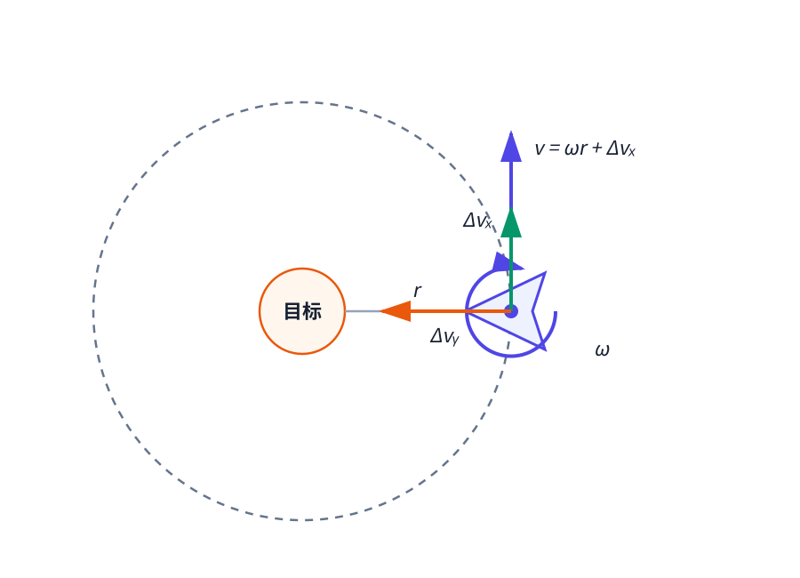
## 航向角积分怎么处理？

我和佬们交流的过程中，很多佬遇到的一个经典问题就是：为啥我陀螺仪积分出来的角度不对？

佬们可能看我 B 站发的视频，发现我车原地转动的速度很快，而且转动极快的情况下角度积分根本不飘。

经典的去零飘就不说了，我们实测只要在换陀螺或者外界变化较大的时候进行一次校准就好了，佬们可以看代码：[src/script/calibrate_gyro.py](https://github.com/LanternCX/SmartCar2026-TransportCar/blob/master/src/script/calibrate_gyro.py)

顺带一提，尽管航向角积分准确，但是我们航向角位置环的死区其实很大（大概在 $8^{\degree}$ 左右）。我们猜测这是来源于电机的死区。不过这点死区在蚂蚁搬家这个任务里面无伤大雅就是（要知道我今年电赛 E 题玩 FOC 步进都有大概 $2^{\degree}$ 的死区），又不是造飞机火箭。 

造成航向角积分不准的原因可能有很多，我们主要的解决方法是：采用动态时间周期进行积分、增大采样率。
### 动态时间周期

因为 MicroPython 的执行效率较低，导致单纯增加代码就可能造成控制周期波动，导致实际的积分使用的期望周期和真正的控制周期有偏差，进而影响控制。

为了解决这个问题，仓库中使用了一个携带时间项的四元数积分器：[src/utils/quaternion.py](https://github.com/LanternCX/SmartCar2026-TransportCar/blob/master/src/utils/quaternion.py)

在更新四元数积分时，时间项并不是固定的控制周期 $dt$，而是一个动态计算的时间：

```python
# 计算真实控制周期
current_time_us = time.ticks_us()
        dt_us = time.ticks_diff(current_time_us, last_time_us)
        last_time_us = current_time_us
        dt_s = dt_us / 1000000.0

# 进行四元数积分
q_est.update(gx, gy, gz, dt_s)
```

代码仓库中实现了一个简单的 Demo：[src/script/yaw_sender.py](https://github.com/LanternCX/SmartCar2026-TransportCar/blob/master/src/script/yaw_sender.py)，使用 IMU660RB 实测下来又快又准。

通过这种方式，甚至不需要对数据进行滤波之类的预处理：

```python
# 获取陀螺仪数据并去除零飘
if imu_data:
	# imu_data indices: 3=Gx, 4=Gy, 5=Gz
	gx_raw = float(imu_data[3]) - imu_offsets[3]
	gy_raw = float(imu_data[4]) - imu_offsets[4]
	gz_raw = float(imu_data[5]) - imu_offsets[5]
else:
	gx_raw = gy_raw = gz_raw = 0.0

# 将原始数据转换为弧度/秒 (rad/s)
# raw / Scale = deg/s
# deg/s * (pi/180) = rad/s
rad_scale = (math.pi / 180.0) / GYRO_SCALE
gx = gx_raw * rad_scale
gy = gy_raw * rad_scale
gz = gz_raw * rad_scale

# 更新四元数
q_est.update(gx, gy, gz, dt_s)
```

读出来去零飘，积分之后就能直接用。

我也交流到有一些佬使用的是积分后补偿一个修正系数校准的方式，不过这种方式治标不治本，动态计算是最省心也最优雅、最具有鲁棒性的。
### 增大采样率

经过上面的处理之后，采样率就成了影响积分精度的主要因素。角度积分本质上是在累加角速度曲线下的面积：采样率越低，两次采样之间漏掉快速变化的概率越大，这些面积误差还会持续累加到航向角上。

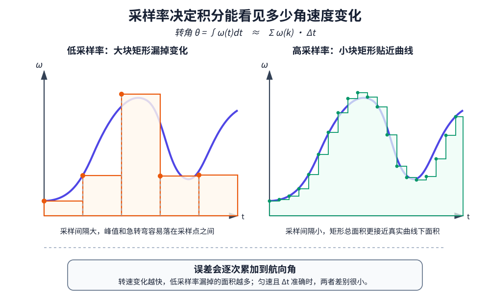

当然，如果车辆始终匀速转动且 $dt$ 准确，单纯提高采样率带来的差别很小。真正拉开差距的是快速加减速、振动和转向变化等角速度不断变化的过程。

经过我们的调试，控制环的 5ms 已经很适合积分。如果还飘的话主要的飘动就是来源于零飘了。
## 跟随环如何设计？

尽管我的主车后面有一个粉色色标，但是我们从车跟随主车并不是全视觉跟踪，而是通过一个速度前馈环加上视觉跟随环执行。

这样就能很好地保证有足够的硬度的同时，并不完全依赖开环的速度前馈控制进行跟随。同时在视觉因为光线抖动暂时丢失目标时，也能依赖前馈进行基本的跟随。

实现上还是比较简单的，就是直接把视觉环的速度和主车发来的前馈速度无脑加到一起：[src/role/assistant/follow_runtime.py](https://github.com/LanternCX/SmartCar2026-TransportCar/blob/master/src/role/assistant/follow_runtime.py#L509-L518)

这里也是请 GPT 老师画个图：

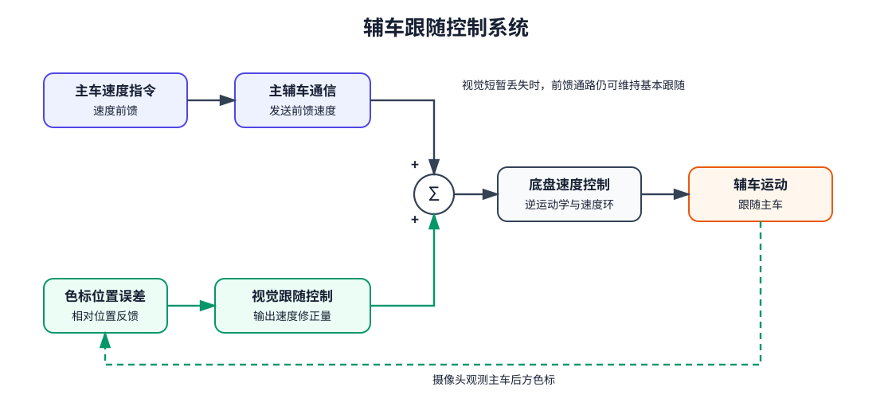

通过这样的设计就能实现非常丝滑的跟随效果，可以看到两台车模出库之后单纯靠跟随环就能找到构型，完全不需要额外的状态：


## 速度环如何设计？

速度环其实没有好坏之说。只有软硬的区别。

为了方便控制和调试，我把速度环做成了一个很硬的环，整体曲线接近于理想系统。

如果后面需要另外的加速度限制，再单独调整。

另外由于没有电流环（懒得做），我们系统的速度环对负载的变化其实是比较敏感的。

不过好在蚂蚁搬家组别的负载变化并不算大，因此我们构思了一套带参数辨识的前馈控制速度环的思路。
### 编码器数据处理

其实我们的决赛方案是大量使用了编码器定位的。好在我们采用了一颗 1:30 减速比的 N20 电机，我们并不需要十分担心使用 N20 自带编码器带来的定位精度问题。

实际测试下我们的定位精度在不打滑的情况下能稳定在 $\pm 5cm$ 也就是总 $10cm$ 左右的误差。这对于蚂蚁搬家组别并不密集的砖块路障来说完全足够了。

既然确定了编码器，就不得不面对 N20 自带的八线编码器带来的种种问题：读数不稳定、抖动幅度大。

这是因为八线编码器在较高的控制周期下无法达到较高的采样精度，在我们实际测试下读数的分布区间大概在 $0 \sim 10\ \text{脉冲/周期}$ 左右。

基于这个特性，我们采用了双窗口线性回归滤波为核心，加上中值滤波、差分限幅、低通滤波等等技巧滤波器，最终将编码器的读数处理到了一个比较令人满意的程度：

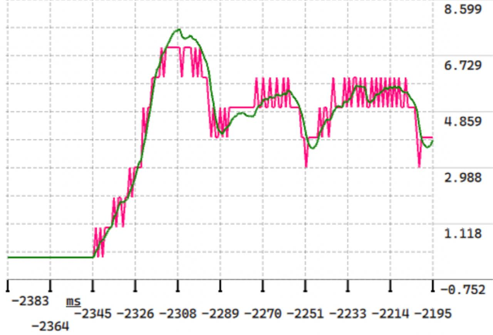

图中粉色的线是编码器的原始数据，绿色的线是滤波后的数据。可以看到效果非常之不错，兼顾了响应、平滑。

具体的滤波器设计如下：

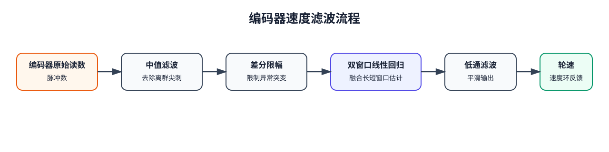

实现位置：[src/core/runtime.py](https://github.com/LanternCX/SmartCar2026-TransportCar/blob/master/src/core/runtime.py#L1200-L1217)

当然这么好的效果也是有代价的。这套滤波器的内存开销非常大。不过在 MicroPython 设备上，内存占用的大头其实是代码量以及可变长数组、对象等等。实际统计下来这坨滤波器其实并非内存大头。

窗口的好处就是能够在时间尺度上获得更多的统计信息，毕竟要充分利用电机的减速比确实不得不上窗口，否则精度确实是不够的。

另外，我的队友跟我说其实直接上一个低通滤波器调速度环也能达到不错的效果，现在看来当时设计的这套滤波器有点小丑了（bushi）。
### 电机参数辨识

这一步的意义在于计算电机前馈的数据，也就是计算电机的转速（编码器值）和电压（占空比）之间的数学关系。

通过阶跃法对直流电机电压控制的系统建模方程：

$$
\tau \dot{\omega}(t) + \omega(t) = K u(t)
$$
中的两个参数 $\tau$ 和 $K$ 进行辨识，我们可以直接计算出电机目标转速 $\omega$ 和电压 $U$ 的关系，实现速度环无负载工况下的开环控制。

具体理论介绍和理论推导不做展开，感兴趣可以看我另一篇文章[[Robotic/DC motor parameter identification/main|直流有刷电机的系统辨识与前馈控制]]

参数辨识的脚本实现在：[src/script/pid_identify.py](https://github.com/LanternCX/SmartCar2026-TransportCar/blob/master/src/script/pid_identify.py)
### 速度环前馈控制

进行了参数辨识之后，由于直流有刷电机在工作区间十分线性，我们可以直接通过辨识的参数 $K$ 直接算出目标转速下所需的占空比。

然后将这个计算出的占空比直接加到增量式 PI 环的输出上，最后就实现了速度环的前馈控制。


## 对牛如何夹紧？

看似是一个简单的问题，但是实际调试起来非常麻烦。

我们最初的方案是将主车的搬运速度乘以一个系数作为从车的搬运速度。

这个方案在最初是十分好用的，但是提速之后就不太好用了。

由于搬运阻力的存在，整个对牛夹紧的系统并不能看作一个线性系统。至于为啥，我们接下来分析一下。
### 对齐加速度

首先我们考虑沙包的阻力不可忽略。只对主车讨论，那么这个运动模型就变成了一个经典的高中物理滑块问题：固定力 F 推动滑块，滑块的速度曲线如何变化？

实际上，滑块（沙包）会经历一个先加速后匀速的运动过程。毕竟主车推力并没有远大于沙包，因此这个加速阶段不可忽略。

并且由于这个搬运阻力的存在，即使有速度环，主车的搬运速度也不会达到期望值。

我们还是请 GPT 画一个图方便理解：

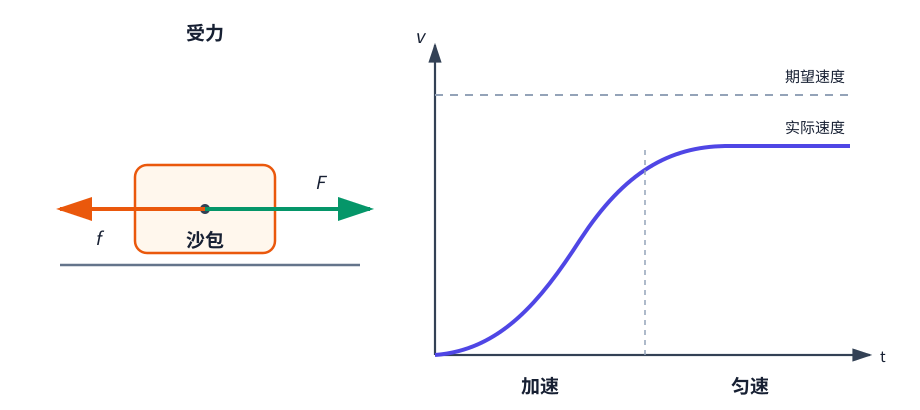

因此我们必须在对齐两车速度的基础上对齐加速度。

我们的方案采用了一种非常无脑的思路：直接通过限制加速时间的方式限制加速度。

在我交流的过程中，有佬是直接对速度做了一个积分器（渐渐将速度加到目标值的过程本质上是积分），通过调整积分的 $k_i$ 项控制加速度。

不过我认为还是直接限制加速时间比较直观且好调试，本质上也是积分器的思路就是了。
### 视觉闭环

由于对牛方案的推杆并不像 V 推那样可以把两台车的推杆拼一起，因此搬运态的容错其实很小，必须在搬运时进行视觉闭环。

经过我们的调试，我们最终确定了闭环方案：两台车各自通过视觉闭环垂直于搬运方向的运动，也就是左右闭环、前后不闭环。前后靠速度和加速度的对齐保持夹紧。

依旧是请 GPT 画个图：

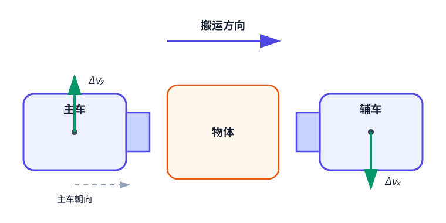

我们其实也试过闭环纵向和横向两个方向，但是效果不理想，不如开环夹紧来得稳定。

也有从车直接识别主车车上标记直接和主车对齐而不是和物体对齐的方案，但是我们后面没有采用（因为方案比较稳定，就懒得调了）

顺带一提，我们的推杆上其实是有砂纸保证夹紧的，不过只有主车安装了砂纸。

这是因为主车在推行的过程中始终和物体接触，不太可能存在需要横向对正的场景，因此安装砂纸并不会在视觉对正的时候带着物体跑。

但是辅车不一样，辅车如果安装了砂纸，由于搬运时是夹紧的，很有可能在左右动态对正的时候带着物体（尤其是网球）跑，把物体带偏。因此没有安装。

另外，主车安装砂纸还能有效避免不小心碰到网球把网球肘飞，这是因为砂纸能在碰撞瞬间避免网球滚动。

（砂纸这个方案不知道是怎么传开的，我们在十一月在群里发的车其实就安装了砂纸，不过没有公开这一方案。后面似乎别的车友也想到了这个方案，去 QA 问了卓大，于是大家都开始用了）
## 侧翻、翘头如何避免？

侧翻本质上是一个机械问题引发的控制问题。

如果重心过高，在给出较大的横向加速度之后就会产生侧翻。而给出较大的纵向加速度就会产生前倾。

而一旦车模发生侧翻，即使没有完全翻倒，也会导致一些开环过程（例如绕行）的轨迹受到严重影响。

说实话这个问题其实我们没有调得特别好，速度上去之后前倾和侧翻还是相当严重的。为了解决这个问题我们不得不在主车底盘上加了 50g 配重以提升车模运行的稳定性。这也让我们的总重量罚时来到了 10s 左右。

另外侧翻几乎是提速阶段必经的一环，我们当时的方案是冲着完赛去的，因此没有过多考虑侧翻的影响，最终也导致了我们的决赛方案没有提高到较高的速度。
### 机械

Y 车模的侧翻问题是饱受诟病的，去年有调过智能视觉的佬一定认识杭电的反装车模。

通过将底盘反装，能够极大降低车模的重心。

而对于自制车模，这个问题就更加复杂。车模的侧翻问题受到底盘高度、车模重量、底盘半径、整体重心等种种因素的影响。

而底盘半径和底盘高度又会影响过圆坡的性能。如果底盘太低底盘半径太大车模就会卡在圆坡上。

这些都需要结合控制和机械进行详尽的调试。

我们详细的车模设计，会在下文[[#机械上有什么巧思？]]提到。
### 控制

控制上主要分为两个方向：

1. 状态机设计时尽量避免侧向移动：车模的侧翻相比车模前倾更容易受加速度影响。因此在状态机设计的时候，尽量用旋转+执行代替全向移动。
2. 控制加速度：这个技巧在前文 [[#对牛如何夹紧？]]有提到。不过我们最终的方案主要是通过避免侧向移动防止侧翻，只在搬运启动阶段尝试了加速度控制。如果佬们还有调试的机会可以试试。

## 通信如何设计？

我们的通信设计在开始的时候比较无脑，直接使用字符串通信。

但是由于[[#优化串口通信]]一章提到的内存占用问题，我们不得不转向可读性和可调试性都较弱，但稳定性和内存友好的基于 Byte 收发的通信协议。

我们具体的通信协议分为可靠通信和非可靠通信两种方式。通过一个统一的通信抽象层操作串口。具体实现在：[src/protocol/transport.py](https://github.com/LanternCX/SmartCar2026-TransportCar/blob/master/src/protocol/transport.py)

最终我们的通信协议极大地参考了计算机网络中的通信机制，包括帧结构、缓存与缓存清理、收发方式、帧检验等等。接下来就来详细说说。
### 非可靠包

非可靠包主要负责流式传输，是速度包（主从车速度前馈包、视觉速度控制包）的主要通信方式。

主要包格式：

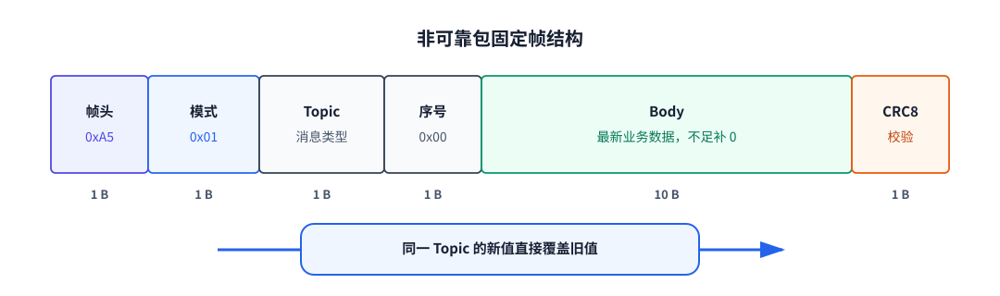

MicroPython 接口形态：

```python
transport.udp_write(UART8, TOPIC, body)

transport.udp_read(UART8, TOPIC, out_body)
```

代码中的实现位置：[src/protocol/transport.py](https://github.com/LanternCX/SmartCar2026-TransportCar/blob/master/src/protocol/transport.py)
### 可靠包

可靠包通信主要负责主车和辅车之间的状态机通信。同时，我们通过状态机设计，保证了状态跳转的时候底盘必然速度为 0。这样我们就不需要考虑非可靠包到可靠包模式切换时的丢包问题，直接将可靠包默认解释为速度 0 即可。

主要包格式：

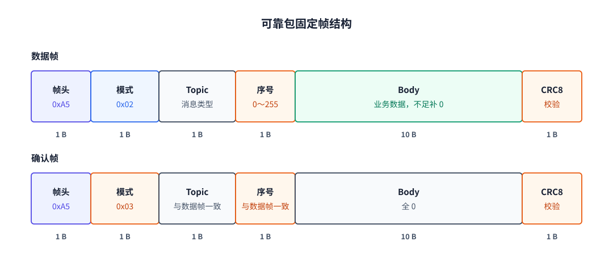

发送阶段：

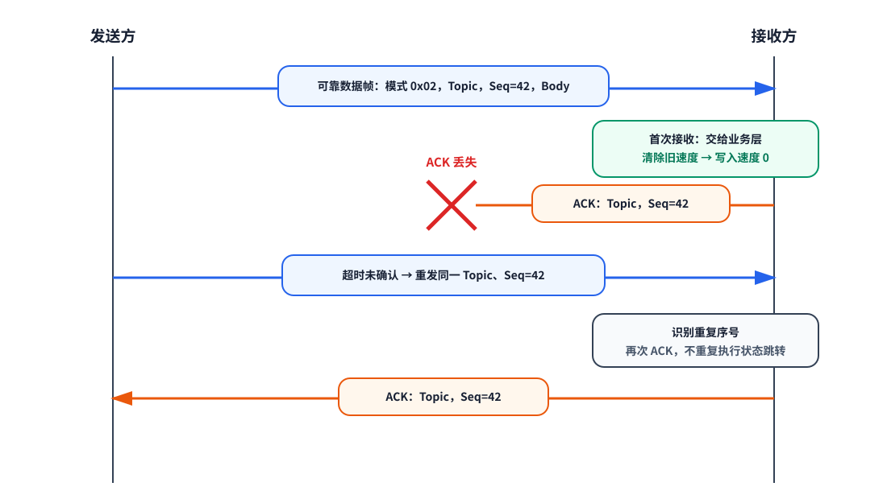

MicroPython 接口形态：

```python
transport.tcp_write(UART8, TOPIC, body)

while transport.tcp_delivery(UART8, TOPIC) == "delivered":
	# 等待 ACK
    break

transport.tcp_read(UART8, TOPIC, out_body)
```

代码中的实现位置：[src/protocol/transport.py](https://github.com/LanternCX/SmartCar2026-TransportCar/blob/master/src/protocol/transport.py)
## 机械上有什么巧思？

机械上其实有非常多的创新空间，尤其在这个组别。

机械设计的主要目标有这么几个：增加车模完赛率、增加车模鲁棒性、降低重心以增加车模速度上限。

[[#对齐加速度]]一章提到了搬运物（主要是沙包）的摩擦力不可忽略，这也导致了车模重量会按摩擦系数换算成车模的推力上限。因此车重也会影响搬运的速度（主要是加速度）上限。如果车重太轻且不加负压，甚至很难提速。

比较令人惊艳的还是属于哈工深的负压蚂蚁，以及他们把 Art Plus 的主板通过转接下移到底盘的设计。
### 轮内收

我们车模比较有创新性的一点就是在机械上采用了轮内收的结构。

相较于传统福来轮车模，我们将三轮的安装方向修改为了编码器朝外、电机出轴朝内的结构，这样我们就能极大地利用底盘的包边，有效避免绕行时碰撞到其他的物体：

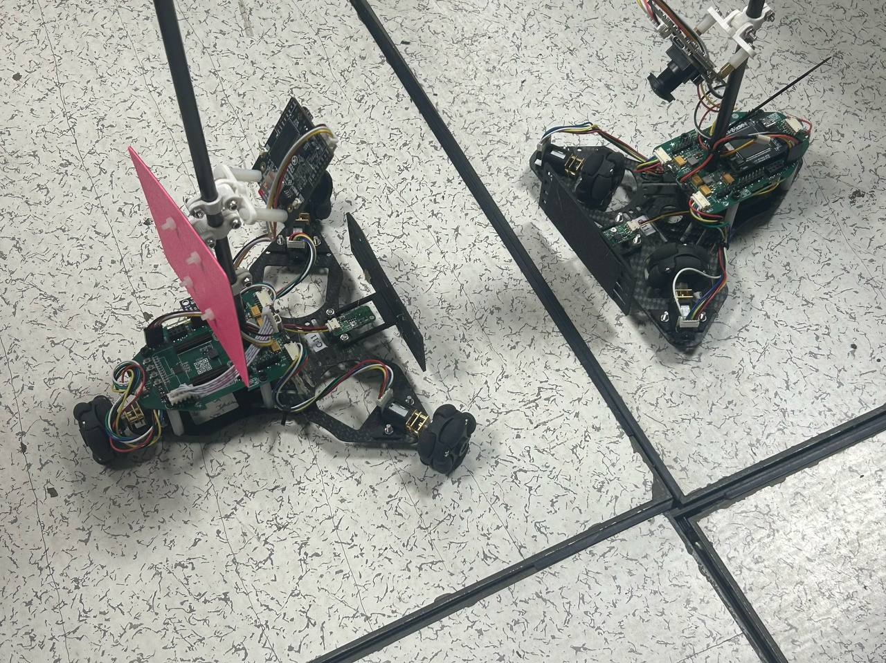

上图的左侧的车是轮外翻构型，右侧的车是轮内收构型（是的我们的底盘支持两种构型，不过省赛跑的是两台轮内收）。

这个构型结合对牛能带来的一个非常好的收益就是，我们能结合对牛，拨开搬运路径上绝大多数的物体，而不是通过加状态的方式进行避障：

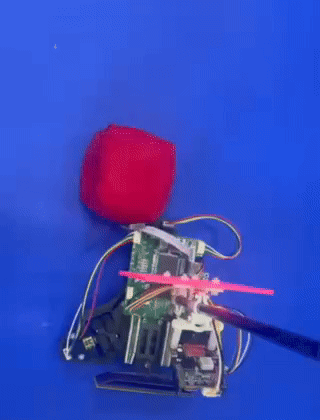

不过这种构型也有弊端，就是会导致底盘外框偏大的同时底盘实际半径偏小。这会进一步导致前面[[#侧翻、翘头如何避免？]]一章中提到的翘头侧翻问题。所以可以看到上面的 GIF 里面我们是给底盘加了配重的。
### 电池

我们的电池使用了一块格氏的 1S 300mAh 95C 电池，通过稳压电路升到 12V、5V、3.3V 给核心板及其外设供电：

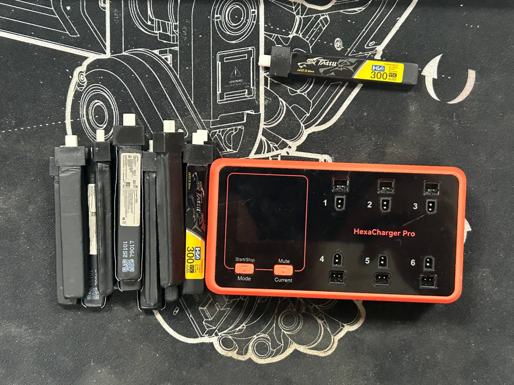

通过这样安装在车上：

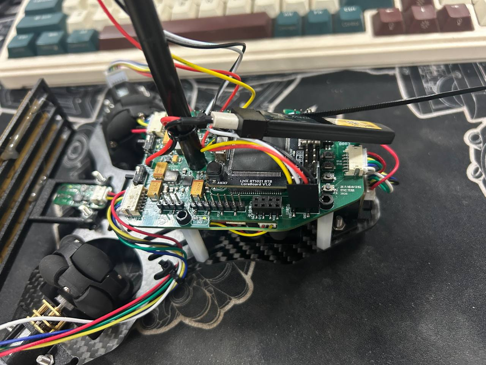

之所以这样装是因为在我们使用这一套东西几天后，原本直接焊在主板上的座子就出现了老化。

这导致了我们的车跑着跑着就会莫名其妙断电，省赛倒数第二天和硬件修了好久，汗流浃背了。

## 模型需要完成到什么程度？

这个仓库的视觉部分其实我只完成了传统视觉的部分。

模型的部分是我的另一位队友完成的，而我对这方面的经验几乎为零。

之前和我们的视觉交流过，加上和别的学校交换的数据，大概做了包含 6 万张图片的数据集，不过每个学校的训练思路不同，需要自己洗数据，同时也要防止投毒。

关于训练方面，比较推荐阅读我学长 24 年智能车视觉组的国一开源代码，在这里贴上链接：[EveAaA/DEBUG_SmartCar_main: DEBUG实验室19届智能视觉工程](https://github.com/EveAaA/DEBUG_SmartCar_main)

加之现在 AI 的视觉能力都十分强悍了，接下来视觉部分我会写一些“提示词”性质的东西，说明模型需要完成什么样的指标对控制来说是最好的。
### 帧率

帧率在这个组别是十分重要的，毕竟我们的车需要依赖模型的识别结果寻路到对应的物体进行搬运。

如果采用速度式控制，对帧率的要求就很高。毕竟视觉回传的像素单位和实际的速度单位差了一阶，如果帧率太低控制起来可能效果不如位置式。

位置式控制也有缺点，就是卡顿非常明显。尽管可以通过滤波或者插值的方式提高丝滑程度，但是本质上也和速度式控制差别不大。

我们组别在最开始的时候是采用的 OpenArt Mini 系列视觉模块，视觉的帧率远低于要求，大概只有不到 10 帧。

后面换到 OpenArt Plus 之后，我们逐飞方案模型的帧率能稳定在 9～10 帧。不过这也不太够。

在视觉和 GPT 老师的激情合作下，通过调整输入大小等等方式，我们的视觉帧率大概稳定在了 15 ～ 20 帧。

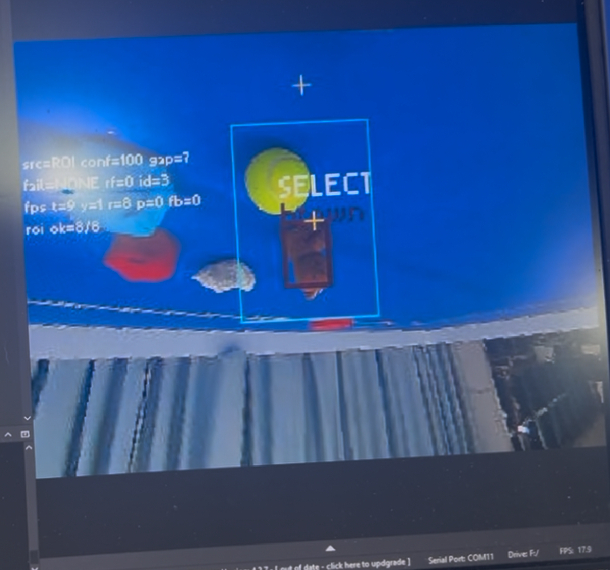

具体的模型参数如下（GPT 老师直接看着模型的权重文件总结的）：

| 项目 | 当前值 |
|---|---|
| 模型文件 | `vision/yolo/yolo.tflite` |
| 文件大小 | 106,864 字节，约 104 KiB |
| 输入 | `1 × 80 × 80 × 3`，INT8 RGB |
| 参数量 | 约 48,614 个 |
| 检测头 | 1 个，输出特征图 `5 × 5 × 30` |
| 类别数 | 5 类 |
| 类别顺序 | green、red、blue、brown、white |
| 最大输出 | 每帧 5 个目标 |
| 模型内置信度阈值 | 0.45 |
| NMS IoU 阈值 | 0.45 |
| 程序实际接收阈值 | 0.80 |
| 锚框 | `(6,6)`、`(11,10)`、`(19,17)` |
| 主要算子 | 18 个普通卷积、8 个深度卷积、3 个残差加法 |
| 推理输出 | 边界框、类别、置信度、目标数量 |
### 识别框的形态

尽管蚂蚁搬家组的模型需要完成的分类任务较少，但是对模型的识别框、框坐标等等细节的要求都很高。

例如我们看下面的对比图：

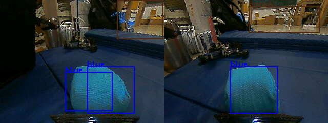

尽管两者都正确将物体识别为蓝色沙包，但显然右边的识别结果比左边的识别结果更符合我们的预期，也更适合控制。

很多视觉同学在训练的时候只看在测试集上的跑分，而忽略了控制实际需要的识别框形态，在蚂蚁搬家组别是很致命的。

### 识别准确率

这也是视觉模型最基本的需要满足的要求，识别的结果足够准确。

在我们的调试过程中，甚至出现过我们的白熊在被盘了好几趟之后，颜色由白转灰，最后成功被识别成了棕熊的情况。

### 识别框稳定性

由于找物体阶段我们采用的是速度式控制，这对识别框的稳定性提出了极高的要求。

例如识别框不能只在几帧出现，抖动要小等等。

尽管我们的模型在置信度 0.5 ~ 0.8 的情况下差别不大，但是识别结果依旧会出现小概率的抖动。

为此，我们没有直接把每一帧的识别框交给控制，而是在视觉仓库中加入了候选筛选、类别锁定、连续帧确认和目标丢失处理。具体代码见：

[主车视觉后处理代码](https://github.com/LanternCX/SmartCar2026-Vision/blob/dev/master/run.py)和[从车视觉后处理代码](https://github.com/LanternCX/SmartCar2026-Vision/blob/dev/assistant/run.py)。

流程上，我们在拿到识别结果后做了这些后处理：

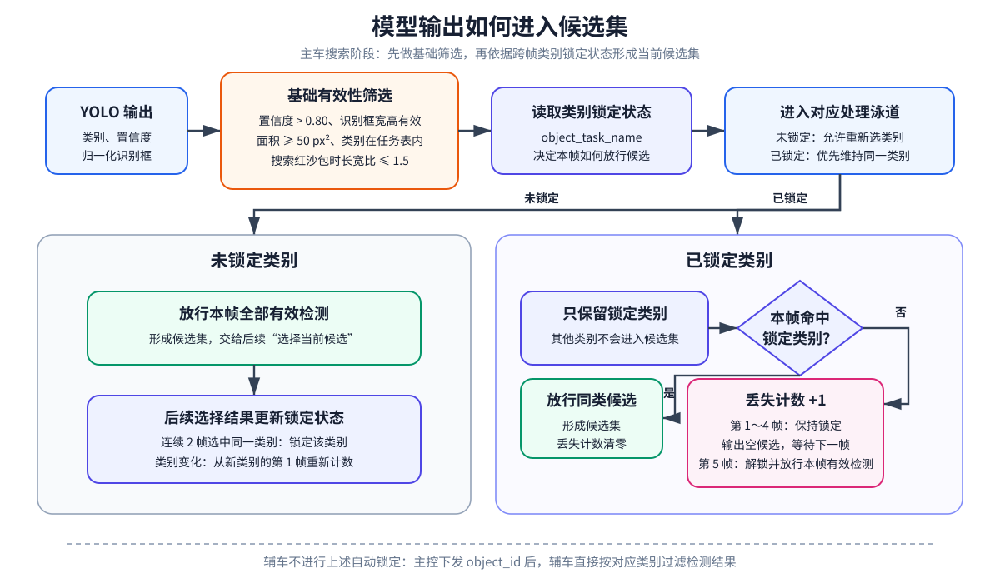

这个 2 帧锁定和 5 帧释放的参数是我经过大量调试尝试出来的，只有这个参数下对模型的结果的处理效果是最好的。
## 目标物选取如何决策？

这个问题只有在决赛中需要考虑。对于初赛简单的 3 个物品的地图而言，直接无脑选择距离车模视觉底边的中点最近的点就好了。
### 处理红沙包

红沙包的处理其实比较无脑。

我们试过很多方法，包括加负样本（视觉跟我说加了大概 2 万张）、过滤长宽比等等手段，视觉模型都难以分辨红沙包和红砖。

因此我们直接无脑跑到物品区后直接先搬运红沙包，然后后面直接不识别红砖。

当然这样的保险机制是有三层的：完全不识别红沙包只搬四个、只识别一次红沙包并搬运、全程识别红沙包。

总体来说效果还不错，完赛率很高。
### 选择未被遮挡的边缘物体

这个是我们探索出来的完赛率最高（但并非最快）的决策方式。解释起来很麻烦，下面这段文字和图片都是 GPT 帮我写的。总的策略就是选择边缘的物体并考虑遮挡，但是我实在懒得捋这一坨答辩逻辑，具体还是看代码以及下面的说明吧。

这个决策依赖完整的搬运过程，而不是只看一张静止画面。红色和蓝色物体搬到 left 边，棕色和白色物体搬到 right 边，网球搬到 top 边。搬运时车头朝向目标边；到边后车辆先后退一小段，再原地回转 $180\degree$，背向目标边进入下一轮搜索。摄像头固定在车上，所以车辆从哪条边返回，直接决定了下一轮画面的场地方向。

- 从 left 边返回时，车头朝向 right 边，top 方向位于画面左侧。
- 从 right 边返回时，车头朝向 left 边，top 方向位于画面右侧。
- 从 top 边返回时，车头朝向 bottom 边，right 方向位于画面左侧，left 方向位于画面右侧。

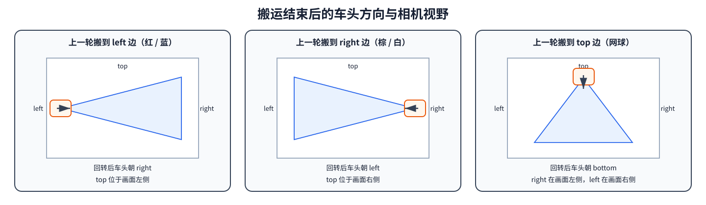

视觉首先利用车载相机的透视关系过滤被挡住的目标：画面越靠下的物体越接近车辆。如果一个近处目标框横向盖住了远处候选的中心，而且与远处候选的下半部分发生重叠，就认为车辆沿当前方向接近远处候选时会先撞上近处物体，过滤远处候选。之后只保留无遮挡候选中画面最左和最右的两个物体。

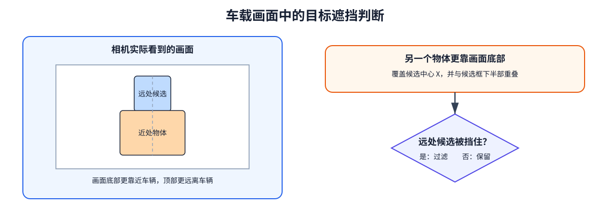

上一轮的目标边还提供了一条已经走通的通道。程序优先继续选择目标边相同的物体，让车辆沿刚刚返回的通道再次搬运。网球的搬运方向与左右两类物体垂直，因此切换目标边时还要结合固定的返回视野判断阻挡关系。例如从 right 边返回时，top 方向在画面右侧；如果网球位于画面左侧，而画面右侧还有另一个候选，那么这个候选夹在网球与 top 边之间，网球的搬运路径会被挡住，因此过滤这个网球。从 top 边返回并改搬左右边物体时，同样按画面方向进行判断。

最后，程序在剩余候选中优先选择与上一轮目标边相同的物体；没有同目标边候选时，再选择更靠画面边缘的物体。

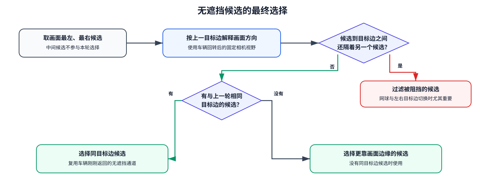

代码实现：[master/run.py:900-962](https://github.com/LanternCX/SmartCar2026-Vision/blob/dev/master/run.py#L900-L962)
## 黄线如何识别？

我们识别黄线其实尝试过很多视觉方案，但是受限于场地现场多变的灯光，以及复杂的现场环境，导致我们很难保证黄线在不误识别的情况下现场不用调阈值。

加之浙江是一轮游赛制，不像区赛一样有循环和试车，这就导致了我们的尝试机会十分有限。为了避免这一不确定因素，我们采用了和去年智能视觉组大部分佬们选择的方案：灰度传感器。

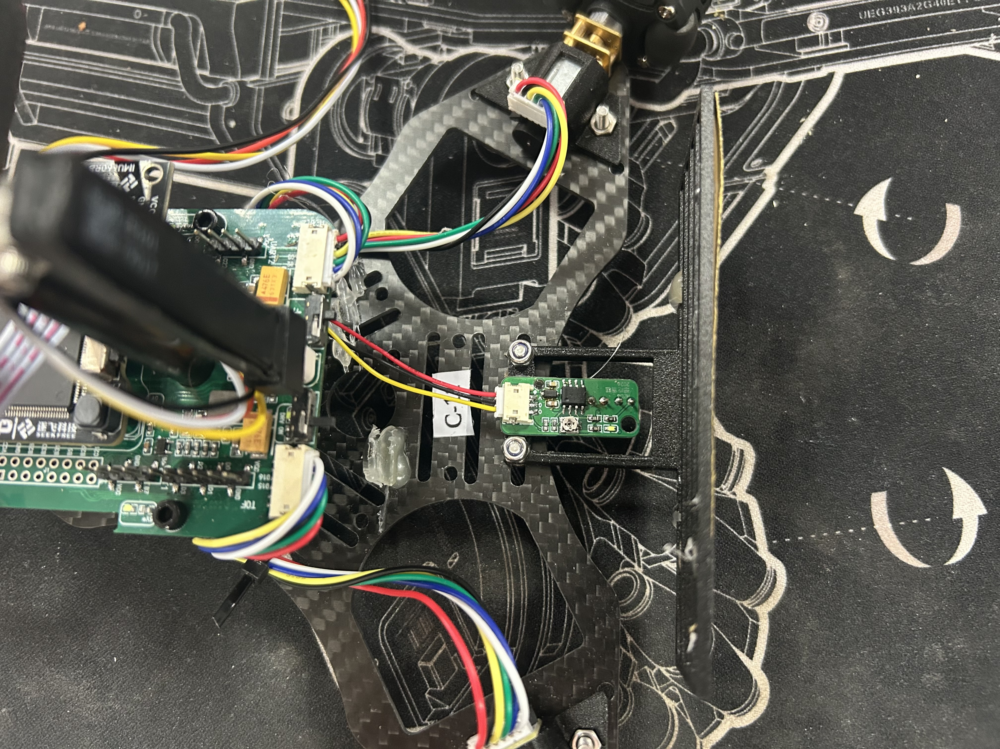

但是由于传统的基于光电管的灰度传感器在我们车模上的安装高度下效果不佳，因此我们将原本光电管的位置修改为了一颗等效的光敏电阻，并调整了外围电路：

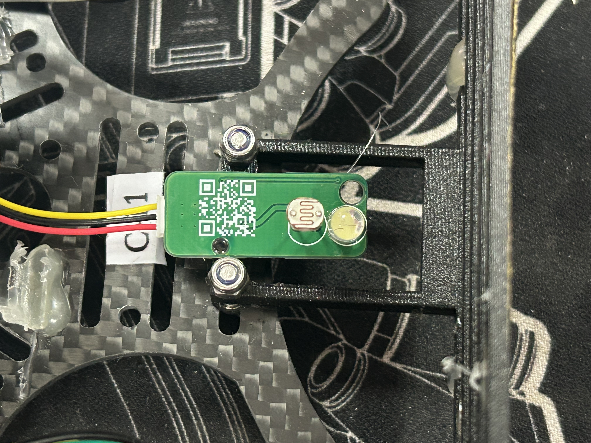

经过我们的测试，光敏电阻灰度的灵敏度、稳定性、调试难度等等方面都十分优秀，帮助视觉省下了很多麻烦。

不过光电管的坏处就是，我们的回库黄线识别方案，在识别到黄线停车转向后并不能十分精准的停在黄线内，导致车模一般会压黄线回库：

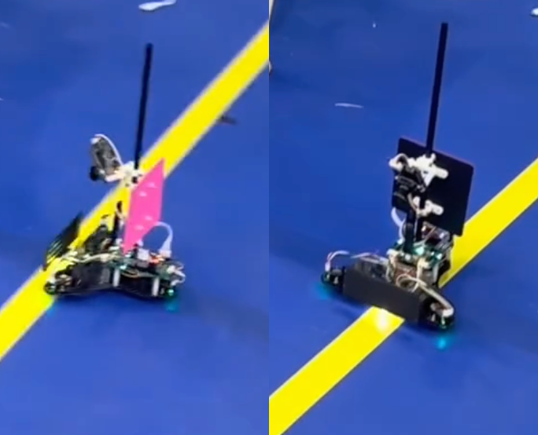

这可能会导致裁判判罚上的一些风险。

因此在省赛前最后一天我临时加了一个触线后后退的动作保险，不过在时间上就不是那么具有竞争力了。
## 如何提速？

其实我们并没有在提速上花费非常多的精力。

得益于前中期稳扎稳打的设计，系统在提速阶段已足够稳定和易于调教，我仅仅花费了两天就将预赛从 90s 提高到了 35s。

不过，35s 预赛似乎已经接近我们车模的机械上限，再提车模的运行就很容易不稳定，会发生侧翻、翘头以及丢物体等等问题。

不过既然要讲提速，还是稍微分享一下思路叭。
### 搬运阶段

由于我们是对牛方案，而对牛要求两车夹紧，由于一些物理限制的存在，需要调整搬运阶段的速度和加速度两个参数。至于为啥，我前面的[[#对牛如何夹紧？]] 有提到过。

这个阶段其实是最好提速的，因为此时系统十分简单。

提速的瓶颈主要是在对牛搬运的时候速度和加速度难以完全对齐，加之网球、熊、沙包对底盘的负载都不同，导致速度没对齐的情况下两车干涉严重，无法提高到十分高的速度。

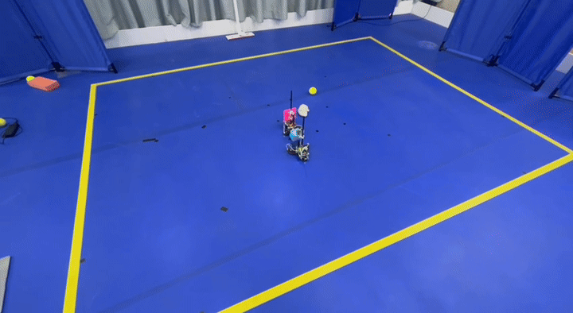

### 出库阶段

出库阶段的提速目标其实就是以尽可能快的方式到达物品区。主要调整目标就是路径最短。然后就可以猛提速。


### 回库阶段

预赛阶段我们直接通过将最后一个物体推到左边界的决策提速。可以省下一小段路程。


决赛阶段我们的方案主要是稳定为主，因此没有过多的提速。（其实后面也没时间提）
### 状态机优化

佬们应该都知道，这个组别的主要提速瓶颈就在于方案和机械。

状态机优化主要有两个方向：优化状态之间跳转的时间、减少状态。

方案确定之后状态其实很难改变很多，上面的回库决策实际上就是一种通过减少状态的提速方式。

而优化状态之间的跳转时间，主要是调整状态之间跳转的条件，也就是跳转死区的阈值。

我们直接在状态跳转的时候在串口打印跳转条件，结合无线串口，很容易就能发现状态跳转的时候的卡点。
### 机械

这一点在上文的 [[#机械上有什么巧思？]]提到过，这里不再赘述。

一个重心低，重量合适，稳定的底盘对提速来说是至关重要的。
### 其他

看到各个省都有队伍对网球采用推到一半让网球滚出边界的策略。但由于我们是对牛方案，无法做到像 V 推那样的直接将网球肘出边界的效果。

不过这是一个非常好的思路。如果能进国赛的话，我们可能会考虑对牛和 V 推进行决策。可惜现在没机会了。

可以发现我并没有写找物体阶段咋提速。这是因为找物体阶段受视觉的影响较大，帧率不高的话不建议对找物体阶段提速，很难调也很不稳定。

我们初赛提速的后期瓶颈其实就是卡在了机械上限和方案状态数量限制。不过因为浙江省改比决赛，后面就没调初赛了，于是也没有继续优化。
## 一些细小的设计点

### 仓库架构

尽管蚂蚁搬家任务有两台车，但是两台车的功能实际上有很多重叠的点。

因此我们仓库的架构是直接两台车共用底盘控制代码，在业务层（role 层）分别处理各自的业务数据。

在启动的时候，通过识别主板上的拨码开关标识的车号，决定采用主车的业务层还是从车的业务层。

这也满足我前面提到的 [[#Mono Repo]] 的核心思路，对 AI 来说比较友好。
### Github 工作流

我个人是计科专业的，可能和大部分打智能车的佬们专业不同，而且早在高中的时候就写过一些软件和网页。

因此我对 Git / Github 的整套工作流是比较熟悉的。

得益于我对这一套工作流足够熟悉，在进行蚂蚁搬家这一套复杂系统的开发的时候我才能理清楚进度、问题，控制好工程的复杂度。

毕竟 Git 的版本管理功能以及对于调试非常好用的 Git Stash，还有 Github Issue / PR 带来的过程性调试记录能够大大减轻程序员的心智模型负担。

可以看到我的仓库内设置了许多的 Github 工作流，比如 Github Action 自动测试、分支保护、PR 模版等等，这也让我的开发过程对 AI 更加透明，同时也是对自己行为的约束。
### CI 与 Test

CI 就是自动测试的意思。

将业务层和实际的硬件逻辑解耦，AI 能够很轻松的对业务功能编写行为测试。

可以看到我仓库的测试非常完善，可以说整个仓库的代码都是我 TDD （Test Driven Development） 出来的。

这也是我没有在仓库状态机逻辑的编写上花费过多精力的一个重要原因。

毕竟 AI 写这种纯粹逻辑的东西比人强多了。

我们要做的就是将嵌软问题尽可能的转换为纯软问题，方便 AI Debug。
### 在视觉端维护视觉环

可以发现我们的跟随环的参数都是在视觉处维护的，这个设计有以下几点原因：

1. 在视觉端的算力下维护几个 P 环并非难事。
2. 底盘 RT1021 算力紧张。
3. P 环本质上就是乘一个系数，发送前乘和收到后乘差不多。
### ChromaForge

[LanternCX/ChromaForge](https://github.com/LanternCX/ChromaForge)

这是我之前写的一个小工具，能够很方便的对颜色进行标定并导出。

当时为了尝鲜还采用了 Tauri + Svelte 这种很新的架构。

自认为交互等等打磨的还算可以，不过是我三天压力 AI 写完的，因此其实也没有优化到特别好的程度。

我视觉仓库的 [SmartCar2026-Vision/calibration](https://github.com/LanternCX/SmartCar2026-Vision/tree/main/calibration) 的目录下面的标定文件就是这个工具导出的。

不过我们后面模型识别的结果稳定了之后，就不怎么使用纯阈值的方式作为视觉识别了。

如下图所示，这个软件能够非常直观的调整阈值，并且有类似 PS 软件画笔的涂抹操作，用于标定选区。如果佬们感兴趣的话可能后续可以在 B 站单开一集视频讲讲。

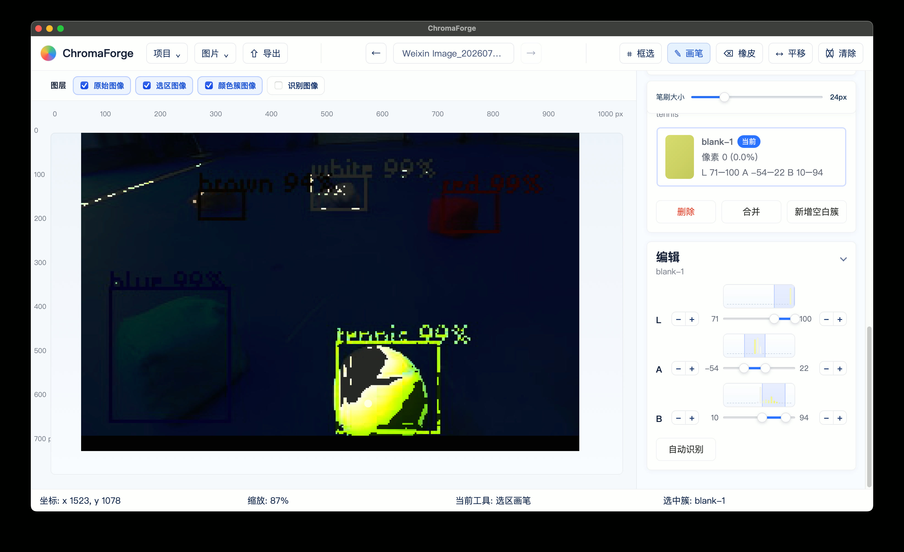
## 写在最后

### 遗憾是智能车的主旋律

花了几天时间终于写完了这篇文章。内心还是很感慨。

这篇文章发布之后，去安大国赛玩两天，我的智能车生涯就结束了。

我知道，我从智能车里面学到了很多，包括怎么处理复杂工程、怎么用 AI、怎么设计控制系统和方案、怎么写算法调策略、怎么调参数等等，这些都是很宝贵的经验，不是一两个奖能衡量的。

我也通过智能车结交了来自全国各地的许多车友，备赛期间我们和许许多多的佬们都或多或少交流了许多，交流方案、交流思路、吐槽赛规，还互相放烟雾弹（bushi）。

尽管省赛顺利完赛，也拿到了目标名次，成绩在全国也排到了较为靠前的程度，无奈名额以 0.12（2.5 - 2.38）之差无缘国赛。国赛名单公示期间我也不断向组委争取、向卓大申请，尽管浙江赛区的名额确实上浮了一些，但无论如何浙江蚂蚁搬家组的名额都只有 2 名，是全浙江乃至全国名额最少的组别。

名额的遗憾、成绩的遗憾、方案的遗憾。遗憾是智能车的主旋律。

### 关于开源

早在我大一的时候，上海交通大学 AuTop 战队的开源文章就对我产生了很大启发。在此我也引用他们在终篇中写的一段话：

> [!quote]
> 总感觉，自14年左右，智能车论坛沉寂以后，虽然参赛队伍与比赛规模在逐渐的扩大，但智能车比赛缺少了原有的一种活力。几所强校传承兴旺，从学长手中接过完整的祖传代码，略微调参或根据比赛要求修正一下元素便可拿到比较好的成绩。弱一些的学校年年从零调起，恶性循环，人员、场地、工具、经验都是很难解决的问题。赛题的难更换性是比赛强校更强，弱校难胜的主要原因。虽然组委会已经在尽可能的玩出花样，每年将不同的赛题杂糅混合，但仍然很难解决比赛赛题元素更换困难的本质因素。

我也羡慕[RoboMaster 社区](https://bbs.robomaster.com/) 以及 Github 这样的更大的开源平台的互联网精神、开源活力。

个人而言，我在被上课考勤硬控没有调车的时间里（这学期课都翘满了x），也在 Github 上给几个新兴的 AI 仓库贡献了 PR，并成功得到了 Merge，内心还是很开心的。

我们学校是小学校，由于断代原因，24 年学长拿的视觉组国一的传承也断得差不多，还是靠着一路和佬们交流收获了很多。

一路上我们看了很多开源。包括我前文提到的[上交 AuTop](https://github.com/SJTU-AuTop/RT1064-Code)、[华北电力大学（保定）铁滑团](https://github.com/Y1ZzLu/openart_fw_18th)、[杭电普朗克佬 20 届的 NXP 平衡车](https://github.com/ZhangStudyLife/My_NXP_Car)以及[我学长 19 届视觉组国一](https://github.com/EveAaA/DEBUG_SmartCar_main)

于是我们也决定将我们的方案开源出来，并且撰写了这篇浅析。希望我们的一些调试经验能够帮助到还在备战国赛以及明年任务组、mpy 组的朋友们。

也算是对社区的一种共建和回馈吧。

### 进一步交流

QQ：1584164717，NXP 群搜 LanternCX。

B 站：[LanternCX](https://space.bilibili.com/453847656)

Github：[LanternCX (Cao Xin)](https://github.com/LanternCX)

感兴趣也可以参与我正在维护的：

- [LanternCX/mpy-cli: mpy-cli | 轻量、便捷、灵活地完成 micro-python 代码部署](https://github.com/LanternCX/mpy-cli)
- [LanternCX/micropython-smartcar-stubs: 逐飞 mpy 库 stubs，用于解决 VS Code 开发 micro-python 智能车的问题](https://github.com/LanternCX/micropython-smartcar-stubs)
- [LanternCX/ChromaForge: 🎨 ChromaForge | 面向计算机视觉工作流的颜色规则标定桌面软件](https://github.com/LanternCX/ChromaForge)

项目开源链接：

- 主仓库：[LanternCX/SmartCar2026-TransportCar](https://github.com/LanternCX/SmartCar2026-TransportCar)
- 视觉仓库：[LanternCX/SmartCar2026-Vision](https://github.com/LanternCX/SmartCar2026-Vision)
- 简陋的调试上位机：[LanternCX/SmartCar2026-Controller](https://github.com/LanternCX/SmartCar2026-Controller)

如果我们的工作有帮助，欢迎到 Github 点 Star 支持。

如果本篇的开源对你有启发，也欢迎开源自己的作品，共建生态。

完结撒花 \o/
