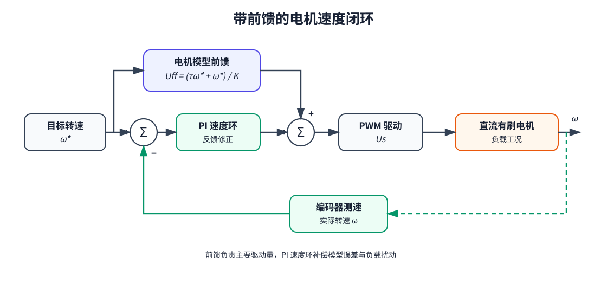

# 直流有刷电机的系统辨识与前馈控制

为了更好地控制直流有刷电机，我们常常会在速度环的输出上加上前馈，以使得电机更快地到达目标转速。

## 系统建模

一般来说，直流有刷电机控制的物理过程是这样的：PWM占空比 -> 电压 -> 电流 -> 力矩 -> 角加速度 -> 角速度。

让我们用更加物理的语言描述这个过程。

占空比 $D$ 和线圈两端电压 $U_s$ 呈正比关系，为了简化计算表达，我们直接认为 PWM 的本质就是电压 $U_s$。

当然这两者单位肯定不一样就是。甚至占空比是一个无量纲量。不过为了讨论方便我们直接讨论电压而不是占空比。

根据欧姆定律，我们有电压 $U$ 和电流 $I$ 的关系：

$$
I = \frac{U}{R}
$$
考虑电机在转速 $\omega$ 下产生的反向电动势 $E$：

$$
E = K_e\omega
$$
电机线圈两端真正的电压是：

$$
U_s - E
$$

代入上面的欧姆定律公式得：

$$
I = \frac{U_s - K_e\omega}{R}
$$
接下来电流 $I$ 产生的力矩 $T_e$ 也近似满足比例关系：

$$
T_e = K_tI
$$

其中 $K_t$ 是个常数。

大学物理告诉我们，对于旋转运动，力矩 $T$、转动惯量 $J$、角加速度 $\alpha$ 满足关系：

$$
T = J\alpha
$$

代入上面的力矩和电流的关系式 $T_e = K_tI$，我们可以得到角加速度 $\alpha$ 和电流 $I$ 的关系为：

$$
\alpha = \frac{T_e}{J} = \frac{K_tI}{J}
$$

角加速度 $\alpha$ 是角速度 $\omega$ 对时间 $t$ 的导数：

$$
\alpha = \frac{d\omega}{dt}
$$
于是我们把上面那几坨全部无脑代入，就有了占空比 $D$ 影响角速度 $\omega$ 的完整物理公式：

$$
\frac{d\omega}{dt}
= \frac{
{K_t}\frac{
\left(
U_s - K_e \omega
\right)}{R}}{J}
$$
整理一下就有：

$$
J \frac{d\omega}{dt}
=
\frac{K_t}{R}
\left(
U_s - K_e \omega
\right)
$$
这就是忽略摩擦、负载、电感的电机物理模型。

## 推导需要辨识的参数

我们把这个公式展开、移项：

$$
\frac{RJ}{K_tK_e}
\frac{d\omega}{dt}
+
\omega
=
\frac{1}{K_e}U_s
$$
令

$$
\tau = \frac{RJ}{K_tK_e}
$$
以及

$$
K = \frac{1}{K_e}
$$
我们就能得到：

$$
\tau \frac{d\omega}{dt}
+
\omega
=
KU_s
$$
由于角加速度 $\frac{d\omega}{dt}$ 可以表示为 $\dot{\omega}$：

$$
\tau \dot{\omega} + \omega= KU_s
$$

于是我们得到了最终的忽略电机电感、摩擦、负载的参数辨识公式。

我们只需要知道 $\tau$ 和 $K$，就可以直接通过目标转速求解出电机占空比，以此实现在无负载条件下开环控制电机转速。

## 参数辨识

那么我们如何知道 $\tau$ 和 $K$ 这两个参数呢？

首先我们考虑一个很简单的情况：电机加速到稳定匀速。

### 求系统增益

此时角加速度 $\dot{\omega} = 0$，我们就可以得到当时间 $t \to \infty$ 时的转速 $\omega_{\infty}$ 和电压 $U_0$ 满足关系：

$$
KU_0 = \omega_{\infty}
$$

也就是只要给电机一个恒定的电压 $U_0$（也就是恒定的占空比 $D$），通过编码器读出转速 $\omega_{\infty}$，就能直接求出 $K$。

### 求时间常数

接下来就要解决 $\tau$ 怎么求。这就需要一点点数学上的技巧。

首先我们看 $\tau$ 的原始表达式：

$$
\tau = \frac{RJ}{K_tK_e}
$$
利用量纲法我们可以发现 $\tau$ 的单位是时间（这也是为啥 $\tau$ 被叫做时间常数）。

于是我们可以猜测 $\tau$  实际上是系统在某一状态下的时间。

因此我们需要求出系统在给定电压 $U_0$ 后从 0 开始加速的这个过程中唯一的可观测量 $\omega$，也就是电机转速关于时间的表达式 $\omega(t)$。

这就需要一点点数学上的技巧。

首先我们对原公式进行换元，令 

$$
x = KU_0 - \omega
$$

$x$ 对 $t$ 求导，由于 $KU_0$ 在上文的恒定电压场景下是一个常数，于是我们得到：

$$
\frac{dx}{dt}
=
\frac{d(KU_0-\omega)}{dt}
=
-\frac{d\omega}{dt}
$$

回看原式：

$$
\tau \frac{d\omega}{dt}
+
\omega
=
KU_0
$$

代入 $x = KU_0 - \omega$，注意到：

$$
\frac{d\omega}{dt}
=
\frac{x}{\tau}
$$
于是我们有：

$$
\frac{dx}{dt} = - \frac{x}{\tau}
$$
这是一个一阶线性齐次常微分方程。我们来解这个方程。首先整理为：

$$
\frac{dx}{x}
=
-\frac{1}{\tau}dt
$$
积分得：

$$
\int{\frac{1}{x}dx}
=
- \frac{1}{\tau}\int dt
$$
求得：

$$
\ln x = -\frac{1}{\tau}t + C
$$
两边取指数，我们最终可以解得：

$$
x = C \mathrm{e}^{-t/\tau}
$$
这就是 $x$ 关于 $t$ 的函数：

$$
x(t) = C \mathrm{e}^{-t/\tau}
$$

接下来我们要求常数 $C$ 是个啥。毕竟原始公式里面没有这玩意，我们肯定不能再辨识一个参数。

于是我们注意到当 $t = 0$ 时，也就是电机刚启动的时候：

$$
\omega(0) = 0
$$
也就是电机刚启动的时候转速为 0。

那么代入我们前面换元的 $x$ 的公式 $x = KU_0 - \omega$，就有：

$$
x(0) = KU_0 - \omega(0)
$$
毕竟 $K$ 和 $U_0$ 在我们上面提到的电压恒定场景下都是常数。

于是：

$$
x(0) = KU_0
$$
代回刚才我们解出的 $x(t) = C \mathrm{e}^{-t/\tau}$，就有：

$$
x(0)
= C\mathrm{e}^0
= C
= KU_0
$$
最终我们得到：

$$
x(t) = KU_0 \mathrm{e}^{-t/\tau}
$$

然后我们把 $x$ 的换元 $x(t) = KU_0 - \omega(t)$ 再换回去：

$$
\omega(t) = KU_0 - x(t)
= KU_0 - KU_0 \mathrm{e}^{-t/\tau}
= KU_0 (1 - \mathrm{e}^{-t/\tau})
$$

我们最终得到了这个十分重要的公式：

$$
\omega(t) 
= KU_0 (1 - \mathrm{e}^{-t/\tau})
$$

于是我们就可以回过头来看我们的问题：如何辨识 $\tau$？

我们发现，在 $t = \tau$ 时，公式就看起来非常好看了：

$$
\omega(\tau) 
= KU_0 (1 - \mathrm{e}^{-\tau/\tau})
= KU_0 (1 - \mathrm{e}^{-1})
$$

然后这个 $KU_0$ 我们利用系统在 $t \to \infty$ 时的状态也已经求出：

$$
KU_0 = \omega_{\infty}
$$

再加上

$$
1 - \mathrm{e}^{-1} \approx 0.632
$$

于是我们有：

$$
\omega(\tau) \approx 0.632\omega_{\infty}
$$

也就是说我们只要记录电机从 0 加速到 $0.632\omega_{\infty}$ 的时间就可以算出 $\tau$ 了！

这就是著名的 **63.2% 法**。
### 总结

我们可以在电机无负载的状态下给电机一个阶跃电压 $U_0$，然后记录电机从转速为 0 到转速稳定的时间 $t$ 和转速 $\omega$ 的关系图。

一般来说我们会直接假设一个电机转速稳定需要的最长时间 $T$，我们直接记录 $0 \sim T$ 这段时间内的 $t$ 和转速 $\omega$ 的关系，并且对末尾段取几个点的平均值，就可以找到 $\omega_{\infty}$ 了。

找到 $\omega_{\infty}$ 后，我们可以直接计算：

$$
K = \frac{\omega_{\infty}}{U_0}
$$

然后通过查表，找到电机加速到 $0.632\omega_{\infty}$ 对应的时间，就是 $\tau$。
## 前馈控制

得到了电压和实际转速的关系式，就可以开始着手设计闭环方案了。

由于大部分电机都是运行在有负载工况下，我们可以比较无脑地直接对系统在有负载工况下进行参数辨识。虽然这和实际模型是有差别的，但是差别在负载固定且仅仅将辨识参数用于计算速度环前馈的场景下几乎可以忽略。

无脑将 PI 速度环的输出和我们计算出的这个前馈输出相加，就可以得到经典的带有前馈的速度环方案了：

也就是说，对于目标恒定转速 $\omega_0$，此时目标加速度 $\dot{\omega_0} = 0$，我们可以直接代入电机模型，得到前馈电压 $U_{ff}$：

$$
U_{ff} = \frac{\omega_0}{K}
$$

其实就是一个标准的线性关系。

除此之外，还能借助我们前面辨识出的 $K$ 和 $\tau$，和我们人为给定的一个电机响应速度 $\lambda$，就可以推导出电机速度环的 $K_p$ 和 $K_i$ 参数：

$$
K_p = \frac{\tau}{K\lambda} 
$$
$$
K_i = \frac{1}{K\lambda} 
$$

但是实际调试中这两个参数其实并不是十分好用，不如手调得好。加上推导过程比较简单，因此推导过程这里不做展开（其实是因为懒得写了）。
